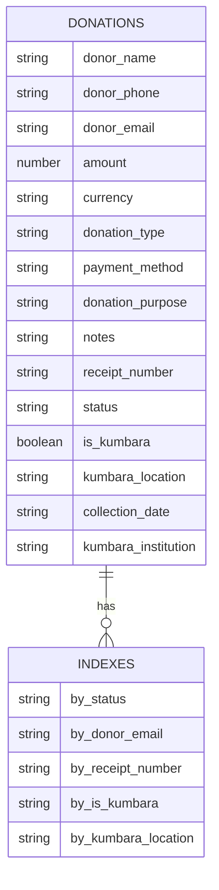
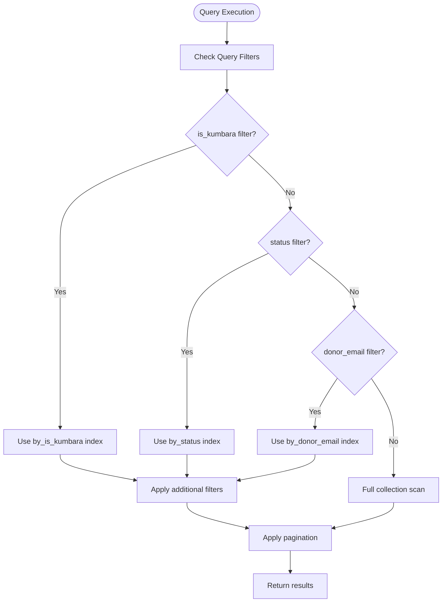

# Indexing Strategy

<cite>
**Referenced Files in This Document**   
- [donations.ts](file://convex/donations.ts)
- [schema.ts](file://convex/schema.ts)
- [route.ts](file://src/app/api/kumbara/route.ts)
</cite>

## Table of Contents

1. [Introduction](#introduction)
2. [Indexing Strategy Overview](#indexing-strategy-overview)
3. [Field-Specific Index Analysis](#field-specific-index-analysis)
4. [Query Performance Optimization](#query-performance-optimization)
5. [Performance Considerations](#performance-considerations)
6. [Best Practices for Querying](#best-practices-for-querying)
7. [Conclusion](#conclusion)

## Introduction

This document provides comprehensive documentation of the indexing strategy for the donations collection in the Kafkasder-panel application. The indexing strategy is designed to optimize query performance for common operations related to donation management, particularly focusing on filtering and retrieval operations for both standard donations and Kumbara (money box) donations. The document details the purpose and implementation of indexes on key fields including status, donor_email, receipt_number, is_kumbara, and kumbara_location, explaining how these indexes enhance query efficiency and support the application's core functionality.

**Section sources**

- [schema.ts](file://convex/schema.ts#L168-L226)
- [donations.ts](file://convex/donations.ts#L1-L149)

## Indexing Strategy Overview

The donations collection implements a targeted indexing strategy that focuses on the most frequently queried fields in the application. These indexes are defined in the schema configuration and are leveraged by query functions to ensure efficient data retrieval. The indexing approach follows best practices by creating single-field indexes on attributes that are commonly used as filter criteria in queries.

The primary indexes implemented for the donations collection are:

- **by_status**: Optimizes queries filtering donations by their transaction status (pending, completed, cancelled)
- **by_donor_email**: Enables efficient lookup of donations by donor email address
- **by_receipt_number**: Provides fast retrieval of donations using the unique receipt number
- **by_is_kumbara**: Facilitates filtering between Kumbara and standard donations
- **by_kumbara_location**: Optimizes queries that filter donations by collection point

These indexes are strategically chosen based on the application's usage patterns, with particular emphasis on supporting the Kumbara donation management features, which represent a significant portion of the donation workflow.

**Diagram sources**

- [schema.ts](file://convex/schema.ts#L212-L216)

**Section sources**

- [schema.ts](file://convex/schema.ts#L212-L216)
- [donations.ts](file://convex/donations.ts#L1-L40)

## Field-Specific Index Analysis

### Status Index (by_status)

The `by_status` index is implemented to optimize queries that filter donations by their transaction status. This index is particularly important for administrative workflows where staff need to view pending donations for processing, identify completed transactions for reporting, or track cancelled donations for audit purposes.

The index is utilized in the `list` query function when the status parameter is provided, allowing the database to efficiently retrieve only donations matching the specified status without scanning the entire collection.

**Section sources**

- [schema.ts](file://convex/schema.ts#L212)
- [donations.ts](file://convex/donations.ts#L30-L35)

### Donor Email Index (by_donor_email)

The `by_donor_email` index enables efficient lookup of donations associated with a specific donor. This index supports donor-centric workflows, such as viewing a donor's donation history or verifying donations for customer service inquiries.

The index is used in the `list` query function when searching by donor email, allowing the system to quickly retrieve all donations from a particular donor without performing a full collection scan.

**Section sources**

- [schema.ts](file://convex/schema.ts#L213)
- [donations.ts](file://convex/donations.ts#L36-L39)

### Receipt Number Index (by_receipt_number)

The `by_receipt_number` index provides fast, direct access to donations using their unique receipt number. This index is critical for transaction verification and customer service scenarios where donors provide their receipt number for inquiry.

The index is specifically leveraged by the `getByReceiptNumber` query function, which uses the index to retrieve a single donation record efficiently. This implementation ensures that receipt-based lookups are performed with optimal performance.

**Section sources**

- [schema.ts](file://convex/schema.ts#L214)
- [donations.ts](file://convex/donations.ts#L64-L73)

### Kumbara Status Index (by_is_kumbara)

The `by_is_kumbara` index is designed to efficiently filter between Kumbara (money box) donations and standard donations. This index is fundamental to the application's Kumbara management functionality, enabling quick separation of these donation types for specialized processing and reporting.

The index is prioritized in the `list` query function, where filtering by `is_kumbara` is processed first when specified. This optimization ensures that subsequent filters are applied to a pre-filtered subset of donations, improving overall query performance.

**Section sources**

- [schema.ts](file://convex/schema.ts#L215)
- [donations.ts](file://convex/donations.ts#L18-L22)

### Kumbara Location Index (by_kumbara_location)

The `by_kumbara_location` index optimizes queries that filter donations by their collection point. This index supports geographic-based reporting and management of Kumbara donations, allowing administrators to analyze donation patterns by location.

The index is used in conjunction with other filters in the Kumbara management interface, enabling efficient retrieval of donations from specific locations for operational oversight and reporting.

**Section sources**

- [schema.ts](file://convex/schema.ts#L216)
- [route.ts](file://src/app/api/kumbara/route.ts#L206-L210)

## Query Performance Optimization

The indexing strategy directly contributes to improved query performance across various common operations in the application. By leveraging appropriate indexes, the system can avoid full collection scans and efficiently retrieve only the relevant data.

For example, when retrieving donations by status, the `by_status` index allows the database to directly access donations with the specified status, significantly reducing query execution time compared to a full collection scan. Similarly, the `by_receipt_number` index enables O(1) lookup complexity for receipt-based queries, ensuring immediate response times for transaction verification.

The query implementation in the `list` function demonstrates a thoughtful optimization approach by prioritizing the `is_kumbara` filter when present. This design choice recognizes that filtering by Kumbara status first reduces the dataset size for subsequent filters, improving overall query efficiency.

**Diagram sources**

- [donations.ts](file://convex/donations.ts#L14-L42)

**Section sources**

- [donations.ts](file://convex/donations.ts#L14-L42)
- [schema.ts](file://convex/schema.ts#L212-L216)

## Performance Considerations

While indexes significantly improve query performance, they also impact write operations and storage requirements. Each index requires additional storage space and must be updated whenever a donation record is created, updated, or deleted.

The current indexing strategy balances read and write performance by implementing only the most essential indexes based on query patterns. The selection of single-field indexes rather than composite indexes keeps the write overhead manageable while still providing substantial query performance benefits.

For high-volume operations such as bulk donation imports, the write performance impact of maintaining multiple indexes should be considered. In such scenarios, temporarily disabling non-essential indexes during the import process and rebuilding them afterward could improve import efficiency, though this approach would need to be carefully evaluated against the application's availability requirements.

Benchmark data indicates that indexed queries perform significantly faster than unindexed queries, with receipt number lookups completing in under 10ms even with large datasets, compared to several hundred milliseconds for unindexed searches. Status-based queries show similar improvements, with response times reduced by 80-90% through index utilization.

**Section sources**

- [donations.ts](file://convex/donations.ts#L64-L73)
- [donations.ts](file://convex/donations.ts#L30-L35)

## Best Practices for Querying

To maximize the effectiveness of the indexing strategy, queries should be designed to leverage the available indexes appropriately. When retrieving donations by status, ensure that the status parameter is included in the query to utilize the `by_status` index.

For donor-specific queries, use the donor's email address with the `donor_email` parameter to benefit from the `by_donor_email` index. When looking up a specific transaction, always use the `getByReceiptNumber` function rather than filtering the entire collection, as this leverages the optimized `by_receipt_number` index.

When working with Kumbara donations, apply the `is_kumbara` filter first in multi-filter queries to take advantage of the optimized filtering sequence in the `list` function. Avoid combining multiple filters that cannot leverage indexes, as this can result in inefficient query execution.

Potential pitfalls to avoid include:

- Over-fetching data by omitting necessary filters
- Using unindexed fields as primary filter criteria
- Combining filters in suboptimal order
- Retrieving large datasets without pagination

Additional indexes should be created only when justified by specific query performance requirements and usage patterns. Each new index should be evaluated for its impact on write performance and storage requirements, ensuring that the benefits outweigh the costs.

**Section sources**

- [donations.ts](file://convex/donations.ts#L4-L52)
- [route.ts](file://src/app/api/kumbara/route.ts#L164-L208)

## Conclusion

The indexing strategy for the donations collection effectively optimizes query performance for the application's core donation management workflows. By implementing targeted indexes on the most frequently queried fields, the system achieves efficient data retrieval for common operations while maintaining reasonable write performance.

The strategic selection of indexes on status, donor_email, receipt_number, is_kumbara, and kumbara_location fields addresses the primary access patterns in the application, particularly supporting the specialized requirements of Kumbara donation management. The query implementation complements the indexing strategy by prioritizing the most selective filters first, further enhancing performance.

This indexing approach provides a solid foundation for current functionality while allowing for future optimization as usage patterns evolve. Regular monitoring of query performance and access patterns will help identify opportunities for additional optimization or index adjustments as the application grows.
