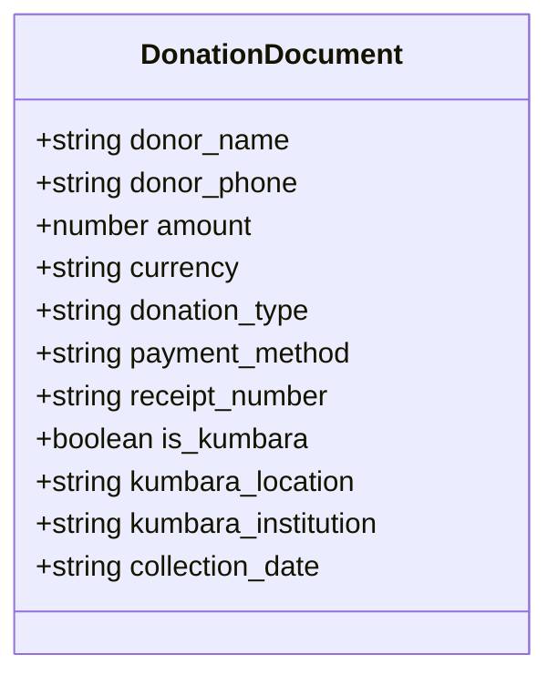
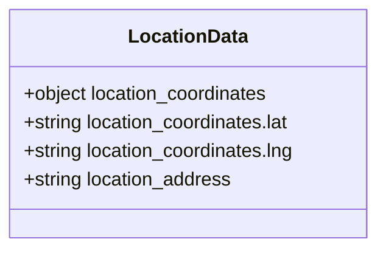
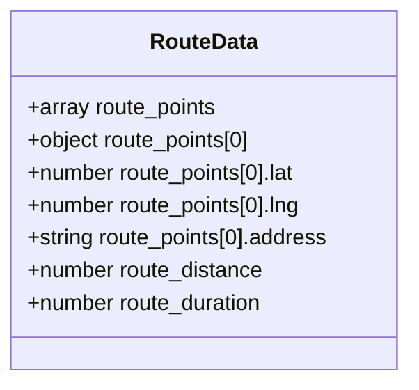
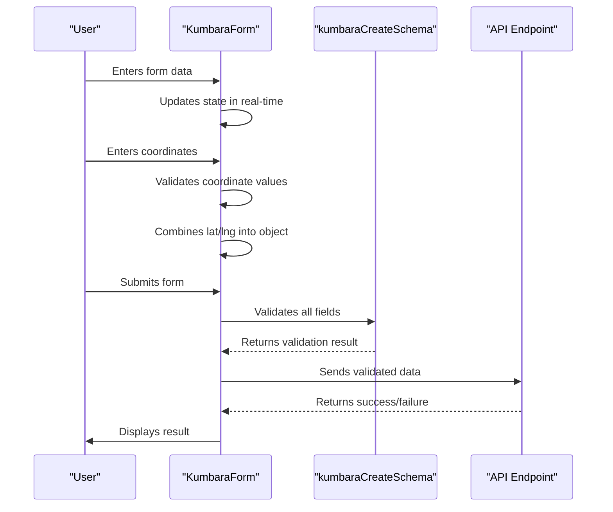
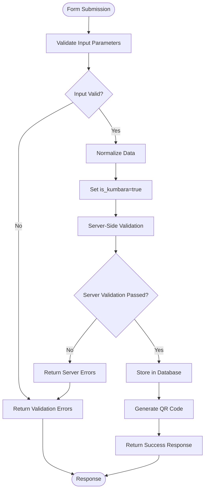
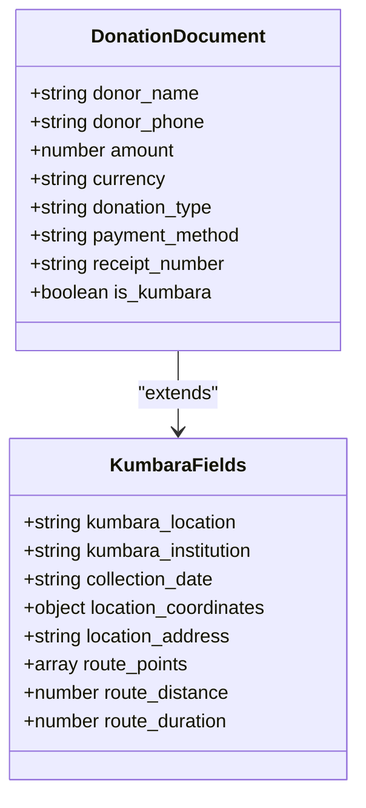

# Kumbara-Specific Fields

<cite>
**Referenced Files in This Document**   
- [KumbaraForm.tsx](file://src/components/kumbara/KumbaraForm.tsx)
- [kumbara.ts](file://src/lib/validations/kumbara.ts)
- [donations.ts](file://convex/donations.ts)
- [database.ts](file://src/types/database.ts)
- [route.ts](file://src/app/api/kumbara/route.ts)
</cite>

## Table of Contents

1. [Introduction](#introduction)
2. [Core Kumbara Fields](#core-kumbara-fields)
3. [Location and GPS Tracking Fields](#location-and-gps-tracking-fields)
4. [Route Management Fields](#route-management-fields)
5. [Field Implementation in KumbaraForm](#field-implementation-in-kumbaraform)
6. [Validation and Data Integrity](#validation-and-data-integrity)
7. [Integration with Donation System](#integration-with-donation-system)
8. [Common Issues and Solutions](#common-issues-and-solutions)

## Introduction

The Kumbara-specific fields extend the base donation model to support physical money box collection operations. These fields enable comprehensive tracking of collection activities, including location management, GPS route tracking, and collection scheduling. The implementation provides a structured way to manage physical donation collections while maintaining data integrity and traceability throughout the donation lifecycle.

**Section sources**

- [database.ts](file://src/types/database.ts#L148-L171)

## Core Kumbara Fields

The core Kumbara fields are designed to capture essential information about physical money box collections. The `is_kumbara` field serves as a boolean flag to distinguish Kumbara donations from other donation types, ensuring proper routing and processing within the system.

The `kumbara_location` field captures the specific location where the money box is placed (e.g., "Ofis Giriş, Market"), while `kumbara_institution` records the institution or address details (e.g., "ABC A.Ş. - Merkez Mah."). The `collection_date` field stores the scheduled collection date in ISO format, and `kumbara_institution` maintains the organizational context of the collection point.

**Diagram sources**

- [database.ts](file://src/types/database.ts#L148-L171)
- [kumbara.ts](file://src/lib/validations/kumbara.ts#L4-L76)

**Section sources**

- [database.ts](file://src/types/database.ts#L148-L171)
- [kumbara.ts](file://src/lib/validations/kumbara.ts#L4-L76)

## Location and GPS Tracking Fields

The location management system includes several fields for precise tracking of collection points. The `location_coordinates` field stores GPS coordinates as an object with `lat` and `lng` properties, enabling accurate positioning of collection points on maps. This field is optional but recommended for route optimization and verification purposes.

The `location_address` field provides a human-readable address string that complements the GPS coordinates. This dual approach ensures that collection points can be accurately identified both programmatically through coordinates and visually through address information. The system validates coordinate data to ensure both latitude and longitude values are valid numbers before storing them.

**Diagram sources**

- [database.ts](file://src/types/database.ts#L167-L168)
- [kumbara.ts](file://src/lib/validations/kumbara.ts#L59-L64)

**Section sources**

- [database.ts](file://src/types/database.ts#L167-L168)
- [kumbara.ts](file://src/lib/validations/kumbara.ts#L59-L64)

## Route Management Fields

The route management system captures comprehensive data about collection routes to optimize efficiency and track performance. The `route_points` field stores an array of coordinate objects representing waypoints along the collection route, each containing `lat` and `lng` properties and an optional `address` field.

The `route_distance` field records the total distance of the collection route in kilometers, while `route_duration` captures the estimated or actual time required to complete the route in minutes. These metrics enable performance analysis and route optimization over time. The system validates that both fields contain positive numbers when provided.

**Diagram sources**

- [database.ts](file://src/types/database.ts#L169-L171)
- [kumbara.ts](file://src/lib/validations/kumbara.ts#L66-L75)

**Section sources**

- [database.ts](file://src/types/database.ts#L169-L171)
- [kumbara.ts](file://src/lib/validations/kumbara.ts#L66-L75)

## Field Implementation in KumbaraForm

The KumbaraForm component implements a comprehensive interface for collecting all Kumbara-specific data. The form initializes with default values including `is_kumbara: true` and sets the current date as the default `collection_date`. Field validation is handled through the `kumbaraCreateSchema` which enforces minimum length requirements and data type constraints.

The form includes specialized input components for coordinate entry, with separate fields for latitude and longitude that are combined into a single `location_coordinates` object. The coordinate input includes validation to ensure values are valid numbers before updating the form state. The form also manages file uploads for supporting documentation, linking them to the donation record through the `receipt_file_id` field.

**Diagram sources**

- [KumbaraForm.tsx](file://src/components/kumbara/KumbaraForm.tsx#L46-L814)
- [kumbara.ts](file://src/lib/validations/kumbara.ts#L4-L76)

**Section sources**

- [KumbaraForm.tsx](file://src/components/kumbara/KumbaraForm.tsx#L46-L814)

## Validation and Data Integrity

The system implements robust validation at multiple levels to ensure data integrity. The Zod schema (`kumbaraCreateSchema`) defines type constraints and validation rules for all Kumbara fields, including minimum length requirements for text fields and numeric validation for coordinates and financial amounts.

Server-side validation in the API route performs additional checks, including verifying that coordinate values are valid numbers and that route metrics are positive values. The validation process normalizes data by ensuring `is_kumbara` is always set to `true` for Kumbara donations and providing default values for optional fields. Error messages are returned in a structured format to facilitate user feedback.

**Diagram sources**

- [kumbara.ts](file://src/lib/validations/kumbara.ts#L69-L158)
- [route.ts](file://src/app/api/kumbara/route.ts#L69-L158)

**Section sources**

- [kumbara.ts](file://src/lib/validations/kumbara.ts#L69-L158)
- [route.ts](file://src/app/api/kumbara/route.ts#L69-L158)

## Integration with Donation System

The Kumbara fields are seamlessly integrated into the broader donation system through the `DonationDocument` interface, which extends the base donation model with Kumbara-specific properties. The `is_kumbara` flag enables conditional logic throughout the system, allowing different processing paths for Kumbara donations versus other donation types.

The system uses Convex queries with specific indexes to efficiently retrieve Kumbara donations, such as the `by_is_kumbara` index that filters donations based on the `is_kumbara` flag. This integration allows Kumbara donations to participate in all standard donation workflows while providing specialized functionality for collection management, reporting, and tracking.

**Diagram sources**

- [database.ts](file://src/types/database.ts#L148-L171)
- [donations.ts](file://convex/donations.ts#L1-L149)

**Section sources**

- [database.ts](file://src/types/database.ts#L148-L171)
- [donations.ts](file://convex/donations.ts#L1-L149)

## Common Issues and Solutions

The system addresses several common challenges in physical collection management. For GPS coordinate accuracy, the implementation includes client-side validation to ensure coordinate values are valid numbers before submission, preventing invalid data from reaching the server.

For route optimization, the system captures detailed route metrics (`route_distance` and `route_duration`) that can be analyzed over time to identify inefficiencies and optimize collection routes. The QR code generation system provides a reliable way to verify collection points, with QR data including location coordinates and institutional information for verification purposes.

The form's progressive completion indicator helps users understand which required fields remain incomplete, reducing submission errors. Server-side validation provides clear error messages for common issues such as invalid dates or coordinate formats, enabling users to correct mistakes efficiently.

**Section sources**

- [KumbaraForm.tsx](file://src/components/kumbara/KumbaraForm.tsx#L46-L814)
- [kumbara.ts](file://src/lib/validations/kumbara.ts#L69-L158)
- [route.ts](file://src/app/api/kumbara/route.ts#L69-L158)
