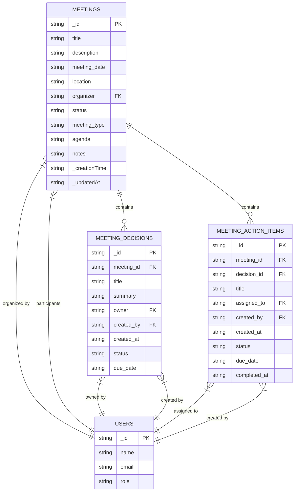
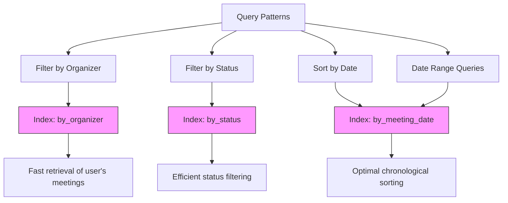
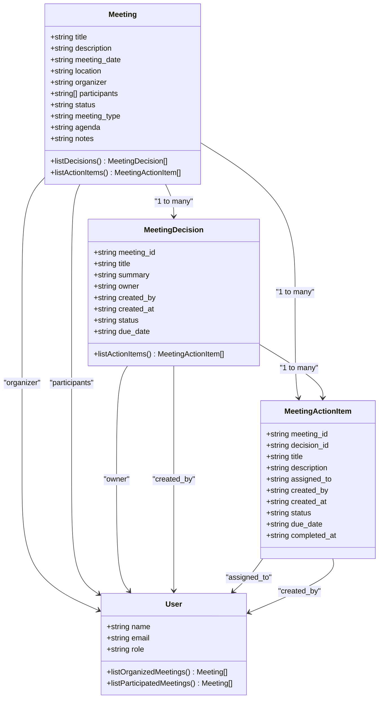
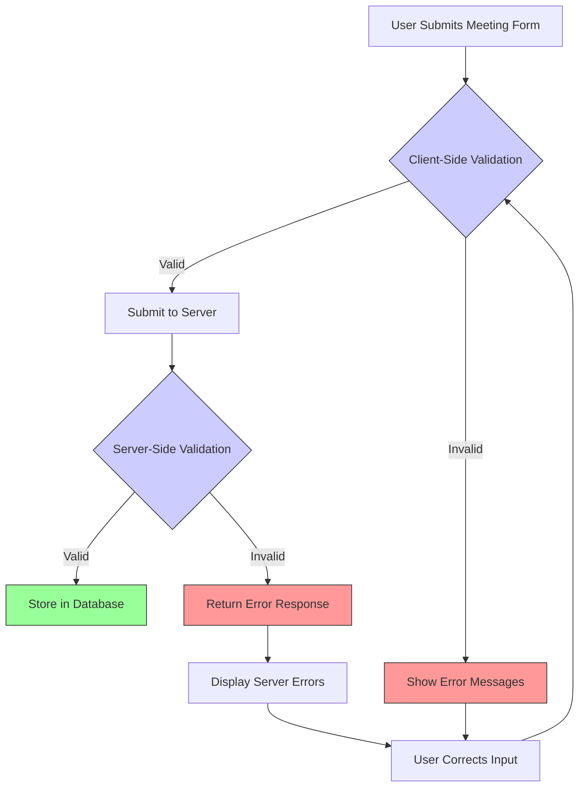
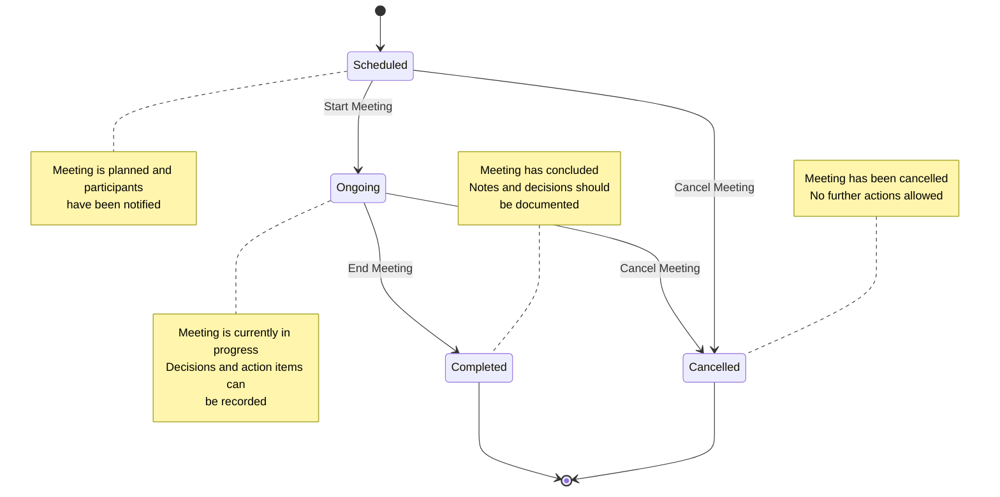

# Meetings Data Model

<cite>
**Referenced Files in This Document**   
- [meetings.ts](file://convex/meetings.ts)
- [meeting_decisions.ts](file://convex/meeting_decisions.ts)
- [meeting_action_items.ts](file://convex/meeting_action_items.ts)
- [schema.ts](file://convex/schema.ts)
- [MeetingForm.tsx](file://src/components/forms/MeetingForm.tsx)
- [database.ts](file://src/types/database.ts)
- [meeting.ts](file://src/lib/validations/meeting.ts)
- [route.ts](file://src/app/api/meetings/route.ts)
- [route.ts](file://src/app/api/meetings/[id]/route.ts)
- [convex-api-client.ts](file://src/lib/api/convex-api-client.ts)
</cite>

## Table of Contents

1. [Introduction](#introduction)
2. [Entity Structure](#entity-structure)
3. [Indexing Strategy](#indexing-strategy)
4. [Relationships to Related Collections](#relationships-to-related-collections)
5. [Data Validation Rules](#data-validation-rules)
6. [Business Logic for Meeting Lifecycle Management](#business-logic-for-meeting-lifecycle-management)
7. [API Endpoints](#api-endpoints)

## Introduction

The meetings collection in the Kafkasder-panel application serves as the central entity for managing organizational meetings. This data model supports comprehensive meeting management including scheduling, participant tracking, status monitoring, and integration with related entities such as decisions and action items. The design follows a normalized approach with proper relationships to maintain data integrity while supporting efficient querying patterns through strategic indexing.

**Section sources**

- [meetings.ts](file://convex/meetings.ts#L1-L124)
- [schema.ts](file://convex/schema.ts#L264-L298)

## Entity Structure

The meetings collection contains comprehensive information about scheduled meetings with the following fields:

| Field            | Type          | Description                                     | Constraints                                                         |
| ---------------- | ------------- | ----------------------------------------------- | ------------------------------------------------------------------- |
| **title**        | string        | The title or subject of the meeting             | Required, minimum 3 characters, maximum 200 characters              |
| **description**  | string        | Detailed description or agenda for the meeting  | Optional, maximum 2000 characters                                   |
| **meeting_date** | string        | Date and time of the meeting in ISO 8601 format | Required, must be current date or future                            |
| **location**     | string        | Physical or virtual location of the meeting     | Optional, maximum 200 characters                                    |
| **organizer**    | Id<'users'>   | Reference to the user who organized the meeting | Required, must be valid user ID                                     |
| **participants** | Id<'users'>[] | Array of user IDs for meeting participants      | Required, minimum 1 participant, maximum 50, must include organizer |
| **status**       | enum          | Current status of the meeting                   | Required, one of: 'scheduled', 'ongoing', 'completed', 'cancelled'  |
| **meeting_type** | enum          | Type/category of the meeting                    | Required, one of: 'general', 'committee', 'board', 'other'          |
| **agenda**       | string        | Formal agenda for the meeting                   | Optional, maximum 2000 characters                                   |
| **notes**        | string        | General notes or minutes from the meeting       | Optional, maximum 2000 characters                                   |

The entity extends the base Document interface with standard fields including \_id, \_creationTime, \_updatedAt, and other metadata fields automatically managed by Convex.

**Diagram sources**

- [schema.ts](file://convex/schema.ts#L264-L298)
- [meeting_decisions.ts](file://convex/meeting_decisions.ts#L304-L326)
- [meeting_action_items.ts](file://convex/meeting_action_items.ts#L332-L381)

**Section sources**

- [schema.ts](file://convex/schema.ts#L264-L298)
- [database.ts](file://src/types/database.ts#L246-L257)
- [meeting.ts](file://src/lib/validations/meeting.ts#L58-L84)

## Indexing Strategy

The meetings collection implements a strategic indexing approach to optimize query performance for common access patterns. Three dedicated indexes support the most frequent query scenarios:

- **by_organizer**: Index on the organizer field to efficiently retrieve all meetings organized by a specific user. This supports user-specific meeting dashboards and workload analysis.
- **by_status**: Index on the status field to quickly filter meetings by their current state (scheduled, ongoing, completed, cancelled). This enables status-based views and reporting.
- **by_meeting_date**: Index on the meeting_date field to support chronological sorting and date-range queries. This is essential for calendar views and time-based filtering.

These indexes are designed to support the primary query patterns used throughout the application, including listing meetings by organizer, filtering by status, and displaying meetings in chronological order. The indexing strategy ensures optimal performance for both list and calendar views of meetings.

**Diagram sources**

- [schema.ts](file://convex/schema.ts#L296-L298)
- [meetings.ts](file://convex/meetings.ts#L5-L40)

**Section sources**

- [schema.ts](file://convex/schema.ts#L296-L298)
- [meetings.ts](file://convex/meetings.ts#L5-L40)

## Relationships to Related Collections

The meetings collection maintains relationships with several related collections to support comprehensive meeting management:

### Meeting Decisions

Each meeting can have multiple associated decisions stored in the meeting_decisions collection. The relationship is established through the meeting_id field in meeting_decisions, which references the \_id of the parent meeting. This one-to-many relationship allows capturing key decisions made during meetings, with each decision including details such as title, summary, owner, status, and due date.

### Meeting Action Items

Action items arising from meetings or specific decisions are tracked in the meeting_action_items collection. This collection maintains a reference to the parent meeting through the meeting_id field. Additionally, action items can be linked to specific decisions via the decision_id field, creating a hierarchical structure where meetings contain decisions, and decisions generate action items.

### Users

The meetings collection has multiple relationships with the users collection:

- The organizer field references the user who created and is responsible for the meeting
- The participants array contains references to all users attending the meeting
- These relationships enable participant management, notification routing, and access control

The relationship model supports complex queries such as finding all action items assigned to a user from meetings they attended, or retrieving all decisions made in meetings organized by a specific user.

**Diagram sources**

- [meeting_decisions.ts](file://convex/meeting_decisions.ts#L304-L326)
- [meeting_action_items.ts](file://convex/meeting_action_items.ts#L332-L381)
- [schema.ts](file://convex/schema.ts#L264-L298)

**Section sources**

- [meeting_decisions.ts](file://convex/meeting_decisions.ts#L304-L326)
- [meeting_action_items.ts](file://convex/meeting_action_items.ts#L332-L381)
- [convex-api-client.ts](file://src/lib/api/convex-api-client.ts#L321-L424)

## Data Validation Rules

The meetings data model implements comprehensive validation rules to ensure data quality and consistency:

### Client-Side Validation

The MeetingForm component enforces validation through Zod schemas that are applied to form inputs:

- **Title**: Minimum 3 characters, maximum 200 characters
- **Description**: Maximum 2000 characters
- **Meeting Date**: Must be at least one hour in the future for new meetings (to prevent last-minute scheduling)
- **Location**: Maximum 200 characters
- **Participants**: Minimum 1, maximum 50 participants with no duplicates
- **Status**: One of the allowed values: 'scheduled', 'ongoing', 'completed', 'cancelled'
- **Meeting Type**: One of the allowed values: 'general', 'committee', 'board', 'other'
- **Agenda and Notes**: Maximum 2000 characters each

Additional business rules are enforced:

- The organizer must be included in the participants list
- Participants cannot be removed from the meeting if they are the organizer

### Server-Side Validation

The API routes implement server-side validation to ensure data integrity:

- **Title**: Must be at least 3 characters long
- **Meeting Date**: Required field
- **Status**: Must be one of the allowed values
- **Organizer**: Must be a valid user ID
- **Participants**: Must be an array of valid user IDs

The server-side validation acts as a final safeguard, ensuring that only properly formatted and valid data is stored in the database, regardless of the client implementation.

**Diagram sources**

- [meeting.ts](file://src/lib/validations/meeting.ts#L58-L135)
- [route.ts](file://src/app/api/meetings/route.ts#L7-L36)
- [route.ts](file://src/app/api/meetings/[id]/route.ts#L8-L23)

**Section sources**

- [meeting.ts](file://src/lib/validations/meeting.ts#L58-L135)
- [route.ts](file://src/app/api/meetings/route.ts#L7-L36)
- [route.ts](file://src/app/api/meetings/[id]/route.ts#L8-L23)

## Business Logic for Meeting Lifecycle Management

The meetings collection implements a state-based lifecycle management system that guides meetings through their natural progression from scheduling to completion:

### State Transitions

Meetings progress through four distinct states:

- **Scheduled**: The initial state when a meeting is created and planned
- **Ongoing**: The state when a meeting has started (transitioned manually by the organizer)
- **Completed**: The state when a meeting has concluded successfully
- **Cancelled**: The state when a meeting has been cancelled

The application provides a "Start Meeting" button in the UI that transitions a meeting from 'scheduled' to 'ongoing' status. This action is typically performed by the meeting organizer when the meeting begins.

### Lifecycle Enforcement

The system enforces business rules around state transitions:

- Only meetings with 'scheduled' status can be started
- Meetings can be cancelled at any time before completion
- Once a meeting is marked as 'completed', it cannot be modified except for adding notes
- The organizer is automatically added as a participant and cannot be removed

### Integration with Related Entities

The meeting lifecycle is closely integrated with related entities:

- Meeting decisions can only be created for meetings with 'scheduled', 'ongoing', or 'completed' status
- Action items can be created throughout the meeting lifecycle but are typically created during or after the meeting
- When a meeting is completed, users are prompted to add notes and decisions to capture outcomes

The lifecycle management ensures that meetings progress in a controlled manner while maintaining data integrity and providing a clear audit trail of meeting status changes.

**Diagram sources**

- [meetings.ts](file://convex/meetings.ts#L52-L122)
- [MeetingForm.tsx](file://src/components/forms/MeetingForm.tsx#L138-L149)
- [convex-api-client.ts](file://src/lib/api/convex-api-client.ts#L304-L312)

**Section sources**

- [meetings.ts](file://convex/meetings.ts#L52-L122)
- [MeetingForm.tsx](file://src/components/forms/MeetingForm.tsx#L138-L149)
- [convex-api-client.ts](file://src/lib/api/convex-api-client.ts#L304-L312)

## API Endpoints

The meetings collection is accessible through a set of RESTful API endpoints that provide CRUD operations and specialized functionality:

### GET /api/meetings

Retrieves a list of meetings with optional filtering and pagination. Supports query parameters for:

- limit: Number of results per page
- skip: Offset for pagination
- status: Filter by meeting status
- organizer: Filter by organizer ID

### GET /api/meetings/[id]

Retrieves a specific meeting by its ID, including all associated data.

### POST /api/meetings

Creates a new meeting with the provided data. Performs validation on all fields before creation.

### PUT /api/meetings/[id]

Updates an existing meeting with new data. Only specified fields are updated.

### DELETE /api/meetings/[id]

Deletes a meeting by its ID. Requires appropriate permissions.

The API endpoints are implemented as Next.js route handlers that serve as a proxy to the Convex backend, providing an additional layer of security, validation, and authentication. The endpoints follow consistent response patterns with success flags, data payloads, and error messages.

**Section sources**

- [route.ts](file://src/app/api/meetings/route.ts)
- [route.ts](file://src/app/api/meetings/[id]/route.ts)
- [convex-api-client.ts](file://src/lib/api/convex-api-client.ts#L268-L317)
