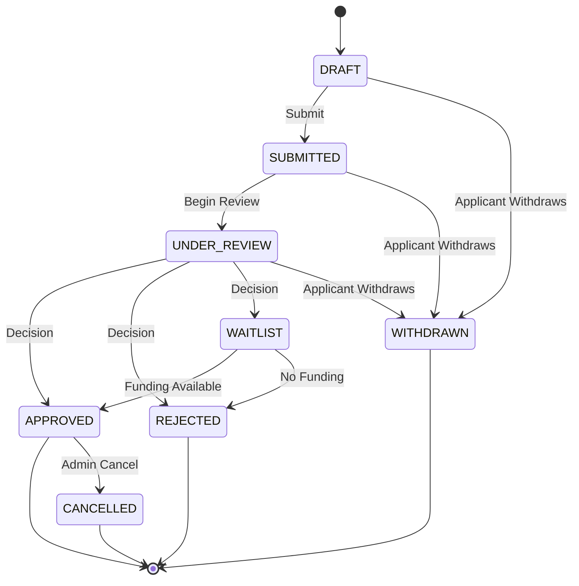
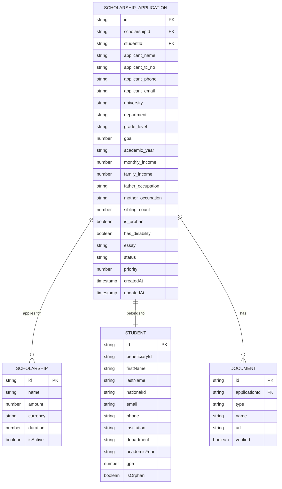
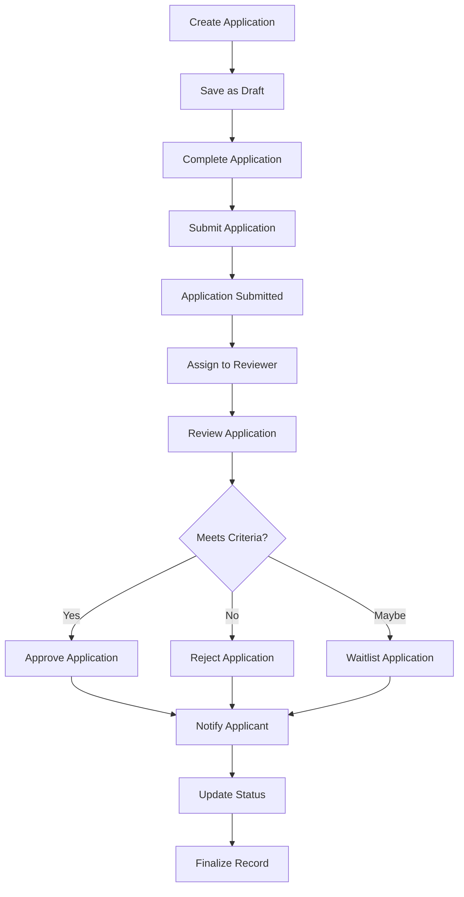

# Scholarship Application Entity

<cite>
**Referenced Files in This Document**   
- [aid_applications.ts](file://convex/aid_applications.ts)
- [scholarship.ts](file://src/types/scholarship.ts)
- [aid-application.ts](file://src/lib/validations/aid-application.ts)
- [AidApplicationForm.tsx](file://src/components/forms/AidApplicationForm.tsx)
- [route.ts](file://src/app/api/aid-applications/route.ts)
</cite>

## Table of Contents

1. [Introduction](#introduction)
2. [Core Fields and Data Structure](#core-fields-and-data-structure)
3. [Status Lifecycle and Workflow](#status-lifecycle-and-workflow)
4. [Priority Scoring System](#priority-scoring-system)
5. [Relationships with Other Entities](#relationships-with-other-entities)
6. [Indexing Strategy](#indexing-strategy)
7. [Application Workflow](#application-workflow)
8. [API Methods](#api-methods)
9. [Validation Rules](#validation-rules)
10. [Frontend Implementation](#frontend-implementation)

## Introduction

The Scholarship Application entity in the Kafkasder-panel application represents a comprehensive system for managing scholarship applications. This document details the implementation of the application entity, including its data structure, workflow, relationships, and API interface. The entity serves as a central component in the scholarship management system, capturing applicant information, academic details, financial need, and supporting documentation.

**Section sources**

- [scholarship.ts](file://src/types/scholarship.ts#L128-L155)

## Core Fields and Data Structure

The Scholarship Application entity contains comprehensive information about applicants and their circumstances. Key fields include:

- **scholarshipId**: Reference to the scholarship being applied for
- **studentId**: Optional reference to an existing beneficiary/student
- **applicant_name**: Full name of the applicant
- **applicant_tc_no**: Turkish identification number
- **applicant_phone**: Contact phone number
- **applicant_email**: Email address
- **university**: Institution of study
- **department**: Academic department
- **grade_level**: Current grade or year
- **gpa**: Academic performance metric
- **academic_year**: Current academic year
- **monthly_income**: Individual monthly income
- **family_income**: Total family income
- **father_occupation**: Father's occupation
- **mother_occupation**: Mother's occupation
- **sibling_count**: Number of siblings
- **is_orphan**: Orphan status indicator
- **has_disability**: Disability status
- **essay**: Personal statement or motivation letter
- **documents**: Array of supporting document references
- **createdAt/updatedAt**: Timestamps for record management

The data structure is designed to capture both academic merit and financial need factors for comprehensive evaluation.

**Section sources**

- [scholarship.ts](file://src/types/scholarship.ts#L128-L155)
- [aid_applications.ts](file://convex/aid_applications.ts#L55-L88)

## Status Lifecycle and Workflow

The application status field implements a comprehensive lifecycle management system with the following possible values:

- **DRAFT**: Application is being prepared
- **SUBMITTED**: Application has been submitted by the applicant
- **UNDER_REVIEW**: Application is being evaluated by reviewers
- **APPROVED**: Application has been approved for funding
- **REJECTED**: Application has been declined
- **WAITLIST**: Application is on a waiting list for potential funding

The status transitions follow a defined workflow from creation through evaluation to final disposition. Additional statuses include WITHDRAWN (applicant withdrew) and CANCELLED (administratively cancelled).

**Diagram sources**

- [scholarship.ts](file://src/types/scholarship.ts#L16-L25)

## Priority Scoring System

The priority scoring system enables ranking and sorting of applications based on urgency and need. The priority field uses a numerical value that can be calculated from various factors including:

- Financial need severity
- Academic merit
- Special circumstances (orphan status, disability, etc.)
- Urgency of situation
- Deadline proximity

The system allows administrators to manually adjust priority scores or use automated scoring algorithms based on predefined criteria. Higher priority scores indicate applications that should be reviewed first or given special consideration.

**Section sources**

- [scholarship.ts](file://src/types/scholarship.ts#L142)
- [aid_applications.ts](file://convex/aid_applications.ts#L80-L87)

## Relationships with Other Entities

The Scholarship Application entity maintains critical relationships with other system entities:

- **Scholarship**: One-to-many relationship where one scholarship can have multiple applications
- **Student/Beneficiary**: Optional one-to-one relationship linking to existing beneficiary records
- **Documents**: One-to-many relationship with supporting documents
- **Users**: Relationships with applicants, reviewers, and approvers

These relationships enable data consistency and provide context for application evaluation. The system supports both applications from existing beneficiaries and new applicants who may not yet be in the system.

**Diagram sources**

- [scholarship.ts](file://src/types/scholarship.ts#L62-L80)
- [scholarship.ts](file://src/types/scholarship.ts#L82-L115)
- [scholarship.ts](file://src/types/scholarship.ts#L157-L166)

## Indexing Strategy

The application entity implements an efficient indexing strategy to support various query patterns:

- **by_scholarship**: Index on scholarshipId for retrieving all applications for a specific scholarship
- **by_status**: Index on status field for filtering applications by their current status
- **by_tc_no**: Index on applicant_tc_no for quick lookup by Turkish identification number
- **by_submitted_at**: Index on submission timestamp for chronological sorting and date-range queries

These indexes ensure optimal performance for common operations such as listing applications by scholarship, filtering by status, and searching by applicant identity.

**Section sources**

- [aid_applications.ts](file://convex/aid_applications.ts#L19-L30)

## Application Workflow

The application workflow encompasses the complete lifecycle from creation to final disposition:

1. **Creation**: Applicants or administrators create a new application, initially in DRAFT status
2. **Editing**: Users can modify application details while in DRAFT status
3. **Submission**: Applicant submits the application, changing status to SUBMITTED
4. **Review Assignment**: System or administrators assign applications to reviewers
5. **Evaluation**: Reviewers assess applications based on criteria and update review notes
6. **Decision**: Reviewers or committees make approval decisions
7. **Notification**: Applicants are notified of decisions
8. **Disbursement**: For approved applications, scholarship funds are disbursed
9. **Completion**: Application record is finalized

The workflow supports both individual and batch processing of applications.

**Diagram sources**

- [aid_applications.ts](file://convex/aid_applications.ts#L55-L92)
- [route.ts](file://src/app/api/aid-applications/route.ts#L61-L98)

## API Methods

The Scholarship Application entity exposes a comprehensive API for managing applications:

- **list**: Retrieve applications with optional filtering by scholarship, status, or beneficiary
- **get**: Retrieve a specific application by ID
- **create**: Create a new application with initial data
- **update**: Modify an existing application (with validation of status transitions)
- **remove**: Delete an application (typically only for drafts)

The API supports pagination, filtering, and sorting to handle large volumes of applications efficiently. Authentication and authorization are enforced to ensure only authorized users can access or modify application data.

**Section sources**

- [aid_applications.ts](file://convex/aid_applications.ts#L5-L162)

## Validation Rules

The application entity implements comprehensive validation rules to ensure data quality:

- Required fields validation (applicant_name, application_date, etc.)
- Data type validation (numeric fields, date formats)
- Enum value validation for status and priority fields
- Range validation for numeric values (GPA, income, etc.)
- Format validation for contact information
- Document verification status tracking

Validation occurs at multiple levels: frontend form validation, API request validation, and database schema validation to provide robust data integrity.

**Section sources**

- [aid-application.ts](file://src/lib/validations/aid-application.ts#L8-L45)
- [route.ts](file://src/app/api/aid-applications/route.ts#L6-L27)

## Frontend Implementation

The frontend implementation provides a user-friendly interface for managing scholarship applications:

- **AidApplicationForm**: React component for creating and editing applications
- Form validation using Zod and React Hook Form
- Real-time validation feedback
- Conditional rendering based on application type
- File upload integration for supporting documents
- Responsive design for various screen sizes
- Loading states and error handling
- Success notifications

The form interface guides users through the application process with clear sections for personal information, academic details, financial information, and supporting documents.

**Section sources**

- [AidApplicationForm.tsx](file://src/components/forms/AidApplicationForm.tsx#L27-L42)
- [AidApplicationForm.tsx](file://src/components/forms/AidApplicationForm.tsx#L110-L349)
