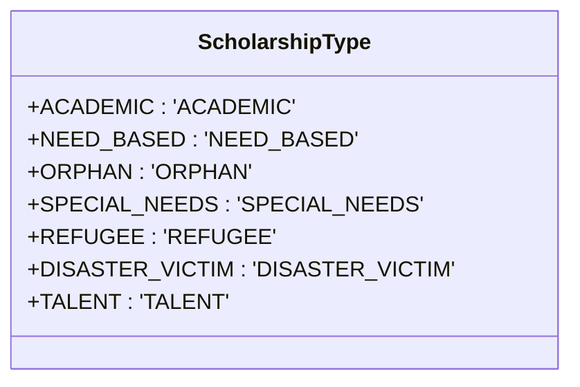
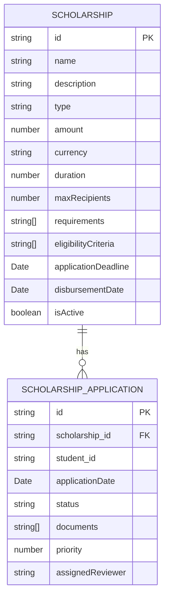
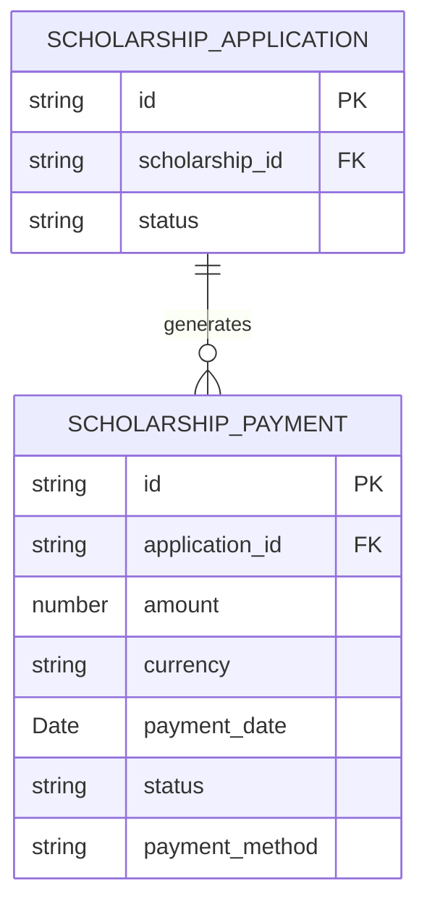
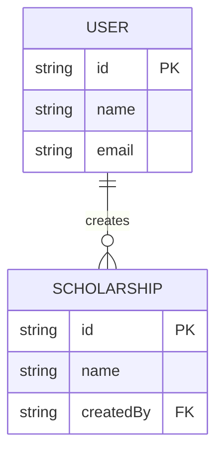
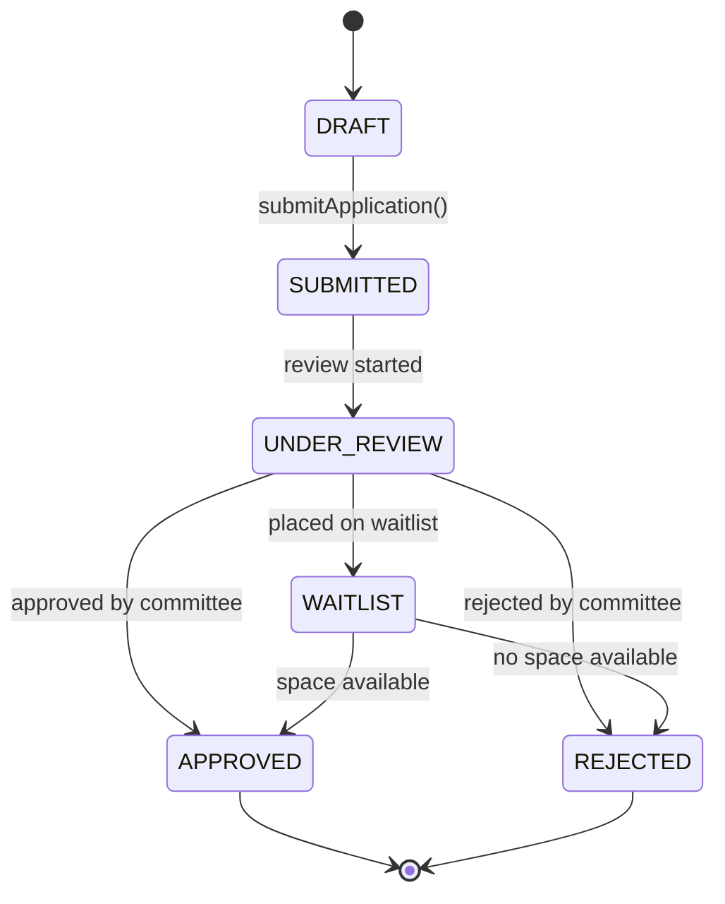
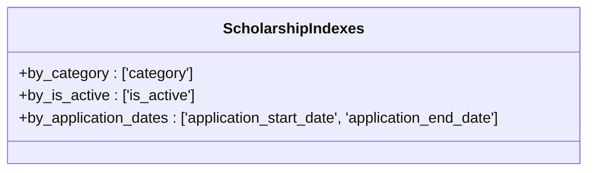

# Scholarship Entity

<cite>
**Referenced Files in This Document**   
- [scholarship.ts](file://src/types/scholarship.ts)
- [scholarships.ts](file://convex/scholarships.ts)
- [schema.ts](file://convex/schema.ts)
- [scholarships.ts](file://src/lib/api/scholarships.ts)
</cite>

## Table of Contents

1. [Introduction](#introduction)
2. [Entity Structure](#entity-structure)
3. [Relationships](#relationships)
4. [Data Validation and Business Logic](#data-validation-and-business-logic)
5. [Indexing Strategy](#indexing-strategy)
6. [Audit and Timestamps](#audit-and-timestamps)

## Introduction

The Scholarship entity in the Kafkasder-panel application represents financial aid programs designed to support students. This documentation provides a comprehensive overview of the entity's structure, relationships, validation rules, and business logic. The entity serves as the foundation for managing scholarship programs, tracking applications, and disbursing payments.

**Section sources**

- [scholarship.ts](file://src/types/scholarship.ts#L61-L79)

## Entity Structure

The Scholarship entity contains comprehensive information about each scholarship program, including financial details, eligibility criteria, and operational parameters.

### Core Fields

| Field               | Type            | Description                                                    |
| ------------------- | --------------- | -------------------------------------------------------------- |
| id                  | string          | Unique identifier for the scholarship                          |
| name                | string          | Official name of the scholarship program                       |
| description         | string          | Detailed description of the scholarship's purpose and benefits |
| type                | ScholarshipType | Categorical classification of the scholarship                  |
| amount              | number          | Monetary value of the scholarship                              |
| currency            | string          | Currency code for the scholarship amount (TRY, USD, EUR)       |
| duration            | number          | Duration of the scholarship in months                          |
| maxRecipients       | number          | Maximum number of students who can receive this scholarship    |
| requirements        | string[]        | List of required documents for application                     |
| eligibilityCriteria | string[]        | List of criteria applicants must meet                          |
| applicationDeadline | Date            | Deadline for submitting applications                           |
| disbursementDate    | Date            | Scheduled date for fund disbursement                           |
| isActive            | boolean         | Current operational status of the scholarship program          |

### Scholarship Type Enum

The ScholarshipType enum defines the categorical classification system for scholarships:

**Diagram sources**

- [scholarship.ts](file://src/types/scholarship.ts#L5-L13)

**Section sources**

- [scholarship.ts](file://src/types/scholarship.ts#L5-L13)

## Relationships

The Scholarship entity maintains relationships with several related collections to support the scholarship management workflow.

### Scholarship Applications

Each scholarship can have multiple applications submitted by students. The relationship is defined by the scholarship_id field in the scholarship_applications collection.

**Diagram sources**

- [schema.ts](file://convex/schema.ts#L1007-L1030)
- [scholarship.ts](file://src/types/scholarship.ts#L127-L154)

### Payments

Approved scholarship applications generate payment records. The relationship is established through the application_id field in the scholarship_payments collection.

**Diagram sources**

- [scholarships.ts](file://convex/scholarships.ts#L341-L427)
- [scholarship.ts](file://src/types/scholarship.ts#L182-L199)

### User Relationships

The createdBy field establishes a relationship with the users collection, tracking which user created the scholarship record.

**Diagram sources**

- [schema.ts](file://convex/schema.ts#L1007-L1030)

**Section sources**

- [schema.ts](file://convex/schema.ts#L1007-L1030)

## Data Validation and Business Logic

The scholarship management system implements comprehensive validation rules and business logic to ensure data integrity and proper workflow execution.

### Application Validation

When creating a scholarship application, the system validates the Turkish Identification Number (TC number) format to ensure it contains exactly 11 digits.

### Priority Scoring

The system automatically calculates a priority score for each application based on multiple factors:

- Academic performance (GPA) - 30% weight
- Financial need (family and monthly income) - 40% weight
- Special circumstances (orphan status, disability, number of siblings) - 30% weight

The calculated priority score helps administrators evaluate and rank applications.

### Status Transitions

The application status follows a defined workflow:

**Diagram sources**

- [scholarships.ts](file://convex/scholarships.ts#L278-L299)
- [scholarship.ts](file://src/types/scholarship.ts#L15-L24)

**Section sources**

- [scholarships.ts](file://convex/scholarships.ts#L278-L299)

## Indexing Strategy

The system implements a comprehensive indexing strategy to optimize query performance for common access patterns.

### Collection Indexes

The scholarships collection has three indexes to support efficient filtering:

**Diagram sources**

- [schema.ts](file://convex/schema.ts#L1007-L1030)

### Index Usage

- **by_category**: Optimizes queries filtering scholarships by category/type
- **by_is_active**: Enables fast retrieval of active or inactive scholarship programs
- **by_application_dates**: Supports date-range queries for application periods

These indexes ensure optimal performance for dashboard displays, reporting, and administrative functions that filter scholarships based on these common criteria.

**Section sources**

- [schema.ts](file://convex/schema.ts#L1007-L1030)

## Audit and Timestamps

The Scholarship entity includes comprehensive audit and timestamp fields to track record lifecycle and modifications.

### Timestamp Fields

| Field     | Description                                             |
| --------- | ------------------------------------------------------- |
| createdAt | Timestamp when the scholarship record was created       |
| updatedAt | Timestamp when the scholarship record was last modified |

### Audit Fields

| Field     | Description                                                |
| --------- | ---------------------------------------------------------- |
| createdBy | Reference to the user ID who created the scholarship       |
| updatedBy | Reference to the user ID who last modified the scholarship |

These fields provide complete audit trail capabilities, allowing administrators to track the history of scholarship programs and identify responsible users for any changes made to the records.

**Section sources**

- [scholarship.ts](file://src/types/scholarship.ts#L75-L78)
- [schema.ts](file://convex/schema.ts#L1007-L1030)
