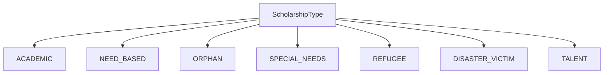
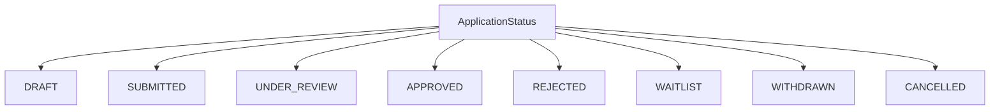
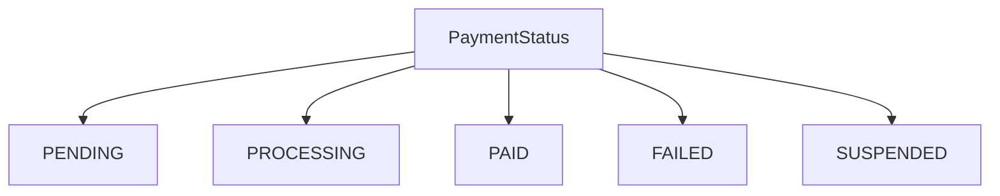
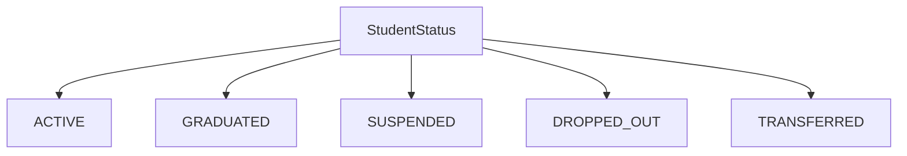
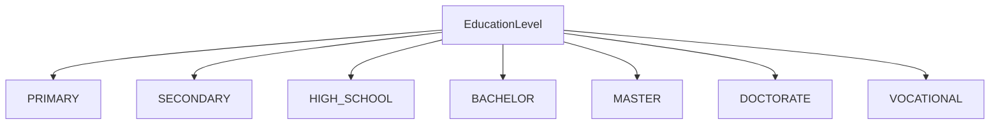
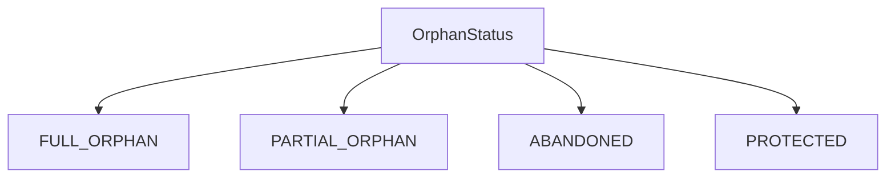
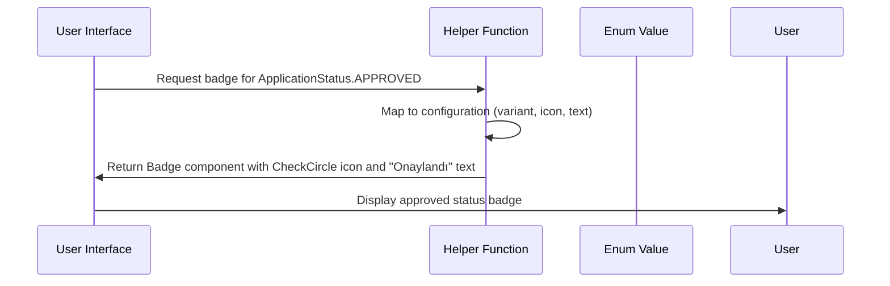

# Scholarship Enumeration Types

<cite>
**Referenced Files in This Document**   
- [scholarship.ts](file://src/types/scholarship.ts)
- [scholarship-helpers.tsx](file://src/lib/utils/scholarship-helpers.tsx)
- [orphan-types.ts](file://src/lib/constants/orphan-types.ts)
</cite>

## Table of Contents

1. [Introduction](#introduction)
2. [ScholarshipType Enum](#scholarshiptype-enum)
3. [ApplicationStatus Enum](#applicationstatus-enum)
4. [PaymentStatus Enum](#paymentstatus-enum)
5. [StudentStatus Enum](#studentstatus-enum)
6. [EducationLevel Enum](#educationlevel-enum)
7. [OrphanStatus Enum](#orphanstatus-enum)
8. [Usage in Application](#usage-in-application)
9. [Conclusion](#conclusion)

## Introduction

This document provides comprehensive documentation for the enumeration types used in the scholarship system of the Kafkasder-panel application. These enums are fundamental to maintaining data consistency, enabling validation, and supporting user interface rendering throughout the scholarship management system. The primary enumeration types include ScholarshipType, ApplicationStatus, PaymentStatus, StudentStatus, EducationLevel, and OrphanStatus, each serving specific purposes in the application's data model and workflow.

**Section sources**

- [scholarship.ts](file://src/types/scholarship.ts#L4-L58)

## ScholarshipType Enum

The ScholarshipType enum defines the different categories of scholarships available in the system. This enumeration ensures data consistency when categorizing scholarship programs and enables proper filtering and reporting capabilities.

The ScholarshipType enum includes the following values:

- **ACADEMIC**: Scholarships awarded based on academic merit and performance
- **NEED_BASED**: Scholarships awarded based on financial need and socioeconomic status
- **ORPHAN**: Scholarships specifically for orphaned students
- **SPECIAL_NEEDS**: Scholarships for students with special educational needs or disabilities
- **REFUGEE**: Scholarships for refugee students
- **DISASTER_VICTIM**: Scholarships for students affected by natural disasters or emergencies
- **TALENT**: Scholarships awarded for exceptional talent in arts, sports, or other non-academic areas

These types allow the system to categorize scholarship programs appropriately and apply specific eligibility criteria and processing rules based on the scholarship category.

**Diagram sources**

- [scholarship.ts](file://src/types/scholarship.ts#L6-L14)

**Section sources**

- [scholarship.ts](file://src/types/scholarship.ts#L6-L14)

## ApplicationStatus Enum

The ApplicationStatus enum represents the various stages in the scholarship application lifecycle. This enumeration is crucial for tracking application progress and implementing workflow logic.

The ApplicationStatus enum includes the following values:

- **DRAFT**: Application is being prepared and has not been submitted
- **SUBMITTED**: Application has been completed and submitted for review
- **UNDER_REVIEW**: Application is currently being evaluated by the review committee
- **APPROVED**: Application has been accepted and the applicant qualifies for the scholarship
- **REJECTED**: Application has been denied based on eligibility criteria or other factors
- **WAITLIST**: Application is conditionally accepted but awaits final confirmation based on funding availability
- **WITHDRAWN**: Applicant has voluntarily withdrawn their application
- **CANCELLED**: Application has been cancelled by the administration for various reasons

This status progression enables the system to manage the application workflow effectively and provide appropriate feedback to applicants at each stage.

**Diagram sources**

- [scholarship.ts](file://src/types/scholarship.ts#L16-L25)

**Section sources**

- [scholarship.ts](file://src/types/scholarship.ts#L16-L25)

## PaymentStatus Enum

The PaymentStatus enum tracks the financial transaction status for scholarship disbursements. This enumeration is essential for financial management and reporting.

The PaymentStatus enum includes the following values:

- **PENDING**: Payment has been authorized but not yet processed
- **PROCESSING**: Payment is currently being processed through the financial system
- **PAID**: Payment has been successfully completed and funds have been transferred
- **FAILED**: Payment attempt failed due to insufficient funds, invalid account, or other issues
- **SUSPENDED**: Payment has been temporarily suspended, typically due to verification requirements or disputes

This status tracking ensures accurate financial records and enables appropriate follow-up actions for payments that require attention.

**Diagram sources**

- [scholarship.ts](file://src/types/scholarship.ts#L27-L33)

**Section sources**

- [scholarship.ts](file://src/types/scholarship.ts#L27-L33)

## StudentStatus Enum

The StudentStatus enum represents the current enrollment and participation status of scholarship recipients. This enumeration helps maintain accurate records of student engagement with the scholarship program.

The StudentStatus enum includes the following values:

- **ACTIVE**: Student is currently enrolled and receiving the scholarship
- **GRADUATED**: Student has successfully completed their education program
- **SUSPENDED**: Student's scholarship has been temporarily suspended
- **DROPPED_OUT**: Student has discontinued their education and withdrawn from the program
- **TRANSFERRED**: Student has transferred to another educational institution

This status information is critical for determining scholarship continuation, renewal eligibility, and proper resource allocation.

**Diagram sources**

- [scholarship.ts](file://src/types/scholarship.ts#L35-L41)

**Section sources**

- [scholarship.ts](file://src/types/scholarship.ts#L35-L41)

## EducationLevel Enum

The EducationLevel enum categorizes the academic level of students applying for or receiving scholarships. This enumeration supports proper scholarship matching and reporting by educational stage.

The EducationLevel enum includes the following values:

- **PRIMARY**: Primary school level education
- **SECONDARY**: Secondary school level education
- **HIGH_SCHOOL**: High school level education
- **BACHELOR**: Undergraduate or bachelor's degree level
- **MASTER**: Graduate or master's degree level
- **DOCTORATE**: Doctoral or PhD level education
- **VOCATIONAL**: Vocational or technical education

This classification enables the system to match scholarships with appropriate educational levels and generate meaningful reports on scholarship distribution across different academic stages.

**Diagram sources**

- [scholarship.ts](file://src/types/scholarship.ts#L43-L51)

**Section sources**

- [scholarship.ts](file://src/types/scholarship.ts#L43-L51)

## OrphanStatus Enum

The OrphanStatus enum specifies the specific circumstances of orphaned students, allowing for targeted support and appropriate scholarship allocation.

The OrphanStatus enum includes the following values:

- **FULL_ORPHAN**: Student has lost both parents
- **PARTIAL_ORPHAN**: Student has lost one parent
- **ABANDONED**: Student has been abandoned by their family
- **PROTECTED**: Student is under official protection or guardianship

This detailed classification enables the system to provide appropriate levels of support and ensure that the most vulnerable students receive priority consideration.

**Diagram sources**

- [scholarship.ts](file://src/types/scholarship.ts#L53-L58)
- [orphan-types.ts](file://src/lib/constants/orphan-types.ts#L5-L9)

**Section sources**

- [scholarship.ts](file://src/types/scholarship.ts#L53-L58)
- [orphan-types.ts](file://src/lib/constants/orphan-types.ts#L5-L9)

## Usage in Application

The enumeration types are extensively used throughout the Kafkasder-panel application to ensure data consistency, enable validation, and support user interface rendering. These enums are implemented in various components and services to maintain data integrity and provide a consistent user experience.

### Data Consistency and Validation

The enumeration types serve as a single source of truth for valid values, preventing data entry errors and ensuring consistency across the application. When creating or updating scholarship records, applications, or student information, the system validates that the provided values match one of the defined enum values. This validation occurs at multiple levels:

- Frontend form validation prevents submission of invalid values
- Backend API validation ensures data integrity
- Database schema constraints enforce referential integrity

### User Interface Rendering

The enumeration types are used to render appropriate UI elements that enhance user experience. Helper functions in the application transform enum values into user-friendly representations:

The `scholarship-helpers.tsx` file contains utility functions that convert enum values into visually appropriate components:

- `getApplicationStatusBadge()` converts ApplicationStatus values into colored badges with icons
- `getStudentStatusBadge()` renders StudentStatus values as appropriately styled badges
- `getEducationLevelBadge()` displays EducationLevel values in a consistent format

These helper functions ensure consistent presentation of status information throughout the application, making it easier for users to quickly understand the current state of scholarship applications and student records.

**Diagram sources**

- [scholarship-helpers.tsx](file://src/lib/utils/scholarship-helpers.tsx#L25-L66)
- [scholarship.ts](file://src/types/scholarship.ts#L16-L25)

**Section sources**

- [scholarship-helpers.tsx](file://src/lib/utils/scholarship-helpers.tsx#L8-L66)
- [scholarship.ts](file://src/types/scholarship.ts#L16-L58)

## Conclusion

The enumeration types in the Kafkasder-panel scholarship system play a critical role in maintaining data integrity, enabling workflow management, and providing a consistent user experience. By defining clear categories for scholarship types, application statuses, payment statuses, student statuses, education levels, and orphan statuses, the system ensures that all stakeholders—from administrators to applicants—have a shared understanding of the scholarship management process. These enums serve as the foundation for data validation, reporting, and user interface rendering, contributing to the overall reliability and usability of the scholarship management system.
