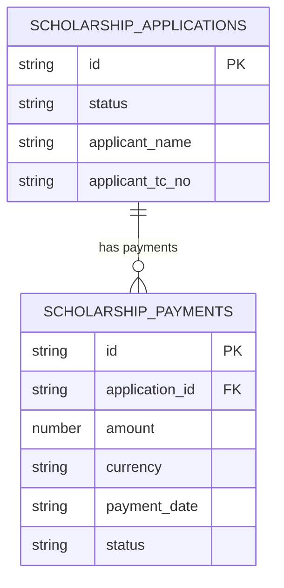
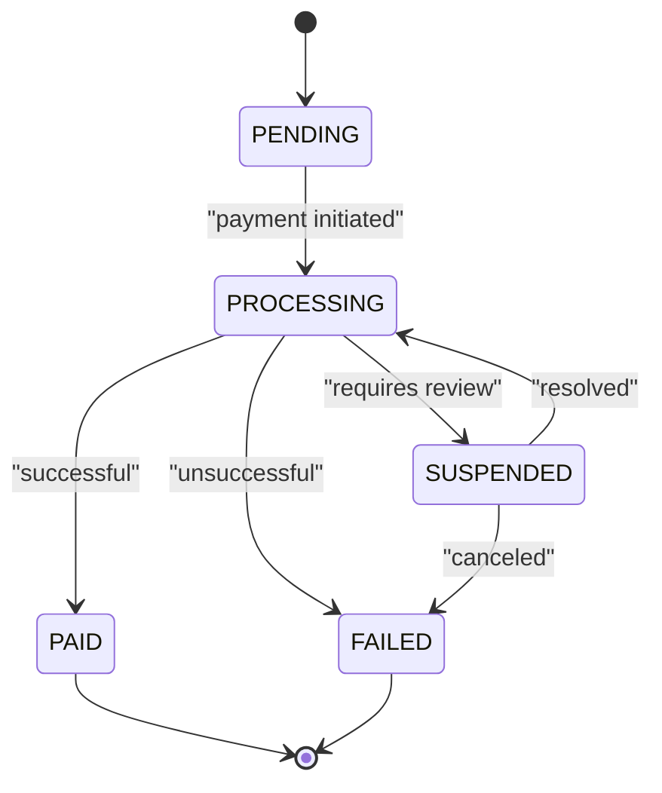
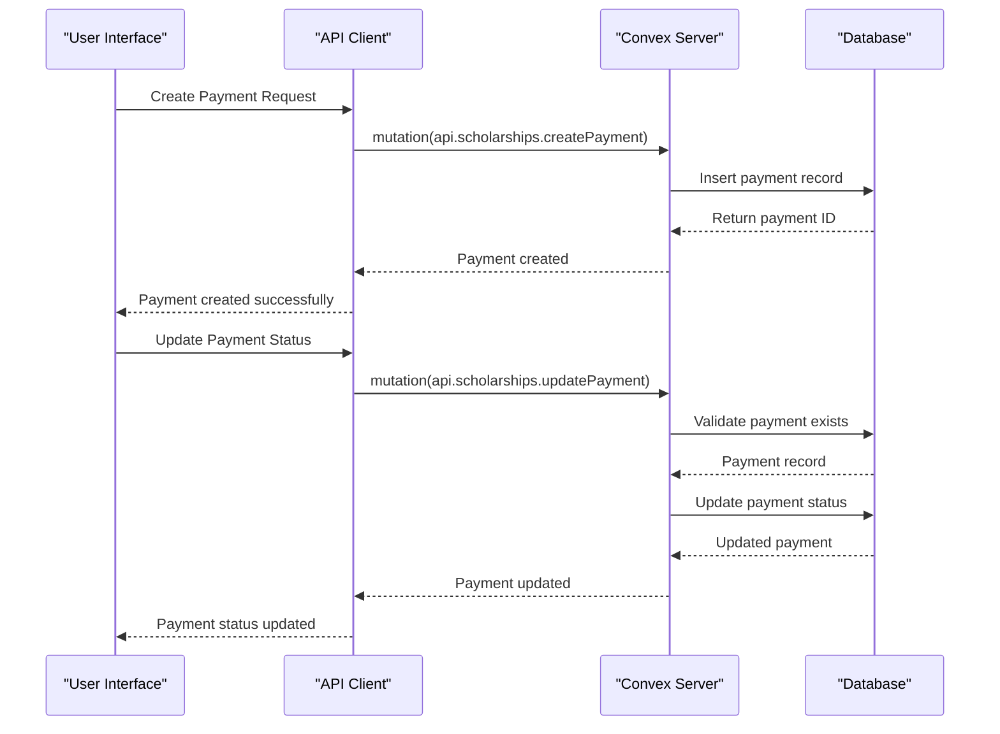
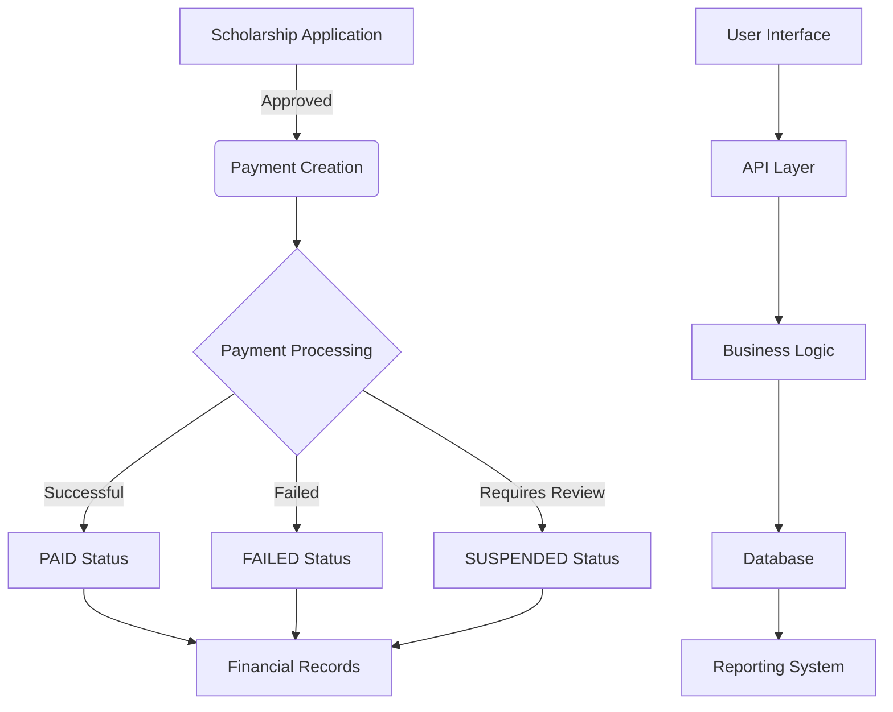

# Scholarship Payment Entity

<cite>
**Referenced Files in This Document**   
- [schema.ts](file://convex/schema.ts#L1094-L1129)
- [scholarships.ts](file://convex/scholarships.ts#L343-L426)
- [scholarships.ts](file://src/lib/api/scholarships.ts#L306-L388)
- [scholarship.ts](file://src/types/scholarship.ts#L26-L32)
</cite>

## Table of Contents

1. [Introduction](#introduction)
2. [Entity Structure](#entity-structure)
3. [Relationships](#relationships)
4. [Data Validation and Business Logic](#data-validation-and-business-logic)
5. [Payment Workflow](#payment-workflow)
6. [Indexing Strategy](#indexing-strategy)
7. [Integration with Scholarship Management System](#integration-with-scholarship-management-system)

## Introduction

The Scholarship Payment entity in the Kafkasder-panel application serves as the financial tracking mechanism for approved scholarship applications. This entity captures all payment transactions associated with scholarship disbursements, ensuring proper financial record-keeping and auditability. The payment system is designed to handle the complete lifecycle of scholarship disbursements, from initial creation through processing to final settlement, while maintaining a clear audit trail and supporting efficient querying for financial reporting purposes.

**Section sources**

- [schema.ts](file://convex/schema.ts#L1094-L1129)

## Entity Structure

The Scholarship Payment entity is structured with comprehensive fields to capture all necessary financial and administrative details of scholarship disbursements. The entity is defined in the application's data model with specific field types, constraints, and documentation.

### Core Fields

The payment entity contains the following fields:

- **application_id**: Reference to the scholarship application (Id<'scholarship_applications'>)
- **amount**: Payment amount (number)
- **currency**: Currency type (TRY, USD, EUR)
- **payment_date**: Date of payment (string)
- **status**: Current status of the payment (PENDING, PROCESSING, PAID, FAILED, SUSPENDED)
- **transaction_id**: Unique transaction identifier (string)
- **bank_account**: Destination bank account information (string)
- **description**: Payment description (string)
- **processed_by**: User who processed the payment (Id<'users'>)
- **processed_at**: Timestamp when payment was processed (string)
- **next_payment_date**: Date for the next installment (string)
- **installments**: Total number of installments (number)
- **current_installment**: Current installment number (number)

### Additional Fields

The entity also includes supplementary fields for operational tracking:

- **payment_method**: Method of payment (e.g., 'bank_transfer')
- **payment_reference**: Reference number for the transaction
- **notes**: Additional notes about the payment
- **receipt_file_id**: ID of the stored receipt file
- **created_at**: Timestamp when the payment record was created

**Section sources**

- [schema.ts](file://convex/schema.ts#L1094-L1129)

## Relationships

The Scholarship Payment entity maintains critical relationships with other entities in the system, forming the backbone of the financial tracking system for scholarships.

### Primary Relationship

The payment entity has a direct relationship with the scholarship application entity through the application_id field. This relationship ensures that each payment is linked to a specific approved scholarship application, enabling comprehensive financial tracking for each scholarship recipient.

**Diagram sources**

- [schema.ts](file://convex/schema.ts#L1094-L1129)

### User Relationship

Payments are also associated with the user who processed them through the processed_by field, which references the users collection. This creates an audit trail showing which staff member handled each payment transaction.

**Section sources**

- [schema.ts](file://convex/schema.ts#L1094-L1129)

## Data Validation and Business Logic

The Scholarship Payment entity implements comprehensive validation rules and business logic to ensure data integrity and enforce business processes.

### Status Validation

The payment status field is constrained to specific values: PENDING, PROCESSING, PAID, FAILED, and SUSPENDED. The system enforces these values through type definitions in both the backend and frontend code.

**Diagram sources**

- [scholarship.ts](file://src/types/scholarship.ts#L26-L32)

### Currency Validation

The currency field is restricted to three values: TRY (Turkish Lira), USD (US Dollar), and EUR (Euro). This validation is enforced at both the database schema level and in the application logic.

### Business Logic

The system implements the following business logic for payment processing:

1. When a payment is created, it is automatically assigned a status of PENDING
2. The processed_by field is populated when a user updates the payment status
3. The created_at timestamp is automatically set when the payment record is created
4. The system validates that the application_id references an existing scholarship application

**Section sources**

- [scholarships.ts](file://convex/scholarships.ts#L394-L398)
- [scholarships.ts](file://convex/scholarships.ts#L417-L425)

## Payment Workflow

The payment processing workflow in the Kafkasder-panel application follows a structured sequence of operations that ensure proper handling of scholarship disbursements.

**Diagram sources**

- [scholarships.ts](file://convex/scholarships.ts#L382-L426)
- [scholarships.ts](file://src/lib/api/scholarships.ts#L334-L388)

### Workflow Steps

1. **Payment Creation**: A new payment is created with a PENDING status, linked to an approved scholarship application
2. **Processing**: The payment enters PROCESSING status when the disbursement is initiated
3. **Completion**: Upon successful transfer, the payment status is updated to PAID
4. **Failure Handling**: If the payment fails, the status is set to FAILED with appropriate notes
5. **Suspension**: Payments requiring additional review are marked as SUSPENDED

The workflow ensures that all payments are properly tracked and that the financial status of each scholarship is accurately reflected in the system.

**Section sources**

- [scholarships.ts](file://convex/scholarships.ts#L382-L426)

## Indexing Strategy

The Scholarship Payment entity employs a strategic indexing approach to optimize query performance for common financial operations and reporting needs.

### Database Indexes

The following indexes are defined on the scholarship_payments collection:

- **by_application**: Index on application_id field for efficient retrieval of all payments for a specific scholarship application
- **by_status**: Index on status field for quick filtering of payments by their current status
- **by_payment_date**: Index on payment_date field for chronological sorting and date-range queries

These indexes support the primary use cases for payment data access, including:

- Viewing all payments for a specific scholarship application
- Generating reports of payments by status (e.g., all pending payments)
- Creating financial reports sorted by payment date
- Monitoring payment processing workflows

The indexing strategy enables efficient querying with pagination support, allowing the system to handle large volumes of payment records without performance degradation.

**Section sources**

- [schema.ts](file://convex/schema.ts#L1127-L1129)

## Integration with Scholarship Management System

The Scholarship Payment entity is tightly integrated with the overall scholarship management system, forming a critical component of the financial operations.

### System Integration Points

The payment entity interacts with multiple components of the scholarship management system:

1. **Scholarship Applications**: Payments are directly linked to approved applications, ensuring that only eligible recipients receive funds
2. **Financial Reporting**: Payment data contributes to overall financial statistics and reporting
3. **User Management**: The processed_by field creates an audit trail linking payments to specific staff members
4. **Document Management**: The receipt_file_id field connects payments to supporting documentation

### Data Flow

The integration follows a clear data flow pattern:

**Diagram sources**

- [scholarships.ts](file://convex/scholarships.ts#L343-L426)

This integration ensures that payment processing is aligned with the overall scholarship lifecycle, from application through disbursement, while maintaining data consistency and supporting comprehensive financial tracking for approved scholarships.

**Section sources**

- [scholarships.ts](file://convex/scholarships.ts#L343-L426)
- [scholarships.ts](file://src/lib/api/scholarships.ts#L306-L388)
