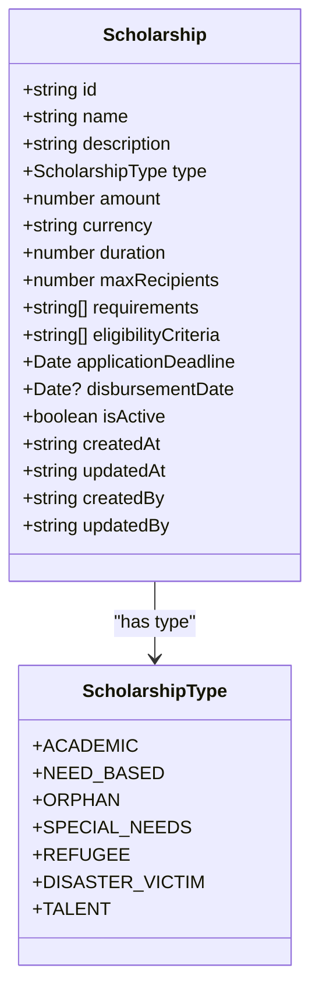
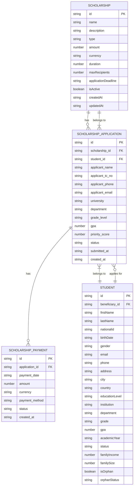
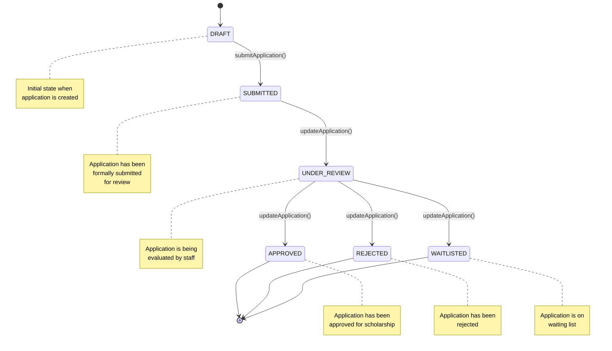
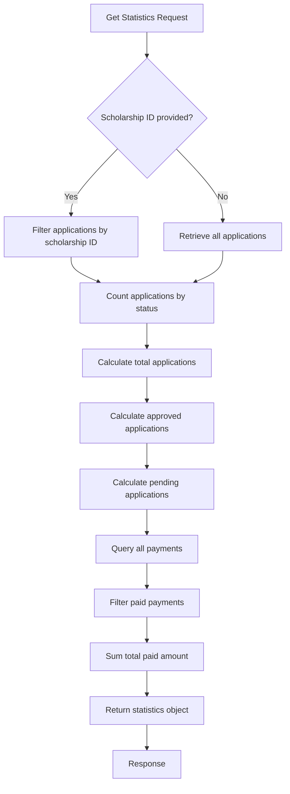

# Scholarships Data Model

<cite>
**Referenced Files in This Document**   
- [scholarships.ts](file://convex/scholarships.ts)
- [schema.ts](file://convex/schema.ts)
- [scholarship.ts](file://src/types/scholarship.ts)
- [scholarships.ts](file://src/lib/api/scholarships.ts)
</cite>

## Table of Contents

1. [Introduction](#introduction)
2. [Scholarship Entity Structure](#scholarship-entity-structure)
3. [Related Collections](#related-collections)
4. [Data Validation Rules](#data-validation-rules)
5. [Business Logic](#business-logic)
6. [Indexing Strategy](#indexing-strategy)
7. [Search Capabilities](#search-capabilities)

## Introduction

The scholarships collection in the Kafkasder-panel application manages scholarship programs, applications, and related financial transactions. This document provides comprehensive documentation of the data model, including entity structure, relationships, validation rules, business logic, and search capabilities. The system is built on Convex, a backend-as-a-service platform that provides a unified API for data access and manipulation.

**Section sources**

- [scholarships.ts](file://convex/scholarships.ts#L1-L51)
- [schema.ts](file://convex/schema.ts#L1007-L1030)

## Scholarship Entity Structure

The scholarship entity represents a scholarship program with various attributes that define its characteristics, eligibility criteria, and operational parameters.



**Diagram sources**

- [scholarship.ts](file://src/types/scholarship.ts#L61-L79)
- [scholarship.ts](file://src/types/scholarship.ts#L5-L13)

### Field Definitions

- **id**: Unique identifier for the scholarship program
- **name**: Title of the scholarship program
- **description**: Detailed description of the scholarship program
- **type**: Category of the scholarship (ACADEMIC, NEED_BASED, ORPHAN, etc.)
- **amount**: Monetary value of the scholarship
- **currency**: Currency of the scholarship amount (TRY, USD, EUR)
- **duration**: Duration of the scholarship in months
- **maxRecipients**: Maximum number of students who can receive this scholarship
- **requirements**: Array of string requirements for the scholarship
- **eligibilityCriteria**: Array of string eligibility criteria for the scholarship
- **applicationDeadline**: Date by which applications must be submitted
- **disbursementDate**: Optional date when funds will be disbursed
- **isActive**: Boolean flag indicating if the scholarship program is currently active
- **createdAt**: Timestamp of when the scholarship was created
- **updatedAt**: Timestamp of the last update to the scholarship
- **createdBy**: ID of the user who created the scholarship
- **updatedBy**: ID of the user who last updated the scholarship

**Section sources**

- [scholarship.ts](file://src/types/scholarship.ts#L61-L79)
- [scholarships.ts](file://convex/scholarships.ts#L53-L77)

## Related Collections

The scholarships collection has relationships with several other collections in the system, forming a comprehensive scholarship management ecosystem.



**Diagram sources**

- [scholarships.ts](file://convex/scholarships.ts#L201-L240)
- [scholarships.ts](file://convex/scholarships.ts#L382-L400)
- [schema.ts](file://convex/schema.ts#L1070-L1096)
- [schema.ts](file://convex/schema.ts#L1094-L1119)

### Scholarship Applications

The scholarship_applications collection stores applications submitted by students for scholarships. Each application contains detailed information about the applicant, their academic and financial situation, and their application status.

Key fields in the scholarship_applications collection:

- **scholarship_id**: Reference to the scholarship program being applied for
- **student_id**: Reference to the student beneficiary (if already registered)
- **applicant_name**: Full name of the applicant
- **applicant_tc_no**: Turkish National Identity Number of the applicant
- **applicant_phone**: Contact phone number of the applicant
- **applicant_email**: Email address of the applicant
- **university**: University the applicant is attending or plans to attend
- **department**: Department or major of study
- **grade_level**: Current grade or year of study
- **gpa**: Grade Point Average of the applicant
- **academic_year**: Academic year for which the scholarship is requested
- **monthly_income**: Monthly income of the applicant
- **family_income**: Total family income
- **father_occupation**: Occupation of the applicant's father
- **mother_occupation**: Occupation of the applicant's mother
- **sibling_count**: Number of siblings in the family
- **is_orphan**: Boolean indicating if the applicant is an orphan
- **has_disability**: Boolean indicating if the applicant has a disability
- **essay**: Personal statement or motivation letter
- **documents**: Array of document names uploaded with the application
- **priority_score**: Calculated score to determine the priority of the application
- **status**: Current status of the application (draft, submitted, under_review, approved, rejected, waitlisted)
- **reviewer_notes**: Notes from the reviewer of the application
- **submitted_at**: Timestamp when the application was submitted
- **reviewed_by**: ID of the user who reviewed the application
- **reviewed_at**: Timestamp when the application was reviewed
- **created_at**: Timestamp when the application record was created

**Section sources**

- [scholarships.ts](file://convex/scholarships.ts#L201-L240)
- [scholarship.ts](file://src/types/scholarship.ts#L127-L154)

### Scholarship Payments

The scholarship_payments collection logs payment transactions for approved scholarships. Each payment record is linked to an approved scholarship application and contains details about the payment transaction.

Key fields in the scholarship_payments collection:

- **application_id**: Reference to the approved scholarship application
- **payment_date**: Date the payment was made
- **amount**: Amount of the payment
- **currency**: Currency of the payment (TRY, USD, EUR)
- **payment_method**: Method used for the payment (e.g., bank_transfer)
- **payment_reference**: Reference number for the payment transaction
- **bank_account**: Bank account the payment was sent to
- **notes**: Additional notes about the payment
- **status**: Status of the payment (pending, paid, failed, cancelled)
- **processed_by**: ID of the user who processed the payment
- **receipt_file_id**: ID of the stored receipt file
- **created_at**: Timestamp when the payment record was created

**Section sources**

- [scholarships.ts](file://convex/scholarships.ts#L382-L400)
- [scholarship.ts](file://src/types/scholarship.ts#L181-L198)

### Students

The students collection (linked through beneficiaries) contains detailed information about students who may apply for scholarships. This collection is connected to the main beneficiaries collection and includes academic and personal information relevant to scholarship applications.

Key fields in the student data model:

- **id**: Unique identifier for the student
- **beneficiaryId**: Link to the main beneficiary record
- **firstName**: First name of the student
- **lastName**: Last name of the student
- **nationalId**: National identity number
- **birthDate**: Date of birth
- **gender**: Gender of the student
- **email**: Email address
- **phone**: Phone number
- **address**: Residential address
- **city**: City of residence
- **country**: Country of residence
- **educationLevel**: Current level of education
- **institution**: Educational institution
- **department**: Department or major
- **grade**: Current grade level
- **gpa**: Grade Point Average
- **academicYear**: Current academic year
- **status**: Student status (ACTIVE, GRADUATED, SUSPENDED, etc.)
- **familyIncome**: Family's total income
- **familySize**: Size of the family
- **isOrphan**: Boolean indicating if the student is an orphan
- **orphanStatus**: Detailed orphan status (FULL_ORPHAN, PARTIAL_ORPHAN, etc.)
- **guardianName**: Name of the guardian
- **guardianPhone**: Phone number of the guardian
- **guardianRelation**: Relationship of the guardian to the student
- **documents**: Array of student documents
- **notes**: Additional notes
- **createdAt**: Timestamp of record creation
- **updatedAt**: Timestamp of last update
- **createdBy**: ID of the creating user
- **updatedBy**: ID of the user who last updated the record

**Section sources**

- [scholarship.ts](file://src/types/scholarship.ts#L82-L115)

## Data Validation Rules

The system implements several data validation rules to ensure data integrity and consistency across the scholarship management system.

### Scholarship Validation

- **TC Number Format**: Turkish National Identity Numbers must be exactly 11 digits
- **Amount**: Scholarship amount must be a positive number
- **Currency**: Currency must be one of TRY, USD, or EUR
- **Application Dates**: Application start date must be before application end date
- **Status**: Scholarship status must be one of the defined values (active, inactive)
- **Required Fields**: Title, amount, currency, category, application start date, application end date, and is_active are required fields

### Application Validation

- **TC Number Format**: Applicant TC numbers must be validated to ensure they are 11 digits
- **GPA**: Grade Point Average must be between 0 and 4.0
- **Income Values**: Monthly and family income values must be non-negative
- **Status Transitions**: Applications can only be submitted if they are in 'draft' status
- **Required Fields**: Scholarship ID, applicant name, applicant TC number, and applicant phone are required fields

### Payment Validation

- **Amount**: Payment amount must be positive
- **Currency**: Payment currency must match the scholarship currency
- **Status**: Payment status must be one of pending, paid, failed, or cancelled
- **Required Fields**: Application ID, payment date, amount, and currency are required fields

**Section sources**

- [scholarships.ts](file://convex/scholarships.ts#L5-L6)
- [scholarships.ts](file://convex/scholarships.ts#L226-L228)
- [scholarships.ts](file://convex/scholarships.ts#L288-L290)

## Business Logic

The scholarship management system implements several business rules and logic to automate processes and ensure consistent behavior.

### Priority Score Calculation

The system automatically calculates a priority score for each scholarship application based on multiple factors:

```mermaid
flowchart TD
Start([Application Received]) --> GPA["GPA Factor (30% weight)"]
GPA --> Income["Income Factors (40% weight)"]
Income --> Circumstances["Special Circumstances (30% weight)"]
Circumstances --> Calculate["Calculate Total Score"]
Calculate --> Round["Round to Nearest Integer"]
Round --> Store["Store Priority Score"]
Store --> End([Application Processed])
subgraph GPA
A[Check GPA value] --> B{GPA > 0?}
B --> |Yes| C[Score = (GPA / 4.0) * 30]
B --> |No| D[Score = 0]
end
subgraph Income
E[Check family income] --> F{Family income < 2000?}
F --> |Yes| G[Add 20 points]
F --> |No| H{Family income < 4000?}
H --> |Yes| I[Add 15 points]
H --> |No| J{Family income < 6000?}
J --> |Yes| K[Add 10 points]
J --> |No| L[Add 5 points]
M[Check monthly income] --> N{Monthly income < 1000?}
N --> |Yes| O[Add 20 points]
N --> |No| P{Monthly income < 2000?}
P --> |Yes| Q[Add 15 points]
P --> |No| R{Monthly income < 3000?}
R --> |Yes| S[Add 10 points]
R --> |No| T[Add 5 points]
end
subgraph Circumstances
U[Check if applicant is orphan] --> V{Is orphan?}
V --> |Yes| W[Add 15 points]
V --> |No| X[Add 0 points]
Y[Check if applicant has disability] --> Z{Has disability?}
Z --> |Yes| AA[Add 10 points]
Z --> |No| AB[Add 0 points]
AC[Check sibling count] --> AD{Sibling count > 3?}
AD --> |Yes| AE[Add 5 points]
AD --> |No| AF[Add 0 points]
end
```

**Diagram sources**

- [scholarships.ts](file://convex/scholarships.ts#L302-L339)

The priority score calculation algorithm assigns weights to different factors:

- GPA contributes 30% to the total score
- Income factors (family and monthly income) contribute 40% to the total score
- Special circumstances (orphan status, disability, large family) contribute 30% to the total score

The final score is rounded to the nearest integer and stored in the application record to assist in the review and selection process.

### Application Status Workflow

The system enforces a specific workflow for application status transitions:



**Diagram sources**

- [scholarships.ts](file://convex/scholarships.ts#L279-L298)
- [scholarship.ts](file://src/types/scholarship.ts#L16-L25)

Key business rules for the application workflow:

- Only applications in 'draft' status can be submitted
- Once submitted, an application cannot be reverted to 'draft' status
- The system automatically records the submission timestamp when an application is submitted
- Reviewers can update the application status to 'under_review', 'approved', 'rejected', or 'waitlisted'
- The system tracks which user reviewed the application and when

**Section sources**

- [scholarships.ts](file://convex/scholarships.ts#L279-L298)

## Indexing Strategy

The system implements a comprehensive indexing strategy to optimize query performance for common operations.

### Scholarships Collection Indexes

- **by_category**: Index on the 'category' field to enable fast filtering by scholarship type
- **by_is_active**: Index on the 'is_active' field to quickly retrieve active or inactive scholarships
- **by_application_dates**: Composite index on 'application_start_date' and 'application_end_date' fields to optimize date range queries

### Scholarship Applications Collection Indexes

- **by_scholarship**: Index on the 'scholarship_id' field to efficiently retrieve all applications for a specific scholarship
- **by_status**: Index on the 'status' field to quickly filter applications by their current status
- **by_tc_no**: Index on the 'applicant_tc_no' field to enable fast lookups by Turkish National Identity Number
- **by_submitted_at**: Index on the 'submitted_at' field to optimize date-based queries and sorting

### Scholarship Payments Collection Indexes

- **by_application**: Index on the 'application_id' field to quickly retrieve all payments for a specific application
- **by_status**: Index on the 'status' field to efficiently filter payments by their current status

These indexes ensure that common queries, such as listing all active scholarships, retrieving applications for a specific scholarship program, or finding all pending payments, can be executed efficiently even as the dataset grows.

**Section sources**

- [schema.ts](file://convex/schema.ts#L1007-L1030)
- [schema.ts](file://convex/schema.ts#L1070-L1096)
- [schema.ts](file://convex/schema.ts#L1094-L1119)

## Search Capabilities

The scholarship management system provides robust search capabilities through both direct field filtering and API endpoints.

### Query Parameters

The system supports several query parameters for filtering and pagination:

**Scholarships API:**

- **limit**: Number of records to return (default: 50)
- **skip**: Number of records to skip (for pagination)
- **category**: Filter by scholarship category
- **isActive**: Filter by active/inactive status

**Scholarship Applications API:**

- **limit**: Number of records to return (default: 50)
- **skip**: Number of records to skip (for pagination)
- **scholarship_id**: Filter by specific scholarship program
- **status**: Filter by application status
- **tc_no**: Search by applicant's Turkish National Identity Number (requires authentication and ADMIN/MANAGER role)

**Scholarship Payments API:**

- **limit**: Number of records to return (default: 50)
- **skip**: Number of records to skip (for pagination)
- **application_id**: Filter by specific application
- **status**: Filter by payment status

### Statistics and Reporting

The system provides a statistics endpoint that aggregates key metrics for scholarship programs:



**Diagram sources**

- [scholarships.ts](file://convex/scholarships.ts#L429-L467)

The statistics endpoint returns:

- **totalApplications**: Total number of applications
- **statusCounts**: Count of applications by status
- **totalPaid**: Total amount paid across all scholarships
- **approvedApplications**: Number of approved applications
- **pendingApplications**: Number of applications under review

These search and reporting capabilities enable administrators to monitor scholarship program performance, track application volumes, and analyze payment trends.

**Section sources**

- [scholarships.ts](file://convex/scholarships.ts#L429-L467)
- [scholarships.ts](file://src/lib/api/scholarships.ts#L145-L165)
