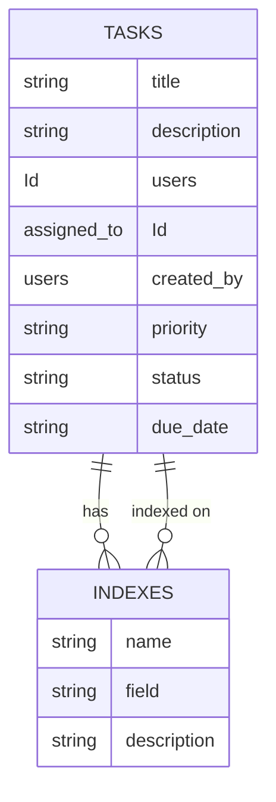
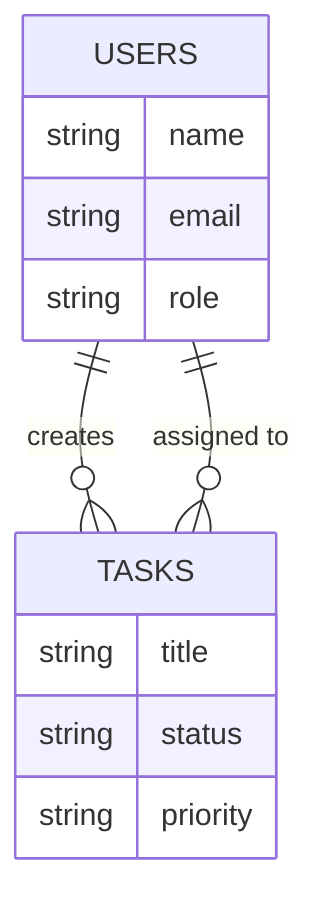
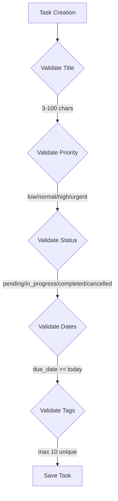
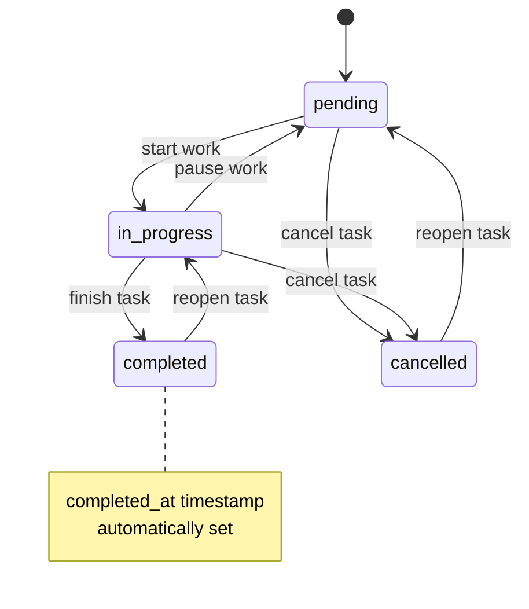
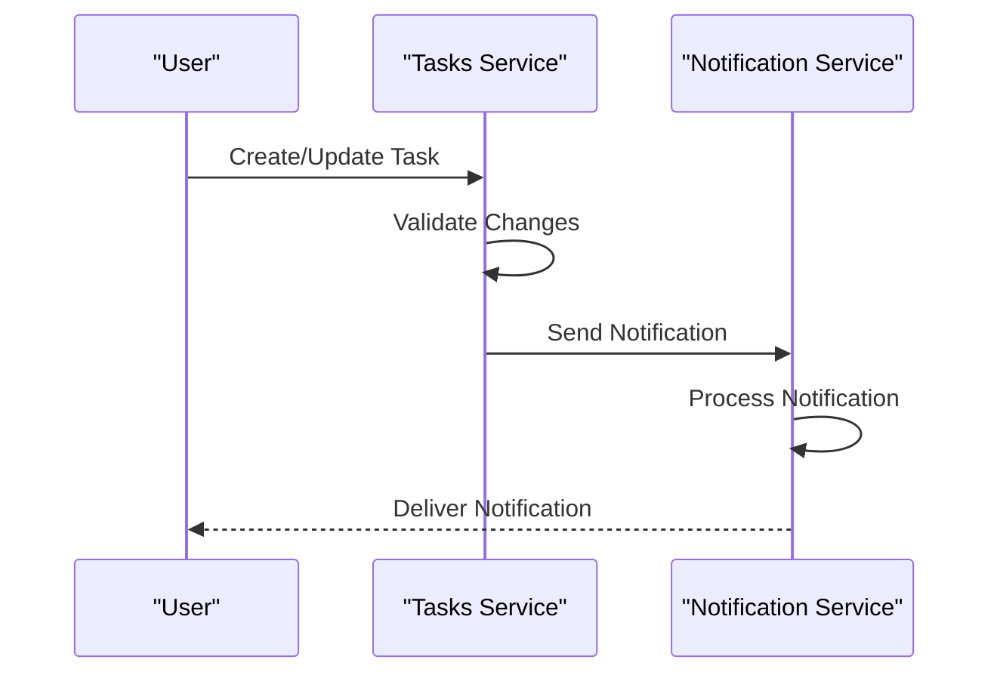

# Tasks Data Model

<cite>
**Referenced Files in This Document**   
- [tasks.ts](file://convex/tasks.ts)
- [schema.ts](file://convex/schema.ts)
- [task.ts](file://src/lib/validations/task.ts)
- [TaskForm.tsx](file://src/components/forms/TaskForm.tsx)
- [workflow_notifications.ts](file://convex/workflow_notifications.ts)
- [database.ts](file://src/types/database.ts)
</cite>

## Table of Contents

1. [Introduction](#introduction)
2. [Entity Structure](#entity-structure)
3. [Indexing Strategy](#indexing-strategy)
4. [Relationships](#relationships)
5. [Data Validation Rules](#data-validation-rules)
6. [Business Logic](#business-logic)
7. [Integration with Notification System](#integration-with-notification-system)
8. [Conclusion](#conclusion)

## Introduction

The Tasks collection in the Kafkasder-panel application serves as the central system for managing work assignments, tracking progress, and coordinating team activities. This data model documentation provides a comprehensive overview of the task entity structure, indexing strategy, relationships, validation rules, and business logic that govern task management within the application. The model supports key workflow features including assignment tracking, priority management, status transitions, and integration with the notification system to ensure timely task completion.

**Section sources**

- [schema.ts](file://convex/schema.ts#L218-L258)

## Entity Structure

The tasks collection represents individual work items that can be assigned to users within the system. Each task document contains comprehensive metadata to support workflow management and reporting.

### Core Fields

The task entity includes the following fields:

| Field        | Type              | Required | Description                                               |
| ------------ | ----------------- | -------- | --------------------------------------------------------- |
| title        | string            | Yes      | The title or subject of the task                          |
| description  | string            | No       | Detailed description of the task requirements             |
| assigned_to  | Id<'users'>       | No       | Reference to the user assigned to complete the task       |
| created_by   | Id<'users'>       | Yes      | Reference to the user who created the task                |
| priority     | enum              | Yes      | Priority level: low, normal, high, urgent                 |
| status       | enum              | Yes      | Current state: pending, in_progress, completed, cancelled |
| due_date     | string (ISO date) | No       | Deadline for task completion                              |
| completed_at | string (ISO date) | No       | Timestamp when task was marked as completed               |
| category     | string            | No       | Organizational category for the task                      |
| tags         | string[]          | No       | Array of tags for filtering and organization              |
| is_read      | boolean           | Yes      | Flag indicating if the assigned user has viewed the task  |

**Section sources**

- [schema.ts](file://convex/schema.ts#L222-L255)
- [database.ts](file://src/types/database.ts#L231-L243)

## Indexing Strategy

The tasks collection implements a strategic indexing approach to optimize query performance for common access patterns in the application.

### Primary Indexes

Three main indexes support the most frequent query operations:

**Diagram sources**

- [schema.ts](file://convex/schema.ts#L256-L258)

#### by_assigned_to Index

This index enables efficient retrieval of tasks assigned to a specific user, which is critical for personalized task dashboards and workload management. The index is created on the `assigned_to` field and supports queries that filter tasks by assignee.

#### by_status Index

The status index optimizes queries that filter tasks by their current state (pending, in_progress, completed, cancelled). This supports workflow views that organize tasks by stage and enables quick access to tasks in specific states for reporting and analytics.

#### by_created_by Index

This index facilitates queries for tasks created by a specific user, supporting audit trails, creator-based reporting, and delegation tracking. It is particularly useful for managers who need to monitor tasks they have assigned to team members.

The indexing strategy ensures that list operations with common filter combinations (status, assigned_to, created_by) perform efficiently even as the task collection grows.

**Section sources**

- [schema.ts](file://convex/schema.ts#L256-L258)
- [tasks.ts](file://convex/tasks.ts#L16-L33)

## Relationships

The tasks collection maintains relationships with other entities in the system through foreign key references, enabling integrated workflow management.

### User Relationships

Tasks are connected to users through two distinct relationships:

**Diagram sources**

- [schema.ts](file://convex/schema.ts#L228-L230)
- [database.ts](file://src/types/database.ts#L234-L235)

#### created_by Relationship

Every task must have a `created_by` field that references a user in the users collection. This establishes ownership and accountability for task creation, enabling audit trails and creator-based filtering. The relationship is mandatory, ensuring every task has a clear origin.

#### assigned_to Relationship

The optional `assigned_to` field creates a reference to the user responsible for completing the task. This supports workload distribution, team coordination, and performance tracking. When a task is assigned, the system can notify the user and track their task completion rate.

These relationships enable comprehensive reporting on user activity, including tasks created, tasks completed, and average completion time.

**Section sources**

- [schema.ts](file://convex/schema.ts#L228-L230)
- [database.ts](file://src/types/database.ts#L234-L235)

## Data Validation Rules

The application implements comprehensive validation rules to ensure data integrity and consistency across task records.

### Field-Level Validation

Each field in the task model has specific validation constraints:

**Diagram sources**

- [task.ts](file://src/lib/validations/task.ts#L40-L124)

#### Title Validation

The title field requires a minimum of 3 characters and a maximum of 100 characters, ensuring descriptive yet concise task titles. The field is trimmed to remove extraneous whitespace.

#### Priority and Status Validation

Priority is restricted to one of four values: low, normal, high, or urgent. Status is limited to: pending, in_progress, completed, or cancelled. These enumerated values ensure consistency in workflow states.

#### Date Validation

The due_date must be today or a future date, preventing tasks from being created with past deadlines. This validation helps maintain realistic scheduling and prevents confusion in task management.

#### Tags Validation

Tags are validated to ensure they are unique (case-insensitive), non-empty, and do not exceed 30 characters. A maximum of 10 tags can be assigned to a single task, preventing over-tagging while allowing sufficient categorization.

**Section sources**

- [task.ts](file://src/lib/validations/task.ts#L40-L124)

## Business Logic

The task model incorporates several business rules that govern state transitions and workflow behavior.

### Status Transition Logic

The system implements specific business rules for task state management:

**Diagram sources**

- [tasks.ts](file://convex/tasks.ts#L117-L120)
- [TaskForm.tsx](file://src/components/forms/TaskForm.tsx#L177-L180)

#### Automatic completed_at Timestamp

When a task's status is updated to "completed", the system automatically sets the `completed_at` field to the current timestamp if it is not already provided. This ensures accurate tracking of completion times without requiring manual entry.

#### Priority-Deadline Alignment

The system includes a validation rule that warns when a task with a "pending" status has a due date within 24 hours but does not have "urgent" priority. This encourages appropriate prioritization of time-sensitive tasks.

#### State Transition Validation

The update operation validates that tasks can only transition between appropriate states, preventing invalid workflow progressions. For example, a completed task cannot be directly moved to "cancelled" without first being reopened.

**Section sources**

- [tasks.ts](file://convex/tasks.ts#L117-L120)
- [TaskForm.tsx](file://src/components/forms/TaskForm.tsx#L177-L180)

## Integration with Notification System

The tasks collection is integrated with the workflow notification system to provide real-time updates and reminders.

### Notification Triggers

Task operations trigger notifications to keep users informed of important changes:

**Diagram sources**

- [workflow_notifications.ts](file://convex/workflow_notifications.ts#L76-L103)
- [tasks.ts](file://convex/tasks.ts#L78-L80)

#### Task Assignment Notifications

When a task is created or reassigned, the system generates a notification to the assigned user with category "gorev" (task). This ensures users are aware of new responsibilities.

#### Status Change Notifications

Changes to task status trigger notifications to both the assignee and creator, facilitating collaboration and progress tracking. Completed tasks generate notifications to inform stakeholders of completion.

#### Notification Reference System

Notifications include a reference object that links back to the relevant task, enabling users to navigate directly from the notification to the task details. The reference includes the task ID and type for proper routing.

This integration ensures that task management is not siloed but is part of a broader communication workflow that keeps all stakeholders informed.

**Section sources**

- [workflow_notifications.ts](file://convex/workflow_notifications.ts#L76-L103)
- [tasks.ts](file://convex/tasks.ts#L78-L80)

## Conclusion

The tasks data model in the Kafkasder-panel application provides a robust foundation for workflow management and team coordination. With its comprehensive field structure, strategic indexing, clear relationships to users, and integrated business logic, the model supports efficient task tracking and reporting. The validation rules ensure data quality, while the notification integration creates a responsive workflow system. This well-designed data model enables the application to effectively manage organizational tasks and support productivity across teams.
