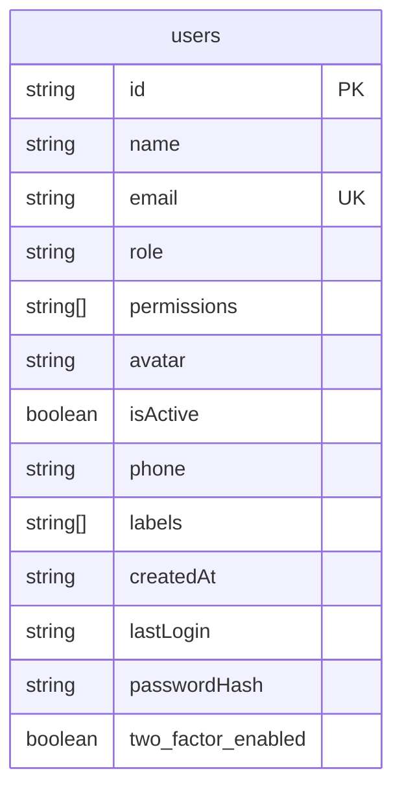
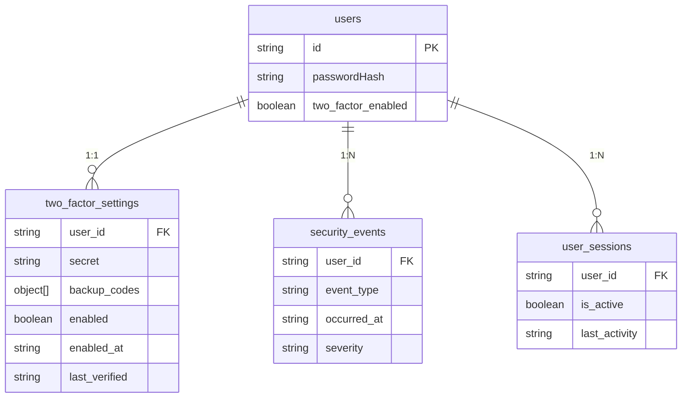
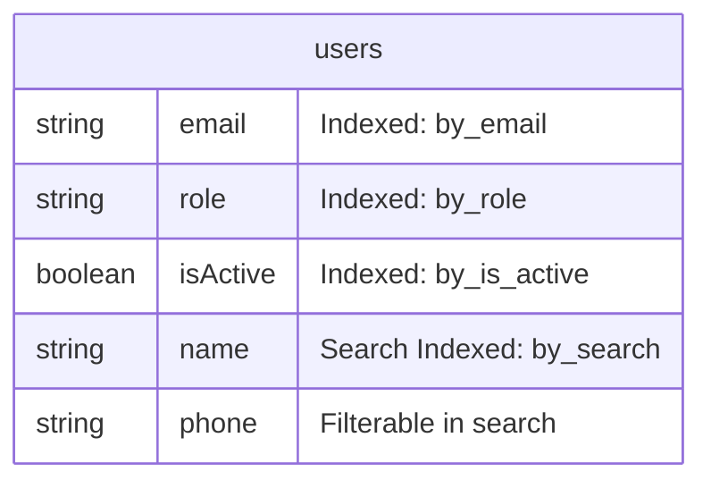
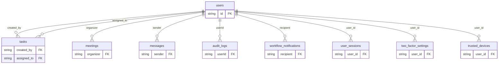

# Users Data Model

<cite>
**Referenced Files in This Document**   
- [schema.ts](file://convex/schema.ts)
- [users.ts](file://convex/users.ts)
- [auth.ts](file://src/types/auth.ts)
- [user-form.tsx](file://src/components/forms/user-form.tsx)
- [two_factor_auth.ts](file://convex/two_factor_auth.ts)
- [shared-validators.ts](file://src/lib/validations/shared-validators.ts)
- [security.ts](file://src/lib/security.ts)
- [api/users/route.ts](file://src/app/api/users/route.ts)
</cite>

## Table of Contents

1. [Introduction](#introduction)
2. [Entity Structure](#entity-structure)
3. [Security Fields](#security-fields)
4. [Indexing Strategy](#indexing-strategy)
5. [Relationships with Other Collections](#relationships-with-other-collections)
6. [Data Validation Rules](#data-validation-rules)
7. [Security Considerations](#security-considerations)
8. [Performance Implications](#performance-implications)
9. [Conclusion](#conclusion)

## Introduction

The Users collection in the Kafkasder-panel application serves as the central repository for user account information, managing authentication, profile details, and authorization data. This data model supports a role-based access control system where users are assigned specific permissions that determine their access to various application modules. The collection is designed to support secure user management with features including password hashing, two-factor authentication, and comprehensive audit logging. User accounts can be activated or deactivated through the `isActive` field, providing an efficient mechanism for access control without requiring account deletion. The data model is implemented using Convex, a serverless database platform that provides real-time capabilities and seamless integration with the Next.js frontend framework.

**Section sources**

- [schema.ts](file://convex/schema.ts#L6-L41)

## Entity Structure

The Users collection contains comprehensive user information organized into authentication, profile, and authorization categories. The entity structure includes personal identification fields such as name, email, and phone, along with role-based authorization data including role, permissions, and account status. Profile information is enhanced with an avatar field for visual identification and labels for user categorization. Authentication and session management are supported by the lastLogin timestamp and account creation metadata. The isActive boolean field controls account accessibility, allowing administrators to disable accounts without data loss. All string fields are stored in normalized format, with email addresses converted to lowercase to prevent duplication. The data model follows a flat structure for efficient querying, avoiding nested objects for frequently accessed fields. Field validation is enforced at both the application and database levels to ensure data integrity.

**Diagram sources**

- [schema.ts](file://convex/schema.ts#L9-L33)
- [auth.ts](file://src/types/auth.ts#L3-L15)

**Section sources**

- [schema.ts](file://convex/schema.ts#L9-L33)
- [auth.ts](file://src/types/auth.ts#L3-L15)
- [user-form.tsx](file://src/components/forms/user-form.tsx#L28-L38)

## Security Fields

The Users collection incorporates several security-related fields to protect user accounts and maintain system integrity. The passwordHash field stores bcrypt-hashed passwords, ensuring that plaintext passwords are never persisted in the database. Two-factor authentication is supported through the two_factor_enabled boolean flag, which indicates whether 2FA is activated for the account. This field works in conjunction with the separate two_factor_settings collection that stores the encrypted TOTP secret and backup codes. Password strength is enforced through validation rules requiring a minimum of 8 characters with uppercase, lowercase, numeric, and special characters. The system also implements security event logging for all authentication activities, including login attempts, password changes, and 2FA modifications. Sensitive operations require additional verification, such as providing a 2FA code when disabling two-factor authentication.

**Diagram sources**

- [schema.ts](file://convex/schema.ts#L30-L33)
- [two_factor_auth.ts](file://convex/two_factor_auth.ts#L4-L55)
- [schema.ts](file://convex/schema.ts#L676-L704)

**Section sources**

- [schema.ts](file://convex/schema.ts#L30-L33)
- [two_factor_auth.ts](file://convex/two_factor_auth.ts#L4-L55)
- [shared-validators.ts](file://src/lib/validations/shared-validators.ts#L301-L312)
- [security.ts](file://src/lib/security.ts#L436-L476)

## Indexing Strategy

The Users collection implements a comprehensive indexing strategy to optimize query performance for common access patterns. Three dedicated indexes support efficient filtering by email, role, and account status: the by_email index enables rapid user lookups during authentication, the by_role index facilitates role-based user management, and the by_is_active index allows quick identification of active or deactivated accounts. Additionally, a search index named by_search is configured on the name field, enabling full-text search capabilities while supporting filtering by email and phone through the filterFields configuration. This search index enhances the user experience in administrative interfaces where staff need to locate users by name. The indexing strategy balances query performance with storage efficiency, avoiding over-indexing while ensuring critical operations execute with minimal latency. All indexes are automatically maintained by Convex, ensuring data consistency without requiring manual index management.

**Diagram sources**

- [schema.ts](file://convex/schema.ts#L35-L41)

**Section sources**

- [schema.ts](file://convex/schema.ts#L35-L41)
- [users.ts](file://convex/users.ts#L18-L37)

## Relationships with Other Collections

The Users collection serves as a central hub in the application's data model, establishing relationships with multiple other collections through foreign key references. The userId field creates parent-child relationships with collections such as tasks, meetings, messages, and audit_logs, enabling ownership tracking and access control. For example, the tasks collection references users through the assigned_to and created_by fields, while the meetings collection uses the organizer field to establish ownership. The audit_logs collection maintains a userId reference to track which user performed specific actions, creating a comprehensive audit trail. The two_factor_settings collection has a direct 1:1 relationship with users through the user_id field, storing 2FA configuration securely. Additionally, the trusted_devices collection references users to manage trusted devices for 2FA bypass. These relationships enable rich querying capabilities, such as retrieving all tasks assigned to a user or all security events associated with an account.

**Diagram sources**

- [schema.ts](file://convex/schema.ts#L222-L258)
- [schema.ts](file://convex/schema.ts#L264-L298)
- [schema.ts](file://convex/schema.ts#L433-L458)
- [schema.ts](file://convex/schema.ts#L1179-L1220)
- [schema.ts](file://convex/schema.ts#L387-L427)
- [schema.ts](file://convex/schema.ts#L710-L731)
- [schema.ts](file://convex/schema.ts#L747-L771)
- [schema.ts](file://convex/schema.ts#L774-L794)

**Section sources**

- [schema.ts](file://convex/schema.ts#L222-L258)
- [schema.ts](file://convex/schema.ts#L264-L298)
- [schema.ts](file://convex/schema.ts#L433-L458)
- [schema.ts](file://convex/schema.ts#L1179-L1220)

## Data Validation Rules

The Users collection enforces strict data validation rules at both the application and database levels to ensure data integrity and security. Name fields require a minimum of 2 characters and must contain only alphabetic characters and spaces, supporting Turkish characters. Email addresses are validated for proper format and automatically normalized to lowercase to prevent duplication. Phone numbers must conform to Turkish mobile number patterns, starting with '5' and containing 10 digits. Role fields require a minimum of 2 characters to prevent ambiguous or incomplete role assignments. The permissions array must contain at least one valid permission value from the predefined set of module access rights. Passwords must meet stringent strength requirements, including a minimum of 8 characters with uppercase, lowercase, numeric, and special characters. All string inputs are trimmed of whitespace, and duplicate permissions are automatically removed through set operations. These validation rules are implemented consistently across the frontend form components, API routes, and database mutation handlers.

**Section sources**

- [user-form.tsx](file://src/components/forms/user-form.tsx#L28-L38)
- [shared-validators.ts](file://src/lib/validations/shared-validators.ts#L15-L38)
- [api/users/route.ts](file://src/app/api/users/route.ts#L34-L87)
- [users.ts](file://convex/users.ts#L158-L178)

## Security Considerations

The Users data model incorporates multiple security layers to protect sensitive user information and prevent unauthorized access. Passwords are never stored in plaintext; instead, they are hashed using bcrypt before persistence in the passwordHash field. The application enforces strong password policies through validation rules that require complexity and minimum length. Two-factor authentication provides an additional security layer, with TOTP codes and backup codes securely stored in a separate collection. Security events are logged for all authentication-related activities, including login attempts, password changes, and 2FA modifications, enabling comprehensive audit trails. The system implements rate limiting to prevent brute force attacks on authentication endpoints. Sensitive operations such as disabling 2FA or changing passwords require additional verification steps. Email addresses are validated to prevent injection attacks, and all user inputs are sanitized to mitigate XSS and SQL injection risks. The separation of authentication data (passwordHash, two_factor_enabled) from profile information enhances security by minimizing the exposure of sensitive fields.

**Section sources**

- [security.ts](file://src/lib/security.ts#L436-L476)
- [two_factor_auth.ts](file://convex/two_factor_auth.ts#L4-L55)
- [schema.ts](file://convex/schema.ts#L676-L704)
- [users.ts](file://convex/users.ts#L97-L106)

## Performance Implications

The Users collection's indexing strategy and query patterns have significant performance implications for user lookups and administrative operations. The by_email index ensures O(log n) lookup time for authentication processes, enabling rapid user identification during login. Role-based queries leverage the by_role index for efficient filtering of users by their assigned roles, which is critical for permission checks and team management. The search index on the name field supports fast text search operations while allowing additional filtering by email and phone, optimizing the user experience in search-heavy administrative interfaces. Pagination is implemented for list operations to prevent performance degradation with large user bases, limiting results to 50-100 items per page by default. The normalized data structure avoids expensive join operations, as all essential user information is stored in a single document. However, queries that combine multiple filter criteria (e.g., role and status) may require in-memory filtering after index lookup, potentially impacting performance with very large datasets. The system balances performance and functionality by prioritizing indexes on the most frequently queried fields.

**Section sources**

- [users.ts](file://convex/users.ts#L18-L49)
- [schema.ts](file://convex/schema.ts#L35-L41)
- [api/users/route.ts](file://src/app/api/users/route.ts#L127-L132)

## Conclusion

The Users data model in the Kafkasder-panel application provides a robust foundation for user management, authentication, and authorization. By combining comprehensive user information with strong security features and efficient indexing, the model supports both functional requirements and performance needs. The integration of two-factor authentication, password security, and audit logging demonstrates a commitment to data protection and compliance. The relationships with other collections create a cohesive data ecosystem that enables rich functionality across the application. The validation rules and security considerations ensure data integrity and protect against common vulnerabilities. This well-structured data model serves as a critical component of the application's architecture, supporting the organization's mission through secure and efficient user management capabilities.
