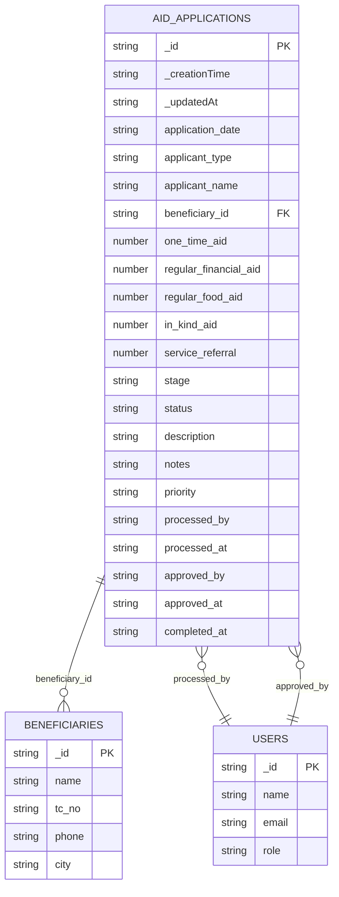
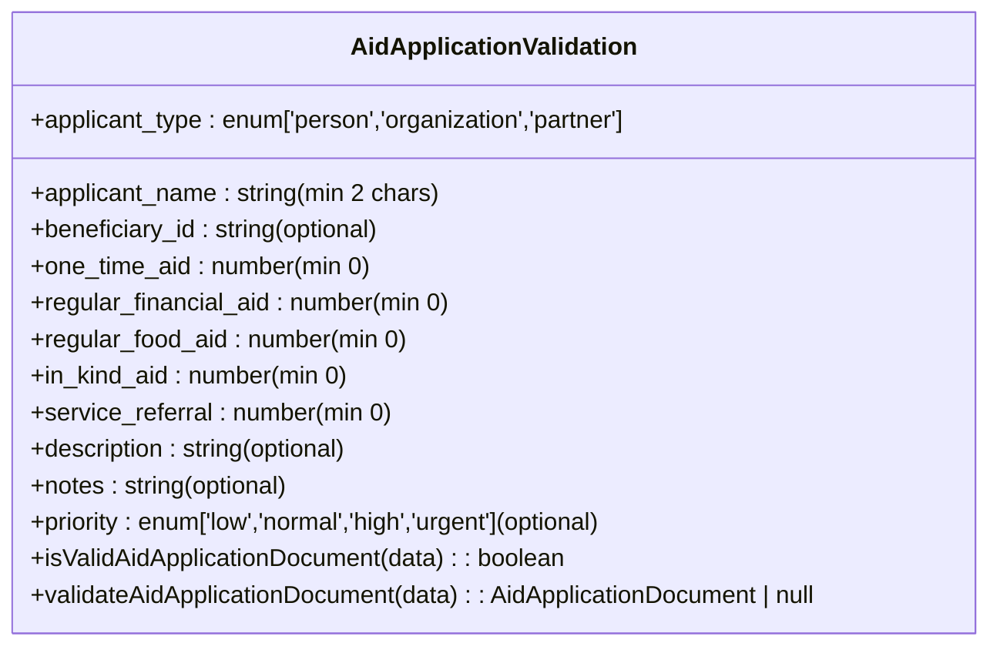
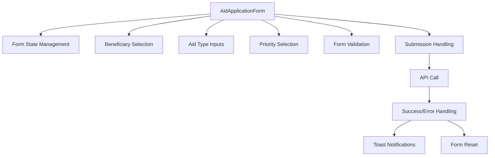
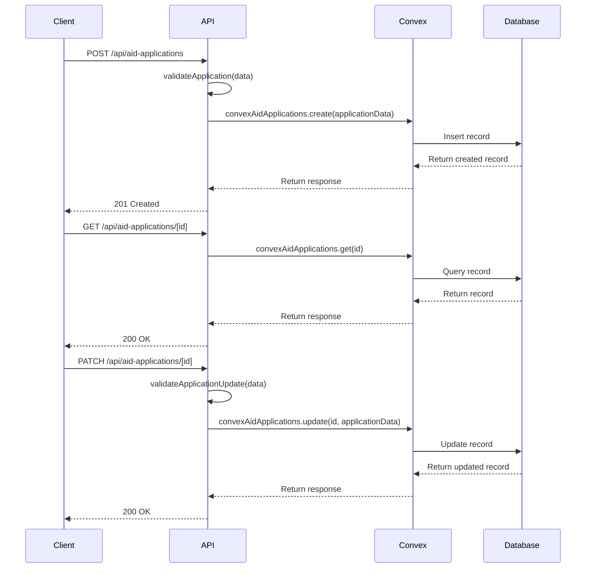
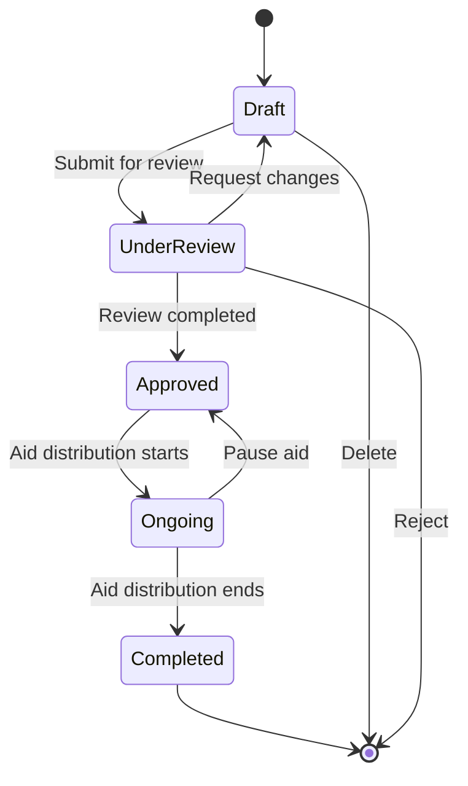
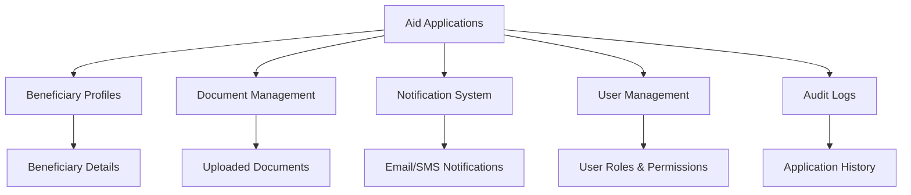

# Beneficiary Applications

<cite>
**Referenced Files in This Document**   
- [aid_applications.ts](file://convex/aid_applications.ts)
- [aid-application.ts](file://src/lib/validations/aid-application.ts)
- [AidApplicationForm.tsx](file://src/components/forms/AidApplicationForm.tsx)
- [route.ts](file://src/app/api/aid-applications/route.ts)
- [route.ts](file://src/app/api/aid-applications/[id]/route.ts)
- [database.ts](file://src/types/database.ts)
- [api.ts](file://src/lib/convex/api.ts)
- [convex-api-client.ts](file://src/lib/api/convex-api-client.ts)
</cite>

## Table of Contents

1. [Introduction](#introduction)
2. [Data Model](#data-model)
3. [Form Validation](#form-validation)
4. [UI Components](#ui-components)
5. [API Routes](#api-routes)
6. [Workflows](#workflows)
7. [Integration Points](#integration-points)
8. [Common Issues](#common-issues)

## Introduction

The Beneficiary Applications module enables the submission, review, and tracking of aid applications for beneficiaries. This system supports various application types including individuals, organizations, and partners. The module provides comprehensive functionality for managing application lifecycles from initial submission through approval and completion. Applications can request multiple types of aid including one-time financial assistance, regular financial support, food aid, in-kind donations, and service referrals. The system integrates with beneficiary profiles, document management, and notification systems to provide a complete solution for aid distribution management.

## Data Model

The aid application data model is defined in the `AidApplicationDocument` interface and implemented in the Convex database. The data structure includes application metadata, aid types, status tracking, and workflow information.

**Diagram sources**

- [database.ts](file://src/types/database.ts#L186-L215)
- [aid_applications.ts](file://convex/aid_applications.ts#L55-L92)

**Section sources**

- [database.ts](file://src/types/database.ts#L186-L215)
- [aid_applications.ts](file://convex/aid_applications.ts#L55-L92)

## Form Validation

Form validation is implemented using Zod schemas to ensure data integrity at both the client and server levels. The validation schema defines required fields, data types, and constraints for aid applications.

**Diagram sources**

- [aid-application.ts](file://src/lib/validations/aid-application.ts#L8-L44)

**Section sources**

- [aid-application.ts](file://src/lib/validations/aid-application.ts#L8-L67)

## UI Components

The UI components provide a user-friendly interface for creating and managing aid applications. The main component is the AidApplicationForm which handles form rendering, validation, and submission.

**Diagram sources**

- [AidApplicationForm.tsx](file://src/components/forms/AidApplicationForm.tsx#L51-L349)

**Section sources**

- [AidApplicationForm.tsx](file://src/components/forms/AidApplicationForm.tsx#L26-L41)

## API Routes

The API routes handle CRUD operations for aid applications, providing endpoints for creating, reading, updating, and deleting application records. These routes serve as the interface between the frontend and the Convex database.

**Diagram sources**

- [route.ts](file://src/app/api/aid-applications/route.ts#L61-L114)
- [route.ts](file://src/app/api/aid-applications/[id]/route.ts#L53-L120)

**Section sources**

- [route.ts](file://src/app/api/aid-applications/route.ts#L61-L114)
- [route.ts](file://src/app/api/aid-applications/[id]/route.ts#L53-L120)

## Workflows

The application workflows cover the complete lifecycle of aid applications from submission to completion. These workflows include application creation, status updates, and history tracking.

**Diagram sources**

- [aid_applications.ts](file://convex/aid_applications.ts#L95-L147)
- [AidApplicationForm.tsx](file://src/components/forms/AidApplicationForm.tsx#L82-L88)

**Section sources**

- [aid_applications.ts](file://convex/aid_applications.ts#L95-L147)

## Integration Points

The Beneficiary Applications module integrates with several other system components including beneficiary profiles, document uploads, and notification systems. These integrations provide a comprehensive solution for aid management.

**Diagram sources**

- [aid_applications.ts](file://convex/aid_applications.ts#L55-L92)
- [convex-api-client.ts](file://src/lib/api/convex-api-client.ts#L654-L714)

**Section sources**

- [convex-api-client.ts](file://src/lib/api/convex-api-client.ts#L654-L714)

## Common Issues

This section addresses common issues encountered when working with the Beneficiary Applications module, including validation errors, status transitions, and expired applications.

### Application Validation

Validation issues typically occur when required fields are missing or contain invalid data. The system validates applications at both the client and server levels to ensure data integrity.

**Section sources**

- [aid-application.ts](file://src/lib/validations/aid-application.ts#L8-L44)
- [route.ts](file://src/app/api/aid-applications/route.ts#L6-L27)

### Status Transitions

Status transitions follow a specific workflow to maintain application integrity. Invalid transitions are prevented by server-side validation.

**Section sources**

- [aid_applications.ts](file://convex/aid_applications.ts#L136-L142)
- [route.ts](file://src/app/api/aid-applications/[id]/route.ts#L7-L21)

### Expired Applications

Applications may expire if not processed within a specified timeframe. The system does not automatically handle expiration but provides the necessary fields to track application timelines.

**Section sources**

- [database.ts](file://src/types/database.ts#L201-L202)
- [aid_applications.ts](file://convex/aid_applications.ts#L70-L75)
