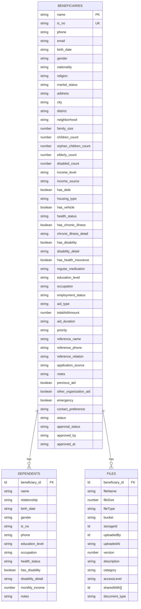
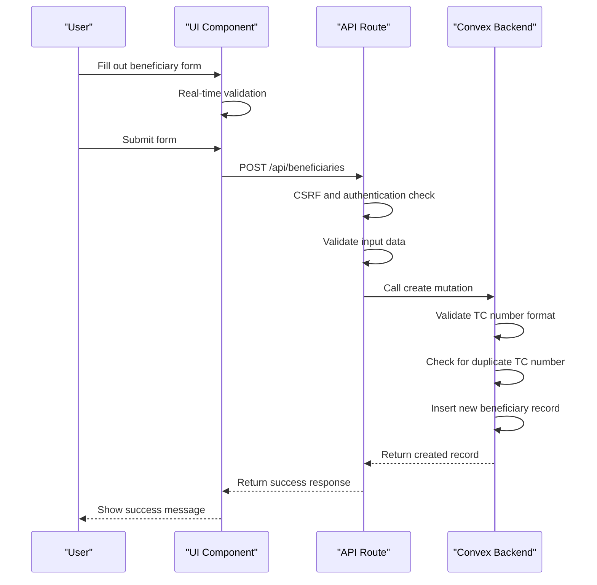
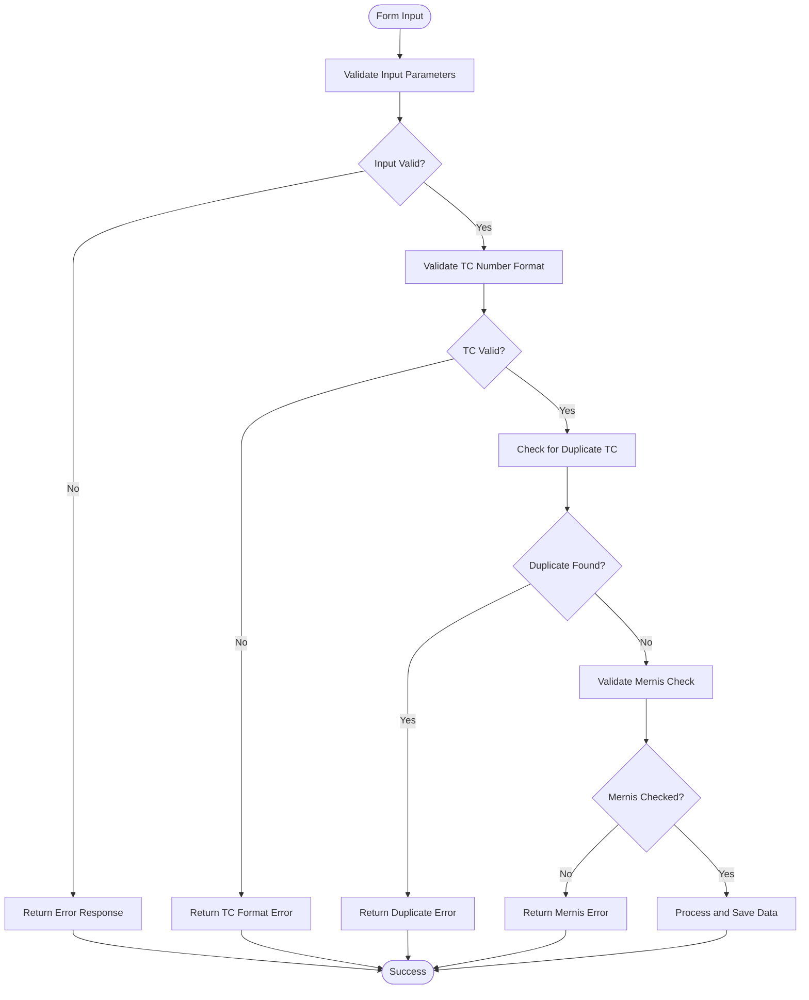
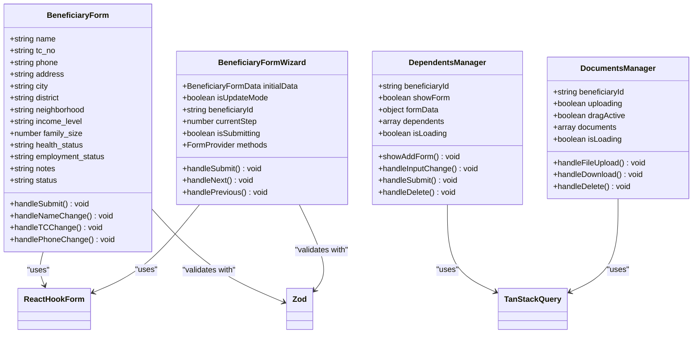
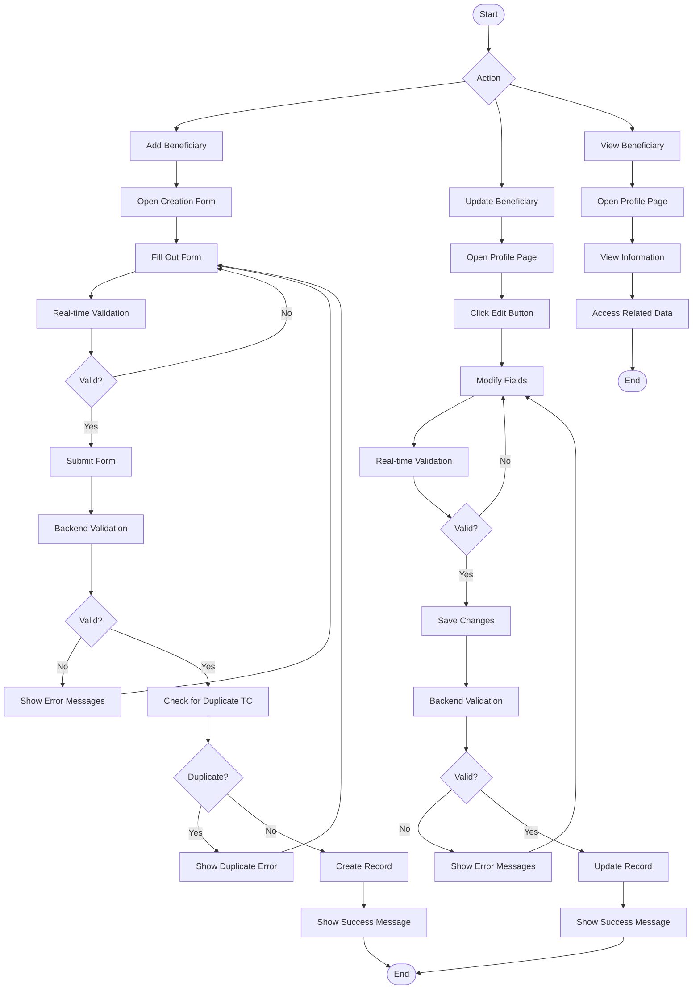
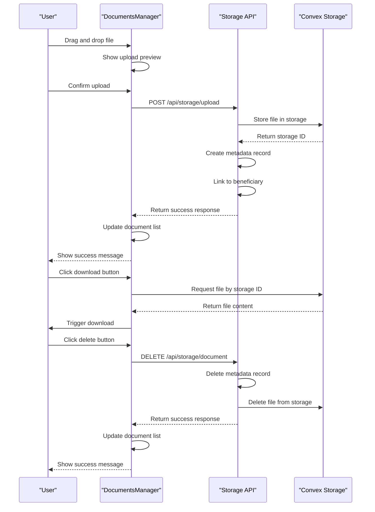
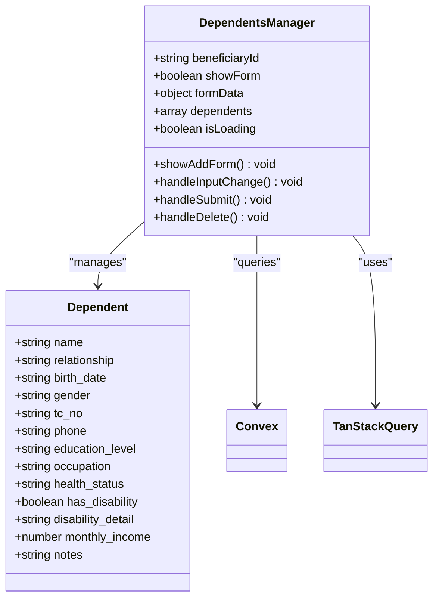
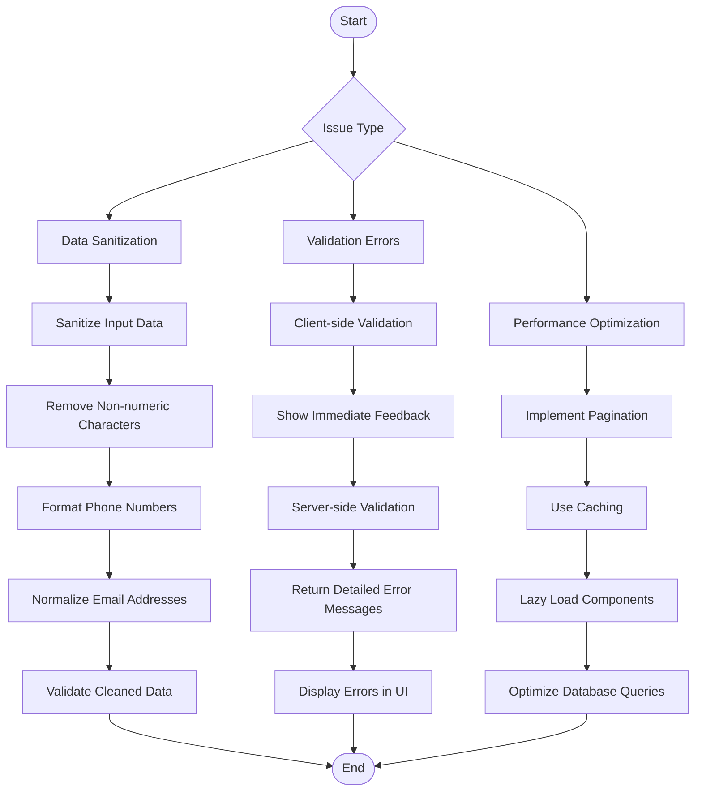

# Beneficiary Management

<cite>
**Referenced Files in This Document**   
- [beneficiaries.ts](file://convex/beneficiaries.ts)
- [dependents.ts](file://convex/dependents.ts)
- [documents.ts](file://convex/documents.ts)
- [schema.ts](file://convex/schema.ts)
- [BeneficiaryForm.tsx](file://src/components/forms/BeneficiaryForm.tsx)
- [BeneficiaryFormWizard.tsx](file://src/components/forms/BeneficiaryFormWizard.tsx)
- [AdvancedBeneficiaryForm.tsx](file://src/components/forms/AdvancedBeneficiaryForm.tsx)
- [DependentsManager.tsx](file://src/components/dependents/DependentsManager.tsx)
- [DocumentsManager.tsx](file://src/components/documents/DocumentsManager.tsx)
- [beneficiary.ts](file://src/types/beneficiary.ts)
- [beneficiary.ts](file://src/lib/validations/beneficiary.ts)
- [page.tsx](file://src/app/(dashboard)/yardim/ihtiyac-sahipleri/[id]/page.tsx)
- [route.ts](file://src/app/api/beneficiaries/route.ts)
</cite>

## Table of Contents

1. [Introduction](#introduction)
2. [Data Model](#data-model)
3. [Beneficiary Profile Implementation](#beneficiary-profile-implementation)
4. [Form Validation Logic](#form-validation-logic)
5. [UI Components](#ui-components)
6. [Workflows](#workflows)
7. [Document Management](#document-management)
8. [Dependent Tracking](#dependent-tracking)
9. [Audit Logging](#audit-logging)
10. [Common Issues](#common-issues)

## Introduction

The Beneficiary Management module is a comprehensive system for managing aid recipients within the KafkasDer platform. This module provides functionality for creating, updating, and viewing beneficiary profiles, managing applications, tracking dependents, and handling document storage. The system is built on a robust data model with extensive validation and security features to ensure data integrity and compliance. The implementation leverages Convex as the backend database and uses React with Next.js for the frontend interface, providing a responsive and user-friendly experience for administrators and staff.

**Section sources**

- [page.tsx](<file://src/app/(dashboard)/yardim/ihtiyac-sahipleri/[id]/page.tsx#L1-L1910>)

## Data Model

The data model for the Beneficiary Management module is defined in the Convex schema and consists of several interconnected collections. The primary collection is `beneficiaries`, which stores comprehensive information about aid recipients. This collection includes personal details such as name, TC identification number, contact information, address, family size, income level, health status, employment status, and various other attributes relevant to social assistance programs.

The `beneficiaries` collection is structured with multiple indexes to optimize query performance, including indexes on TC number, status, and city. It also features a search index on the name field with filter fields for TC number, phone, and email, enabling efficient searching and filtering of beneficiary records. The schema enforces data integrity through validation rules, such as requiring the TC number to be exactly 11 digits and ensuring that certain fields like name, address, city, district, and neighborhood meet minimum length requirements.

Related data is stored in separate but connected collections. The `dependents` collection tracks individuals who are dependent on a beneficiary, with a foreign key relationship to the `beneficiaries` collection through the `beneficiary_id` field. Similarly, the `files` collection stores document metadata and is linked to beneficiaries through the `beneficiary_id` field, enabling document management for each beneficiary record.

**Diagram sources**

- [schema.ts](file://convex/schema.ts#L47-L158)
- [dependents.ts](file://convex/dependents.ts#L1-L44)
- [documents.ts](file://convex/documents.ts#L1-L44)

**Section sources**

- [schema.ts](file://convex/schema.ts#L47-L158)
- [beneficiary.ts](file://src/types/beneficiary.ts#L393-L507)

## Beneficiary Profile Implementation

The implementation of beneficiary profiles is centered around the `beneficiaries` collection in Convex, which serves as the primary data store for all beneficiary information. The system provides comprehensive CRUD (Create, Read, Update, Delete) operations through Convex queries and mutations, accessible via the API layer. The backend implementation in `beneficiaries.ts` defines functions for listing, retrieving, creating, updating, and removing beneficiary records, with appropriate validation and error handling.

When creating a new beneficiary, the system performs several validation checks to ensure data integrity. The TC identification number is validated to ensure it is exactly 11 digits and follows the proper format. The system also checks for duplicate TC numbers to prevent the creation of duplicate records. The creation process includes mapping the status field from English values (active, inactive, archived) to their Turkish equivalents (AKTIF, PASIF, SILINDI) as required by the database schema.

The frontend implementation provides multiple interfaces for managing beneficiary profiles. The `BeneficiaryForm` component offers a simple form for creating new beneficiaries with essential fields, while the `AdvancedBeneficiaryForm` and `BeneficiaryFormWizard` components provide more comprehensive interfaces with additional fields and a step-by-step workflow. These components use React Hook Form for form state management and validation, with real-time field validation to provide immediate feedback to users.

**Diagram sources**

- [beneficiaries.ts](file://convex/beneficiaries.ts#L89-L169)
- [route.ts](file://src/app/api/beneficiaries/route.ts#L128-L242)
- [BeneficiaryForm.tsx](file://src/components/forms/BeneficiaryForm.tsx#L99-L478)

**Section sources**

- [beneficiaries.ts](file://convex/beneficiaries.ts#L89-L169)
- [route.ts](file://src/app/api/beneficiaries/route.ts#L128-L242)
- [BeneficiaryForm.tsx](file://src/components/forms/BeneficiaryForm.tsx#L99-L478)

## Form Validation Logic

The form validation logic in the Beneficiary Management module is implemented using Zod, a TypeScript-first schema declaration and validation library. The validation schema is defined in `beneficiary.ts` within the `src/lib/validations` directory and includes comprehensive rules for all beneficiary fields. The schema ensures that required fields are present and meet specific criteria, such as minimum length requirements and format constraints.

For example, the name field must be at least 2 characters long, the TC identification number must be exactly 11 digits and pass a checksum validation algorithm, and the phone number must follow the Turkish mobile phone format. The schema also includes conditional validation rules, such as requiring the marital status to be "single" if the beneficiary is under 18 years old, and ensuring that if a TC number is provided, the Mernis check must be performed.

The validation is implemented at multiple levels in the application. On the frontend, React Hook Form integrates with Zod to provide real-time validation feedback as users fill out the form. Each field is validated as it is modified, with visual indicators showing whether the input is valid or invalid. This immediate feedback helps users correct errors before submitting the form.

On the backend, the API route performs the same validation using the Zod schema before attempting to create or update a beneficiary record. This dual-layer validation ensures data integrity even if the frontend validation is bypassed. The backend validation returns detailed error messages that are displayed to the user, helping them understand and correct any issues with their input.

**Diagram sources**

- [beneficiary.ts](file://src/lib/validations/beneficiary.ts#L37-L393)
- [route.ts](file://src/app/api/beneficiaries/route.ts#L45-L79)

**Section sources**

- [beneficiary.ts](file://src/lib/validations/beneficiary.ts#L37-L393)
- [route.ts](file://src/app/api/beneficiaries/route.ts#L45-L79)

## UI Components

The UI components for the Beneficiary Management module are designed to provide a user-friendly and efficient interface for managing beneficiary records. The primary components are located in the `src/components/forms` directory and include `BeneficiaryForm`, `AdvancedBeneficiaryForm`, and `BeneficiaryFormWizard`. These components use React Hook Form for form state management and validation, with Zod for schema validation.

The `BeneficiaryForm` component provides a simple, single-page form for creating new beneficiaries with essential fields. It includes real-time validation with visual feedback, showing green checkmarks for valid fields and red X marks for invalid fields. The form also displays detailed error messages below each field when validation fails, helping users understand and correct their input.

The `BeneficiaryFormWizard` component offers a more comprehensive interface with a step-by-step workflow, breaking the form into multiple sections such as personal information, address information, family information, financial status, and health status. This approach makes it easier for users to manage complex forms by focusing on one section at a time. The wizard includes a progress indicator and navigation buttons to move between steps.

Additional UI components include `DependentsManager` and `DocumentsManager`, which provide interfaces for managing dependents and documents associated with a beneficiary. These components use modal dialogs for adding new records and display existing records in a card-based layout. The `DependentsManager` allows users to add, view, and delete dependents, while the `DocumentsManager` provides functionality for uploading, downloading, and deleting documents.

**Diagram sources**

- [BeneficiaryForm.tsx](file://src/components/forms/BeneficiaryForm.tsx#L99-L478)
- [BeneficiaryFormWizard.tsx](file://src/components/forms/BeneficiaryFormWizard.tsx#L45-L279)
- [DependentsManager.tsx](file://src/components/dependents/DependentsManager.tsx#L35-L363)
- [DocumentsManager.tsx](file://src/components/documents/DocumentsManager.tsx#L25-L274)

**Section sources**

- [BeneficiaryForm.tsx](file://src/components/forms/BeneficiaryForm.tsx#L99-L478)
- [BeneficiaryFormWizard.tsx](file://src/components/forms/BeneficiaryFormWizard.tsx#L45-L279)
- [DependentsManager.tsx](file://src/components/dependents/DependentsManager.tsx#L35-L363)
- [DocumentsManager.tsx](file://src/components/documents/DocumentsManager.tsx#L25-L274)

## Workflows

The workflows for adding, updating, and viewing beneficiary details are designed to be intuitive and efficient, guiding users through the necessary steps while ensuring data integrity. The primary workflow for adding a new beneficiary begins with the user accessing the beneficiary creation form, either through the main dashboard or a dedicated "Add Beneficiary" button.

When adding a new beneficiary, the user is presented with a form that includes fields for personal information, contact details, address, family size, income level, and other relevant data. As the user fills out the form, real-time validation provides immediate feedback on the validity of each field. Once the form is complete, the user submits it, triggering a series of backend processes that validate the data, check for duplicates, and create the new beneficiary record in the database.

For updating beneficiary details, the workflow begins with the user navigating to an existing beneficiary's profile page. This page displays all the beneficiary's information in a read-only format, with an "Edit" button that allows the user to modify the data. When the user clicks "Edit," the form fields become editable, and the user can make changes to the beneficiary's information. After making changes, the user saves the updates, which triggers a validation process similar to the creation workflow.

Viewing beneficiary details is the simplest workflow, involving navigation to a beneficiary's profile page where all their information is displayed in a structured format. The page includes tabs or sections for different categories of information, such as personal details, dependents, documents, and aid history. Users can also access related information, such as aid applications and bank accounts, through modal dialogs or separate pages.

**Diagram sources**

- [page.tsx](<file://src/app/(dashboard)/yardim/ihtiyac-sahipleri/[id]/page.tsx#L243-L458>)
- [BeneficiaryForm.tsx](file://src/components/forms/BeneficiaryForm.tsx#L207-L214)

**Section sources**

- [page.tsx](<file://src/app/(dashboard)/yardim/ihtiyac-sahipleri/[id]/page.tsx#L243-L458>)
- [BeneficiaryForm.tsx](file://src/components/forms/BeneficiaryForm.tsx#L207-L214)

## Document Management

The document management system in the Beneficiary Management module provides functionality for uploading, storing, retrieving, and deleting documents associated with beneficiary records. This system is implemented through the `DocumentsManager` component and the underlying Convex backend, which stores document metadata in the `files` collection and the actual file content in Convex's file storage.

When a user uploads a document, the file is first sent to the `/api/storage/upload` endpoint, which processes the upload and stores the file in Convex's file storage. The endpoint returns a storage ID, which is then used to create a record in the `files` collection with metadata such as the file name, size, type, upload date, and beneficiary ID. This metadata enables efficient searching and filtering of documents, while the storage ID allows for secure retrieval of the file content.

The `DocumentsManager` component provides a user-friendly interface for managing documents, with features such as drag-and-drop upload, file type filtering, and download functionality. Users can upload documents by dragging and dropping files onto the upload area or by clicking the upload button and selecting files from their device. The component supports common file types such as images and PDFs, with appropriate icons displayed for each file type.

Once documents are uploaded, they are displayed in a list with information such as the file name, size, upload date, and actions for downloading or deleting the file. Users can download documents by clicking the download button, which triggers a direct download from Convex's file storage. Documents can be deleted by clicking the delete button, which removes both the metadata record from the `files` collection and the file content from storage.

**Diagram sources**

- [DocumentsManager.tsx](file://src/components/documents/DocumentsManager.tsx#L78-L106)
- [documents.ts](file://convex/documents.ts#L1-L44)

**Section sources**

- [DocumentsManager.tsx](file://src/components/documents/DocumentsManager.tsx#L78-L106)
- [documents.ts](file://convex/documents.ts#L1-L44)

## Dependent Tracking

The dependent tracking system allows users to manage individuals who are dependent on a beneficiary, such as children, spouses, or elderly parents. This functionality is implemented through the `DependentsManager` component and the `dependents` collection in Convex, which stores information about each dependent and their relationship to the beneficiary.

The `DependentsManager` component provides a modal interface for adding new dependents, with fields for the dependent's name, relationship to the beneficiary, date of birth, gender, TC identification number, phone number, education level, occupation, health status, disability status, monthly income, and notes. When a user submits the form, the data is sent to the Convex backend, where it is validated and stored in the `dependents` collection with a foreign key reference to the beneficiary.

The component displays existing dependents in a card-based layout, with each card showing key information such as the dependent's name, relationship, date of birth, TC number, phone number, education level, occupation, and monthly income. Users can delete dependents by clicking the delete button on each card, which removes the record from the database. The component uses TanStack Query for data fetching and mutation, with automatic refetching after create and delete operations to ensure the UI is always up-to-date.

The dependent tracking system is integrated with the main beneficiary profile page, where it appears as one of several tabs or sections. This integration allows users to easily access and manage dependent information without leaving the beneficiary's profile. The system also supports lazy loading of the `DependentsManager` component to improve page load performance, with the component only being loaded when the user navigates to the dependents section.

**Diagram sources**

- [DependentsManager.tsx](file://src/components/dependents/DependentsManager.tsx#L35-L363)
- [dependents.ts](file://convex/dependents.ts#L1-L44)

**Section sources**

- [DependentsManager.tsx](file://src/components/dependents/DependentsManager.tsx#L35-L363)
- [dependents.ts](file://convex/dependents.ts#L1-L44)

## Audit Logging

The audit logging system in the Beneficiary Management module tracks all significant changes to beneficiary records and related data, providing a complete history of modifications for accountability and compliance purposes. This system is implemented through Convex's built-in change tracking and additional custom logging mechanisms that record user actions and system events.

When a beneficiary record is created, updated, or deleted, the system automatically logs the change with metadata such as the timestamp, user ID, action type, and before/after values of the modified fields. This information is stored in a dedicated audit log collection, which can be queried and displayed in the user interface for review. The audit log provides a chronological record of all changes, allowing administrators to track the history of a beneficiary's information and identify any unauthorized modifications.

In addition to automatic change tracking, the system includes manual audit logging for specific actions such as approval of beneficiary applications, changes to beneficiary status, and access to sensitive information. These manual logs are created through dedicated Convex mutations that record the action, user, timestamp, and relevant context. The audit logging system is integrated with the user authentication and authorization system, ensuring that only authorized users can perform actions that generate audit logs.

The audit log data is accessible through the beneficiary profile page, where it appears as a tab or section alongside other information such as personal details, dependents, and documents. Users can view the complete history of changes to a beneficiary's record, with filters to narrow the results by date range, action type, or user. The system also supports exporting audit log data for external review or compliance reporting.

**Section sources**

- [beneficiaries.ts](file://convex/beneficiaries.ts#L172-L214)
- [audit_logs.ts](file://convex/audit_logs.ts#L1-L44)

## Common Issues

The Beneficiary Management module addresses several common issues related to data sanitization, validation errors, and performance optimization when handling large beneficiary datasets. These issues are mitigated through a combination of frontend and backend techniques that ensure data integrity, provide clear error feedback, and maintain responsive performance.

Data sanitization is implemented through utility functions that clean and normalize input data before validation and storage. For example, the TC identification number is sanitized by removing any non-numeric characters and validating the format, while phone numbers are formatted to a standard Turkish mobile phone format. Email addresses are sanitized by removing leading and trailing whitespace and converting to lowercase. These sanitization functions are applied both on the frontend during form input and on the backend before database operations.

Validation errors are handled through a comprehensive error messaging system that provides clear, actionable feedback to users. When a validation error occurs, the system displays a descriptive error message below the relevant form field, explaining what is wrong and how to fix it. For example, if a user enters an invalid TC number, the error message will specify that the number must be exactly 11 digits and pass a checksum validation. The system also includes client-side validation to provide immediate feedback, reducing the number of round trips to the server.

Performance optimization is achieved through several techniques, including pagination, caching, and lazy loading. Large datasets are paginated to limit the amount of data transferred in each request, with the backend supporting limit and skip parameters for efficient querying. The frontend uses TanStack Query for caching and background refetching, reducing the number of API calls and improving perceived performance. Components that are not immediately visible, such as the dependents and documents managers, are lazy-loaded to reduce initial page load time.

**Diagram sources**

- [AdvancedBeneficiaryForm.tsx](file://src/components/forms/AdvancedBeneficiaryForm.tsx#L195-L236)
- [beneficiary.ts](file://src/lib/validations/beneficiary.ts#L37-L393)
- [page.tsx](<file://src/app/(dashboard)/yardim/ihtiyac-sahipleri/page.tsx#L239-L280>)

**Section sources**

- [AdvancedBeneficiaryForm.tsx](file://src/components/forms/AdvancedBeneficiaryForm.tsx#L195-L236)
- [beneficiary.ts](file://src/lib/validations/beneficiary.ts#L37-L393)
- [page.tsx](<file://src/app/(dashboard)/yardim/ihtiyac-sahipleri/page.tsx#L239-L280>)
