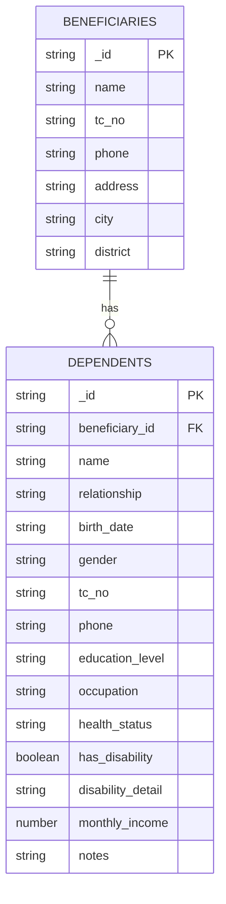
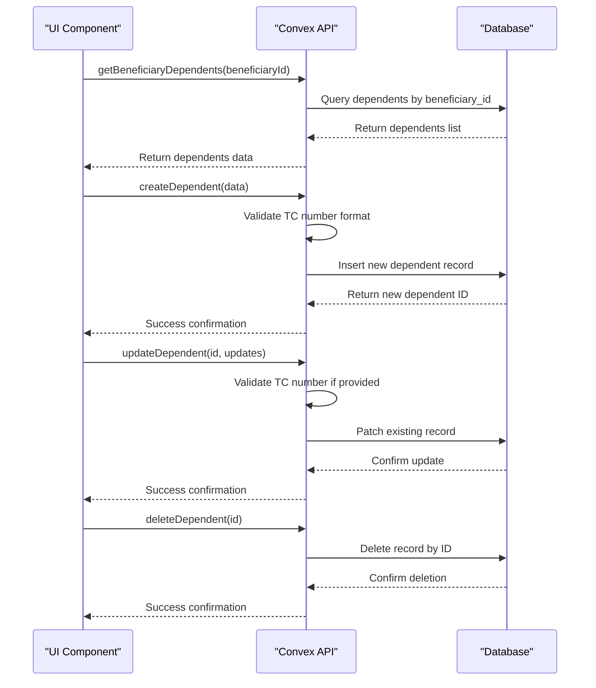
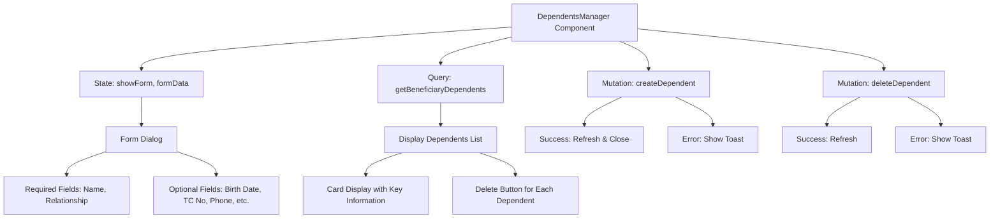

# Dependents Management

<cite>
**Referenced Files in This Document**   
- [schema.ts](file://convex/schema.ts#L890-L938)
- [dependents.ts](file://convex/dependents.ts#L1-L140)
- [DependentsManager.tsx](file://src/components/dependents/DependentsManager.tsx#L1-L363)
- [page.tsx](file://src/app/(dashboard)/yardim/ihtiyac-sahipleri/[id]/page.tsx#L546-L553)
</cite>

## Table of Contents

1. [Introduction](#introduction)
2. [Data Model](#data-model)
3. [API Operations](#api-operations)
4. [UI Component](#ui-component)
5. [Workflow and Validation](#workflow-and-validation)
6. [Integration with Beneficiary Profiles](#integration-with-beneficiary-profiles)
7. [Audit Logging and Data Consistency](#audit-logging-and-data-consistency)
8. [Common Issues](#common-issues)

## Introduction

The Dependents Management feature enables tracking of individuals dependent on a beneficiary within the aid management system. This functionality allows social workers and administrators to maintain comprehensive family and dependency information, which is crucial for determining aid eligibility and providing appropriate support. The system supports full CRUD (Create, Read, Update, Delete) operations for dependent records, with proper validation and integration across the application.

**Section sources**

- [page.tsx](<file://src/app/(dashboard)/yardim/ihtiyac-sahipleri/[id]/page.tsx#L546-L553>)

## Data Model

The dependents data model is defined in the Convex schema, establishing a clear relationship between beneficiaries and their dependents. Each dependent record is linked to a beneficiary through a foreign key relationship, ensuring data integrity and enabling efficient querying.

The `dependents` collection in `schema.ts` contains the following fields:

- `beneficiary_id`: Reference to the beneficiary who is responsible for this dependent
- `name`: Full name of the dependent
- `relationship`: Relationship to the beneficiary (spouse, child, parent, sibling, other)
- `birth_date`: Date of birth of the dependent
- `gender`: Gender of the dependent
- `tc_no`: Turkish National Identity Number (11 digits)
- `phone`: Contact phone number
- `education_level`: Highest education level completed
- `occupation`: Current occupation
- `health_status`: General health status
- `has_disability`: Boolean flag indicating disability status
- `disability_detail`: Details about the disability
- `monthly_income`: Monthly income amount
- `notes`: Additional notes about the dependent

The schema includes an index on `beneficiary_id` to optimize queries that retrieve all dependents for a specific beneficiary.

**Diagram sources**

- [schema.ts](file://convex/schema.ts#L890-L938)

**Section sources**

- [schema.ts](file://convex/schema.ts#L890-L938)

## API Operations

The dependents API provides a complete set of operations for managing dependent records through Convex functions. These server-side functions handle data validation, database operations, and error handling.

### Query Function

The `getBeneficiaryDependents` query function retrieves all dependents for a specific beneficiary by their ID. It uses an indexed query for optimal performance, filtering dependents by the `beneficiary_id` field.

### Mutation Functions

The system implements three mutation functions for data modification:

**Create Dependent**

- Validates TC number format (11 digits)
- Inserts a new dependent record with all provided fields
- Returns the ID of the created dependent

**Update Dependent**

- Supports partial updates of dependent information
- Validates TC number format when provided
- Applies only the fields that have been modified
- Returns success confirmation

**Delete Dependent**

- Removes a dependent record by ID
- Performs no additional validation beyond authentication
- Returns success confirmation

These functions are accessible through the Convex API and are consumed by the frontend components.

**Diagram sources**

- [dependents.ts](file://convex/dependents.ts#L1-L140)

**Section sources**

- [dependents.ts](file://convex/dependents.ts#L1-L140)

## UI Component

The `DependentsManager` component provides a user-friendly interface for managing dependent information within the beneficiary profile. This React component uses client-side state management and integrates with Convex through React Query for data fetching and mutations.

### Key Features

- **Add Dependent**: Modal form with fields for all dependent information
- **View Dependents**: List display showing key information for each dependent
- **Remove Dependent**: Delete functionality with confirmation feedback
- **Real-time Updates**: Automatic refresh after create/delete operations

### Component Structure

The component accepts a `beneficiaryId` prop and uses it to:

1. Fetch existing dependents via `getBeneficiaryDependents`
2. Create new dependents linked to the beneficiary
3. Display dependents in a card-based layout

The form includes validation for required fields (name and relationship) and provides appropriate feedback through toast notifications for success and error states.

**Diagram sources**

- [DependentsManager.tsx](file://src/components/dependents/DependentsManager.tsx#L1-L363)

**Section sources**

- [DependentsManager.tsx](file://src/components/dependents/DependentsManager.tsx#L1-L363)

## Workflow and Validation

The dependents management workflow follows a standard CRUD pattern with specific validation rules to ensure data quality and consistency.

### Add Dependent Workflow

1. User clicks "Yeni Kişi" (New Person) button
2. Modal form appears with pre-filled default values
3. User completes required fields (name, relationship)
4. Optional fields can be filled as needed
5. Upon submission:
   - Frontend validates required fields
   - TC number format is validated (11 digits)
   - Data is sent to Convex API
   - Success: Toast confirmation, form reset, list refresh
   - Error: Error toast displayed

### Edit Dependent

Currently, the UI does not support direct editing, but the API supports updates. Editing would require:

- Retrieving the dependent record
- Presenting fields in an edit form
- Submitting only changed fields to the update endpoint

### Remove Dependent

1. User clicks trash icon on a dependent card
2. Mutation is triggered with the dependent ID
3. Record is deleted from the database
4. Query cache is invalidated to refresh the list
5. Success toast is displayed

### Validation Rules

- **TC Number**: Must be exactly 11 digits if provided
- **Name**: Required field
- **Relationship**: Required field with predefined options
- **Birth Date**: Valid date format
- **Phone**: Numeric input
- **Monthly Income**: Numeric value

## Integration with Beneficiary Profiles

The dependents feature is tightly integrated with beneficiary profiles, appearing as a dedicated section within the beneficiary detail page.

### Display in Beneficiary Profile

The dependents information is displayed in the beneficiary profile under the "Baktığı Kişiler" (People They Support) section. Each dependent is shown in a card format with key information:

- Name and relationship (with translated labels)
- Birth date (formatted)
- TC number
- Phone number
- Education level
- Occupation
- Monthly income (formatted with Turkish currency)
- Disability status indicator

### Access Pattern

The `DependentsManager` component is dynamically imported and rendered within a dialog modal when the user clicks on the dependents card in the beneficiary profile dashboard. This lazy loading approach improves initial page load performance.

The integration ensures that all dependent data is contextualized within the beneficiary's overall profile, allowing social workers to make informed decisions about aid eligibility based on the complete household situation.

**Section sources**

- [page.tsx](<file://src/app/(dashboard)/yardim/ihtiyac-sahipleri/[id]/page.tsx#L546-L553>)

## Audit Logging and Data Consistency

The system maintains data consistency and provides audit capabilities for dependent records through several mechanisms.

### Data Consistency

- **Foreign Key Relationship**: The `beneficiary_id` field ensures each dependent is linked to a valid beneficiary
- **Indexed Queries**: The index on `beneficiary_id` ensures efficient retrieval of dependents
- **Transaction Safety**: Convex database operations ensure atomicity of create, update, and delete operations
- **Cache Invalidation**: The UI invalidates query caches after mutations to ensure fresh data display

### Audit Considerations

While the current implementation doesn't explicitly log dependent operations, the system has an audit logging framework that could be extended to track:

- Creation of dependent records
- Updates to dependent information
- Deletion of dependent records

The audit system would capture:

- User who performed the action
- Timestamp of the action
- Type of action (create, update, delete)
- Resource affected (dependent record)
- IP address and user agent

This would help maintain accountability and provide a trail for compliance purposes.

## Common Issues

Several potential issues may arise when managing dependent records, along with their solutions.

### Orphaned Dependent Records

**Issue**: Dependent records may become orphaned if the parent beneficiary is deleted without cascading the deletion.

**Solution**: Implement a pre-delete hook that either:

- Prevents deletion of beneficiaries with dependents
- Automatically deletes all dependents when a beneficiary is deleted
- Transfers dependents to another beneficiary

Currently, the system does not handle this scenario, so manual cleanup would be required.

### Validation of Dependent Relationships

**Issue**: The system allows any text for relationship types, though the UI provides predefined options.

**Solution**: Enhance the data model to use a union type for relationship, restricting values to:

- spouse
- child
- parent
- sibling
- other

This would prevent inconsistent or misspelled relationship types.

### Data Quality Issues

**Potential Issues**:

- Incomplete dependent records
- Invalid TC numbers
- Duplicate dependents
- Inconsistent formatting of phone numbers or income

**Mitigation Strategies**:

- Implement more comprehensive client-side validation
- Add server-side deduplication checks
- Standardize phone number formatting
- Validate income ranges for reasonableness

The current validation focuses on TC number format and required fields, but additional validation could improve data quality.
