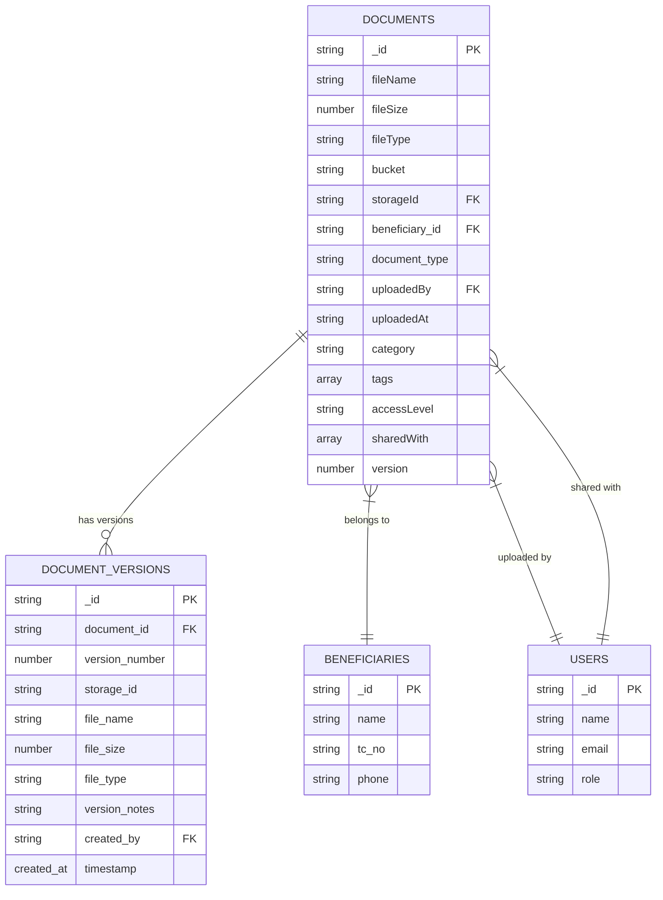
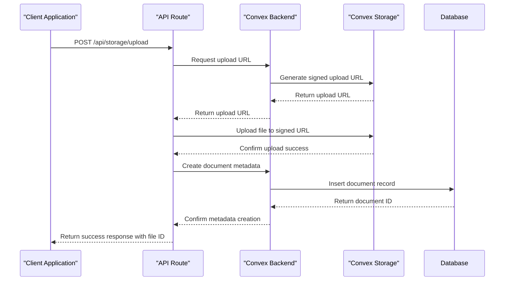
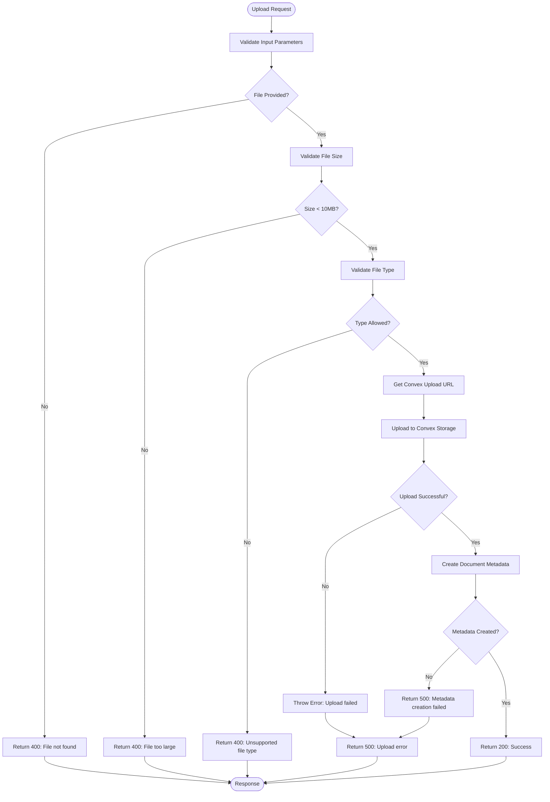
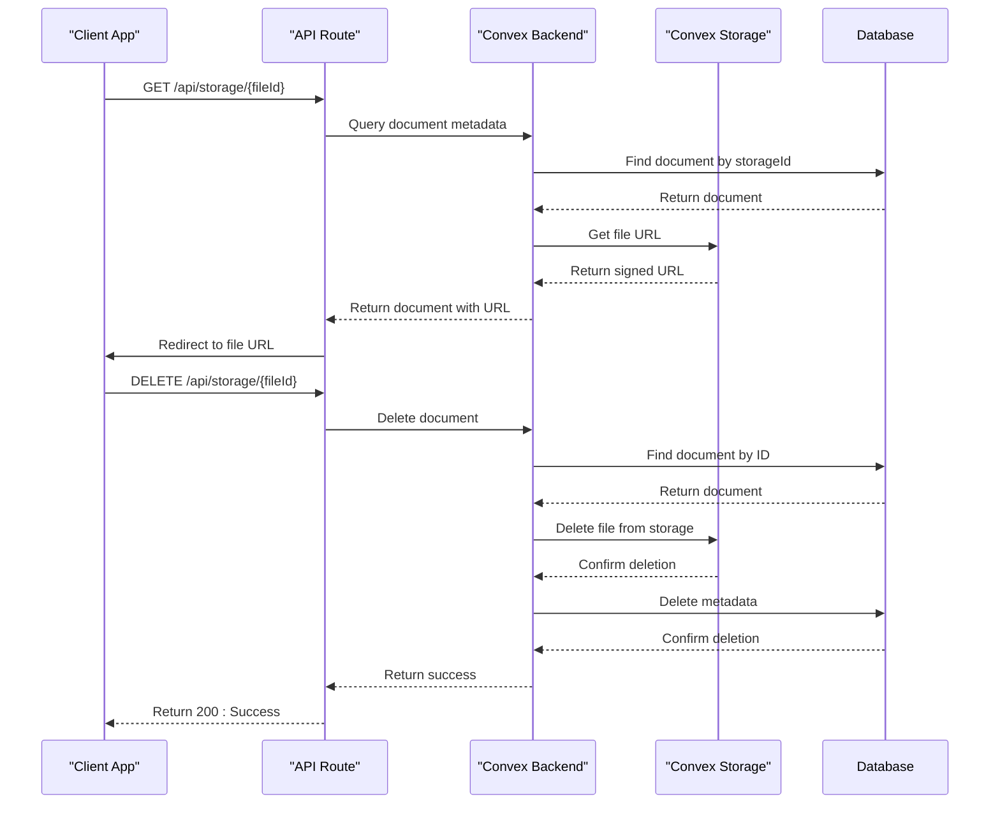
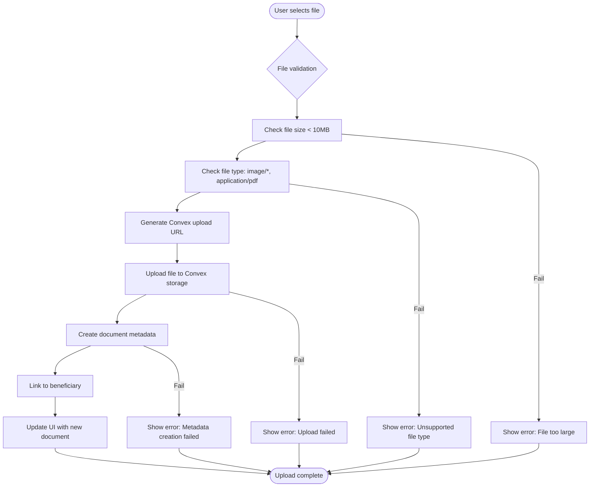
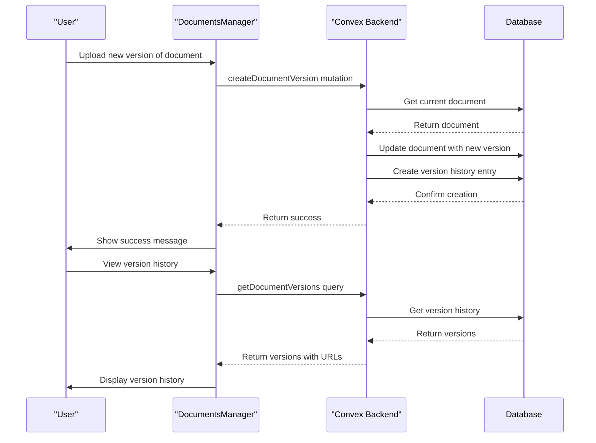
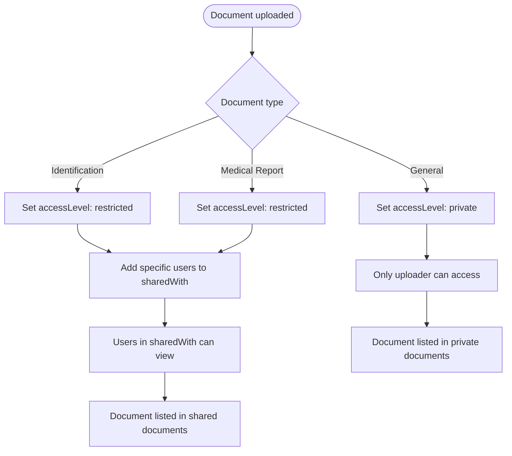

# Documents Management

<cite>
**Referenced Files in This Document**   
- [documents.ts](file://convex/documents.ts)
- [storage.ts](file://convex/storage.ts)
- [DocumentsManager.tsx](file://src/components/documents/DocumentsManager.tsx)
- [upload/route.ts](file://src/app/api/storage/upload/route.ts)
- [\[fileId\]/route.ts](file://src/app/api/storage/[fileId]/route.ts)
- [database.ts](file://src/types/database.ts)
</cite>

## Table of Contents

1. [Introduction](#introduction)
2. [Data Model](#data-model)
3. [File Storage Integration](#file-storage-integration)
4. [API Routes](#api-routes)
5. [UI Components](#ui-components)
6. [Document Workflows](#document-workflows)
7. [Security Considerations](#security-considerations)
8. [Common Issues and Solutions](#common-issues-and-solutions)

## Introduction

The Documents Management feature provides a comprehensive system for uploading, viewing, and managing documents for beneficiaries within the Kafkasder-panel application. This system enables users to handle identification documents, medical reports, and other supporting files with robust security and access controls. The implementation leverages Convex as the backend platform, utilizing its file storage capabilities and database functionality to create a seamless document management experience. The feature supports document versioning, access control, and metadata tracking, ensuring that sensitive beneficiary information is properly managed and secured.

## Data Model

The document management system uses a structured data model to track document metadata and relationships. The core document schema includes essential fields for tracking file information, ownership, and access permissions.



**Diagram sources**

- [documents.ts](file://convex/documents.ts#L53-L104)
- [database.ts](file://src/types/database.ts#L8-L15)

**Section sources**

- [documents.ts](file://convex/documents.ts#L53-L104)
- [database.ts](file://src/types/database.ts#L8-L15)

## File Storage Integration

The document management system integrates with Convex's storage system to handle file uploads and retrieval. The integration follows a secure pattern where files are first uploaded to Convex storage, and then metadata is stored in the database.



**Diagram sources**

- [documents.ts](file://convex/documents.ts#L101-L106)
- [upload/route.ts](file://src/app/api/storage/upload/route.ts#L49-L66)

**Section sources**

- [documents.ts](file://convex/documents.ts#L101-L106)
- [upload/route.ts](file://src/app/api/storage/upload/route.ts#L49-L66)

## API Routes

The document management system exposes several API routes to handle document operations, including upload, retrieval, and deletion. These routes follow REST principles and provide secure access to document functionality.

### Upload Route

The upload route handles document uploads by first validating the file and then coordinating with Convex storage.



**Diagram sources**

- [upload/route.ts](file://src/app/api/storage/upload/route.ts#L1-L98)

**Section sources**

- [upload/route.ts](file://src/app/api/storage/upload/route.ts#L1-L98)

### Document Retrieval and Deletion Routes

The system provides routes for retrieving and deleting documents, ensuring proper access control and error handling.



**Diagram sources**

- [\[fileId\]/route.ts](file://src/app/api/storage/[fileId]/route.ts#L1-L53)

**Section sources**

- [\[fileId\]/route.ts](file://src/app/api/storage/[fileId]/route.ts#L1-L53)

## UI Components

The DocumentsManager component provides a user-friendly interface for managing beneficiary documents, featuring drag-and-drop upload functionality and document listing.

```mermaid
classDiagram
class DocumentsManager {
+beneficiaryId : string
-documents : Document[]
-uploading : boolean
-dragActive : boolean
+useQuery : fetchDocuments()
+useMutation : deleteDocument()
+handleFileUpload(file : File) : Promise~void~
+handleDownload(doc : Document) : void
+formatFileSize(bytes : number) : string
+getFileIcon(fileType : string) : Component
}
class Document {
+_id : string
+fileName : string
+fileSize : number
+fileType : string
+document_type? : string
+uploadedAt : string
+url? : string
}
DocumentsManager --> Document : "manages"
DocumentsManager --> "React Query" : "uses"
DocumentsManager --> "Convex Client" : "uses"
DocumentsManager --> "Toast Notifications" : "uses"
```

**Diagram sources**

- [DocumentsManager.tsx](file://src/components/documents/DocumentsManager.tsx#L1-L277)

**Section sources**

- [DocumentsManager.tsx](file://src/components/documents/DocumentsManager.tsx#L1-L277)

## Document Workflows

The document management system supports several key workflows for handling beneficiary documents, including uploading identification documents, medical reports, and other supporting files.

### Document Upload Workflow

The document upload process follows a standardized workflow to ensure data integrity and security.



**Section sources**

- [upload/route.ts](file://src/app/api/storage/upload/route.ts#L1-L98)
- [DocumentsManager.tsx](file://src/components/documents/DocumentsManager.tsx#L78-L106)

### Document Versioning Workflow

The system supports document versioning, allowing users to maintain a history of document changes.



**Section sources**

- [documents.ts](file://convex/documents.ts#L109-L159)
- [documents.ts](file://convex/documents.ts#L162-L182)

## Security Considerations

The document management system implements several security measures to protect sensitive beneficiary information and ensure proper access control.

### Access Control

The system implements role-based access control for documents, with different access levels and sharing capabilities.

```mermaid
classDiagram
class Document {
+accessLevel : 'public'|'private'|'restricted'
+sharedWith : string[]
}
class User {
+role : string
+permissions : string[]
}
class DocumentsManager {
+getBeneficiaryDocuments()
+getSharedDocuments()
+updateDocumentMetadata()
}
DocumentsManager --> Document : "retrieves"
DocumentsManager --> User : "checks permissions"
Document --> User : "shared with"
note right of Document
Access Levels :
- public : visible to all users
- private : only visible to uploader
- restricted : visible to specific users in sharedWith
end note
```

**Section sources**

- [documents.ts](file://convex/documents.ts#L220-L265)
- [documents.ts](file://convex/documents.ts#L346-L403)

### File Security

The system implements file security measures including type restrictions, size limits, and secure storage.

| Security Aspect | Implementation | Details                                                                                                                                         |
| --------------- | -------------- | ----------------------------------------------------------------------------------------------------------------------------------------------- |
| **File Types**  | Allowed Types  | image/jpeg, image/png, image/webp, application/pdf, application/msword, application/vnd.openxmlformats-officedocument.wordprocessingml.document |
| **File Size**   | Maximum Size   | 10MB per file                                                                                                                                   |
| **Storage**     | Convex Storage | Files stored in secure Convex storage with signed URLs                                                                                          |
| **Access**      | URL Expiration | Document URLs are temporary and expire after use                                                                                                |
| **Validation**  | Server-side    | All file validation occurs on server, not just client-side                                                                                      |

**Section sources**

- [upload/route.ts](file://src/app/api/storage/upload/route.ts#L29-L42)
- [documents.ts](file://convex/documents.ts#L16-L20)

## Common Issues and Solutions

The document management system addresses several common issues related to document handling and provides solutions for troubleshooting.

### Failed Uploads

Failed uploads can occur due to various reasons, and the system provides appropriate error handling.

| Issue                      | Cause                             | Solution                                  |
| -------------------------- | --------------------------------- | ----------------------------------------- |
| **File too large**         | File exceeds 10MB limit           | Compress file or split into smaller parts |
| **Unsupported file type**  | File type not in allowed list     | Convert to PDF or image format            |
| **Network issues**         | Connection problems during upload | Retry upload or check network connection  |
| **Authentication failure** | Session expired or invalid        | Re-authenticate and retry upload          |
| **Server errors**          | Backend processing issues         | Contact support with error details        |

**Section sources**

- [upload/route.ts](file://src/app/api/storage/upload/route.ts#L89-L95)
- [DocumentsManager.tsx](file://src/components/documents/DocumentsManager.tsx#L101-L103)

### Access Control for Sensitive Documents

The system provides mechanisms to control access to sensitive documents through proper categorization and sharing.



**Section sources**

- [documents.ts](file://convex/documents.ts#L220-L265)
- [documents.ts](file://convex/documents.ts#L346-L403)

### Integration with External Verification Services

While not currently implemented, the system is designed to support integration with external document verification services through its extensible architecture.

| Integration Point                 | Current Status        | Future Implementation                                |
| --------------------------------- | --------------------- | ---------------------------------------------------- |
| **Document Validation**           | Basic type validation | Integrate with OCR services for content validation   |
| **Identity Verification**         | Not implemented       | Connect to government ID verification APIs           |
| **Medical Document Verification** | Not implemented       | Partner with healthcare providers for authentication |
| **Document Expiration**           | Not implemented       | Add expiration tracking and renewal reminders        |
| **Automated Classification**      | Manual categorization | Implement AI-based document classification           |

**Section sources**

- [documents.ts](file://convex/documents.ts#L220-L265)
- [documents.ts](file://convex/documents.ts#L322-L343)
