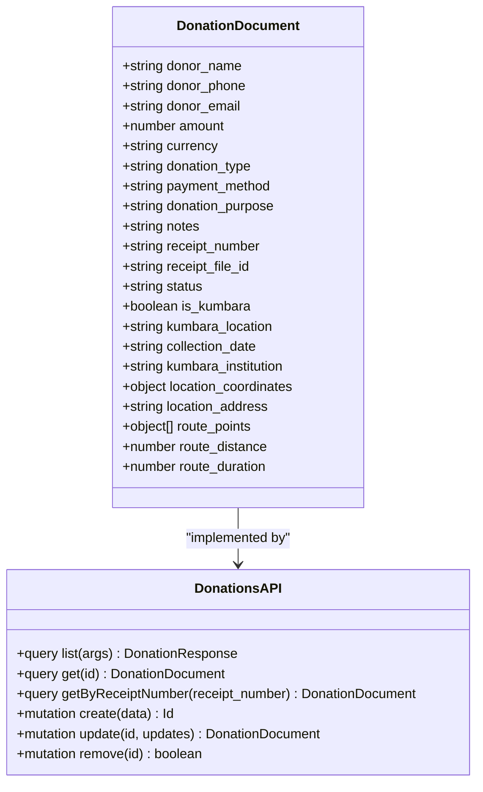
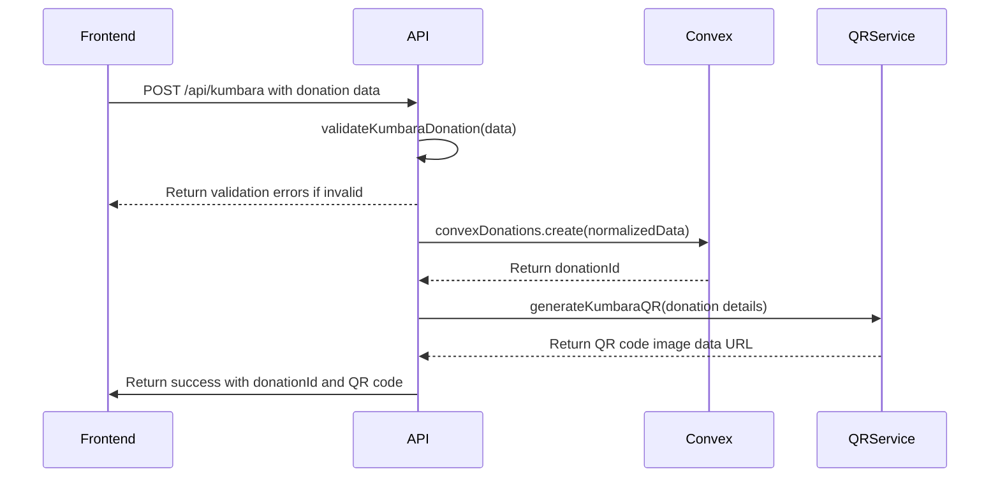
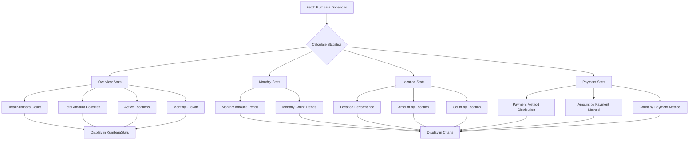
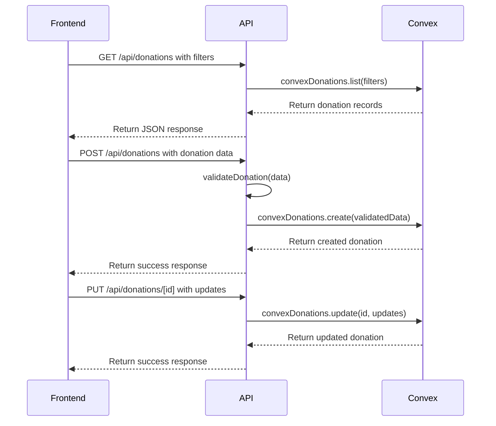
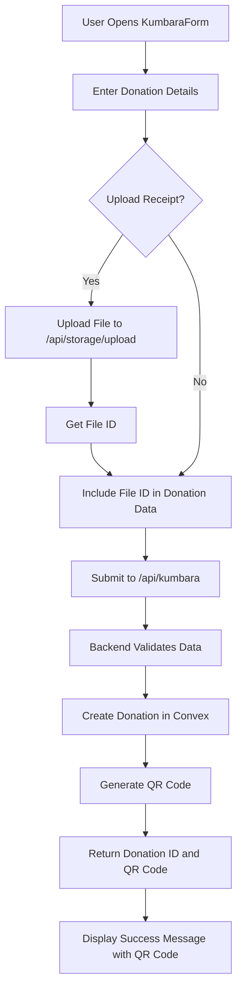

# Donation Management

<cite>
**Referenced Files in This Document**   
- [donations.ts](file://convex/donations.ts)
- [kumbara.ts](file://src/lib/validations/kumbara.ts)
- [KumbaraForm.tsx](file://src/components/kumbara/KumbaraForm.tsx)
- [KumbaraStats.tsx](file://src/components/kumbara/KumbaraStats.tsx)
- [MapLocationPicker.tsx](file://src/components/kumbara/MapLocationPicker.tsx)
- [donationForm.tsx](file://src/components/forms/DonationForm.tsx)
- [route.ts](file://src/app/api/donations/route.ts)
- [route.ts](file://src/app/api/kumbara/route.ts)
- [schema.ts](file://convex/schema.ts)
</cite>

## Table of Contents

1. [Introduction](#introduction)
2. [Donation Tracking and Status Management](#donation-tracking-and-status-management)
3. [Kumbara Collections Implementation](#kumbara-collections-implementation)
4. [Reporting and Analytics](#reporting-and-analytics)
5. [Frontend-Backend Integration](#frontend-backend-integration)
6. [Special Features and Workflows](#special-features-and-workflows)
7. [Data Consistency and Financial Auditing](#data-consistency-and-financial-auditing)
8. [Conclusion](#conclusion)

## Introduction

The Donation Management module provides a comprehensive system for tracking donations, managing Kumbara (piggy bank) collections, and generating financial reports. The system integrates frontend components with Convex backend functions to ensure data consistency and streamline donation workflows. This documentation covers the implementation of donation creation, status tracking, reconciliation workflows, and integration with financial reporting modules.

**Section sources**

- [donations.ts](file://convex/donations.ts#L1-L149)
- [schema.ts](file://convex/schema.ts#L168-L216)

## Donation Tracking and Status Management

The donation tracking system is built around the donations collection in Convex, which stores comprehensive information about each donation. Donations are tracked through their lifecycle with status values of 'pending', 'completed', or 'cancelled'. The system supports various donation types including standard donations and Kumbara-specific collections.

Key fields in the donation record include donor information (name, phone, email), financial details (amount, currency, payment method), and transaction metadata (receipt number, donation purpose, notes). Each donation is assigned a unique identifier and can be queried through multiple indexes including by status, donor email, receipt number, and Kumbara-specific attributes.

The system implements CRUD operations through Convex mutations and queries. The create mutation inserts new donation records into the database, while the update mutation allows modification of key fields such as status, amount, and notes. The list query supports filtering by various criteria including status, donor email, and Kumbara-specific flags.

**Diagram sources**

- [donations.ts](file://convex/donations.ts#L77-L147)
- [schema.ts](file://convex/schema.ts#L168-L216)

**Section sources**

- [donations.ts](file://convex/donations.ts#L77-L147)
- [schema.ts](file://convex/schema.ts#L168-L216)

## Kumbara Collections Implementation

The Kumbara (piggy bank) collection system extends the standard donation functionality with specialized fields and workflows. Kumbara donations are identified by the is_kumbara flag and include additional metadata such as collection location, institution, and date. The system supports geographic tracking through GPS coordinates and address information.

The KumbaraForm component provides a specialized interface for creating Kumbara donations, with validation rules specific to Kumbara collections. The form includes fields for location details, collection date, and optional route information. The MapLocationPicker component enables users to select geographic coordinates and define collection routes with multiple waypoints.

Kumbara-specific validation ensures data quality by requiring minimum length for location and institution fields, validating collection dates, and checking coordinate accuracy. The system also supports optional route metrics including distance and duration, which are validated to ensure they are positive numbers.

**Diagram sources**

- [kumbara.ts](file://src/lib/validations/kumbara.ts#L5-L77)
- [KumbaraForm.tsx](file://src/components/kumbara/KumbaraForm.tsx#L47-L800)
- [route.ts](file://src/app/api/kumbara/route.ts#L458-L522)

**Section sources**

- [kumbara.ts](file://src/lib/validations/kumbara.ts#L5-L77)
- [KumbaraForm.tsx](file://src/components/kumbara/KumbaraForm.tsx#L47-L800)
- [MapLocationPicker.tsx](file://src/components/kumbara/MapLocationPicker.tsx#L31-L471)
- [route.ts](file://src/app/api/kumbara/route.ts#L458-L522)

## Reporting and Analytics

The reporting system provides comprehensive analytics for donation management, with specialized components for Kumbara collections. The KumbaraStats component displays key performance indicators including total Kumbara count, total amount collected, active locations, and monthly growth trends.

The system implements multiple statistical views through the GET_STATS endpoint, which supports different report types including overview, monthly, location-based, and payment method statistics. The statistics are calculated from all Kumbara donations and provide insights into collection patterns and performance metrics.

The reporting interface includes visualizations of monthly donation trends, location-based performance, and payment method distribution. These analytics help identify high-performing locations, track collection team performance, and optimize resource allocation for future collections.

**Diagram sources**

- [KumbaraStats.tsx](file://src/components/kumbara/KumbaraStats.tsx#L18-L172)
- [route.ts](file://src/app/api/kumbara/route.ts#L280-L452)

**Section sources**

- [KumbaraStats.tsx](file://src/components/kumbara/KumbaraStats.tsx#L18-L172)
- [route.ts](file://src/app/api/kumbara/route.ts#L280-L452)

## Frontend-Backend Integration

The frontend-backend integration is implemented through API routes that connect React components with Convex backend functions. The DonationForm and KumbaraForm components use React Hook Form with Zod validation to ensure data integrity before submission to the backend.

The integration follows a consistent pattern where frontend components make API calls to Next.js route handlers, which in turn invoke Convex functions. The route handlers perform CSRF validation, module access checks, and data validation before processing requests. Error handling is implemented consistently across all endpoints, with appropriate status codes and error messages.

The system uses React Query for data fetching and mutation management, enabling automatic query invalidation and data synchronization. When a donation is created or updated, the relevant queries are invalidated to ensure the UI reflects the latest data. File uploads are handled through a dedicated storage endpoint, with file IDs stored in the donation record.

**Diagram sources**

- [DonationForm.tsx](file://src/components/forms/DonationForm.tsx#L98-L530)
- [route.ts](file://src/app/api/donations/route.ts#L1-L148)
- [donations.ts](file://convex/donations.ts#L77-L147)

**Section sources**

- [DonationForm.tsx](file://src/components/forms/DonationForm.tsx#L98-L530)
- [route.ts](file://src/app/api/donations/route.ts#L1-L148)
- [donations.ts](file://convex/donations.ts#L77-L147)

## Special Features and Workflows

The system implements several specialized features and workflows to support Kumbara collections and donation management. The QR code generation feature creates scannable QR codes for each Kumbara, containing metadata about the collection location, institution, and date. These QR codes enable quick identification and tracking of Kumbara units in the field.

The MapLocationPicker component provides an interactive map interface for selecting geographic coordinates and defining collection routes. Users can click on the map to add route points, search for addresses, or use their current location. The component calculates driving routes between points and displays the total distance and duration.

The system supports bulk operations through the list endpoint, which can filter and paginate large datasets. This enables efficient processing of multiple donations and supports bulk import scenarios. The validation system includes specialized schemas for different donation types, ensuring data consistency while accommodating different use cases.

**Diagram sources**

- [KumbaraForm.tsx](file://src/components/kumbara/KumbaraForm.tsx#L47-L800)
- [MapLocationPicker.tsx](file://src/components/kumbara/MapLocationPicker.tsx#L31-L471)
- [route.ts](file://src/app/api/kumbara/route.ts#L458-L522)

**Section sources**

- [KumbaraForm.tsx](file://src/components/kumbara/KumbaraForm.tsx#L47-L800)
- [MapLocationPicker.tsx](file://src/components/kumbara/MapLocationPicker.tsx#L31-L471)

## Data Consistency and Financial Auditing

The system ensures data consistency through comprehensive validation at multiple levels. Frontend validation provides immediate feedback to users, while backend validation ensures data integrity regardless of the client. The system uses Zod schemas to define data structures and validation rules, which are shared between frontend and backend where possible.

Financial auditing is supported through the comprehensive metadata stored with each donation, including timestamps, user references, and status change history. The system maintains data integrity through Convex's transactional guarantees and implements soft deletion patterns where appropriate. The finance_records collection provides an additional layer of financial tracking that can be reconciled with donation records.

The system includes logging for all critical operations, with detailed error logging for troubleshooting and audit purposes. Security measures include CSRF protection, module access controls, and input sanitization to prevent common web vulnerabilities. The architecture supports integration with financial reporting modules through standardized data formats and APIs.

**Section sources**

- [donations.ts](file://convex/donations.ts#L77-L147)
- [schema.ts](file://convex/schema.ts#L168-L216)
- [route.ts](file://src/app/api/donations/route.ts#L1-L148)
- [route.ts](file://src/app/api/kumbara/route.ts#L1-L522)

## Conclusion

The Donation Management module provides a robust system for tracking donations and managing Kumbara collections. The integration between frontend components and Convex backend functions ensures data consistency and provides a seamless user experience. The system supports comprehensive reporting, financial auditing, and specialized workflows for Kumbara collections, including QR code generation and geographic tracking. The architecture is designed for scalability and maintainability, with clear separation of concerns and consistent patterns across components.
