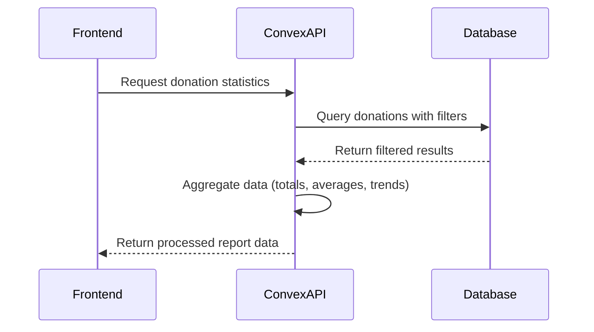
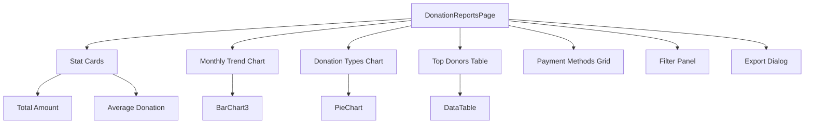
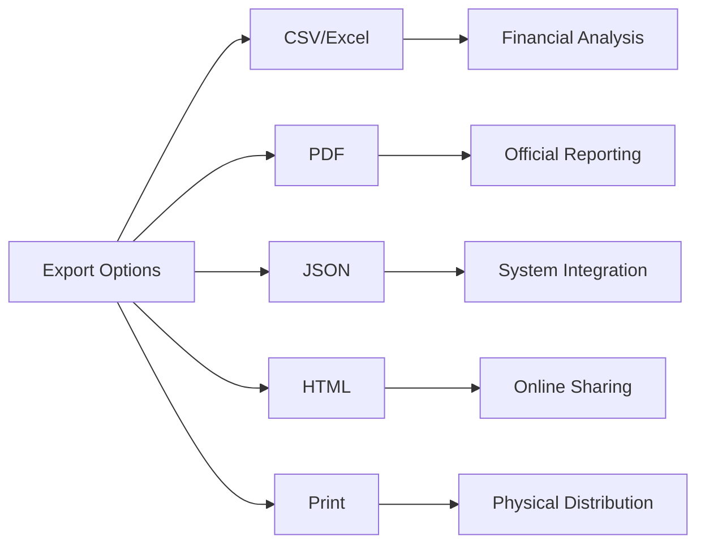

# Donation Reporting

<cite>
**Referenced Files in This Document**   
- [analytics.ts](file://convex/analytics.ts)
- [page.tsx](file://src/app/(dashboard)/bagis/raporlar/page.tsx)
- [api-cache.ts](file://src/lib/api-cache.ts)
- [KumbaraCharts.tsx](file://src/components/kumbara/KumbaraCharts.tsx)
- [export-buttons.tsx](file://src/components/ui/export-buttons.tsx)
- [pdf-export.ts](file://src/lib/utils/pdf-export.ts)
</cite>

## Table of Contents

1. [Introduction](#introduction)
2. [Data Aggregation and Visualization](#data-aggregation-and-visualization)
3. [Analytics Functions Implementation](#analytics-functions-implementation)
4. [Frontend Integration](#frontend-integration)
5. [Filtering and Query Capabilities](#filtering-and-query-capabilities)
6. [Report Export and Compliance](#report-export-and-compliance)
7. [Performance Considerations](#performance-considerations)
8. [Troubleshooting Guide](#troubleshooting-guide)

## Introduction

The Donation Reporting sub-module provides comprehensive analytics and visualization capabilities for donation data within the Kafkasder-panel system. This documentation details how donation data is aggregated, visualized, and reported through interactive dashboards that support various filtering options, export formats, and performance optimizations. The system integrates Convex backend functions with React frontend components to deliver real-time insights into donation trends, donor statistics, and financial performance metrics.

## Data Aggregation and Visualization

The donation reporting system aggregates data from multiple sources including direct donations, Kumbara collections, and other donation types. The primary visualization dashboard displays key metrics such as total collections, donation trends over time, donor statistics, and payment method distributions.

The system processes donation data to calculate:

- Total collection amounts and transaction counts
- Average donation values
- Donation status distributions (completed vs. pending)
- Monthly donation trends showing both amount and frequency
- Breakdowns by donation type and payment method
- Top donor rankings based on contribution amounts

Visualization components include bar charts for monthly trends, pie charts for donation type distributions, and data tables for detailed donor information. The Kumbara-specific reporting includes additional visualizations for location-based distributions and payment method breakdowns.

**Section sources**

- [page.tsx](<file://src/app/(dashboard)/bagis/raporlar/page.tsx#L80-L618>)
- [KumbaraCharts.tsx](file://src/components/kumbara/KumbaraCharts.tsx#L41-L239)

## Analytics Functions Implementation

The analytics functionality is implemented through Convex functions in the analytics.ts file. These server-side functions handle data aggregation, filtering, and statistical calculations.

Key functions include:

- `track`: Records analytics events with properties, user context, and timestamps
- `getEventStats`: Retrieves statistics for specific events within date ranges
- `getTopEvents`: Returns the most frequent events sorted by count
- `getUserActivity`: Tracks user-specific activity patterns

The functions leverage Convex's query capabilities with indexed data access for efficient filtering and aggregation. Date-based filtering is implemented to support various time ranges including last 7 days, last 30 days, current year, and custom date ranges.



**Diagram sources**

- [analytics.ts](file://convex/analytics.ts#L6-L116)

**Section sources**

- [analytics.ts](file://convex/analytics.ts#L6-L116)

## Frontend Integration

The frontend implementation integrates the analytics data with React components to create an interactive reporting dashboard. The main reporting page uses React Query for data fetching and state management, with caching to optimize performance.

Key frontend components include:

- Stat cards displaying summary metrics (total amount, average donation, etc.)
- Bar charts visualizing monthly donation trends
- Pie charts showing donation type distributions
- Data tables listing top donors with contribution details
- Filter panels for date ranges and report types
- Export dialogs for downloading reports in various formats

The component architecture follows React best practices with proper state management, loading states, and error handling. The use of React Query enables automatic refetching, caching, and background updates.



**Diagram sources**

- [page.tsx](<file://src/app/(dashboard)/bagis/raporlar/page.tsx#L80-L618>)

**Section sources**

- [page.tsx](<file://src/app/(dashboard)/bagis/raporlar/page.tsx#L80-L618>)

## Filtering and Query Capabilities

The reporting system supports multiple filtering options to enable targeted analysis of donation data. Users can filter reports by:

- **Date ranges**: All time, last 7 days, last 30 days, current year, or custom date ranges
- **Donation types**: Different categories of donations including regular donations and Kumbara collections
- **Sources**: Specific collection points or channels

The filtering logic is implemented in the frontend component using useMemo to optimize performance by memoizing the processed data. When filters change, the system recalculates all derived metrics including totals, averages, and distribution percentages.

For Kumbara collections specifically, additional filtering and visualization options are available through dedicated components that show location-based distributions and payment method breakdowns.

**Section sources**

- [page.tsx](<file://src/app/(dashboard)/bagis/raporlar/page.tsx#L80-L618>)
- [KumbaraCharts.tsx](file://src/components/kumbara/KumbaraCharts.tsx#L41-L239)

## Report Export and Compliance

The system provides multiple export options to support compliance requirements and stakeholder communication. Users can export reports in various formats:

- **CSV/Excel**: Tabular data export for further analysis in spreadsheet applications
- **PDF**: Professionally formatted documents suitable for official reporting
- **JSON**: Structured data export for system integration
- **HTML**: Web-friendly format for sharing online
- **Print**: Optimized layout for physical printing

The export functionality is implemented through dedicated utility functions that format the data appropriately for each output type. The PDF export includes branding and formatting to meet organizational standards, while CSV exports include proper headers and Turkish locale formatting for currency values.



**Diagram sources**

- [export-buttons.tsx](file://src/components/ui/export-buttons.tsx#L1-L211)
- [pdf-export.ts](file://src/lib/utils/pdf-export.ts)

**Section sources**

- [export-buttons.tsx](file://src/components/ui/export-buttons.tsx#L1-L211)
- [page.tsx](<file://src/app/(dashboard)/bagis/raporlar/page.tsx#L218-L264>)

## Performance Considerations

The reporting system implements several performance optimizations to handle large datasets efficiently:

### Caching Strategy

The system uses a multi-layer caching approach with the api-cache.ts implementation providing client-side caching for API responses. The cache configuration includes:

- Time-to-live (TTL) settings for different data types
- Maximum cache size limits with LRU (Least Recently Used) eviction
- Stale-while-revalidate pattern for seamless updates
- Garbage collection to remove expired entries

Specific cache configurations are defined for different data types:

- Donations: 3-minute TTL, 50-item maximum
- Beneficiaries: 5-minute TTL, 100-item maximum
- Tasks: 2-minute TTL, 75-item maximum

### Data Processing Optimization

The frontend implements memoization using React's useMemo hook to prevent unnecessary recalculations when filters change. Large datasets are limited to 1000 records for reporting purposes to maintain responsiveness.

### Prefetching

The system includes prefetching capabilities to anticipate user actions and load data before it's requested, improving perceived performance.

```mermaid
classDiagram
class SmartCache {
+cache : Map<string, CacheEntry<T>>
+config : CacheConfig
+stats : {hits, misses}
+get(key) : T | null
+set(key, data, ttl?) : void
+delete(key) : void
+clear() : void
+size() : number
+getStats() : {hits, misses, hitRate}
-evictLRU() : void
-startGarbageCollection() : void
-garbageCollect() : void
}
class CacheConfig {
+ttl : number
+maxSize : number
+staleWhileRevalidate : boolean
+gcInterval : number
}
class CacheEntry {
+data : T
+timestamp : number
+expiresAt : number
+accessCount : number
+lastAccessed : number
}
SmartCache --> CacheConfig : "uses"
SmartCache --> CacheEntry : "contains"
```

**Diagram sources**

- [api-cache.ts](file://src/lib/api-cache.ts#L31-L144)

**Section sources**

- [api-cache.ts](file://src/lib/api-cache.ts#L1-L403)
- [page.tsx](<file://src/app/(dashboard)/bagis/raporlar/page.tsx#L88-L91>)

## Troubleshooting Guide

This section provides guidance for common issues encountered with the donation reporting system.

### Data Discrepancies

When donation data appears incorrect or inconsistent:

1. Check the date range filters to ensure they cover the expected period
2. Verify that all donation sources (including Kumbara) are properly integrated
3. Clear the local cache using the cache invalidation tools
4. Confirm that the data synchronization between frontend and backend is current
5. Check for any failed data import operations that might affect completeness

### Report Generation Failures

If reports fail to generate or display:

1. Verify network connectivity between frontend and backend services
2. Check browser console for JavaScript errors
3. Ensure sufficient memory is available, especially for large datasets
4. Validate that the export functions have proper permissions
5. Confirm that the PDF generation library is properly configured

### Performance Issues

For slow report loading or unresponsive interfaces:

1. Monitor cache hit rates using the cache statistics tools
2. Consider reducing the data set size if processing large volumes
3. Verify that database indexes are properly configured
4. Check for memory leaks in long-running sessions
5. Ensure that the garbage collection is functioning correctly

**Section sources**

- [analytics.ts](file://convex/analytics.ts#L6-L116)
- [api-cache.ts](file://src/lib/api-cache.ts#L337-L398)
- [page.tsx](<file://src/app/(dashboard)/bagis/raporlar/page.tsx#L255-L263>)
