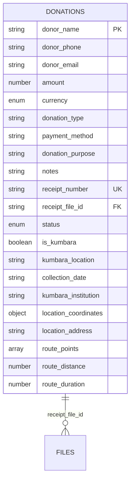
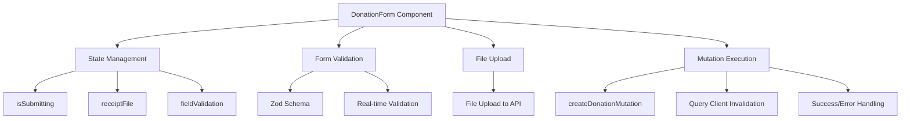
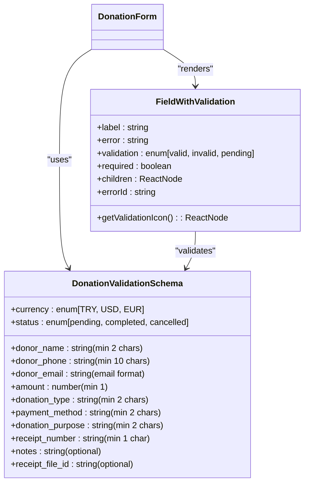
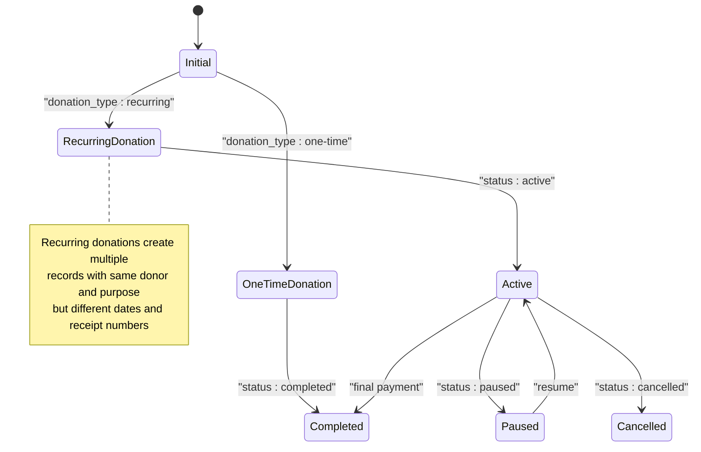
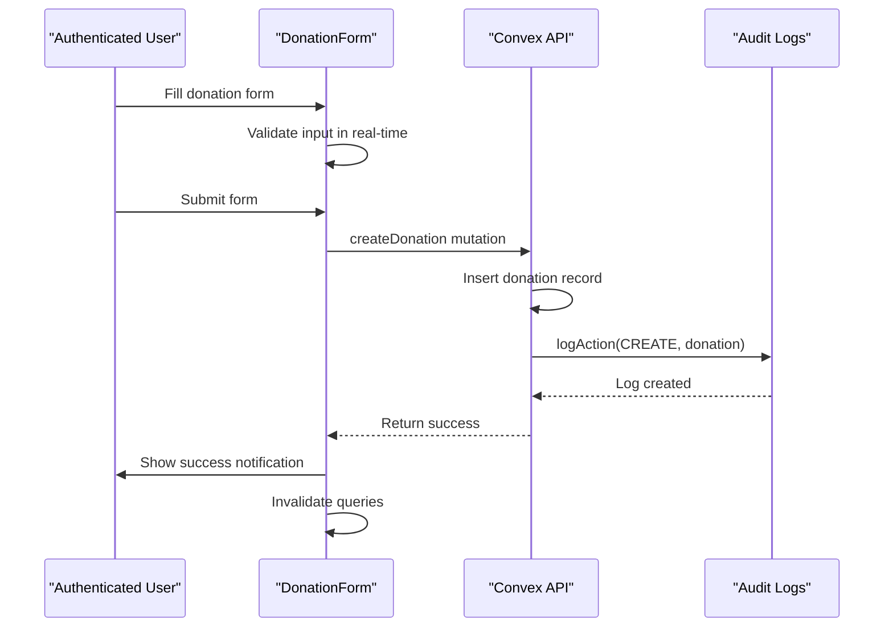
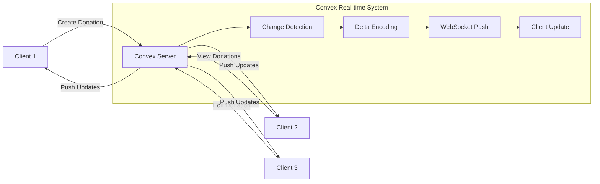
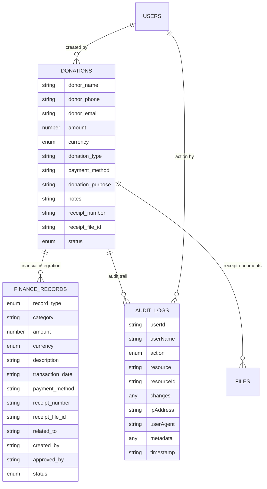
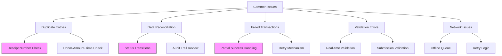

# Donation Tracking

<cite>
**Referenced Files in This Document**   
- [DonationForm.tsx](file://src/components/forms/DonationForm.tsx)
- [donations.ts](file://convex/donations.ts)
- [schema.ts](file://convex/schema.ts)
- [useFormMutation.ts](file://src/hooks/useFormMutation.ts)
- [audit_logs.ts](file://convex/audit_logs.ts)
</cite>

## Table of Contents

1. [Introduction](#introduction)
2. [Donation Data Model](#donation-data-model)
3. [DonationForm Component Implementation](#donationform-component-implementation)
4. [Form Validation with Zod](#form-validation-with-zod)
5. [Handling One-time and Recurring Donations](#handling-one-time-and-recurring-donations)
6. [User Authentication and Audit Trails](#user-authentication-and-audit-trails)
7. [Real-time Synchronization with Convex Subscriptions](#real-time-synchronization-with-convex-subscriptions)
8. [Integration with Financial Reporting and Audit Logs](#integration-with-financial-reporting-and-audit-logs)
9. [Common Issues and Error Handling](#common-issues-and-error-handling)
10. [Conclusion](#conclusion)

## Introduction

The Donation Tracking sub-module provides a comprehensive system for managing donations within the application. It enables users to create, edit, and view individual donations through the DonationForm component, which interfaces with Convex functions defined in donations.ts. The system supports various donation types, payment methods, and status transitions while maintaining data integrity through robust validation and audit mechanisms. This documentation details the implementation of the donation tracking functionality, including the data model, form validation, user authentication integration, real-time synchronization, and financial reporting integration.

**Section sources**

- [DonationForm.tsx](file://src/components/forms/DonationForm.tsx#L1-L532)
- [donations.ts](file://convex/donations.ts#L1-L149)

## Donation Data Model

The donation data model is defined in the Convex schema and includes comprehensive fields for tracking donation details, donor information, payment methods, and status transitions. The model supports both standard donations and Kumbara (money box) specific donations.

**Diagram sources**

- [schema.ts](file://convex/schema.ts#L168-L216)
- [donations.ts](file://convex/donations.ts#L77-L105)

The donation record includes the following key attributes:

- **Donor Information**: Name, phone, and email for donor identification
- **Financial Details**: Amount, currency (TRY, USD, EUR), and payment method
- **Donation Metadata**: Type, purpose, receipt number, and optional notes
- **Status Management**: Status field with values of 'pending', 'completed', or 'cancelled'
- **Kumbara-specific Fields**: Location, collection date, institution, and route information for money box donations
- **Document Reference**: File ID for uploaded receipt documents

The schema includes multiple indexes to optimize query performance:

- `by_status`: Index on donation status for filtering by status
- `by_donor_email`: Index on donor email for donor-specific queries
- `by_receipt_number`: Unique index on receipt number to prevent duplicates
- `by_is_kumbara`: Index to distinguish between standard and Kumbara donations
- `by_kumbara_location`: Index on Kumbara location for location-based queries

**Section sources**

- [schema.ts](file://convex/schema.ts#L168-L216)
- [donations.ts](file://convex/donations.ts#L4-L52)

## DonationForm Component Implementation

The DonationForm component provides a user interface for creating and editing donation records. It is implemented as a React component using the 'use client' directive, indicating it runs on the client side with React hooks for state management and form handling.

**Diagram sources**

- [DonationForm.tsx](file://src/components/forms/DonationForm.tsx#L98-L530)

The component implements the following key features:

- **Form State Management**: Uses useState hooks to manage submission state, receipt file selection, and field validation status
- **Real-time Validation**: Implements immediate feedback for form fields as users type, with visual indicators for valid, invalid, and pending validation states
- **File Upload Integration**: Handles receipt file uploads through a direct API endpoint before creating the donation record
- **Mutation Handling**: Uses React Query's useMutation hook to handle the creation of donation records with proper error handling and success notifications
- **Loading State**: Displays a loading overlay with spinner during submission to prevent duplicate submissions
- **Responsive Design**: Adapts layout for different screen sizes with grid-based form organization

The form is organized into logical sections:

1. Donor Information (name, phone, email)
2. Donation Details (amount, currency, receipt number)
3. Donation Classification (type, payment method, purpose)
4. Additional Information (notes, receipt file upload)

**Section sources**

- [DonationForm.tsx](file://src/components/forms/DonationForm.tsx#L98-L530)

## Form Validation with Zod

The DonationForm implements robust validation using the Zod library to ensure data integrity before submission. The validation schema is defined at the component level and enforces strict requirements for all required fields.

**Diagram sources**

- [DonationForm.tsx](file://src/components/forms/DonationForm.tsx#L27-L40)
- [DonationForm.tsx](file://src/components/forms/DonationForm.tsx#L59-L97)

The validation implementation includes:

- **Schema Definition**: A comprehensive Zod schema that defines type safety and validation rules for all donation fields
- **Real-time Validation**: Field-level validation that triggers as users type, providing immediate feedback on input validity
- **Visual Feedback**: Custom validation indicators using icons (checkmark for valid, X for invalid) alongside error messages
- **Accessibility Features**: Proper ARIA attributes for screen readers, including aria-describedby, aria-invalid, and role attributes
- **Turkish Locale Formatting**: Special handling for Turkish phone numbers and currency formatting to match local conventions
- **Error Messages**: User-friendly error messages in Turkish that clearly explain validation requirements

The validation process occurs in two stages:

1. **Immediate Feedback**: As users type, individual fields are validated asynchronously and visual indicators are updated
2. **Final Validation**: When the form is submitted, the entire form is validated using react-hook-form's built-in validation before the mutation is executed

**Section sources**

- [DonationForm.tsx](file://src/components/forms/DonationForm.tsx#L27-L40)
- [DonationForm.tsx](file://src/components/forms/DonationForm.tsx#L108-L114)

## Handling One-time and Recurring Donations

The donation system is designed to handle both one-time and recurring donations through the same data model and form interface, with differentiation based on the donation_type field and additional metadata.

**Diagram sources**

- [donations.ts](file://convex/donations.ts#L77-L105)
- [schema.ts](file://convex/schema.ts#L168-L216)

The implementation handles different donation types as follows:

- **One-time Donations**: Standard donations with a single transaction and completion status
- **Recurring Donations**: Implemented as a series of individual donation records with the same donor and purpose but different dates and receipt numbers
- **Kumbara Donations**: Special type of donation collected from money boxes, with additional location and route information

The system supports various payment methods including:

- Cash (Nakit)
- Credit Card (Kredi Kartı)
- Bank Transfer (Banka Transferi)
- Wire Transfer (Havale)
- EFT
- Check (Çek)

For recurring donations, the system does not have automated scheduling but allows manual creation of multiple donation records with consistent donor information and purpose, enabling organizations to manage recurring giving programs while maintaining complete control over each transaction.

**Section sources**

- [donations.ts](file://convex/donations.ts#L85-L86)
- [schema.ts](file://convex/schema.ts#L180-L181)

## User Authentication and Audit Trails

The donation system integrates with user authentication to maintain audit trails for all donation operations. Every donation record is associated with the creating user through the audit logging system, ensuring accountability and traceability.

**Diagram sources**

- [donations.ts](file://convex/donations.ts#L107-L108)
- [audit_logs.ts](file://convex/audit_logs.ts#L12-L34)
- [DonationForm.tsx](file://src/components/forms/DonationForm.tsx#L132-L138)

The audit trail implementation includes:

- **Action Logging**: Every create, update, and delete operation is logged with the user ID, action type, resource, and timestamp
- **IP Address Tracking**: The IP address of the user performing the action is recorded for security auditing
- **User Agent Information**: Browser and device information is captured for forensic analysis
- **Change Tracking**: For update operations, the changes made are recorded in the audit log
- **Resource Identification**: Each log entry includes the specific resource ID (donation ID) for precise tracking

When a donation is created, the system automatically logs a CREATE action in the audit_logs collection with details including:

- User ID and name of the creating user
- Action type (CREATE)
- Resource type ('donations')
- Resource ID (the newly created donation ID)
- Timestamp of the action
- IP address and user agent of the request

This comprehensive audit trail enables organizations to track all donation activities, investigate discrepancies, and maintain compliance with financial regulations.

**Section sources**

- [audit_logs.ts](file://convex/audit_logs.ts#L12-L34)
- [donations.ts](file://convex/donations.ts#L107-L108)

## Real-time Synchronization with Convex Subscriptions

The donation tracking system leverages Convex's real-time capabilities to ensure immediate synchronization of donation records across all connected clients. This enables multiple users to view and work with the most current donation data without manual refreshing.

**Diagram sources**

- [DonationForm.tsx](file://src/components/forms/DonationForm.tsx#L136-L137)
- [donations.ts](file://convex/donations.ts#L107-L108)

The real-time synchronization is implemented through the following mechanisms:

- **Query Invalidation**: After a successful donation creation or update, the component invalidates the 'donations' and 'dashboard-metrics' query keys, triggering automatic refetching of data across all components that use these queries
- **Convex Subscriptions**: The underlying Convex framework automatically establishes real-time subscriptions for queries, pushing updates to clients when data changes
- **Optimistic Updates**: While not explicitly implemented in this component, the React Query mutation system supports optimistic updates for improved user experience
- **Error Recovery**: If a mutation fails, the system maintains the previous state and displays an error message, preventing data inconsistency

The system uses React Query's useQuery hook in various components (such as the donations list page) to subscribe to donation data. When a new donation is created through the DonationForm, the query invalidation triggers all subscribed components to refresh their data from the server, ensuring consistency across the application.

**Section sources**

- [DonationForm.tsx](file://src/components/forms/DonationForm.tsx#L136-L137)
- [donations.ts](file://convex/donations.ts#L107-L108)

## Integration with Financial Reporting and Audit Logs

The donation system is tightly integrated with financial reporting and audit logging systems to ensure data consistency and compliance. Donation records are automatically synchronized with financial records and audit trails, providing a comprehensive view of financial activities.

**Diagram sources**

- [schema.ts](file://convex/schema.ts#L168-L216)
- [schema.ts](file://convex/schema.ts#L547-L577)
- [audit_logs.ts](file://convex/audit_logs.ts#L6-L34)

Key integration points include:

- **Financial Record Synchronization**: While not directly implemented in the donation functions, the data model is designed to support synchronization with the finance_records collection, sharing fields like amount, currency, payment_method, receipt_number, and receipt_file_id
- **Audit Log Correlation**: Every donation operation is logged in the audit_logs collection, creating a complete trail of all changes
- **Document Management**: Receipt files are stored in the files collection, with references maintained in both donations and potential financial records
- **User Accountability**: Both donation records and audit logs reference the creating user, ensuring accountability

The system supports financial reporting through:

- **Standardized Data Structure**: Consistent field names and types across related collections
- **Unique Identifiers**: Use of receipt numbers as unique identifiers that can be referenced across systems
- **Status Tracking**: Donation status field that can be mapped to financial record status for reconciliation
- **Timestamps**: Creation timestamps that enable chronological reporting and reconciliation

**Section sources**

- [schema.ts](file://convex/schema.ts#L168-L216)
- [schema.ts](file://convex/schema.ts#L547-L577)
- [audit_logs.ts](file://convex/audit_logs.ts#L6-L34)

## Common Issues and Error Handling

The donation tracking system implements comprehensive error handling to address common issues such as duplicate entries, data reconciliation, and failed transactions. The system provides clear feedback to users and maintains data integrity through validation and transaction management.

**Diagram sources**

- [donations.ts](file://convex/donations.ts#L64-L73)
- [DonationForm.tsx](file://src/components/forms/DonationForm.tsx#L162-L169)
- [DonationForm.tsx](file://src/components/forms/DonationForm.tsx#L140-L142)

The system addresses the following common issues:

### Duplicate Entries

The system prevents duplicate donations through multiple mechanisms:

- **Receipt Number Uniqueness**: The by_receipt_number index in the schema prevents duplicate receipt numbers
- **Pre-submission Validation**: The form validates receipt numbers in real-time, checking for existing donations
- **Server-side Validation**: The Convex function checks for existing donations with the same receipt number before insertion

### Data Reconciliation

For data reconciliation issues, the system provides:

- **Audit Trail**: Complete history of all changes to donation records
- **Status Transitions**: Clear status tracking (pending, completed, cancelled) for reconciliation
- **Timestamps**: Creation and modification timestamps for chronological analysis
- **User Attribution**: Tracking of which user created or modified each record

### Failed Transactions

The system handles failed transactions gracefully:

- **Atomic Operations**: Donation creation and file upload are handled as separate steps to prevent partial failures
- **File Upload Resilience**: If file upload fails, the donation is still created without the receipt, with a warning to the user
- **Error Recovery**: Clear error messages guide users on how to resolve issues and retry
- **Transaction Integrity**: The system ensures that either both the donation and file are created, or neither, maintaining data consistency

### Error Handling Implementation

The error handling is implemented at multiple levels:

- **Client-side**: Real-time validation prevents many errors before submission
- **Form Submission**: Comprehensive validation with user-friendly error messages
- **Network Level**: Handling of network failures with appropriate error messages
- **Server-side**: Robust error handling in Convex functions with proper error propagation

The DonationForm component specifically handles errors by:

- Displaying inline error messages for invalid fields
- Showing toast notifications for submission errors
- Maintaining form state during errors to allow correction
- Providing clear instructions for resolving common issues

**Section sources**

- [donations.ts](file://convex/donations.ts#L64-L73)
- [DonationForm.tsx](file://src/components/forms/DonationForm.tsx#L162-L169)
- [DonationForm.tsx](file://src/components/forms/DonationForm.tsx#L140-L142)

## Conclusion

The Donation Tracking sub-module provides a robust, secure, and user-friendly system for managing donations within the application. Through the integration of the DonationForm component with Convex backend functions, the system enables efficient creation, editing, and viewing of donation records while maintaining data integrity and compliance.

Key strengths of the implementation include:

- **Comprehensive Data Model**: Well-structured schema that captures all necessary donation details, including specialized fields for Kumbara donations
- **Robust Validation**: Multi-layered validation using Zod for type safety and data integrity
- **Real-time Synchronization**: Seamless data updates across clients through Convex subscriptions and React Query invalidation
- **Audit Trail Integration**: Complete tracking of all donation operations for accountability and compliance
- **Error Resilience**: Graceful handling of common issues like duplicate entries, failed transactions, and network errors

The system effectively balances user experience with data integrity, providing immediate feedback while ensuring that all donations are properly recorded and tracked. The integration with financial reporting systems and audit logs ensures that donation data can be reliably used for accounting, reporting, and compliance purposes.

Future enhancements could include automated recurring donation scheduling, enhanced reconciliation tools, and more sophisticated duplicate detection algorithms, but the current implementation provides a solid foundation for effective donation management.

**Section sources**

- [DonationForm.tsx](file://src/components/forms/DonationForm.tsx#L1-L532)
- [donations.ts](file://convex/donations.ts#L1-L149)
- [schema.ts](file://convex/schema.ts#L168-L216)
