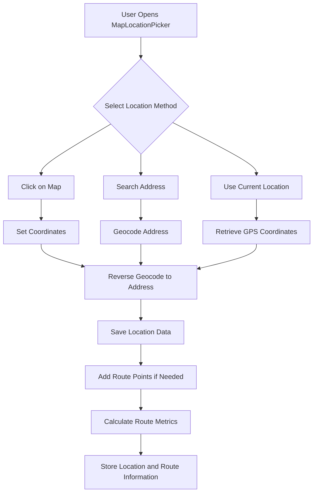
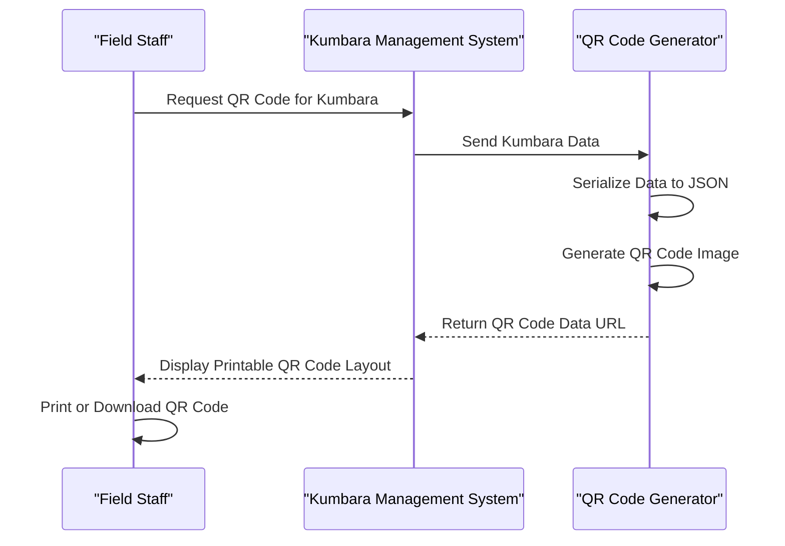
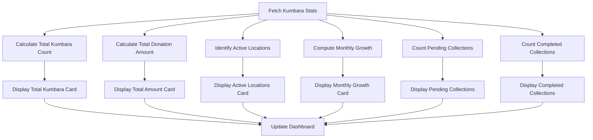

# Kumbara Management

<cite>
**Referenced Files in This Document**   
- [kumbara.ts](file://src/lib/validations/kumbara.ts)
- [KumbaraForm.tsx](file://src/components/kumbara/KumbaraForm.tsx)
- [KumbaraList.tsx](file://src/components/kumbara/KumbaraList.tsx)
- [KumbaraPrintQR.tsx](file://src/components/kumbara/KumbaraPrintQR.tsx)
- [MapLocationPicker.tsx](file://src/components/kumbara/MapLocationPicker.tsx)
- [KumbaraStats.tsx](file://src/components/kumbara/KumbaraStats.tsx)
- [route.ts](file://src/app/api/kumbara/route.ts)
- [schema.ts](file://convex/schema.ts)
</cite>

## Table of Contents

1. [Introduction](#introduction)
2. [Workflow for Creating and Managing Physical Donation Containers](#workflow-for-creating-and-managing-physical-donation-containers)
3. [Location Tracking via MapLocationPicker](#location-tracking-via-maplocationpicker)
4. [QR Code Generation with KumbaraPrintQR](#qr-code-generation-with-kumbaraprintqr)
5. [Status Monitoring through KumbaraStats](#status-monitoring-through-kumbarastats)
6. [Backend Logic in kumbara.ts](#backend-logic-in-kumbarats)
7. [Integration with Donation Records and Financial Dashboards](#integration-with-donation-records-and-financial-dashboards)
8. [Security Measures and Auditability](#security-measures-and-auditability)
9. [Operational Use Cases](#operational-use-cases)
10. [Conclusion](#conclusion)

## Introduction

The Kumbara (Piggy Bank) Management sub-module is designed to streamline the creation, tracking, and management of physical donation containers within the organization. This system enables efficient handling of donation collection events, balance updates, and reconciliation processes. The module integrates location tracking via MapLocationPicker, QR code generation for identification, and real-time status monitoring through comprehensive statistics. It ensures secure and auditable operations while supporting field collection processes and inventory management of physical containers.

## Workflow for Creating and Managing Physical Donation Containers

The workflow for creating and managing physical donation containers begins with the KumbaraForm component, which captures essential details such as donor information, donation amount, currency, payment method, and container-specific data like location and institution. The form enforces validation rules defined in the `kumbaraCreateSchema` to ensure data integrity. Upon submission, the system creates a new Kumbara donation record in the database via the `/api/kumbara` endpoint.

The process includes:

- **Data Entry**: Users input donation details through a structured form with real-time validation.
- **File Upload**: Supporting documents can be attached during the creation process.
- **QR Code Generation**: A unique QR code is automatically generated upon successful creation, enabling easy identification and tracking.
- **Status Updates**: The donation status can be updated to "pending," "completed," or "cancelled" as the collection progresses.

This workflow ensures that all physical containers are properly documented and tracked throughout their lifecycle.

**Section sources**

- [KumbaraForm.tsx](file://src/components/kumbara/KumbaraForm.tsx#L46-L814)
- [kumbara.ts](file://src/lib/validations/kumbara.ts#L4-L76)

## Location Tracking via MapLocationPicker

The MapLocationPicker component facilitates precise location tracking for Kumbara containers using Google Maps integration. It allows users to set the container's location by clicking on the map or searching for an address. The component supports the addition of multiple route points, enabling the definition of collection routes with optimized waypoints.

Key features include:

- **Interactive Map**: Users can click on the map to set coordinates, which are then reverse-geocoded to obtain the address.
- **Route Planning**: Multiple route points can be added to define a collection path, with distance and duration metrics calculated.
- **Current Location Detection**: The system can retrieve the user's current GPS location for quick setup.
- **Address Search**: Users can search for specific addresses to pinpoint the container's location accurately.

This functionality ensures that each Kumbara container's location is precisely recorded, aiding in efficient field operations and route optimization.

**Diagram sources**

- [MapLocationPicker.tsx](file://src/components/kumbara/MapLocationPicker.tsx#L31-L470)

## QR Code Generation with KumbaraPrintQR

The KumbaraPrintQR component generates and manages QR codes for each Kumbara container, providing a quick and reliable way to identify and access container details. When a new Kumbara is created, the system automatically generates a QR code containing essential information such as the container ID, location, institution, collection date, amount, currency, and receipt number.

The QR code generation process involves:

- **Data Serialization**: Relevant container data is serialized into a JSON object.
- **QR Code Creation**: The JSON data is converted into a data URL using the QRCode library.
- **Printing and Downloading**: Users can print the QR code or download it as a PNG file for physical attachment to the container.

This feature enhances operational efficiency by allowing field staff to scan QR codes and instantly access container details, reducing manual data entry errors.

**Diagram sources**

- [KumbaraPrintQR.tsx](file://src/components/kumbara/KumbaraPrintQR.tsx#L23-L161)
- [route.ts](file://src/app/api/kumbara/route.ts#L29-L63)

## Status Monitoring through KumbaraStats

The KumbaraStats component provides real-time monitoring of Kumbara container performance through a set of key metrics displayed in a dashboard format. These metrics include the total number of containers, total donation amount, active locations, monthly collection trends, and the status of pending and completed collections.

The statistics are fetched from the `/api/kumbara/stats` endpoint, which calculates:

- **Total Kumbara Count**: The number of registered containers.
- **Total Donation Amount**: The cumulative value of all donations.
- **Active Locations**: The number of unique locations where containers are placed.
- **Monthly Growth**: The percentage change in monthly collections compared to the previous month.
- **Collection Status**: The count of pending and completed collections.

These insights help managers make informed decisions about resource allocation and collection strategies.

**Diagram sources**

- [KumbaraStats.tsx](file://src/components/kumbara/KumbaraStats.tsx#L18-L171)
- [route.ts](file://src/app/api/kumbara/route.ts#L276-L327)

## Backend Logic in kumbara.ts

The backend logic for the Kumbara Management sub-module is implemented in the `kumbara.ts` file, which defines validation schemas and helper functions for processing donation data. The primary schema, `kumbaraCreateSchema`, specifies the structure and validation rules for creating new Kumbara donations, ensuring that all required fields are present and correctly formatted.

Key aspects of the backend logic include:

- **Validation Schemas**: The `kumbaraCreateSchema` and `kumbaraUpdateSchema` enforce data integrity by validating input against predefined rules.
- **Helper Functions**: Functions like `validateKumbaraCreate` and `validateKumbaraUpdate` provide a consistent interface for validating donation data before it is stored in the database.
- **Data Normalization**: Incoming data is normalized to ensure consistency, such as setting default values for optional fields and converting data types as needed.

This robust backend logic ensures that all Kumbara-related operations are secure, reliable, and maintain data integrity.

**Section sources**

- [kumbara.ts](file://src/lib/validations/kumbara.ts#L4-L217)

## Integration with Donation Records and Financial Dashboards

The Kumbara Management sub-module seamlessly integrates with the organization's donation records and financial dashboards. Each Kumbara donation is stored as a document in the `donations` collection, with the `is_kumbara` flag set to `true` to distinguish it from other types of donations. This allows for easy filtering and reporting on Kumbara-specific data.

Integration points include:

- **Donation Records**: Kumbara donations are linked to donor profiles and donation history, providing a complete view of each donor's contributions.
- **Financial Dashboards**: Aggregated Kumbara data is displayed in financial dashboards, showing trends, totals, and comparisons with other donation sources.
- **Reconciliation Processes**: The system supports reconciliation by matching Kumbara collections with bank deposits and other financial records.

This integration ensures that Kumbara donations are fully accounted for in the organization's financial reporting and analysis.

**Section sources**

- [schema.ts](file://convex/schema.ts#L181-L200)
- [KumbaraList.tsx](file://src/components/kumbara/KumbaraList.tsx#L74-L407)

## Security Measures and Auditability

The Kumbara Management sub-module implements several security measures to prevent unauthorized balance modifications and ensure auditability. Access to Kumbara data is controlled through role-based permissions, requiring module access verification for all API operations.

Security features include:

- **Authentication and Authorization**: The `requireModuleAccess` function ensures that only authorized users can create, update, or delete Kumbara donations.
- **CSRF Protection**: Cross-Site Request Forgery (CSRF) tokens are used to protect against unauthorized requests.
- **Input Validation**: All incoming data is validated against strict schemas to prevent injection attacks and data corruption.
- **Audit Logs**: Every operation on a Kumbara donation is logged, including creation, updates, and deletions, providing a complete audit trail.

These measures ensure that the system remains secure and compliant with organizational policies.

**Section sources**

- [route.ts](file://src/app/api/kumbara/route.ts#L6-L158)
- [route.ts](file://src/app/api/kumbara/[id]/route.ts#L7-L209)

## Operational Use Cases

The Kumbara Management sub-module supports various operational use cases, including field collection processes and inventory management of physical containers.

### Field Collection Processes

Field staff use the system to plan and execute collection routes, with the MapLocationPicker component helping them navigate to each container's location. Upon arrival, they scan the QR code to access the container's details and update its status to "completed." The system records the collection date and any relevant notes, ensuring accurate tracking of each collection event.

### Inventory Management

The system maintains an inventory of all physical containers, including their current status, location, and last collection date. Managers can use the KumbaraList component to view and manage this inventory, filtering by status, location, or date range. This enables efficient planning of future collections and timely replacement of damaged or lost containers.

These use cases demonstrate the system's versatility in supporting both day-to-day operations and strategic planning.

**Section sources**

- [KumbaraList.tsx](file://src/components/kumbara/KumbaraList.tsx#L74-L407)
- [MapLocationPicker.tsx](file://src/components/kumbara/MapLocationPicker.tsx#L31-L470)

## Conclusion

The Kumbara Management sub-module provides a comprehensive solution for creating, tracking, and managing physical donation containers. By integrating location tracking, QR code generation, and real-time status monitoring, the system enhances operational efficiency and ensures data integrity. Its robust backend logic, secure architecture, and seamless integration with financial systems make it a valuable tool for organizations relying on Kumbara donations. With support for various operational use cases, the module empowers field staff and managers alike to optimize collection processes and maintain accurate records.
