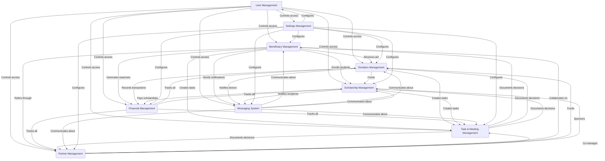

# Feature Modules

<cite>
**Referenced Files in This Document**   
- [beneficiaries.ts](file://convex/beneficiaries.ts)
- [donations.ts](file://convex/donations.ts)
- [scholarships.ts](file://convex/scholarships.ts)
- [finance_records.ts](file://convex/finance_records.ts)
- [tasks.ts](file://convex/tasks.ts)
- [meetings.ts](file://convex/meetings.ts)
- [users.ts](file://convex/users.ts)
- [messages.ts](file://convex/messages.ts)
- [partners.ts](file://convex/partners.ts)
- [system_settings.ts](file://convex/system_settings.ts)
- [navigation.ts](file://src/config/navigation.ts)
- [beneficiary.ts](file://src/types/beneficiary.ts)
- [scholarship.ts](file://src/types/scholarship.ts)
- [permissions.ts](file://src/types/permissions.ts)
- [page.tsx](file://src/app/(dashboard)/yardim/ihtiyac-sahipleri/page.tsx)
- [page.tsx](file://src/app/(dashboard)/bagis/liste/page.tsx)
- [page.tsx](file://src/app/(dashboard)/burs/ogrenciler/page.tsx)
- [page.tsx](file://src/app/(dashboard)/fon/gelir-gider/page.tsx)
- [page.tsx](file://src/app/(dashboard)/is/gorevler/page.tsx)
- [page.tsx](file://src/app/(dashboard)/is/toplantilar/page.tsx)
- [page.tsx](file://src/app/(dashboard)/kullanici/page.tsx)
- [page.tsx](file://src/app/(dashboard)/mesaj/kurum-ici/page.tsx)
- [page.tsx](file://src/app/(dashboard)/partner/liste/page.tsx)
- [page.tsx](file://src/app/(dashboard)/settings/page.tsx)
</cite>

## Table of Contents

1. [Beneficiary Management](#beneficiary-management)
2. [Donation Management](#donation-management)
3. [Scholarship Management](#scholarship-management)
4. [Financial Management](#financial-management)
5. [Task & Meeting Management](#task--meeting-management)
6. [User Management](#user-management)
7. [Messaging System](#messaging-system)
8. [Partner Management](#partner-management)
9. [Settings Management](#settings-management)
10. [Module Relationships](#module-relationships)

## Beneficiary Management

The Beneficiary Management module serves as the central system for tracking and supporting individuals and families in need. This module provides comprehensive tools for registering beneficiaries, managing their personal information, tracking aid distribution, and maintaining detailed records of their circumstances.

The system supports multiple beneficiary categories including orphan families, refugee families, individuals in need, orphan children, refugee children, and youth groups. Each beneficiary record contains extensive demographic information, family composition, educational status, employment situation, and specific needs assessment. The module includes specialized forms for different beneficiary types and maintains a complete history of all interactions and support provided.

Users can search, filter, and sort beneficiaries based on various criteria such as category, location, status, and specific needs. The interface provides quick access to related records including dependents, documents, and communication logs. Administrators can generate reports on beneficiary demographics and track the impact of aid programs over time.

**Section sources**

- [beneficiaries.ts](file://convex/beneficiaries.ts)
- [beneficiary.ts](file://src/types/beneficiary.ts)
- [page.tsx](<file://src/app/(dashboard)/yardim/ihtiyac-sahipleri/page.tsx>)
- [navigation.ts](file://src/config/navigation.ts#L66-L86)

## Donation Management

The Donation Management module handles all aspects of donation processing, from individual contributions to organized fundraising campaigns. This comprehensive system tracks donor information, donation amounts, payment methods, and donation purposes while providing tools for receipt generation and tax documentation.

The module includes specialized functionality for "kumbara" (piggy bank) campaigns, which are physical donation containers placed in strategic locations. Each kumbara has GPS tracking capabilities, allowing the organization to monitor collection routes and optimize collection schedules. The system generates QR codes for each kumbara, enabling donors to scan and contribute digitally while maintaining the traditional physical collection method.

Donation records include detailed information such as donor name, contact information, amount, currency, payment method, donation purpose, and receipt details. The system supports multiple currencies (TRY, USD, EUR) and various payment methods including cash, bank transfer, credit card, and digital payments. Administrators can view donation trends, generate financial reports, and track the success of specific fundraising campaigns.

**Section sources**

- [donations.ts](file://convex/donations.ts)
- [page.tsx](<file://src/app/(dashboard)/bagis/liste/page.tsx>)
- [navigation.ts](file://src/config/navigation.ts#L48-L63)

## Scholarship Management

The Scholarship Management module provides a complete solution for administering educational support programs. This system manages scholarship applications, student records, payment schedules, and academic progress tracking for various scholarship types including academic merit, need-based, orphan, special needs, refugee, disaster victim, and talent-based scholarships.

The application process includes multiple stages: draft, submitted, under review, approved, rejected, waitlist, withdrawn, and cancelled. Each application contains detailed information about the student's academic performance, financial situation, family circumstances, and educational goals. The system supports document uploads for transcripts, identification, and financial statements.

For approved scholarships, the system tracks payment status (pending, processing, paid, failed, suspended) and student status (active, graduated, suspended, dropped out, transferred). Administrators can monitor academic progress, disburse funds according to schedule, and maintain communication with scholarship recipients. The module also includes reporting tools to evaluate the effectiveness of scholarship programs and demonstrate impact to stakeholders.

**Section sources**

- [scholarships.ts](file://convex/scholarships.ts)
- [scholarship.ts](file://src/types/scholarship.ts)
- [page.tsx](<file://src/app/(dashboard)/burs/ogrenciler/page.tsx>)
- [navigation.ts](file://src/config/navigation.ts#L88-L99)

## Financial Management

The Financial Management module provides comprehensive tools for tracking all financial transactions and maintaining accurate accounting records. This system handles both income and expense tracking, budget management, and financial reporting to ensure transparency and accountability in all financial operations.

Each financial record includes essential details such as transaction type (income or expense), category, amount, currency, description, transaction date, payment method, receipt information, and approval status. The system supports multiple currencies (TRY, USD, EUR) and various payment methods including cash, bank transfer, credit card, and digital payments. All transactions require approval before being finalized in the financial records.

The module includes a financial dashboard that provides real-time insights into the organization's financial health, including total income, expenses, net balance, and pending transactions. Administrators can generate detailed financial reports, track cash flow, and monitor budget adherence. The system also includes tools for managing bank accounts associated with beneficiaries and tracking kumbara collection amounts.

**Section sources**

- [finance_records.ts](file://convex/finance_records.ts)
- [page.tsx](<file://src/app/(dashboard)/fon/gelir-gider/page.tsx>)
- [navigation.ts](file://src/config/navigation.ts#L101-L117)

## Task & Meeting Management

The Task & Meeting Management module provides a comprehensive workflow system for organizing team activities, tracking decisions, and ensuring accountability. This integrated system connects meeting planning with task assignment and progress tracking to ensure that decisions are implemented effectively.

The meeting management component allows users to schedule meetings, set agendas, record minutes, and document decisions. Meetings can be categorized by type (board, committee, general) and have designated organizers and participants. The system maintains a complete history of all meetings and their outcomes, making it easy to track organizational decisions over time.

The task management component converts meeting decisions into actionable items with assigned owners, deadlines, and priority levels. Tasks can be tracked through various statuses (pending, in progress, completed, cancelled) and are displayed in a Kanban board interface for visual workflow management. Users receive notifications about upcoming deadlines and can update task progress in real-time. The system also includes a notification center to keep team members informed about important workflow events.

**Section sources**

- [tasks.ts](file://convex/tasks.ts)
- [meetings.ts](file://convex/meetings.ts)
- [page.tsx](<file://src/app/(dashboard)/is/gorevler/page.tsx>)
- [page.tsx](<file://src/app/(dashboard)/is/toplantilar/page.tsx>)
- [navigation.ts](file://src/config/navigation.ts#L131-L147)

## User Management

The User Management module provides comprehensive tools for administering system users, roles, and permissions. This security-critical component ensures that users have appropriate access to system functionality based on their responsibilities within the organization.

The system implements role-based access control (RBAC) with predefined permission levels including administrator, manager, member, and viewer. Each role has specific permissions for different modules, ensuring that users can only access functionality relevant to their responsibilities. Administrators can create new users, assign roles, manage permissions, and deactivate accounts as needed.

The module includes an audit trail that records all user activities, including login attempts, data modifications, and permission changes. This provides accountability and supports compliance with data protection regulations (KVKK/GDPR). The interface displays user information including name, email, role, status, and last activity date, with filtering and search capabilities for managing large user bases.

**Section sources**

- [users.ts](file://convex/users.ts)
- [page.tsx](<file://src/app/(dashboard)/kullanici/page.tsx>)
- [navigation.ts](file://src/config/navigation.ts#L169-L187)

## Messaging System

The Messaging System module provides integrated communication tools for both internal team collaboration and external outreach. This comprehensive system supports multiple communication channels including internal messaging, email, and SMS, ensuring that the organization can effectively communicate with both team members and beneficiaries.

The internal messaging component allows team members to exchange messages, share documents, and collaborate on cases. Messages can be organized by topic or project, and users receive notifications about new messages. The system maintains a complete message history, making it easy to track communication about specific beneficiaries or projects.

The external messaging component supports bulk communication for announcements, reminders, and updates. Administrators can send targeted messages to specific beneficiary groups, donors, or volunteers. The system tracks message delivery status and provides reporting on engagement metrics. All communications are logged in the system for accountability and can be linked to specific beneficiaries or cases.

**Section sources**

- [messages.ts](file://convex/messages.ts)
- [page.tsx](<file://src/app/(dashboard)/mesaj/kurum-ici/page.tsx>)
- [navigation.ts](file://src/config/navigation.ts#L118-L129)

## Partner Management

The Partner Management module facilitates collaboration with external organizations and institutions. This system maintains comprehensive records of partner organizations, including contact information, partnership type, areas of collaboration, and contribution history.

Partners can be categorized by type (institutional, corporate, governmental, NGO) and partnership level (strategic, operational, project-based). The system tracks all interactions with partners, including meetings, agreements, and joint activities. Administrators can monitor the value of contributions from each partner and evaluate the effectiveness of partnerships.

The module supports document management for partnership agreements, memorandums of understanding, and other legal documents. It also includes communication tools for maintaining regular contact with partners and coordinating joint initiatives. Reporting features allow the organization to demonstrate the impact of partnerships to stakeholders and identify opportunities for expanding collaboration.

**Section sources**

- [partners.ts](file://convex/partners.ts)
- [page.tsx](<file://src/app/(dashboard)/partner/liste/page.tsx>)
- [navigation.ts](file://src/config/navigation.ts#L148-L157)

## Settings Management

The Settings Management module provides centralized configuration for the entire system. This administrative component allows authorized users to customize system behavior, manage organizational information, and configure various operational parameters.

The system settings are organized into categories including organization, email, notifications, system, and security. The organization settings allow administrators to configure basic information such as organization name, address, contact details, and logo. Email settings configure SMTP parameters for outgoing email notifications and communications.

Notification settings allow users to customize their alert preferences, including email, push, and SMS notifications for various system events. System settings include parameters such as session timeout, maximum login attempts, and maintenance mode. Security settings control authentication requirements, password policies, and two-factor authentication.

**Section sources**

- [system_settings.ts](file://convex/system_settings.ts)
- [page.tsx](<file://src/app/(dashboard)/settings/page.tsx>)
- [navigation.ts](file://src/config/navigation.ts#L189-L197)

## Module Relationships

The feature modules in Kafkasder-panel are designed to work together as an integrated ecosystem, with data and functionality flowing between modules to support comprehensive organizational management.

The Beneficiary Management module serves as a central hub, with other modules connecting to beneficiary records. Donation Management links donations to specific beneficiaries, allowing for targeted fundraising and transparent reporting of aid distribution. Scholarship Management creates student records that are linked to beneficiary profiles, enabling educational support for identified individuals in need.

Financial Management provides the accounting backbone for all monetary transactions, including donations, scholarship payments, and operational expenses. Task & Meeting Management creates workflow connections between modules by converting decisions into actionable tasks that may involve beneficiaries, donors, or partners.

User Management controls access across all modules, ensuring that users can only interact with data and functionality appropriate to their roles. The Messaging System facilitates communication about records in all other modules, allowing team members to discuss beneficiaries, donations, scholarships, and tasks.

Partner Management creates external connections that can influence activities in other modules, such as corporate partners funding specific scholarship programs or institutional partners referring beneficiaries to the organization.

**Diagram sources**

- [navigation.ts](file://src/config/navigation.ts)
- [permissions.ts](file://src/types/permissions.ts)

**Section sources**

- [navigation.ts](file://src/config/navigation.ts)
- [permissions.ts](file://src/types/permissions.ts)
