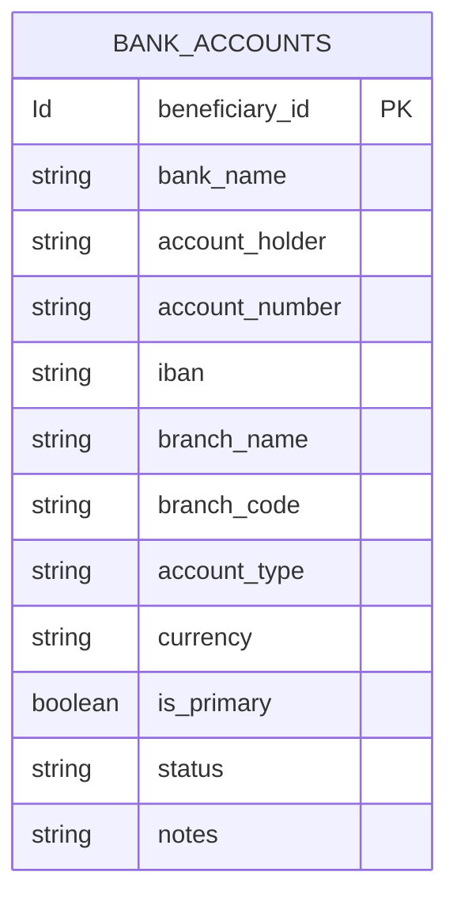
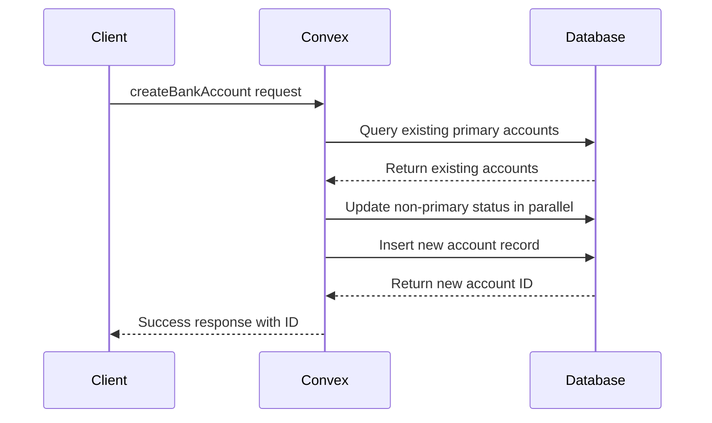
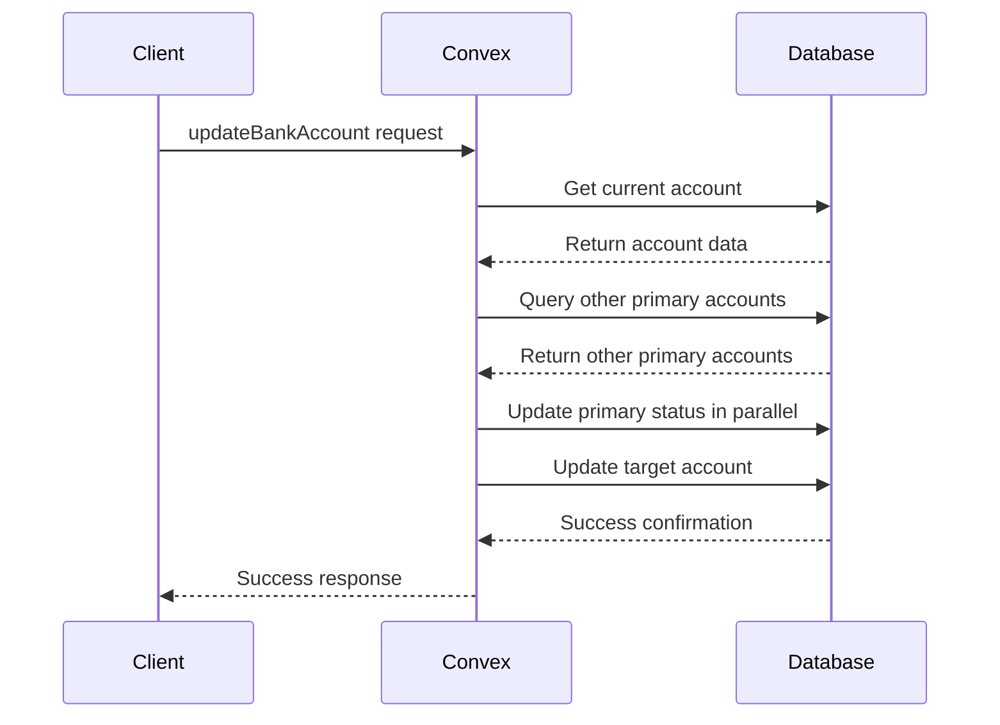
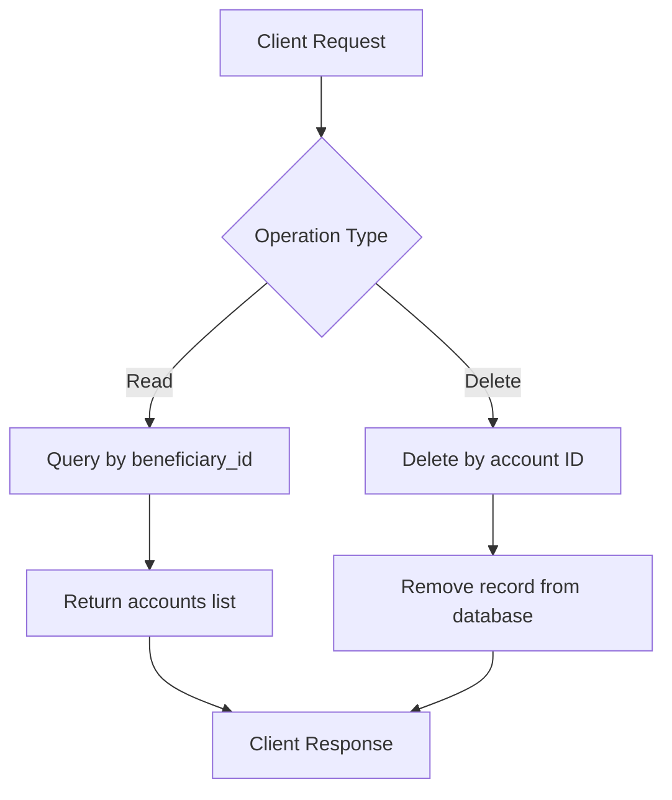
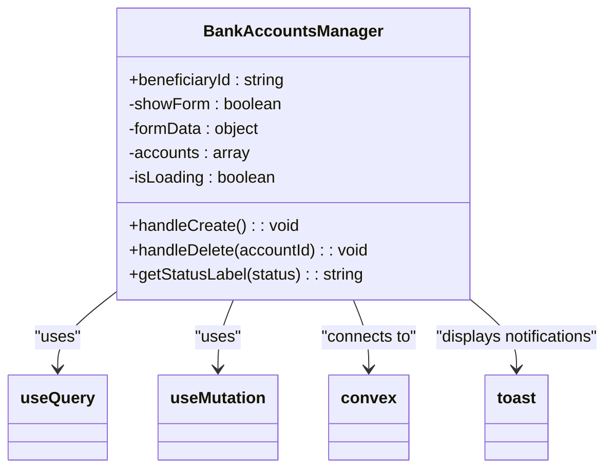
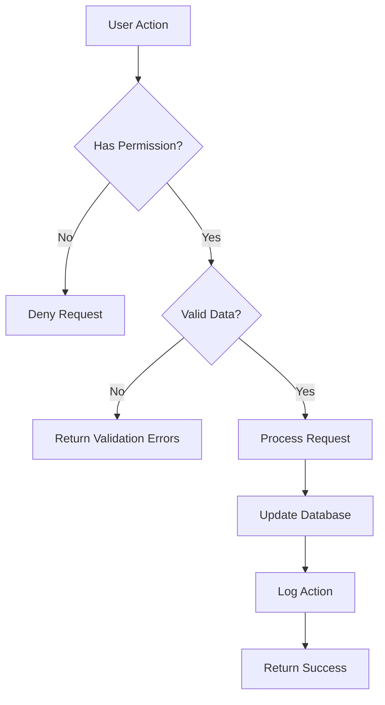
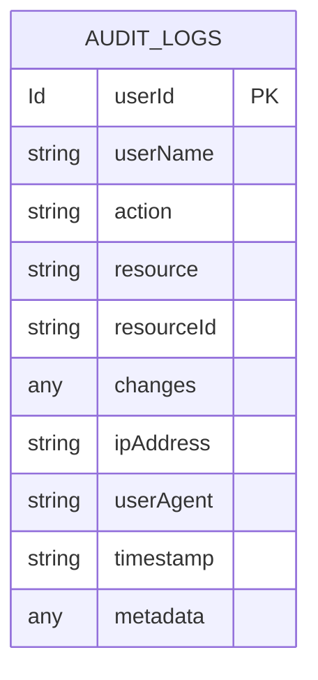

# Bank Accounts Management

<cite>
**Referenced Files in This Document**   
- [bank_accounts.ts](file://convex/bank_accounts.ts)
- [BankAccountsManager.tsx](file://src/components/bank-accounts/BankAccountsManager.tsx)
- [schema.ts](file://convex/schema.ts)
- [audit_logs.ts](file://convex/audit_logs.ts)
</cite>

## Table of Contents

1. [Introduction](#introduction)
2. [Bank Account Data Model](#bank-account-data-model)
3. [CRUD Operations](#crud-operations)
4. [BankAccountsManager Component](#bankaccountsmanager-component)
5. [Integration with Financial Records](#integration-with-financial-records)
6. [Multi-Currency Support](#multi-currency-support)
7. [Validation and Permissions](#validation-and-permissions)
8. [Audit Logging](#audit-logging)
9. [Troubleshooting and Best Practices](#troubleshooting-and-best-practices)

## Introduction

The Bank Accounts Management sub-feature provides a comprehensive system for managing beneficiary bank account information within the organization's financial ecosystem. This documentation details how bank accounts are modeled, the available operations for managing them, and their integration with other financial systems. The implementation ensures data accuracy, maintains audit trails, and supports multi-currency scenarios for international operations.

**Section sources**

- [bank_accounts.ts](file://convex/bank_accounts.ts#L1-L132)
- [BankAccountsManager.tsx](file://src/components/bank-accounts/BankAccountsManager.tsx#L1-L277)

## Bank Account Data Model

The bank account data model is designed to capture essential banking information for beneficiaries, including institution details, account specifications, and status tracking. The model is implemented as a Convex collection with specific fields and validation rules.

The core fields in the bank account model include:

- **beneficiary_id**: Reference to the beneficiary who owns the account
- **bank_name**: Name of the financial institution
- **account_holder**: Name of the person or entity holding the account
- **account_number**: The bank account number
- **iban**: International Bank Account Number (optional)
- **branch_name**: Name of the bank branch (optional)
- **branch_code**: Code of the bank branch (optional)
- **account_type**: Type of account (checking, savings, or other)
- **currency**: Currency of the account (TRY, USD, or EUR)
- **is_primary**: Boolean flag indicating if this is the primary account
- **status**: Current status of the account (active, inactive, or closed)
- **notes**: Additional information about the account

**Diagram sources**

- [schema.ts](file://convex/schema.ts#L862-L915)

## CRUD Operations

The bank_accounts Convex module provides a complete set of CRUD operations for managing bank account records. These operations are implemented as Convex queries and mutations, ensuring data consistency and proper error handling.

### Create Operation

The `createBankAccount` mutation creates a new bank account record for a beneficiary. When creating a primary account, the system automatically unsets the primary flag on any existing primary accounts for the same beneficiary to maintain data integrity.

**Diagram sources**

- [bank_accounts.ts](file://convex/bank_accounts.ts#L19-L69)

### Update Operation

The `updateBankAccount` mutation modifies existing bank account information. Special handling is implemented when updating the primary account status to ensure that only one primary account exists per beneficiary at any time.

**Diagram sources**

- [bank_accounts.ts](file://convex/bank_accounts.ts#L72-L118)

### Read and Delete Operations

The system provides `getBeneficiaryBankAccounts` query to retrieve all accounts for a specific beneficiary, and `deleteBankAccount` mutation to remove an account record from the system.

**Diagram sources**

- [bank_accounts.ts](file://convex/bank_accounts.ts#L4-L16)
- [bank_accounts.ts](file://convex/bank_accounts.ts#L121-L129)

## BankAccountsManager Component

The BankAccountsManager React component provides a user interface for managing beneficiary bank accounts. It integrates with the Convex backend through React Query hooks, enabling data fetching, mutation, and automatic cache invalidation.

The component implements the following key features:

- Form for creating new bank accounts with validation
- List view of existing accounts with status indicators
- Delete functionality with confirmation
- Real-time updates through query invalidation
- Loading states and error handling

**Diagram sources**

- [BankAccountsManager.tsx](file://src/components/bank-accounts/BankAccountsManager.tsx#L35-L275)

## Integration with Financial Records

Bank accounts are integrated with the organization's financial recording and reconciliation workflows. The system supports linking bank accounts to income and expense records, enabling accurate tracking of financial transactions.

When financial records are created, they can reference specific bank accounts, establishing a clear audit trail. The reconciliation process can then verify that transactions in the financial records match the corresponding bank account activity.

The integration points include:

- Linking donation records to specific bank accounts for deposit tracking
- Associating expense records with bank accounts for payment verification
- Reconciliation workflows that compare internal financial records with bank statements
- Reporting features that aggregate financial data by bank account

**Section sources**

- [finance_records.ts](file://convex/finance_records.ts#L1-L323)
- [bank_accounts.ts](file://convex/bank_accounts.ts#L1-L132)

## Multi-Currency Support

The system supports multi-currency scenarios through explicit currency designation in the bank account model. Each bank account is associated with a specific currency (TRY, USD, or EUR), which determines how transactions are recorded and reported.

When transactions occur across different currencies, the system handles currency conversion through the following mechanisms:

- Exchange rate configuration for currency conversion
- Automatic conversion during transaction recording
- Reporting that can aggregate across currencies using current exchange rates
- Display of balances in the account's native currency

The multi-currency support ensures accurate financial tracking for international operations and donations received in foreign currencies.

**Section sources**

- [bank_accounts.ts](file://convex/bank_accounts.ts#L29-L31)
- [finance_records.ts](file://convex/finance_records.ts#L60-L61)

## Validation and Permissions

The bank account management system implements comprehensive validation rules and permission controls to ensure data integrity and security.

### Validation Rules

The system enforces the following validation rules for bank account information:

- Required fields: beneficiaryId, bankName, accountHolder, accountNumber
- Currency validation: restricted to TRY, USD, or EUR
- Status validation: limited to active, inactive, or closed
- Account type validation: checking, savings, or other
- IBAN format validation (when provided)

### Permissions

Account modifications are protected by role-based access control:

- Only authorized staff members can create, update, or delete bank accounts
- Users can only modify accounts associated with beneficiaries they have access to
- Primary account changes require additional validation to prevent conflicts
- Sensitive operations are logged for audit purposes

**Diagram sources**

- [bank_accounts.ts](file://convex/bank_accounts.ts#L1-L132)
- [auth.ts](file://convex/auth.ts#L1-L50)

## Audit Logging

All modifications to bank account records are tracked through the system's audit logging mechanism. This provides a complete history of changes for compliance, troubleshooting, and accountability.

The audit logging system captures:

- User who performed the action
- Timestamp of the action
- Type of action (CREATE, UPDATE, DELETE)
- Resource affected (bank_accounts collection)
- Resource ID (specific account)
- Before and after values for updates
- IP address and user agent
- Additional metadata

The audit logs are stored in the audit_logs collection and can be queried for specific resources, users, or time periods. This enables detailed forensic analysis of any changes to bank account information.

**Diagram sources**

- [audit_logs.ts](file://convex/audit_logs.ts#L1-L178)
- [schema.ts](file://convex/schema.ts#L1179-L1220)

## Troubleshooting and Best Practices

This section provides guidance for troubleshooting common issues and maintaining data accuracy in the bank accounts management system.

### Troubleshooting Synchronization Issues

Common synchronization issues and their solutions include:

**Issue**: Account changes not reflecting in the UI

- **Solution**: Check network connectivity and verify that query invalidation is working properly. Clear the React Query cache if necessary.

**Issue**: Primary account conflicts

- **Solution**: Verify that the update operation correctly handles the primary account flag. Check for race conditions in concurrent updates.

**Issue**: Data inconsistency between UI and database

- **Solution**: Verify that all mutation operations properly invalidate the relevant queries. Check for caching issues in the Convex client.

### Best Practices for Data Accuracy

To maintain data accuracy across linked financial records:

1. **Consistent Data Entry**: Ensure all bank account information is entered completely and accurately, including IBAN when available.

2. **Regular Reconciliation**: Perform regular reconciliation between internal financial records and actual bank statements.

3. **Status Management**: Keep account statuses up to date, especially when accounts are closed or become inactive.

4. **Primary Account Designation**: Carefully manage primary account designations to ensure funds are directed to the correct account.

5. **Audit Trail Maintenance**: Regularly review audit logs to detect and correct any unauthorized or erroneous changes.

6. **Data Validation**: Implement client-side validation to catch errors before they reach the server, reducing round trips.

7. **Backup Procedures**: Regularly backup bank account data as part of the organization's data protection strategy.

**Section sources**

- [bank_accounts.ts](file://convex/bank_accounts.ts#L1-L132)
- [BankAccountsManager.tsx](file://src/components/bank-accounts/BankAccountsManager.tsx#L1-L277)
- [audit_logs.ts](file://convex/audit_logs.ts#L1-L178)
