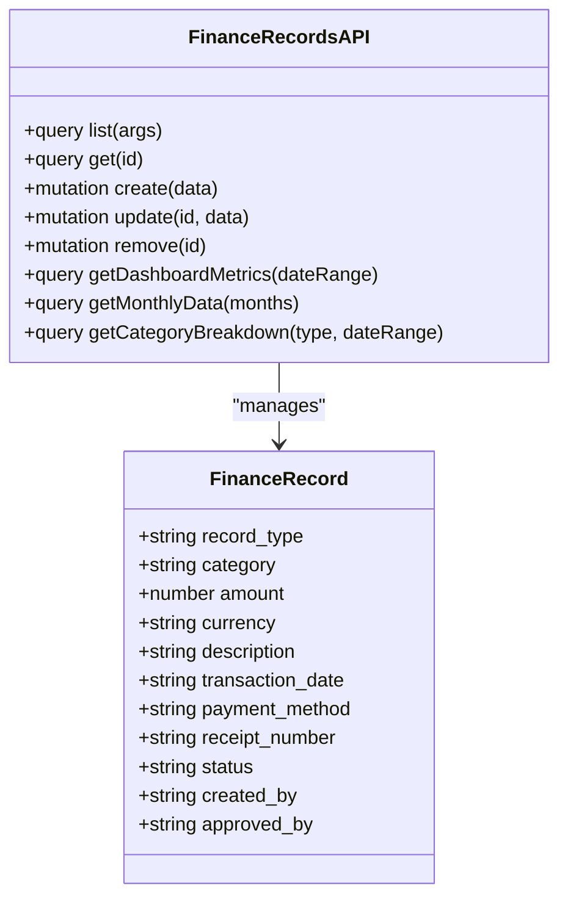
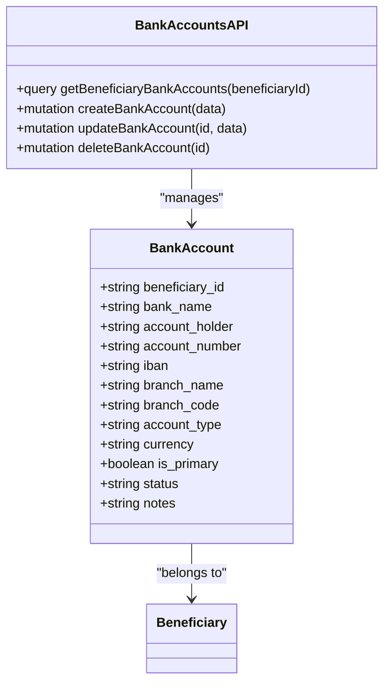
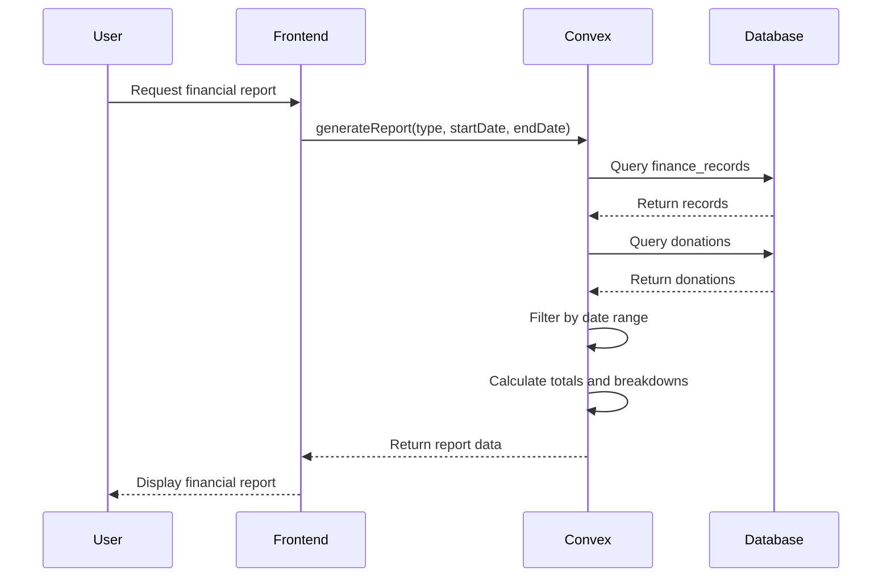
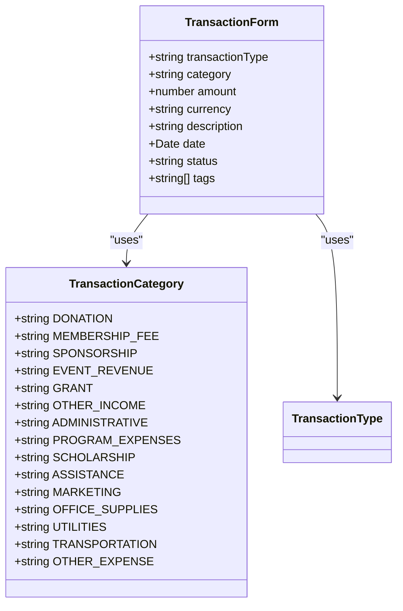
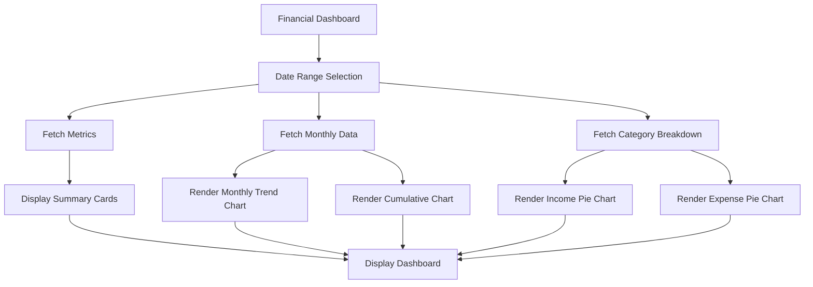
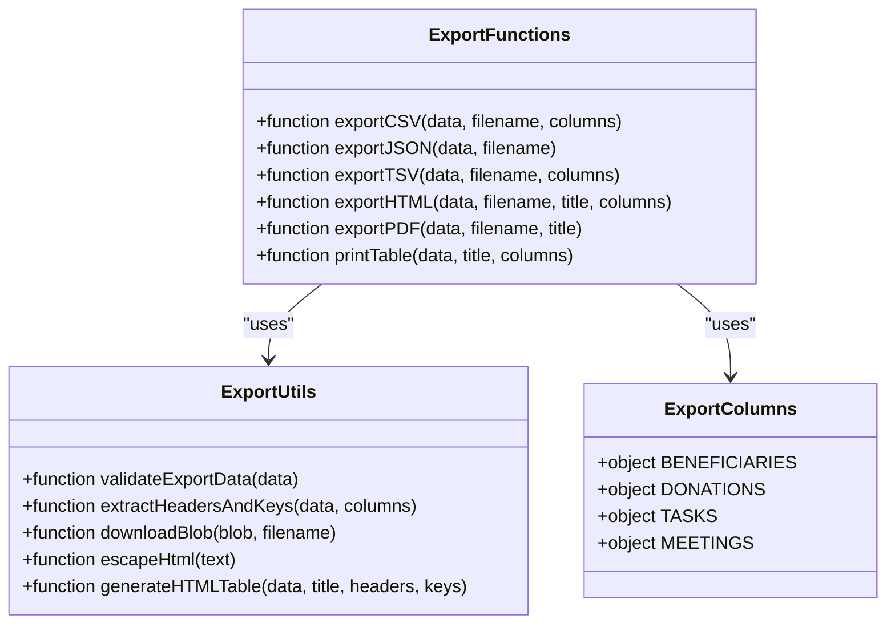

# Financial Management

<cite>
**Referenced Files in This Document**   
- [finance_records.ts](file://convex/finance_records.ts)
- [bank_accounts.ts](file://convex/bank_accounts.ts)
- [reports.ts](file://convex/reports.ts)
- [financial.ts](file://src/types/financial.ts)
- [index.ts](file://src/lib/export/index.ts)
- [TransactionForm.tsx](file://src/components/forms/TransactionForm.tsx)
- [page.tsx](file://src/app/(dashboard)/financial-dashboard/page.tsx)
- [page.tsx](file://src/app/(dashboard)/fon/gelir-gider/page.tsx)
</cite>

## Table of Contents

1. [Introduction](#introduction)
2. [Income and Expense Tracking](#income-and-expense-tracking)
3. [Bank Account Integration](#bank-account-integration)
4. [Financial Reporting](#financial-reporting)
5. [Transaction Categorization](#transaction-categorization)
6. [Reconciliation Workflows](#reconciliation-workflows)
7. [Financial Dashboard Components](#financial-dashboard-components)
8. [Export Functionality](#export-functionality)
9. [Integration with Donation and Scholarship Modules](#integration-with-donation-and-scholarship-modules)
10. [Audit Compliance and Data Accuracy](#audit-compliance-and-data-accuracy)
11. [Performance Considerations](#performance-considerations)
12. [Conclusion](#conclusion)

## Introduction

The Financial Management module provides comprehensive tools for tracking income and expenses, managing bank accounts, generating financial reports, and ensuring audit compliance. The system is designed to support nonprofit organizations in maintaining accurate financial records while providing intuitive interfaces for data entry and analysis. This documentation covers the implementation details of financial records, transaction categorization, reconciliation workflows, and integration with other modules such as donations and scholarships.

**Section sources**

- [finance_records.ts](file://convex/finance_records.ts#L1-L323)
- [financial.ts](file://src/types/financial.ts#L1-L303)

## Income and Expense Tracking

The financial system implements a robust income and expense tracking mechanism through the `finance_records` collection in Convex. Each financial record contains essential information including transaction type (income or expense), category, amount, currency, description, transaction date, payment method, receipt information, and status (pending, approved, or rejected).

The system supports multiple currencies (TRY, USD, EUR) and provides CRUD operations for financial records through Convex queries and mutations. The `create` mutation validates input data and inserts new records, while the `update` mutation allows modifications with automatic handling of approval workflows. Records are stored with metadata including creator and approver information, ensuring accountability.

Financial records are indexed by various attributes including record type, status, and creator, enabling efficient querying and filtering. The system implements pagination for large datasets, retrieving records in batches to optimize performance.

**Diagram sources **

- [finance_records.ts](file://convex/finance_records.ts#L5-L323)

**Section sources**

- [finance_records.ts](file://convex/finance_records.ts#L5-L323)
- [financial.ts](file://src/types/financial.ts#L34-L48)

## Bank Account Integration

The system provides comprehensive bank account management functionality through the `bank_accounts` module. Each beneficiary can have multiple bank accounts associated with them, supporting different account types (checking, savings, other) and currencies (TRY, USD, EUR).

The implementation ensures data integrity through several mechanisms. When creating or updating a bank account, the system automatically handles primary account designation by unsetting other primary accounts for the same beneficiary. This prevents conflicts and maintains data consistency. The system uses Promise.all for parallel updates to reduce Operational Conflict Checking (OCC) conflicts in the database.

Bank account records include essential information such as bank name, account holder, account number, IBAN, branch details, account type, currency, primary status, and account status (active, inactive, closed). The system provides CRUD operations through Convex queries and mutations, with appropriate indexing for efficient retrieval by beneficiary.

**Diagram sources **

- [bank_accounts.ts](file://convex/bank_accounts.ts#L1-L132)

**Section sources**

- [bank_accounts.ts](file://convex/bank_accounts.ts#L1-L132)
- [financial.ts](file://src/types/financial.ts#L34-L48)

## Financial Reporting

The financial reporting system provides comprehensive reporting capabilities through the `reports` module. The system supports four main report types: financial, beneficiaries, donations, and operations. Each report can be generated for a specific date range with optional filters.

Financial reports include detailed summaries of income and expenses, broken down by category. The system calculates key metrics such as total income, total expenses, net balance, and transaction counts. Reports include both summary data and detailed transaction lists, providing comprehensive financial insights.

The reporting system implements data export functionality, allowing users to export data from various collections (finance_records, beneficiaries, donations) in different formats. The export functionality supports date-based filtering, enabling users to generate reports for specific time periods.

**Diagram sources **

- [reports.ts](file://convex/reports.ts#L1-L293)

**Section sources**

- [reports.ts](file://convex/reports.ts#L1-L293)
- [financial.ts](file://src/types/financial.ts#L93-L140)

## Transaction Categorization

The system implements a comprehensive transaction categorization framework to ensure consistent classification of financial activities. Income categories include donation, membership_fee, sponsorship, event_revenue, grant, and other_income. Expense categories include administrative, program_expenses, scholarship, assistance, marketing, office_supplies, utilities, transportation, and other_expense.

The categorization system is implemented through TypeScript enums and Zod validation schemas, ensuring type safety and data integrity. The frontend components use these definitions to provide consistent user interfaces for transaction entry and editing. The TransactionForm component dynamically updates available categories based on the selected transaction type (income or expense), guiding users to select appropriate categories.

Category labels are localized in the frontend, providing user-friendly display names for each category. The system maintains a consistent mapping between technical category values and their human-readable labels, ensuring clarity and reducing errors in data entry.

**Diagram sources **

- [financial.ts](file://src/types/financial.ts#L10-L29)
- [TransactionForm.tsx](file://src/components/forms/TransactionForm.tsx#L19-L38)

**Section sources**

- [financial.ts](file://src/types/financial.ts#L10-L29)
- [TransactionForm.tsx](file://src/components/forms/TransactionForm.tsx#L19-L38)

## Reconciliation Workflows

The financial system implements structured reconciliation workflows through its transaction status management. Each financial record can have one of three statuses: pending, approved, or rejected. This workflow ensures proper review and authorization of financial transactions before they are considered finalized.

When a transaction is created, it defaults to "pending" status, requiring explicit approval. The system automatically sets the approved_by field when a transaction status is changed to "approved". This creates an audit trail of who approved each transaction, enhancing accountability and compliance.

The reconciliation process is supported by various dashboard metrics and reporting tools that highlight pending transactions. The financial dashboard displays counts of pending income and expenses, enabling financial managers to quickly identify transactions requiring attention. Reports can be filtered by status, allowing users to focus on pending items that need reconciliation.

The system also supports vault transactions (cash payments) through a specialized workflow. Vault transactions are automatically approved upon creation, with appropriate authorization requirements for the creating user. This streamlines cash handling while maintaining security controls.

**Section sources**

- [finance_records.ts](file://convex/finance_records.ts#L68-L72)
- [finance_records.ts](file://convex/finance_records.ts#L108-L112)
- [financial-dashboard/page.tsx](<file://src/app/(dashboard)/financial-dashboard/page.tsx#L212-L215>)

## Financial Dashboard Components

The financial dashboard provides a comprehensive overview of the organization's financial health through interactive visualizations and key metrics. The dashboard is implemented as a React component that consumes data from Convex queries and presents it through various charts and summary cards.

The dashboard displays four key metrics: total income, total expenses, net balance, and transaction count. These metrics are color-coded for quick interpretation, with green indicating positive values (income) and red indicating negative values (expenses). The net balance is displayed in green when positive and red when negative, providing immediate visual feedback on financial performance.

The dashboard includes multiple chart types for different analytical perspectives:

- Monthly trend charts showing income and expenses over time
- Cumulative cash flow charts displaying kümülatif balances
- Pie charts illustrating income and expense breakdowns by category

Users can filter data by date range using a popover interface with preset options (this month, last month, last 12 months) and custom date selection. The dashboard automatically updates all visualizations when the date range changes, providing real-time insights.

**Diagram sources **

- [page.tsx](<file://src/app/(dashboard)/financial-dashboard/page.tsx#L51-L415>)

**Section sources**

- [page.tsx](<file://src/app/(dashboard)/financial-dashboard/page.tsx#L51-L415>)
- [finance_records.ts](file://convex/finance_records.ts#L133-L176)

## Export Functionality

The system provides comprehensive export functionality through the `src/lib/export` module. Users can export financial data and other records in multiple formats including CSV, JSON, TSV, and HTML. The export system is designed to be flexible and reusable across different data types.

The export functions support optional column mapping, allowing users to customize the output headers and field order. The system includes predefined column configurations for common data types such as beneficiaries, donations, tasks, and meetings. These configurations map technical field names to user-friendly display names in Turkish, ensuring the exported data is easily understandable.

The export process includes data validation to ensure there is data to export. The system generates appropriate file names with timestamps, making it easy to identify exported files. For HTML exports, the system generates styled tables with Turkish date formatting and proper character encoding.

The financial module integrates export functionality directly into its interfaces. The income/expense page includes an Excel export button that generates a CSV file with formatted financial data, including summary statistics. The export includes proper Turkish number formatting with thousand separators and the Turkish Lira symbol (₺).

**Diagram sources **

- [index.ts](file://src/lib/export/index.ts#L1-L329)

**Section sources**

- [index.ts](file://src/lib/export/index.ts#L1-L329)
- [gelir-gider/page.tsx](<file://src/app/(dashboard)/fon/gelir-gider/page.tsx#L264-L297>)

## Integration with Donation and Scholarship Modules

The financial management system is tightly integrated with the donation and scholarship modules, creating a cohesive financial ecosystem. Financial records related to donations are automatically categorized and linked to donation records, enabling comprehensive tracking of donation income and scholarship disbursements.

When generating financial reports, the system queries both the finance_records and donations collections to provide a complete picture of financial activities. Donation records with "completed" status are included in the total donations calculation, ensuring accurate reporting of received funds.

The system supports scholarship payments as a specific expense category ("scholarship"), allowing financial managers to track scholarship disbursements separately from other expenses. This integration enables detailed reporting on scholarship expenditures and their impact on the organization's financial position.

The transaction categorization system includes specific categories for donation-related income and scholarship-related expenses, ensuring consistent classification across the system. The frontend interfaces guide users to select appropriate categories when recording transactions related to donations or scholarships.

**Section sources**

- [reports.ts](file://convex/reports.ts#L39-L41)
- [reports.ts](file://convex/reports.ts#L62-L65)
- [financial.ts](file://src/types/financial.ts#L22-L23)

## Audit Compliance and Data Accuracy

The financial system implements several features to ensure audit compliance and data accuracy. Each financial record includes comprehensive metadata such as creation time, creator ID, and approval information, creating a complete audit trail. The system maintains immutable records, with updates tracked through the patch operation rather than direct modifications.

The reconciliation workflow with pending, approved, and rejected statuses ensures proper authorization of financial transactions. The system requires explicit approval for transactions, preventing unauthorized expenditures. The financial dashboard highlights pending transactions, enabling timely review and approval.

Data accuracy is maintained through comprehensive validation at multiple levels. TypeScript interfaces and Zod schemas enforce data structure and type safety on the frontend. Convex queries and mutations include validation rules to prevent invalid data from being stored. The system supports receipt attachments and receipt numbers, providing documentation for financial transactions.

The reporting system includes data export functionality, allowing auditors to access raw data for independent verification. The system maintains consistent date formatting and currency handling, reducing the risk of calculation errors. Financial calculations are performed server-side to ensure consistency and accuracy.

**Section sources**

- [finance_records.ts](file://convex/finance_records.ts#L67-L72)
- [finance_records.ts](file://convex/finance_records.ts#L99-L100)
- [reports.ts](file://convex/reports.ts#L55-L56)
- [reports.ts](file://convex/reports.ts#L58-L60)

## Performance Considerations

The financial system is designed to handle large datasets efficiently through several performance optimization strategies. The system implements pagination for financial records, retrieving data in batches to minimize memory usage and network overhead. The default page size is 50 records, with configurable limits based on user needs.

Database indexing is used extensively to optimize query performance. Financial records are indexed by record type, status, and creator, enabling fast filtering and retrieval. Bank accounts are indexed by beneficiary ID, ensuring efficient access to account information for specific beneficiaries.

The system uses client-side caching through Convex's reactivity system, minimizing redundant database queries. When data changes, only affected components are re-rendered, improving overall application performance. The financial dashboard uses useMemo to cache calculated data, preventing unnecessary recalculations during re-renders.

For large dataset processing, the system implements server-side filtering and aggregation. Financial reports are generated on the server, reducing the amount of data transferred to the client. The monthly data query aggregates records by month, significantly reducing the dataset size for charting purposes.

Currency conversion is handled through standardized currency codes (TRY, USD, EUR), with formatting applied client-side using the Intl.NumberFormat API. This approach ensures consistent currency display while minimizing computational overhead.

**Section sources**

- [finance_records.ts](file://convex/finance_records.ts#L13-L37)
- [finance_records.ts](file://convex/finance_records.ts#L186-L188)
- [gelir-gider/page.tsx](<file://src/app/(dashboard)/fon/gelir-gider/page.tsx#L127-L227>)
- [financial-dashboard/page.tsx](<file://src/app/(dashboard)/financial-dashboard/page.tsx#L84-L98>)

## Conclusion

The Financial Management module provides a comprehensive solution for tracking income and expenses, managing bank accounts, generating financial reports, and ensuring audit compliance. The system's architecture balances usability with data integrity, providing intuitive interfaces for data entry while maintaining robust validation and security controls.

Key strengths of the system include its comprehensive reporting capabilities, tight integration with donation and scholarship modules, and robust reconciliation workflows. The export functionality supports multiple formats, enabling data sharing and analysis in various contexts.

The system is designed to handle large financial datasets efficiently through pagination, indexing, and server-side processing. Performance optimizations ensure responsive user interfaces even with extensive financial records.

Future enhancements could include automated bank statement reconciliation, advanced forecasting tools, and multi-currency accounting with exchange rate tracking. The existing architecture provides a solid foundation for these enhancements while maintaining the system's core principles of accuracy, compliance, and usability.
