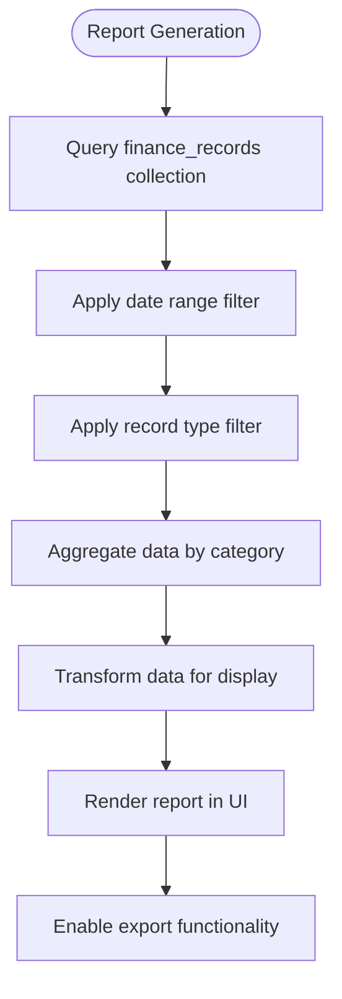
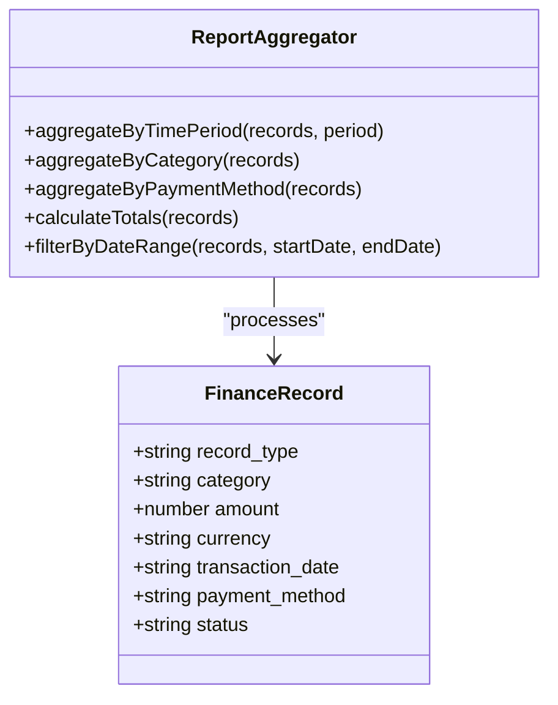
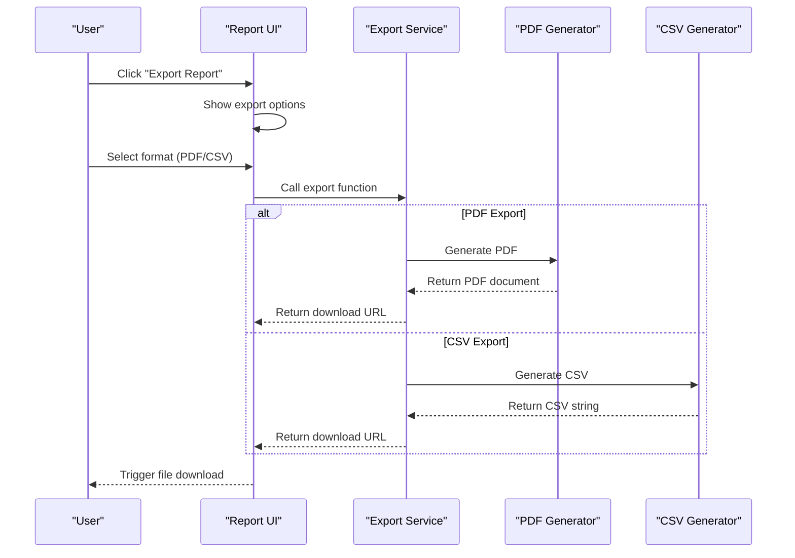
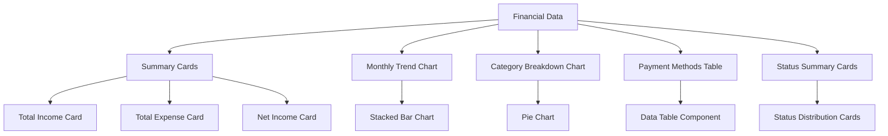
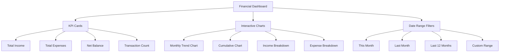
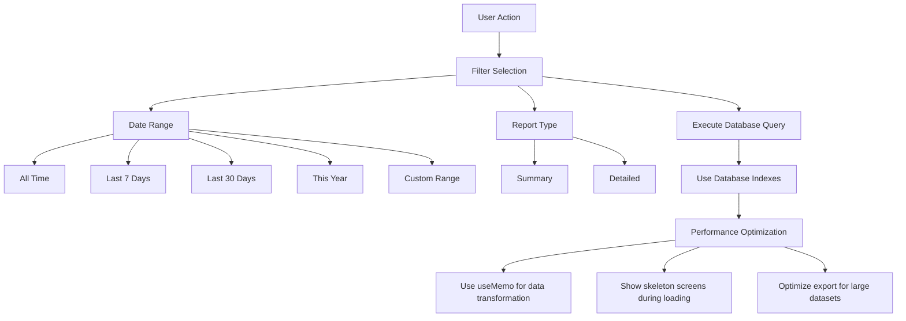

# Financial Reporting

<cite>
**Referenced Files in This Document**   
- [fund-reports-page.tsx](file://src/app/(dashboard)/fon/raporlar/page.tsx)
- [financial-dashboard-page.tsx](file://src/app/(dashboard)/financial-dashboard/page.tsx)
- [finance_records.ts](file://convex/finance_records.ts)
- [export-service.ts](file://src/lib/export/export-service.ts)
- [pdf-export.ts](file://src/lib/utils/pdf-export.ts)
- [data-table.tsx](file://src/components/ui/data-table.tsx)
</cite>

## Table of Contents

1. [Introduction](#introduction)
2. [Report Generation](#report-generation)
3. [Data Aggregation](#data-aggregation)
4. [Export Integration](#export-integration)
5. [Data Visualization](#data-visualization)
6. [Financial Dashboard](#financial-dashboard)
7. [Filtering and Performance](#filtering-and-performance)
8. [Security Considerations](#security-considerations)
9. [Customization and Extensibility](#customization-and-extensibility)

## Introduction

The Financial Reporting sub-feature provides comprehensive financial analysis capabilities for the organization. This system enables users to generate detailed financial reports including balance sheets, income statements, and cash flow summaries. The reporting module is designed to aggregate financial data from various sources and present it in a meaningful way through visualizations and exportable formats. The system supports both summary and detailed reporting modes, allowing users to view high-level financial overviews or drill down into specific transaction details.

**Section sources**

- [fund-reports-page.tsx](<file://src/app/(dashboard)/fon/raporlar/page.tsx#L60-L568>)
- [financial-dashboard-page.tsx](<file://src/app/(dashboard)/financial-dashboard/page.tsx#L51-L414>)

## Report Generation

The financial reporting system generates comprehensive reports by querying the finance_records collection and aggregating data into meaningful financial statements. The primary report generation interface is located in the fund reports page, which provides a complete financial overview including income statements, balance sheet components, and cash flow analysis. The system supports two report modes: summary and detailed, allowing users to toggle between aggregated views and comprehensive data breakdowns.

The report generation process begins with data retrieval from the finance_records collection through Convex queries. The system fetches financial data based on user-specified parameters including date ranges and report types. For summary reports, the system aggregates data into high-level categories such as total income, total expenses, and net income. Detailed reports provide granular information including individual transactions, category breakdowns, and payment method distributions.

**Diagram sources**

- [fund-reports-page.tsx](<file://src/app/(dashboard)/fon/raporlar/page.tsx#L67-L154>)
- [finance_records.ts](file://convex/finance_records.ts#L133-L176)

**Section sources**

- [fund-reports-page.tsx](<file://src/app/(dashboard)/fon/raporlar/page.tsx#L60-L568>)
- [finance_records.ts](file://convex/finance_records.ts#L133-L176)

## Data Aggregation

The reporting system aggregates financial data across multiple dimensions including time periods, categories, and sources. The aggregation process begins with querying the finance_records collection and filtering results based on user-defined parameters such as date ranges and record types. The system then groups the filtered data by various attributes to create meaningful financial summaries.

For time-based aggregation, the system groups financial records by month, enabling the creation of monthly trend reports that show income and expense patterns over time. Category-based aggregation groups transactions by their financial category (e.g., donations, office expenses, scholarship payments), providing insights into spending and revenue patterns. Source-based aggregation categorizes transactions by payment method (e.g., bank transfer, cash, credit card), helping identify the most common transaction channels.

The aggregation logic is implemented through Convex query functions that efficiently process large datasets. The getMonthlyData function retrieves financial records and groups them by month, calculating total income, expenses, and net values for each period. The getCategoryBreakdown function groups records by category and calculates total amounts, providing a clear view of financial distribution across different categories.

**Diagram sources**

- [finance_records.ts](file://convex/finance_records.ts#L179-L223)
- [finance_records.ts](file://convex/finance_records.ts#L227-L261)

**Section sources**

- [finance_records.ts](file://convex/finance_records.ts#L179-L261)
- [fund-reports-page.tsx](<file://src/app/(dashboard)/fon/raporlar/page.tsx#L104-L154>)

## Export Integration

The financial reporting system integrates with the export functionality in src/lib/export to provide CSV and PDF generation capabilities. The export integration allows users to download financial reports in multiple formats for offline analysis and sharing. The system uses a unified export service that handles both CSV and PDF generation through standardized interfaces.

For CSV export, the system converts the report data into comma-separated values format, preserving all financial information including totals, category breakdowns, and monthly trends. The CSV export includes proper formatting for Turkish Lira currency and handles special characters through UTF-8 encoding with BOM. The export process creates a downloadable file that can be opened in spreadsheet applications for further analysis.

PDF export functionality generates professional-looking financial reports with proper formatting, headers, and footers. The system uses jsPDF and jspdf-autotable libraries to create well-structured PDF documents that include the report title, subtitle, generation date, and formatted tables. The PDF export includes pagination with page numbers and uses consistent styling for headers and data cells.

**Diagram sources**

- [export-service.ts](file://src/lib/export/export-service.ts#L52-L317)
- [fund-reports-page.tsx](<file://src/app/(dashboard)/fon/raporlar/page.tsx#L158-L209>)
- [pdf-export.ts](file://src/lib/utils/pdf-export.ts#L237-L267)

**Section sources**

- [export-service.ts](file://src/lib/export/export-service.ts#L52-L317)
- [fund-reports-page.tsx](<file://src/app/(dashboard)/fon/raporlar/page.tsx#L158-L209>)

## Data Visualization

The financial reporting system utilizes various data visualization components to present financial information in an easily digestible format. The system employs charts, tables, and summary cards to represent financial data, enabling users to quickly understand financial performance and trends. The visualization components are designed to work seamlessly with the aggregated financial data, providing both high-level overviews and detailed breakdowns.

The primary visualization components include bar charts for monthly trend analysis, pie charts for category distribution, and data tables for detailed transaction listings. The monthly trend chart displays income and expense patterns over time, using stacked bars to show the relationship between revenue and expenditures. The category breakdown pie chart visualizes the proportion of income and expenses across different financial categories, helping identify major spending areas and revenue sources.

Summary cards provide at-a-glance financial metrics including total income, total expenses, and net income. These cards use color coding (green for income, red for expenses) and trend icons to quickly convey financial performance. The payment methods table presents transaction data in a tabular format, showing total amounts, transaction counts, and average values for each payment method.

**Diagram sources**

- [fund-reports-page.tsx](<file://src/app/(dashboard)/fon/raporlar/page.tsx#L413-L505>)
- [data-table.tsx](file://src/components/ui/data-table.tsx#L54-L345)

**Section sources**

- [fund-reports-page.tsx](<file://src/app/(dashboard)/fon/raporlar/page.tsx#L360-L505>)
- [data-table.tsx](file://src/components/ui/data-table.tsx#L54-L345)

## Financial Dashboard

The financial dashboard provides real-time insights and key performance indicators (KPIs) for monitoring the organization's financial health. The dashboard serves as a central hub for financial monitoring, displaying critical metrics such as total income, total expenses, net balance, and transaction count. The dashboard interface allows users to select custom date ranges to analyze financial performance over specific periods.

The dashboard features interactive charts that visualize financial trends over time, including monthly income-expense comparisons and cumulative cash flow. Users can toggle between different chart types to view financial data from multiple perspectives. The monthly trend chart displays income and expenses as stacked bars, enabling easy comparison of revenue and expenditures across months. The cumulative chart shows the buildup of income, expenses, and net balance over time, illustrating the organization's cash flow trajectory.

KPI cards display essential financial metrics with visual indicators showing performance trends. The dashboard also includes category breakdown charts that show the distribution of income and expenses across different financial categories. These visualizations help identify major revenue sources and spending areas, enabling informed financial decision-making.

**Diagram sources**

- [financial-dashboard-page.tsx](<file://src/app/(dashboard)/financial-dashboard/page.tsx#L51-L414>)
- [finance_records.ts](file://convex/finance_records.ts#L133-L176)

**Section sources**

- [financial-dashboard-page.tsx](<file://src/app/(dashboard)/financial-dashboard/page.tsx#L51-L414>)
- [finance_records.ts](file://convex/finance_records.ts#L133-L176)

## Filtering and Performance

The financial reporting system implements robust filtering capabilities and performance optimizations to handle large datasets efficiently. Users can filter reports by various criteria including date ranges, transaction types, and categories. The system supports predefined date ranges such as "Last 7 Days," "Last 30 Days," and "This Year," as well as custom date ranges for specific analysis periods.

Performance optimization is achieved through several mechanisms. The system uses Convex's indexing capabilities to speed up database queries, particularly for date-based and category-based filtering. The frontend implements data transformation and aggregation in a memoized manner using React's useMemo hook, preventing unnecessary recalculations when component state changes. For large datasets, the system applies data sampling and aggregation to maintain responsive UI performance.

The reporting interface includes loading states and skeleton screens to provide visual feedback during data retrieval. When processing large datasets, the system displays a loading indicator and temporarily shows skeleton elements to maintain perceived performance. The export functionality is optimized to handle large reports by streaming data and using efficient file generation algorithms.

**Diagram sources**

- [fund-reports-page.tsx](<file://src/app/(dashboard)/fon/raporlar/page.tsx#L61-L65>)
- [fund-reports-page.tsx](<file://src/app/(dashboard)/fon/raporlar/page.tsx#L104-L154>)
- [financial-dashboard-page.tsx](<file://src/app/(dashboard)/financial-dashboard/page.tsx#L122-L156>)

**Section sources**

- [fund-reports-page.tsx](<file://src/app/(dashboard)/fon/raporlar/page.tsx#L61-L65>)
- [fund-reports-page.tsx](<file://src/app/(dashboard)/fon/raporlar/page.tsx#L104-L154>)
- [financial-dashboard-page.tsx](<file://src/app/(dashboard)/financial-dashboard/page.tsx#L122-L156>)

## Security Considerations

The financial reporting system incorporates several security measures to protect sensitive financial data and control report access. Access to financial reports is restricted based on user roles and permissions, ensuring that only authorized personnel can view or export financial information. The system implements rate limiting on financial reporting endpoints to prevent abuse and protect against denial-of-service attacks.

Data sensitivity is addressed through proper data handling practices. Financial reports include only necessary information and omit sensitive details such as full bank account numbers or personal identification information. When displaying financial data, the system uses appropriate formatting and masking for sensitive information. The export functionality includes security checks to ensure that users can only export data they have permission to access.

The system maintains audit logs for all report generation and export activities, providing an audit trail for compliance purposes. These logs record user actions, including report generation, export attempts, and filter configurations. The security audit functionality can analyze these logs to detect suspicious patterns and ensure compliance with data protection regulations.

**Section sources**

- [finance_records.ts](file://convex/finance_records.ts#L5-L43)
- [rate-limit-config.ts](file://src/lib/rate-limit-config.ts#L42-L79)
- [security_audit.ts](file://convex/security_audit.ts#L217-L273)

## Customization and Extensibility

The financial reporting system is designed with customization and extensibility in mind, allowing organizations to adapt the reporting functionality to their specific needs. The system supports customizable report templates that can be modified to include organization-specific branding, logos, and formatting. Users can extend the report types by adding new financial categories or creating specialized reports for specific departments or programs.

The export service provides a flexible API that allows developers to create new export formats or modify existing ones. The system's modular architecture enables the addition of new visualization components or the replacement of existing ones without affecting the core reporting functionality. The data aggregation functions are designed to be extensible, allowing for the addition of new aggregation dimensions or calculation methods.

Customization options include the ability to modify date range presets, add new report filters, and configure which financial metrics are displayed prominently. The system also supports localization, allowing financial reports to be generated in different languages and currency formats. These extensibility features ensure that the reporting system can evolve with the organization's changing requirements.

**Section sources**

- [export-service.ts](file://src/lib/export/export-service.ts#L1-L317)
- [fund-reports-page.tsx](<file://src/app/(dashboard)/fon/raporlar/page.tsx#L60-L568>)
- [financial-dashboard-page.tsx](<file://src/app/(dashboard)/financial-dashboard/page.tsx#L51-L414>)
