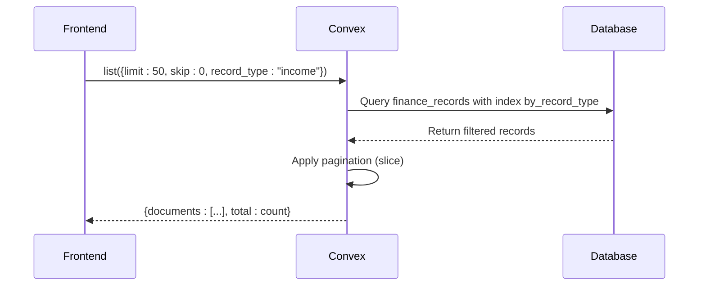
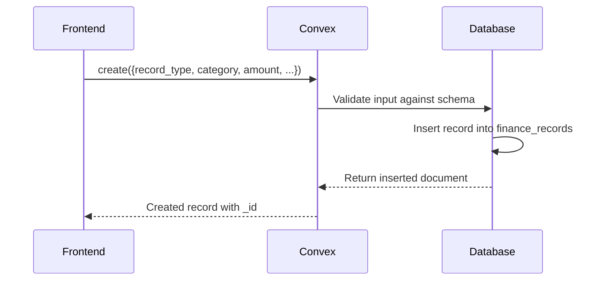
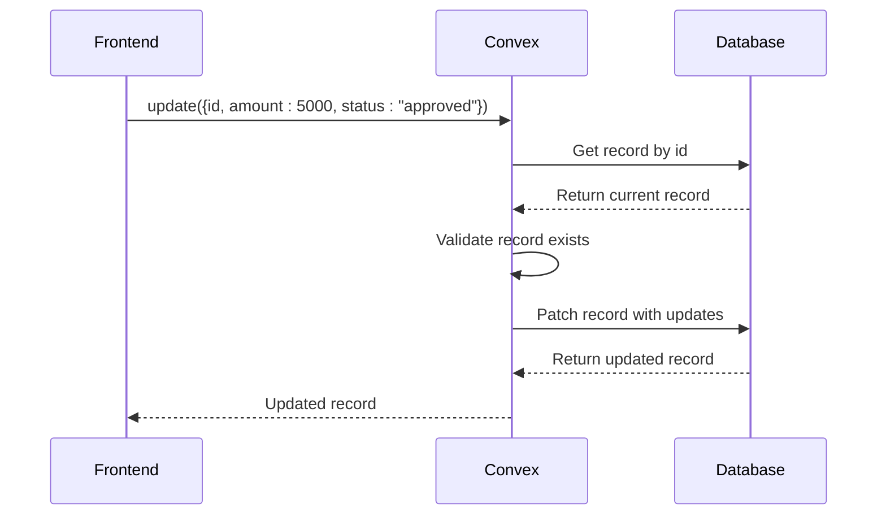
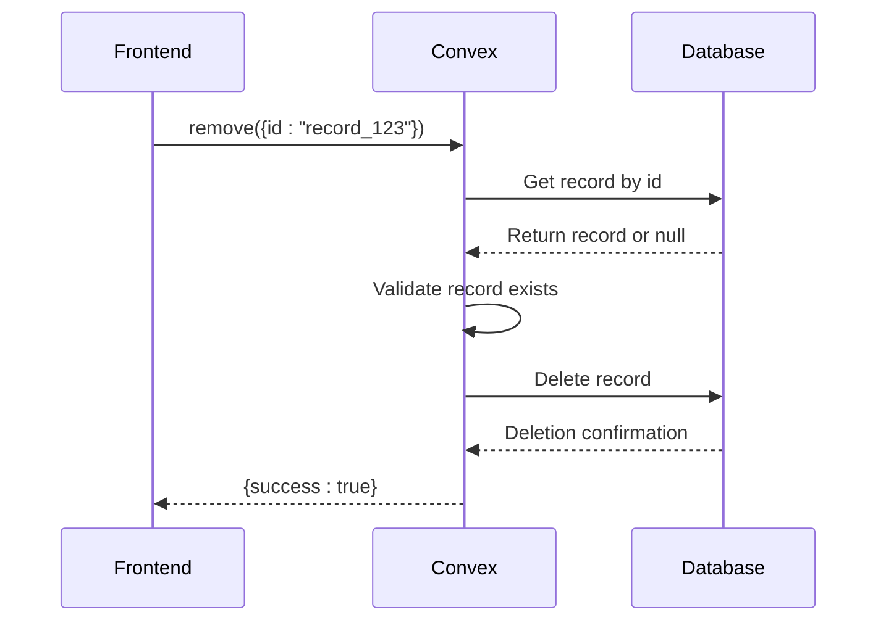
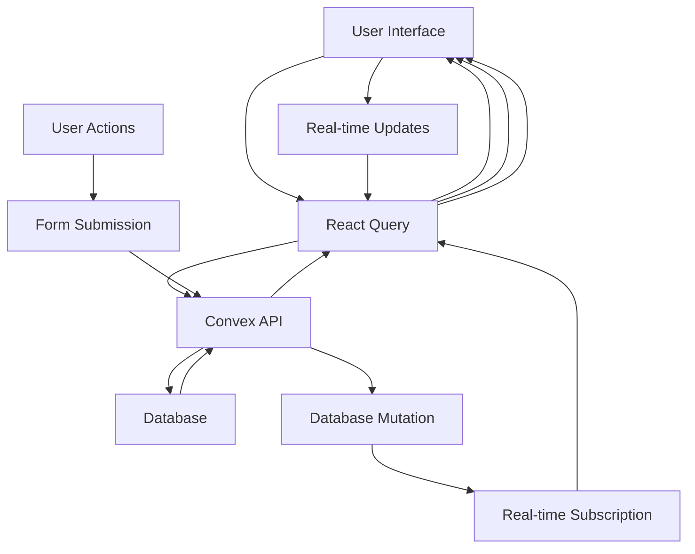
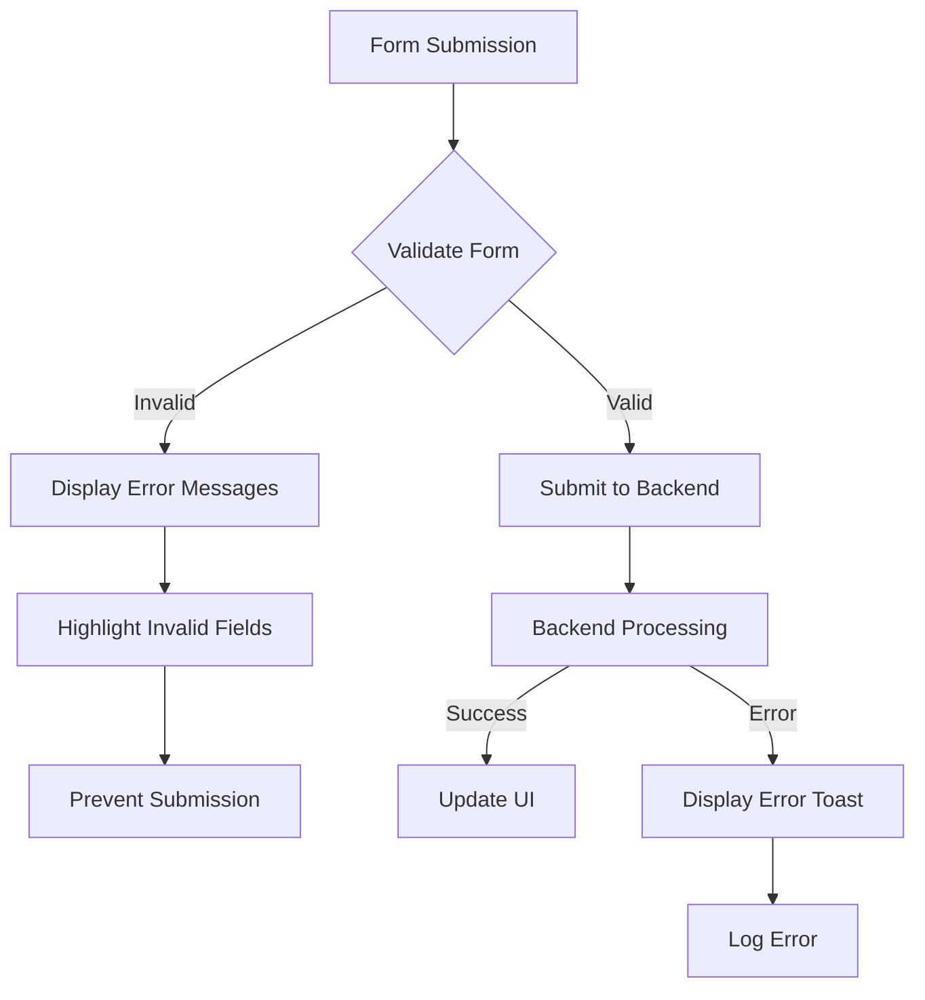

# Income and Expense Tracking

<cite>
**Referenced Files in This Document**   
- [finance_records.ts](file://convex/finance_records.ts)
- [TransactionForm.tsx](file://src/components/forms/TransactionForm.tsx)
- [schema.ts](file://convex/schema.ts)
- [gelir-gider/page.tsx](file://src/app/(dashboard)/fon/gelir-gider/page.tsx)
- [api.ts](file://src/lib/convex/api.ts)
- [database.ts](file://src/types/database.ts)
</cite>

## Table of Contents

1. [Introduction](#introduction)
2. [Data Model](#data-model)
3. [Finance Records Operations](#finance-records-operations)
4. [Transaction Form Implementation](#transaction-form-implementation)
5. [Frontend Integration](#frontend-integration)
6. [Validation and Error Handling](#validation-and-error-handling)
7. [Permissions and Audit Trails](#permissions-and-audit-trails)
8. [Troubleshooting Guide](#troubleshooting-guide)

## Introduction

The Income and Expense Tracking feature provides a comprehensive system for managing financial transactions within the application. This sub-feature enables users to create, categorize, and display financial records through the Gelir Gider interface. The system supports both income and expense tracking with detailed categorization, status management, and approval workflows. Financial data is stored in the finance_records collection and accessed through Convex functions that provide list, create, update, and remove operations. The interface integrates with real-time subscriptions for immediate updates and includes comprehensive validation and error handling to ensure data integrity.

**Section sources**

- [finance_records.ts](file://convex/finance_records.ts#L1-L323)
- [gelir-gider/page.tsx](<file://src/app/(dashboard)/fon/gelir-gider/page.tsx#L1-L774>)

## Data Model

The FinanceRecordDocument data model defines the structure for all financial transactions in the system. Each record contains essential financial information including amount, type, category, and timestamps. The data model is implemented in the finance_records collection with specific field definitions and constraints.

```mermaid
erDiagram
finance_records {
string record_type PK
string category
number amount
string currency
string description
string transaction_date
string payment_method
string receipt_number
string receipt_file_id
string related_to
Id<'users'> created_by FK
Id<'users'> approved_by FK
string status
}
```

**Diagram sources**

- [schema.ts](file://convex/schema.ts#L547-L577)
- [database.ts](file://src/types/database.ts#L323-L338)

The data model includes the following key fields:

- **record_type**: Specifies whether the transaction is 'income' or 'expense'
- **category**: Categorizes the transaction (e.g., 'donation', 'salary', 'rent')
- **amount**: The monetary value of the transaction
- **currency**: The currency of the transaction ('TRY', 'USD', or 'EUR')
- **description**: A detailed description of the transaction
- **transaction_date**: The date when the transaction occurred
- **status**: The current status of the record ('pending', 'approved', or 'rejected')
- **created_by**: Reference to the user who created the record
- **approved_by**: Reference to the user who approved the record

The model also includes optional fields for payment_method, receipt_number, receipt_file_id, and related_to for additional transaction details.

**Section sources**

- [schema.ts](file://convex/schema.ts#L547-L577)
- [database.ts](file://src/types/database.ts#L323-L338)

## Finance Records Operations

The finance_records Convex functions provide a complete CRUD (Create, Read, Update, Delete) interface for managing financial transactions. These operations are implemented as Convex queries and mutations, enabling secure and efficient data manipulation.

### List Operation

The list function retrieves financial records with optional filtering by record type, status, or creator. It supports pagination through limit and skip parameters and returns both the documents and total count.



**Diagram sources**

- [finance_records.ts](file://convex/finance_records.ts#L4-L44)

### Create Operation

The create mutation inserts a new financial record into the database. It requires all essential fields including record_type, category, amount, currency, description, transaction_date, created_by, and status.



**Diagram sources**

- [finance_records.ts](file://convex/finance_records.ts#L54-L77)

### Update Operation

The update mutation modifies existing financial records. It supports partial updates, allowing specific fields to be changed without affecting others. The operation includes validation to ensure the record exists before updating.



**Diagram sources**

- [finance_records.ts](file://convex/finance_records.ts#L79-L117)

### Remove Operation

The remove mutation deletes a financial record from the database. It first verifies the record exists before performing the deletion to prevent errors.



**Diagram sources**

- [finance_records.ts](file://convex/finance_records.ts#L119-L130)

**Section sources**

- [finance_records.ts](file://convex/finance_records.ts#L1-L323)
- [api.ts](file://src/lib/convex/api.ts#L350-L371)

## Transaction Form Implementation

The TransactionForm component provides a user interface for creating and editing financial transactions. It includes comprehensive validation, error handling, and a responsive design for both desktop and mobile devices.

```mermaid
classDiagram
class TransactionForm {
+transaction : Transaction | null
+onSubmit : (data : CreateTransactionInput) => Promise~void~
+onCancel : () => void
+loading : boolean
+className : string
+mode : 'create' | 'edit'
-formData : CreateTransactionInput
-errors : Record~string, string~
-tagInput : string
+validateForm() : boolean
+handleSubmit(e : FormEvent) : void
+handleFieldChange(field : keyof CreateTransactionInput, value : any) : void
+handleAddTag() : void
+handleRemoveTag(tag : string) : void
+getCategories() : {value : string, label : string}[]
}
class CreateTransactionInput {
+type : 'income' | 'expense'
+category : string
+amount : number
+currency : 'TRY' | 'USD' | 'EUR'
+description : string
+date : Date
+status : 'pending' | 'completed' | 'cancelled'
+tags : string[]
}
TransactionForm --> CreateTransactionInput : uses
```

**Diagram sources**

- [TransactionForm.tsx](file://src/components/forms/TransactionForm.tsx#L1-L451)

The form implementation includes the following key features:

- **Dynamic Category Selection**: Categories are filtered based on the selected transaction type (income or expense)
- **Real-time Validation**: Form fields are validated as the user types, with immediate error feedback
- **Tag Management**: Users can add and remove tags to categorize transactions
- **Responsive Layout**: The form adapts to different screen sizes with a grid layout on larger screens
- **Mode Support**: The form supports both 'create' and 'edit' modes with appropriate UI changes

The form handles submission through the onSubmit callback, which is typically connected to the Convex create or update mutation. Error handling is implemented through try-catch blocks that delegate to the mutation's onError callback.

**Section sources**

- [TransactionForm.tsx](file://src/components/forms/TransactionForm.tsx#L1-L451)

## Frontend Integration

The Gelir Gider interface integrates the finance records functionality into a comprehensive dashboard that displays transaction lists, statistics, and filtering options. The frontend uses React Query for data fetching and caching, ensuring efficient data retrieval and real-time updates.



**Diagram sources**

- [gelir-gider/page.tsx](<file://src/app/(dashboard)/fon/gelir-gider/page.tsx#L1-L774>)

The integration includes:

- **Data Fetching**: The useQuery hook retrieves financial records with automatic caching and background updates
- **Real-time Updates**: Convex subscriptions ensure the interface reflects changes immediately without manual refresh
- **Filtering and Search**: Users can filter transactions by type, category, status, and date range
- **Pagination**: Large datasets are handled with pagination to maintain performance
- **Export Functionality**: Users can export transaction data to CSV format for external analysis

The interface displays key financial statistics including total income, total expenses, net balance, and pending transactions. These metrics are calculated from the filtered dataset and updated in real-time as transactions are added or modified.

**Section sources**

- [gelir-gider/page.tsx](<file://src/app/(dashboard)/fon/gelir-gider/page.tsx#L1-L774>)
- [api.ts](file://src/lib/convex/api.ts#L350-L371)

## Validation and Error Handling

The system implements comprehensive validation at both the frontend and backend levels to ensure data integrity and provide meaningful error feedback to users.

### Frontend Validation

The TransactionForm component includes client-side validation that checks:

- Description is not empty
- Amount is positive and greater than zero
- Category is selected
- Date is provided
- Required fields are filled



**Diagram sources**

- [TransactionForm.tsx](file://src/components/forms/TransactionForm.tsx#L101-L123)

### Backend Validation

The Convex functions implement server-side validation through the v schema definitions, which enforce:

- record_type must be 'income' or 'expense'
- amount must be a positive number
- currency must be 'TRY', 'USD', or 'EUR'
- status must be 'pending', 'approved', or 'rejected'
- created_by must reference a valid user

The system also includes validation during data import operations, checking for valid record types and positive amounts before processing.

**Section sources**

- [finance_records.ts](file://convex/finance_records.ts#L54-L77)
- [data_import_export.ts](file://convex/data_import_export.ts#L158-L206)
- [TransactionForm.tsx](file://src/components/forms/TransactionForm.tsx#L101-L123)

## Permissions and Audit Trails

The financial tracking system implements security measures and audit capabilities to ensure accountability and prevent unauthorized modifications.

### Permissions

Access to financial records is controlled through user roles and permissions. The system tracks:

- created_by: The user who created the record
- approved_by: The user who approved the record
- Status changes: All status transitions are recorded

When a record's status is changed to 'approved', the system automatically sets the approved_by field to the current user if not already specified.

### Audit Capabilities

The system maintains audit trails through:

- Creation and update timestamps (\_creationTime, \_updatedAt)
- User references for creation and approval
- Status history tracking
- Real-time subscriptions that notify interested parties of changes

These features ensure that all financial modifications are traceable to specific users and provide a complete history of changes for compliance and auditing purposes.

**Section sources**

- [finance_records.ts](file://convex/finance_records.ts#L80-L117)
- [schema.ts](file://convex/schema.ts#L547-L577)

## Troubleshooting Guide

This section addresses common issues that may occur when using the Income and Expense Tracking feature and provides solutions for resolution.

### Failed Mutations

**Issue**: Create, update, or remove operations fail with error messages.
**Causes and Solutions**:

- **Invalid data format**: Ensure all required fields are provided with correct types (e.g., amount must be a number, record_type must be 'income' or 'expense')
- **Missing required fields**: Verify that description, amount, category, and other required fields are populated
- **Authentication issues**: Ensure the user is properly authenticated and has the necessary permissions
- **Network connectivity**: Check internet connection and retry the operation

### Incorrect Categorization

**Issue**: Transactions appear in unexpected categories or filters.
**Causes and Solutions**:

- **Case sensitivity**: Ensure category names match exactly (case-sensitive)
- **Invalid category values**: Use only predefined category values from the system
- **Caching issues**: Refresh the page to clear any cached data that may be causing display issues

### Real-time Update Issues

**Issue**: Changes are not reflected immediately in the interface.
**Causes and Solutions**:

- **Subscription failures**: Check browser console for WebSocket or subscription errors
- **Network latency**: Wait a few moments as updates may take time to propagate
- **Cache invalidation**: Force a refresh of the data by changing filters or navigating away and back

### Performance Issues

**Issue**: The interface is slow or unresponsive with large datasets.
**Causes and Solutions**:

- **Large result sets**: Apply filters to reduce the number of displayed records
- **Network bandwidth**: Ensure adequate internet connection for data transfer
- **Browser performance**: Close other tabs or restart the browser to free up resources

**Section sources**

- [finance_records.ts](file://convex/finance_records.ts#L1-L323)
- [TransactionForm.tsx](file://src/components/forms/TransactionForm.tsx#L1-L451)
- [gelir-gider/page.tsx](<file://src/app/(dashboard)/fon/gelir-gider/page.tsx#L1-L774>)
