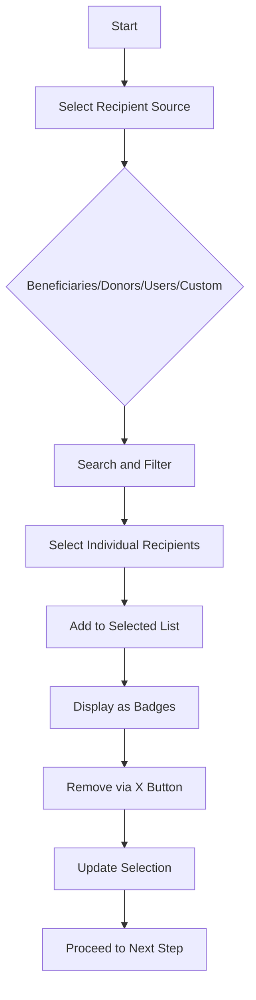
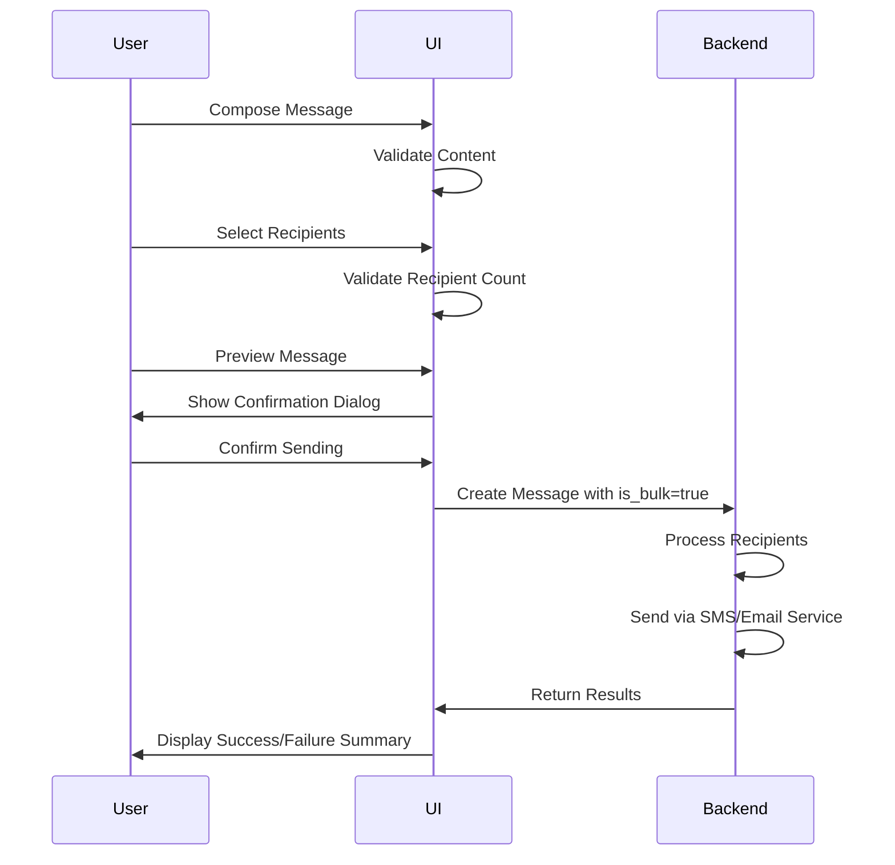
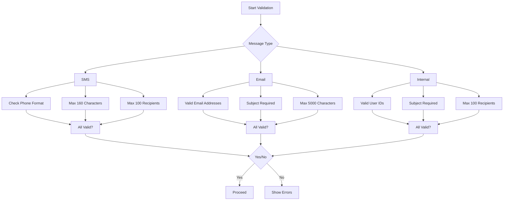
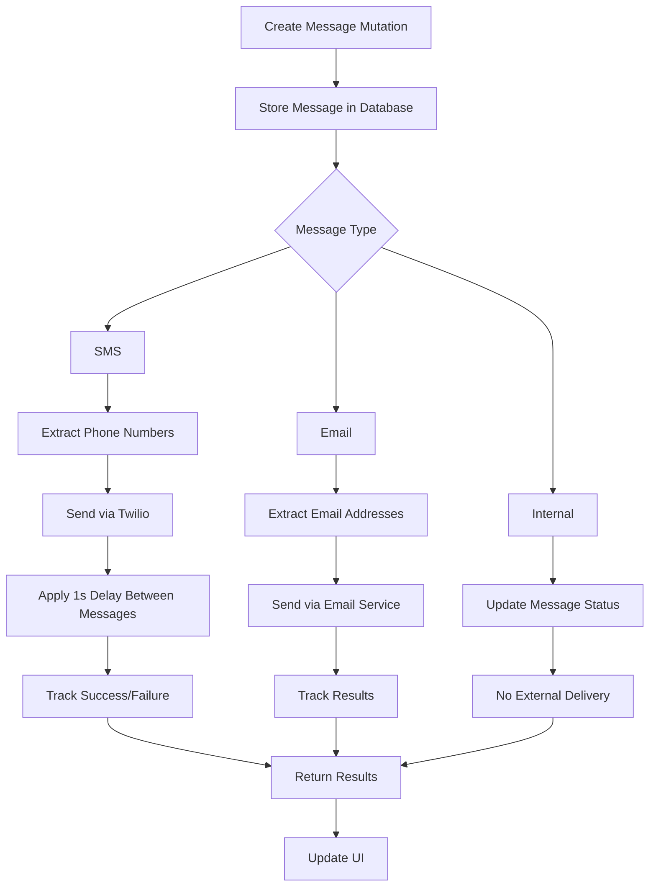
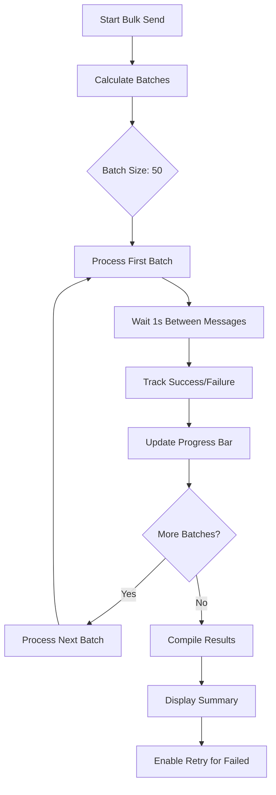
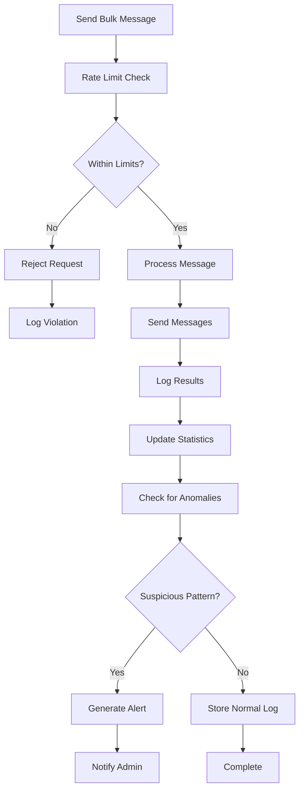

# Bulk Messaging

<cite>
**Referenced Files in This Document**   
- [RecipientSelector.tsx](file://src/components/messages/RecipientSelector.tsx)
- [message.ts](file://src/lib/validations/message.ts)
- [MessageForm.tsx](file://src/components/forms/MessageForm.tsx)
- [sms.ts](file://src/lib/services/sms.ts)
- [page.tsx](file://src/app/(dashboard)/mesaj/toplu/page.tsx)
</cite>

## Table of Contents

1. [Introduction](#introduction)
2. [Recipient Selection and Management](#recipient-selection-and-management)
3. [Bulk Messaging Workflow](#bulk-messaging-workflow)
4. [Validation and Limits](#validation-and-limits)
5. [Backend Processing](#backend-processing)
6. [Performance Considerations](#performance-considerations)
7. [Rate Limiting and Audit Integration](#rate-limiting-and-audit-integration)

## Introduction

The Bulk Messaging feature enables users to send messages to multiple recipients simultaneously through SMS, email, or internal messaging channels. The system implements comprehensive validation, recipient management, and confirmation workflows to ensure reliable bulk communication. This documentation details the implementation of recipient selection limits, automatic flagging of bulk messages, confirmation dialogs, backend processing through Convex mutations, and integration with rate limiting and audit logging systems.

## Recipient Selection and Management

The recipient selection interface provides multiple sources for choosing recipients, including beneficiaries, donors, users, and custom entries. Users can search, filter, and select recipients with visual feedback on selection status.

The UI displays selected recipients as removable badges, allowing users to easily manage their recipient list. The component supports importing recipients from CSV files and exporting selected lists for external use.

**Diagram sources**

- [RecipientSelector.tsx](file://src/components/messages/RecipientSelector.tsx#L48-L603)

**Section sources**

- [RecipientSelector.tsx](file://src/components/messages/RecipientSelector.tsx#L48-L603)

## Bulk Messaging Workflow

The bulk messaging process follows a multi-step wizard pattern that guides users through message composition, recipient selection, preview, and sending. Each step validates inputs before allowing progression to the next stage.

When multiple recipients are selected, the system automatically sets the `is_bulk` flag to true and displays a confirmation dialog before sending. This prevents accidental mass messaging and ensures user intent.

**Diagram sources**

- [page.tsx](<file://src/app/(dashboard)/mesaj/toplu/page.tsx#L59-L787>)
- [MessageForm.tsx](file://src/components/forms/MessageForm.tsx#L235-L294)

**Section sources**

- [page.tsx](<file://src/app/(dashboard)/mesaj/toplu/page.tsx#L59-L787>)
- [MessageForm.tsx](file://src/components/forms/MessageForm.tsx#L235-L294)

## Validation and Limits

The system enforces strict validation rules to maintain data integrity and prevent abuse. The maximum recipient limit is set to 100 recipients per message, with real-time feedback on selection count.

Validation rules vary by message type:

- SMS messages require valid Turkish phone numbers (10 digits, starting with 5)
- Email messages require valid email addresses and a subject line
- Internal messages require valid user IDs and a subject

**Diagram sources**

- [message.ts](file://src/lib/validations/message.ts#L1-L271)

**Section sources**

- [message.ts](file://src/lib/validations/message.ts#L1-L271)

## Backend Processing

Bulk messages are processed through Convex mutations that handle message creation and delivery. The backend separates concerns between message storage and actual delivery, allowing for reliable processing and error handling.

For SMS delivery, the system uses Twilio with rate limiting to prevent exceeding service limits. Each message is sent with a 1-second delay between recipients to comply with rate limits.

**Diagram sources**

- [sms.ts](file://src/lib/services/sms.ts#L1-L219)
- [page.tsx](<file://src/app/(dashboard)/mesaj/toplu/page.tsx#L156-L231>)

**Section sources**

- [sms.ts](file://src/lib/services/sms.ts#L1-L219)
- [page.tsx](<file://src/app/(dashboard)/mesaj/toplu/page.tsx#L156-L231>)

## Performance Considerations

The bulk messaging system implements several performance optimizations to handle large recipient lists efficiently:

- Batch processing with configurable batch sizes (default: 50 recipients per batch)
- Progress tracking with percentage completion
- Asynchronous processing to prevent UI blocking
- Error isolation to ensure partial failures don't stop the entire process

The system estimates delivery time based on recipient count and applies appropriate delays between messages to respect rate limits. For large recipient lists, the estimated delivery time can be several minutes, which is communicated to users through the progress interface.

**Diagram sources**

- [page.tsx](<file://src/app/(dashboard)/mesaj/toplu/page.tsx#L182-L215>)

**Section sources**

- [page.tsx](<file://src/app/(dashboard)/mesaj/toplu/page.tsx#L182-L215>)

## Rate Limiting and Audit Integration

The system integrates comprehensive rate limiting and audit logging to prevent abuse and maintain security. All bulk messaging operations are logged with details including:

- User ID and IP address
- Timestamp and message type
- Recipient count and content summary
- Success/failure status

Rate limiting is implemented at multiple levels:

- Per-user limits to prevent individual abuse
- Per-IP limits to prevent distributed attacks
- Service-level limits to protect external providers

The audit system tracks all bulk messaging operations and generates alerts for suspicious patterns, such as unusually high message volumes or frequent failures.

**Diagram sources**

- [sms.ts](file://src/lib/services/sms.ts#L108-L161)
- [security.ts](file://src/lib/security.ts#L81-L121)

**Section sources**

- [sms.ts](file://src/lib/services/sms.ts#L108-L161)
- [security.ts](file://src/lib/security.ts#L81-L121)
