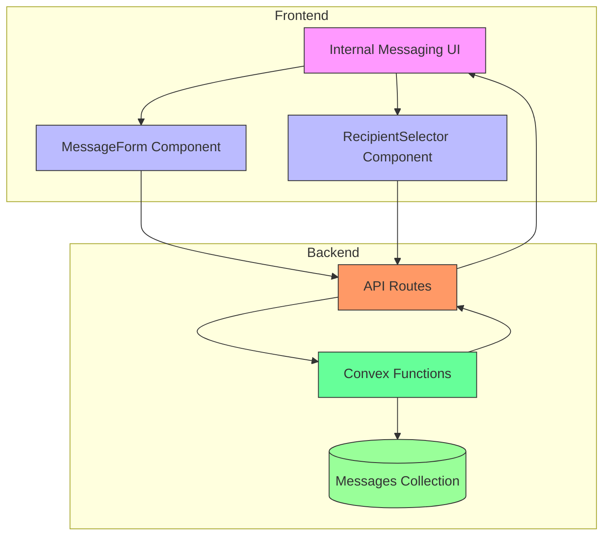
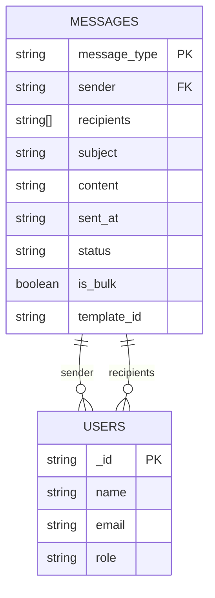
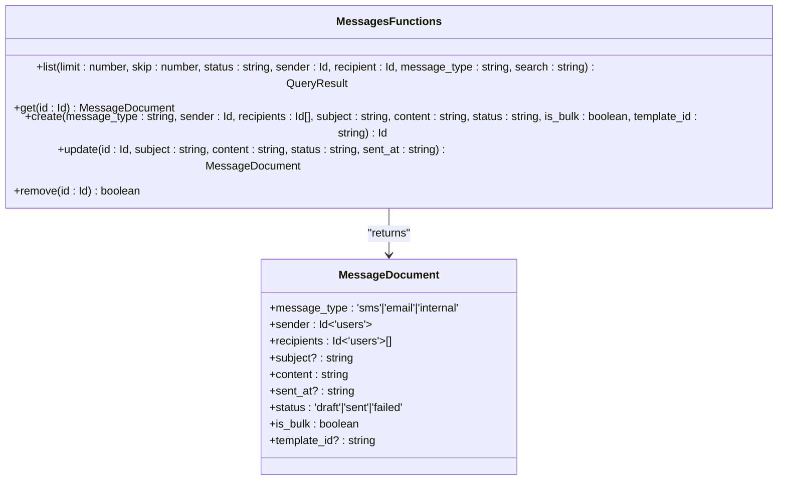
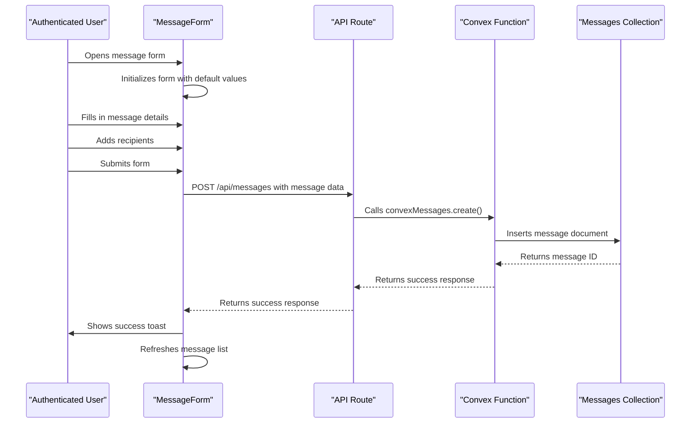
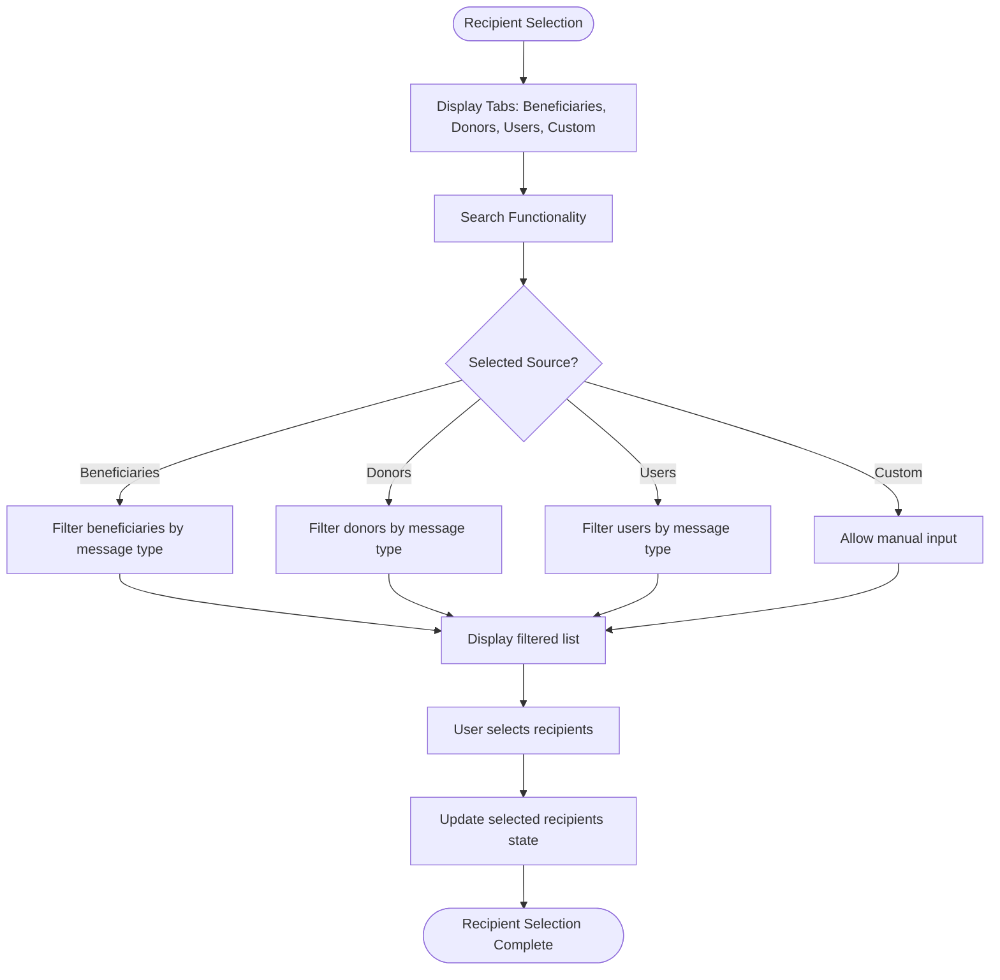
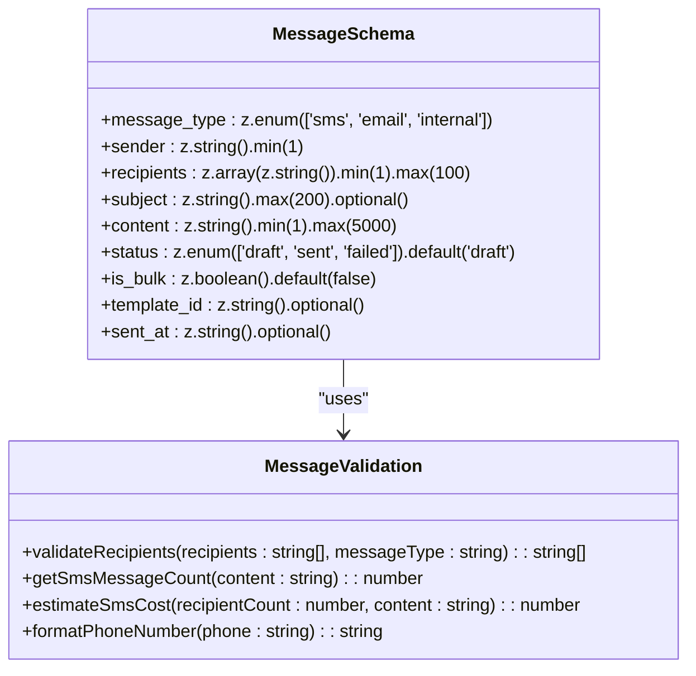
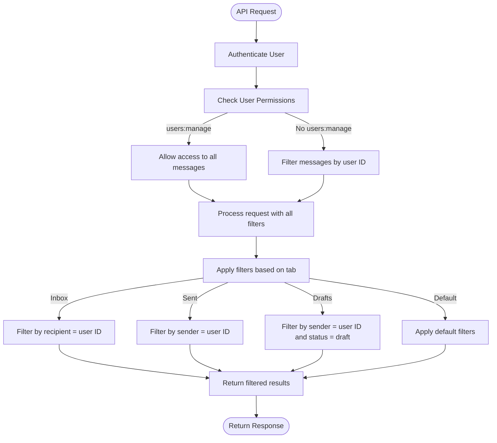
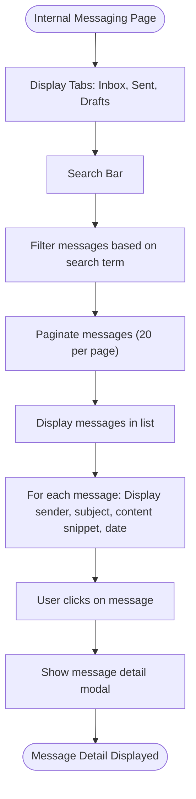
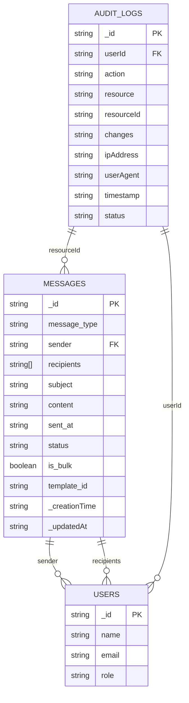

# Internal Messaging

<cite>
**Referenced Files in This Document**   
- [messages.ts](file://convex/messages.ts)
- [schema.ts](file://convex/schema.ts)
- [MessageForm.tsx](file://src/components/forms/MessageForm.tsx)
- [RecipientSelector.tsx](file://src/components/messages/RecipientSelector.tsx)
- [message.ts](file://src/lib/validations/message.ts)
- [message.tsx](file://src/app/(dashboard)/mesaj/kurum-ici/page.tsx)
- [route.ts](file://src/app/api/messages/route.ts)
- [database.ts](file://src/types/database.ts)
</cite>

## Table of Contents

1. [Introduction](#introduction)
2. [Core Components](#core-components)
3. [Architecture Overview](#architecture-overview)
4. [Detailed Component Analysis](#detailed-component-analysis)
5. [Message Validation and Security](#message-validation-and-security)
6. [User Interface and Experience](#user-interface-and-experience)
7. [Audit and Tracking](#audit-and-tracking)
8. [Conclusion](#conclusion)

## Introduction

The Internal Messaging feature enables authenticated users within the organization to send and receive messages securely. This system is built on Convex functions for data storage and retrieval, with messages stored in the 'messages' collection where `message_type='internal'`. The feature supports message composition with subject and content fields, recipient selection from the user directory, and message threading. It includes robust validation rules, permission checks for message visibility based on user roles, and comprehensive audit requirements for message tracking. The implementation ensures that only authorized users can access messages, with administrators having broader visibility while regular users can only view messages they sent or received.

## Core Components

The Internal Messaging system is composed of several key components that work together to provide a seamless messaging experience. The backend is powered by Convex functions that handle message creation, listing, retrieval, updating, and deletion. The frontend consists of React components that provide the user interface for composing and viewing messages. The system uses a dedicated 'messages' collection in the database with specific fields for message type, sender, recipients, subject, content, status, and other metadata. Validation is enforced through Zod schemas to ensure data integrity, and permission checks are implemented to control message visibility based on user roles. The UI components are designed to be intuitive, with features like recipient selection, message threading, and different views for inbox, sent messages, and drafts.

**Section sources**

- [messages.ts](file://convex/messages.ts#L1-L141)
- [schema.ts](file://convex/schema.ts#L428-L458)
- [MessageForm.tsx](file://src/components/forms/MessageForm.tsx#L1-L626)
- [RecipientSelector.tsx](file://src/components/messages/RecipientSelector.tsx#L1-L603)
- [message.ts](file://src/lib/validations/message.ts#L1-L271)
- [message.tsx](<file://src/app/(dashboard)/mesaj/kurum-ici/page.tsx#L1-L695>)
- [route.ts](file://src/app/api/messages/route.ts#L1-L199)
- [database.ts](file://src/types/database.ts#L310-L320)

## Architecture Overview

The Internal Messaging architecture follows a clean separation between frontend and backend components, with Convex serving as the backend-as-a-service platform. The system is designed with security and scalability in mind, ensuring that messages are properly stored, retrieved, and protected based on user permissions.



**Diagram sources**

- [messages.ts](file://convex/messages.ts#L1-L141)
- [schema.ts](file://convex/schema.ts#L428-L458)
- [MessageForm.tsx](file://src/components/forms/MessageForm.tsx#L1-L626)
- [RecipientSelector.tsx](file://src/components/messages/RecipientSelector.tsx#L1-L603)
- [message.tsx](<file://src/app/(dashboard)/mesaj/kurum-ici/page.tsx#L1-L695>)
- [route.ts](file://src/app/api/messages/route.ts#L1-L199)

## Detailed Component Analysis

### Backend Implementation

The backend implementation of the Internal Messaging feature is centered around Convex functions that handle all CRUD operations for messages. The system uses a well-defined schema for the messages collection, with specific fields for different types of messages.

#### Message Schema and Database Structure

The message schema defines the structure of messages stored in the database, with specific fields for different message types and statuses.



**Diagram sources**

- [schema.ts](file://convex/schema.ts#L428-L458)
- [database.ts](file://src/types/database.ts#L310-L320)

#### Convex Functions for Message Operations

The Convex functions provide a secure and efficient way to interact with the messages collection, handling all the business logic for message operations.



**Diagram sources**

- [messages.ts](file://convex/messages.ts#L1-L141)
- [database.ts](file://src/types/database.ts#L310-L320)

### Frontend Implementation

The frontend implementation provides a user-friendly interface for composing, sending, and viewing internal messages. The components are designed to be modular and reusable, with clear separation of concerns.

#### Message Composition and Form Handling

The MessageForm component handles the composition of messages, providing a rich interface for users to create and send messages.



**Diagram sources**

- [MessageForm.tsx](file://src/components/forms/MessageForm.tsx#L1-L626)
- [route.ts](file://src/app/api/messages/route.ts#L130-L194)
- [messages.ts](file://convex/messages.ts#L82-L100)

#### Recipient Selection and Management

The RecipientSelector component provides a flexible way for users to select recipients from different sources, including beneficiaries, donors, and users.



**Diagram sources**

- [RecipientSelector.tsx](file://src/components/messages/RecipientSelector.tsx#L1-L603)
- [message.ts](file://src/lib/validations/message.ts#L190-L213)

## Message Validation and Security

The Internal Messaging system implements comprehensive validation and security measures to ensure data integrity and protect user privacy. These measures are applied at multiple levels, from the frontend user interface to the backend database operations.

### Message Validation Rules

The system uses Zod schemas to validate message data both on the frontend and backend, ensuring that all messages meet the required criteria before being stored.



**Diagram sources**

- [message.ts](file://src/lib/validations/message.ts#L33-L130)
- [message.ts](file://src/lib/validations/message.ts#L190-L237)

### Permission and Access Control

The system implements strict permission checks to ensure that users can only access messages they are authorized to view, based on their roles and permissions.



**Diagram sources**

- [route.ts](file://src/app/api/messages/route.ts#L37-L125)
- [messages.ts](file://convex/messages.ts#L5-L71)

## User Interface and Experience

The user interface for the Internal Messaging feature is designed to be intuitive and user-friendly, with a clean layout and clear navigation. The system provides different views for inbox, sent messages, and drafts, making it easy for users to manage their messages.

### Message List and Navigation

The message list interface provides a comprehensive view of all messages, with filtering and pagination capabilities.



**Diagram sources**

- [message.tsx](<file://src/app/(dashboard)/mesaj/kurum-ici/page.tsx#L43-L693>)
- [message.ts](file://src/lib/validations/message.ts#L151-L162)

### Message Composition Workflow

The message composition workflow guides users through the process of creating and sending messages, with clear steps and feedback.

```mermaid
flowchart TD
Start([Click "New Message"]) --> OpenModal["Open MessageForm modal"]
OpenModal --> SelectType["Select message type (SMS, Email, Internal)"]
SelectType --> AddRecipients["Add recipients using RecipientSelector"]
AddRecipients --> FillContent["Fill in subject and content"]
FillContent --> Preview["Preview message (optional)"]
Preview --> SendOrSave["Choose to send immediately or save as draft"]
SendOrSave --> |Send| ValidateAndSend["Validate and send message"]
SendOrSave --> |Save| SaveAsDraft["Save as draft"]
ValidateAndSend --> Confirmation["Show confirmation dialog for bulk messages"]
Confirmation --> Send["Send message"]
Send --> Success["Show success toast"]
SaveAsDraft --> Success
Success --> CloseModal["Close modal"]
CloseModal --> Refresh["Refresh message list"]
Refresh --> End([Message sent/saved])
```

**Diagram sources**

- [MessageForm.tsx](file://src/components/forms/MessageForm.tsx#L45-L624)
- [message.tsx](<file://src/app/(dashboard)/mesaj/kurum-ici/page.tsx#L219-L247>)

## Audit and Tracking

The Internal Messaging system includes comprehensive audit and tracking capabilities to ensure message integrity and provide a complete history of message operations.

### Message Status and Tracking

The system tracks the status of messages throughout their lifecycle, from draft to sent or failed.

```mermaid
stateDiagram-v2
[*] --> Draft
Draft --> Sent : "Send message"
Draft --> Deleted : "Delete message"
Sent --> [*]
Draft --> [*]
state Sent {
[*] --> Delivered
Delivered --> Read : "Recipient reads message"
Read --> [*]
}
state Draft {
[*] --> Editing
Editing --> Saved : "Save changes"
Saved --> Draft
}
```

**Diagram sources**

- [messages.ts](file://convex/messages.ts#L90-L91)
- [database.ts](file://src/types/database.ts#L318-L319)

### Audit Requirements

The system logs all message operations for audit purposes, ensuring that there is a complete record of all message activities.



**Diagram sources**

- [messages.ts](file://convex/messages.ts#L1-L141)
- [schema.ts](file://convex/schema.ts#L428-L458)
- [database.ts](file://src/types/database.ts#L310-L320)

## Conclusion

The Internal Messaging feature provides a robust and secure way for authenticated users within the organization to communicate. By leveraging Convex functions for data storage and retrieval, the system ensures that messages are properly stored in the 'messages' collection with `message_type='internal'`. The implementation includes comprehensive validation rules to ensure data integrity, permission checks to control message visibility based on user roles, and audit requirements for message tracking. The user interface is designed to be intuitive, with features like message composition with subject and content fields, recipient selection from the user directory, and message threading. The system supports different views for inbox, sent messages, and drafts, making it easy for users to manage their messages. Overall, the Internal Messaging feature provides a complete solution for internal communication within the organization, with a focus on security, usability, and reliability.
