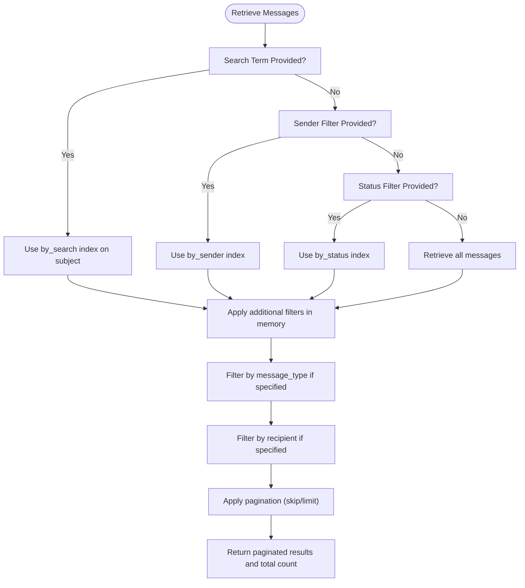
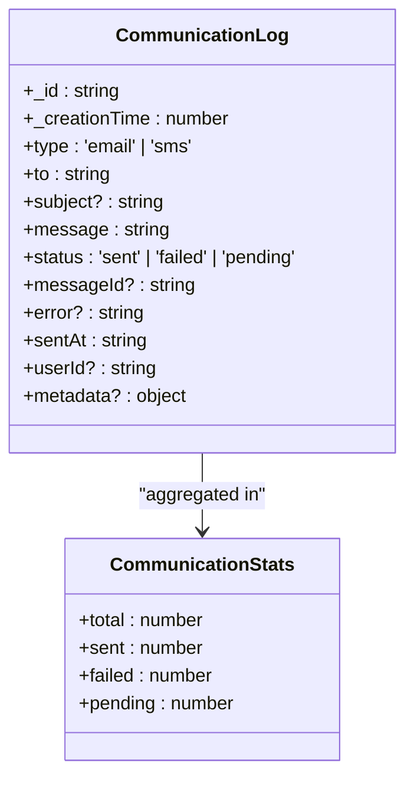
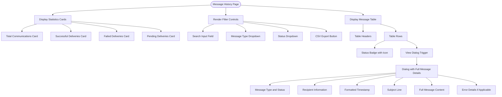

# Message History

<cite>
**Referenced Files in This Document**   
- [messages.ts](file://convex/messages.ts)
- [communication_logs.ts](file://convex/communication_logs.ts)
- [page.tsx](file://src/app/(dashboard)/mesaj/gecmis/page.tsx)
- [message.ts](file://src/lib/validations/message.ts)
</cite>

## Table of Contents

1. [Introduction](#introduction)
2. [Message Storage and Data Model](#message-storage-and-data-model)
3. [Message Retrieval and Filtering](#message-retrieval-and-filtering)
4. [Communication Logs and Delivery Tracking](#communication-logs-and-delivery-tracking)
5. [UI Components and Message Display](#ui-components-and-message-display)
6. [Search Functionality and Convex Indexes](#search-functionality-and-convex-indexes)
7. [Data Retention and Audit Integration](#data-retention-and-audit-integration)

## Introduction

The Message History feature provides a comprehensive interface for users to view, search, and manage their sent and received messages across all communication channels. This system supports multiple message types including SMS, email, and internal messages, with robust filtering, search capabilities, and delivery status tracking. The implementation leverages Convex database for storage and querying, with specialized indexes to optimize search performance. Users can access message threads, view detailed delivery logs, and analyze communication statistics through an intuitive interface with proper date formatting and status indicators.

## Message Storage and Data Model

Messages are stored in the 'messages' collection within the Convex database, with each message containing comprehensive metadata including sender, recipients, message type, status, subject, content, and timestamps. The data model supports three distinct message types: SMS, email, and internal messages, each with specific validation requirements. Messages can exist in various statuses including draft, sent, and failed, allowing users to track the lifecycle of their communications. The storage design includes support for bulk messaging through the is_bulk flag, and template-based messaging through the template_id field. Message metadata is enriched with sender information and recipient details to facilitate comprehensive search and filtering capabilities.

**Section sources**

- [messages.ts](file://convex/messages.ts#L82-L100)
- [message.ts](file://src/lib/validations/message.ts#L33-L50)

## Message Retrieval and Filtering

The system provides robust message retrieval capabilities through the list query in the messages module, supporting multiple filtering options. Users can filter messages by status (draft, sent, failed), message type (SMS, email, internal), sender, recipient, and perform full-text search on message subjects. The implementation uses Convex indexes to optimize query performance, with different indexes for sender, status, and search operations. When multiple filters are applied, the system first uses index-based queries for optimal performance, then applies additional filtering in memory. The retrieval system implements pagination with limit and skip parameters to handle large result sets efficiently, returning both the paginated results and total count for UI display.

**Diagram sources **

- [messages.ts](file://convex/messages.ts#L4-L71)

**Section sources**

- [messages.ts](file://convex/messages.ts#L4-L71)
- [page.tsx](<file://src/app/(dashboard)/mesaj/gecmis/page.tsx#L69-L117>)

## Communication Logs and Delivery Tracking

Delivery logs are stored in a separate 'communication_logs' collection to track the actual delivery status of messages, particularly for external channels like email and SMS. Each log entry contains detailed information about the delivery attempt including type (email or SMS), recipient, subject, message content, status (sent, failed, pending), error details if applicable, and timestamps. The system provides statistics on communication performance through the getStats query, which calculates totals and breakdowns by status over specified date ranges. These logs are used to provide users with detailed delivery status information, including error messages when delivery fails. The separation of message metadata from delivery logs allows for efficient querying and reporting on communication success rates.

**Diagram sources **

- [communication_logs.ts](file://convex/communication_logs.ts#L1-L98)
- [page.tsx](<file://src/app/(dashboard)/mesaj/gecmis/page.tsx#L98-L106>)

**Section sources**

- [communication_logs.ts](file://convex/communication_logs.ts#L1-L98)
- [page.tsx](<file://src/app/(dashboard)/mesaj/gecmis/page.tsx#L98-L106>)

## UI Components and Message Display

The user interface for message history is implemented in the gecmis page component, providing a comprehensive dashboard for viewing and managing communications. The UI displays message statistics through cards showing total communications, successful deliveries, failures, and pending messages, with visual indicators for each status. Users can filter messages using dropdown selectors for type and status, along with a search input for free-text search. The message list is presented in a table format with columns for date, type, recipient, subject, status, and sender, with proper Turkish date formatting using date-fns. Status indicators use colored badges with appropriate icons to visually distinguish between sent, failed, and pending messages. Users can view detailed message information through a modal dialog that displays the full message content, delivery details, and any error information.

**Section sources**

- [page.tsx](<file://src/app/(dashboard)/mesaj/gecmis/page.tsx#L68-L444>)

## Search Functionality and Convex Indexes

The search functionality is implemented using Convex indexes to ensure fast and efficient querying of message data. The system uses a dedicated search index called 'by_search' on the subject field of messages, allowing for full-text search capabilities. When a search term is provided, the system uses this index to quickly retrieve relevant messages before applying additional filters in memory. The search is case-insensitive and trims whitespace from the search term. For non-search queries, the system uses different indexes based on the provided filters: 'by_sender' for sender filtering, 'by_status' for status filtering, and falls back to a full collection scan when no specific filters are applied. This indexing strategy ensures optimal performance for the most common filtering scenarios while maintaining flexibility for complex queries with multiple criteria.

**Section sources**

- [messages.ts](file://convex/messages.ts#L26-L30)
- [messages.ts](file://convex/messages.ts#L32-L43)
- [page.tsx](<file://src/app/(dashboard)/mesaj/gecmis/page.tsx#L109-L118>)

## Data Retention and Audit Integration

The message history system is designed with data retention and audit requirements in mind. While the primary message metadata is stored in the 'messages' collection, detailed delivery logs are maintained in the 'communication_logs' collection, providing a complete audit trail of all communication attempts. The system integrates with the broader audit framework through shared user identification and timestamping standards. Communication logs include userId references to link messages to specific users for audit purposes. The data model includes creation timestamps and, for sent messages, explicit sentAt timestamps to establish a clear timeline of events. The system supports data export functionality through CSV export, allowing for offline analysis and compliance reporting. Retention policies are enforced at the application level, with older messages and logs potentially subject to archival or deletion based on organizational policies.

**Section sources**

- [communication_logs.ts](file://convex/communication_logs.ts#L1-L98)
- [messages.ts](file://convex/messages.ts#L1-L141)
- [page.tsx](<file://src/app/(dashboard)/mesaj/gecmis/page.tsx#L156-L177>)
