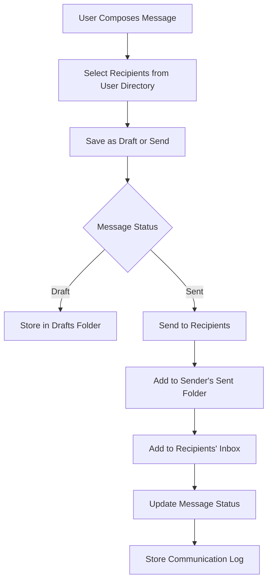
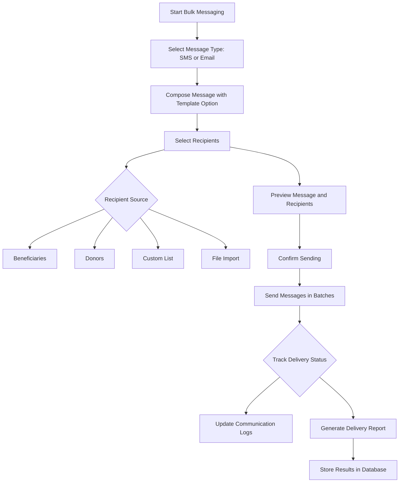
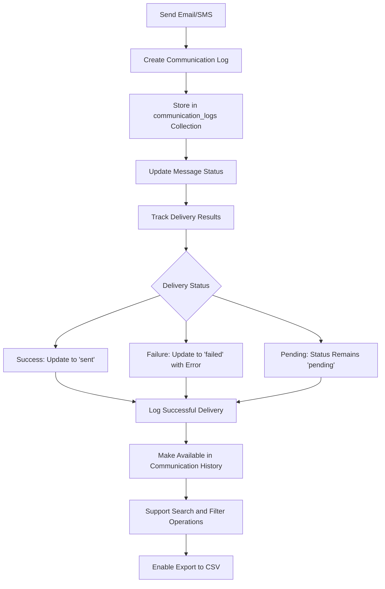
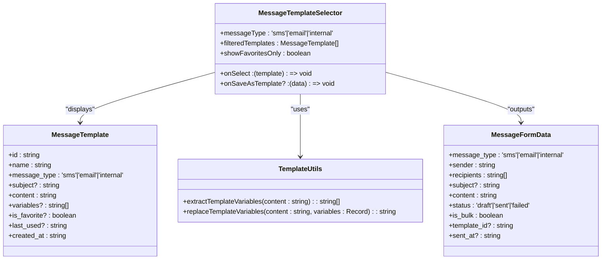
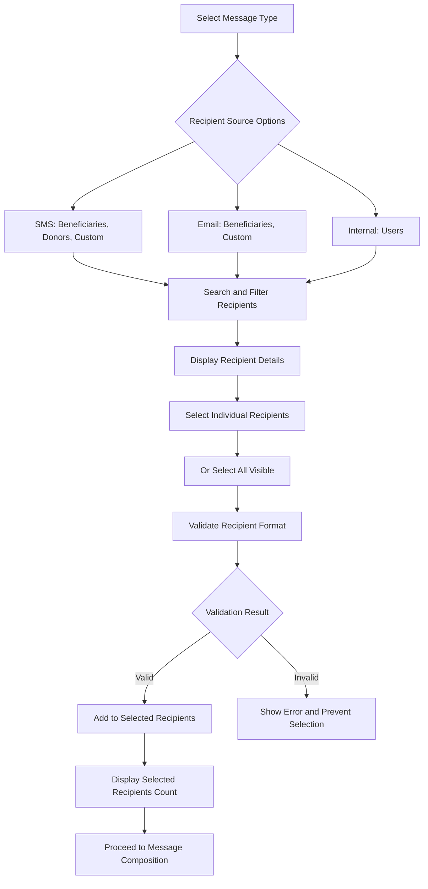
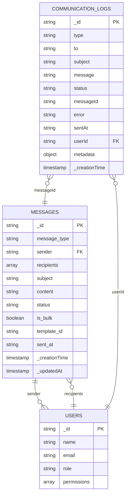
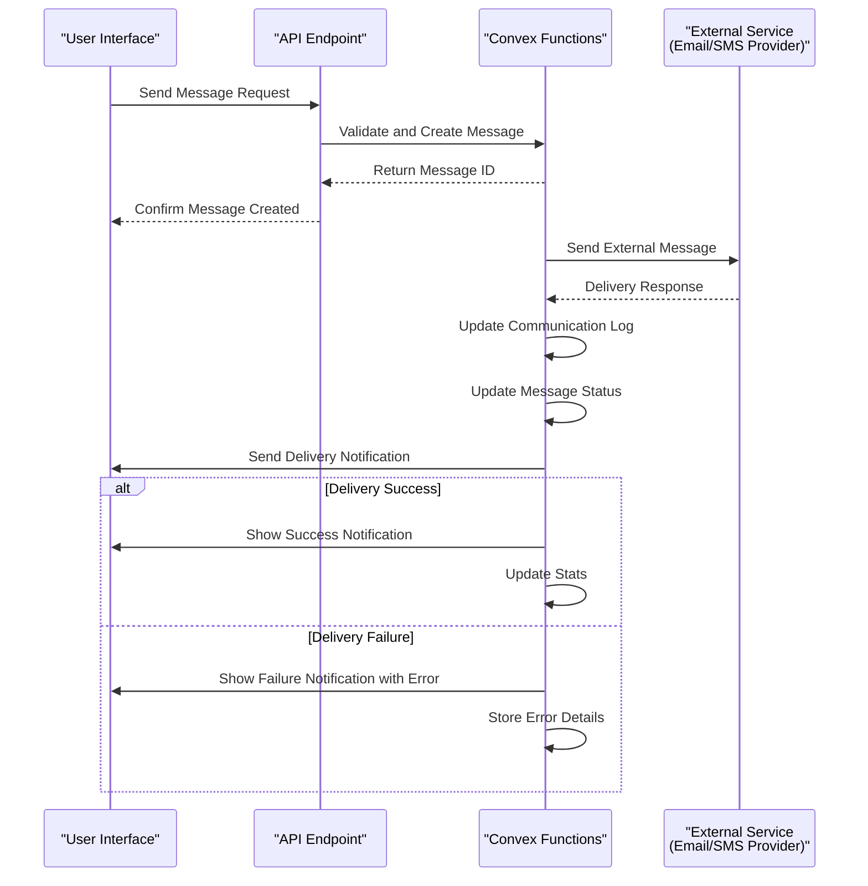
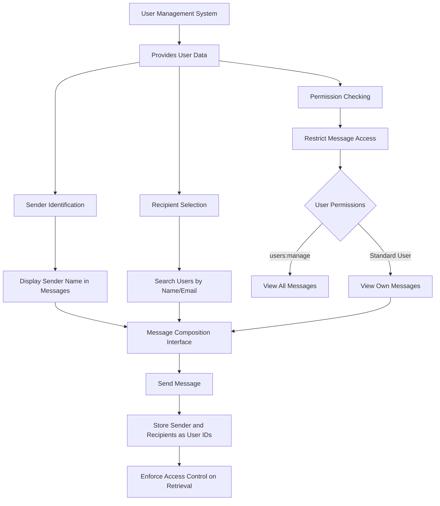
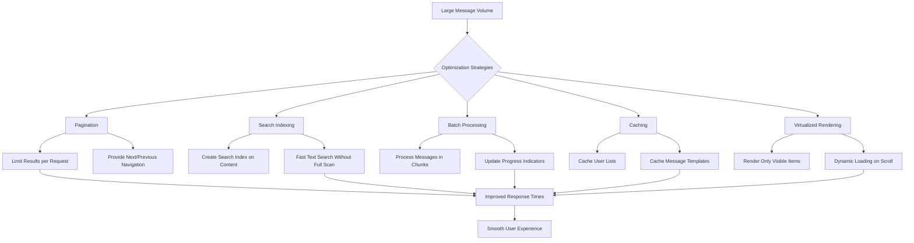
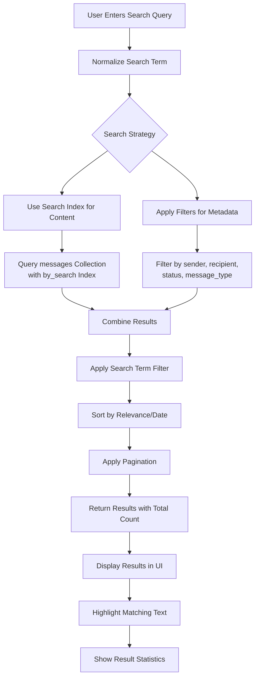

# Messaging System

<cite>
**Referenced Files in This Document**   
- [messages.ts](file://convex/messages.ts)
- [communication_logs.ts](file://convex/communication_logs.ts)
- [route.ts](file://src/app/api/messages/route.ts)
- [message.ts](file://src/lib/validations/message.ts)
- [MessageTemplateSelector.tsx](file://src/components/messages/MessageTemplateSelector.tsx)
- [RecipientSelector.tsx](file://src/components/messages/RecipientSelector.tsx)
- [kurum-ici/page.tsx](file://src/app/(dashboard)/mesaj/kurum-ici/page.tsx)
- [toplu/page.tsx](file://src/app/(dashboard)/mesaj/toplu/page.tsx)
- [gecmis/page.tsx](file://src/app/(dashboard)/mesaj/gecmis/page.tsx)
</cite>

## Table of Contents

1. [Introduction](#introduction)
2. [Core Components](#core-components)
3. [Internal Messaging](#internal-messaging)
4. [Bulk Messaging](#bulk-messaging)
5. [Communication History Tracking](#communication-history-tracking)
6. [Message Composition and Templates](#message-composition-and-templates)
7. [Recipient Selection](#recipient-selection)
8. [Storage and Retrieval](#storage-and-retrieval)
9. [Delivery Status and Notifications](#delivery-status-and-notifications)
10. [Integration with User Management](#integration-with-user-management)
11. [Performance Optimization](#performance-optimization)
12. [Search Functionality](#search-functionality)

## Introduction

The Messaging System module provides comprehensive communication capabilities for the application, supporting internal messaging, bulk messaging via SMS and email, and detailed communication history tracking. The system is built on Convex functions for data operations and integrates with user management, workflow notifications, and audit requirements. This documentation covers the implementation of message composition, template usage, recipient selection, storage and retrieval mechanisms, delivery status tracking, and performance optimization for handling large message volumes.

## Core Components

The Messaging System consists of several core components that work together to provide a complete messaging solution. The system uses Convex as the backend database and serverless functions, with React components for the frontend interface. Key components include message storage and retrieval, communication logging, template management, recipient selection, and user interface components for message composition and history viewing.

**Section sources**

- [messages.ts](file://convex/messages.ts#L1-L141)
- [communication_logs.ts](file://convex/communication_logs.ts#L1-L98)
- [route.ts](file://src/app/api/messages/route.ts#L1-L199)

## Internal Messaging

The internal messaging system enables users to send private messages within the organization. Users can compose messages, select recipients from the user directory, and organize messages into inbox, sent, and drafts folders. The system supports message threading, allowing users to view message conversations in chronological order. Each message includes metadata such as sender, recipients, subject, content, status, and timestamps for creation and sending.

The implementation uses Convex queries to retrieve messages filtered by sender, recipient, status, and message type. The frontend interface provides tabs for different message views (inbox, sent, drafts) with appropriate filtering. Users can search messages by content, subject, or sender, and the system supports pagination for efficient loading of message lists.

**Diagram sources**

- [messages.ts](file://convex/messages.ts#L5-L71)
- [route.ts](file://src/app/api/messages/route.ts#L38-L111)
- [kurum-ici/page.tsx](<file://src/app/(dashboard)/mesaj/kurum-ici/page.tsx#L1-L695>)

## Bulk Messaging

The bulk messaging feature allows administrators to send SMS and email messages to multiple recipients simultaneously. The system provides a wizard interface that guides users through message composition, recipient selection, preview, and sending. Before sending, users can review the message content, recipient count, estimated cost (for SMS), and expected delivery time.

The implementation includes validation to ensure recipients are properly formatted (phone numbers for SMS, email addresses for email). The system supports importing recipient lists from CSV files and exporting selected recipients. During the sending process, the system tracks progress and provides real-time feedback on successful and failed deliveries. After sending, users can download a detailed report of the messaging campaign.

**Diagram sources**

- [toplu/page.tsx](<file://src/app/(dashboard)/mesaj/toplu/page.tsx#L1-L787>)
- [RecipientSelector.tsx](file://src/components/messages/RecipientSelector.tsx#L1-L603)
- [message.ts](file://src/lib/validations/message.ts#L1-L271)

## Communication History Tracking

The communication history system tracks all email and SMS communications sent through the platform. Each communication log entry includes the message type, recipient, subject, message content, status (sent, failed, pending), timestamp, and optional error information. The system provides comprehensive search and filtering capabilities, allowing users to find specific communications by type, status, date range, or content.

Administrators can view detailed statistics on communication success rates, including total messages sent, successful deliveries, failures, and pending messages. The interface includes a table view of communication logs with the ability to drill down into individual message details. Users can export communication history data to CSV format for external analysis or reporting purposes.

**Diagram sources**

- [communication_logs.ts](file://convex/communication_logs.ts#L1-L98)
- [gecmis/page.tsx](<file://src/app/(dashboard)/mesaj/gecmis/page.tsx#L1-L444>)
- [messages.ts](file://convex/messages.ts#L82-L101)

## Message Composition and Templates

The message composition system provides a rich interface for creating messages with support for templates to ensure consistency and save time. Users can create, save, and reuse message templates for common communication scenarios. Templates can include variables that are dynamically replaced with recipient-specific information when the message is sent.

The template system includes predefined templates for common use cases such as donation receipts, annual reports, event invitations, task assignments, and approval requests. Users can create custom templates and mark them as favorites for quick access. When using a template, variables are automatically extracted and displayed, helping users understand what personalization is available.

**Diagram sources**

- [MessageTemplateSelector.tsx](file://src/components/messages/MessageTemplateSelector.tsx#L1-L522)
- [message.ts](file://src/lib/validations/message.ts#L132-L271)
- [messages.ts](file://convex/messages.ts#L82-L101)

## Recipient Selection

The recipient selection system provides a flexible interface for choosing message recipients from various sources. Users can select recipients from beneficiaries, donors, or internal users, depending on the message type. The system validates recipient information to ensure it matches the requirements for the selected message type (phone numbers for SMS, email addresses for email, user IDs for internal messages).

The interface includes tabs for different recipient sources, with search functionality to quickly find specific recipients. Users can select individual recipients or use the "select all" option to choose all visible recipients. The system displays recipient information such as name, contact details, city (for beneficiaries), and last donation date (for donors) to help users make informed selection decisions.

**Diagram sources**

- [RecipientSelector.tsx](file://src/components/messages/RecipientSelector.tsx#L1-L603)
- [message.ts](file://src/lib/validations/message.ts#L191-L214)
- [toplu/page.tsx](<file://src/app/(dashboard)/mesaj/toplu/page.tsx#L507-L512>)

## Storage and Retrieval

The messaging system uses Convex as the primary storage mechanism for messages and communication logs. Messages are stored in the "messages" collection with fields for message type, sender, recipients, subject, content, status, and timestamps. Communication logs are stored in a separate "communication_logs" collection that tracks the delivery status of external messages (email and SMS).

The system implements efficient querying with appropriate indexes to support common access patterns. Messages can be retrieved by ID, filtered by sender, recipient, status, message type, or searched by content. The API layer provides endpoints for listing, creating, updating, and deleting messages, with proper authentication and authorization checks to ensure users can only access messages they are permitted to see.

**Diagram sources**

- [messages.ts](file://convex/messages.ts#L1-L141)
- [communication_logs.ts](file://convex/communication_logs.ts#L1-L98)
- [schema.ts](file://convex/schema.ts)

## Delivery Status and Notifications

The system tracks the delivery status of all messages, providing real-time feedback to users about the success or failure of their communications. For internal messages, the status is updated when the message is sent or saved as a draft. For external messages (email and SMS), the system creates communication log entries that are updated based on delivery results from the external services.

The implementation includes mechanisms to handle failed deliveries, with error details stored in the communication logs. Users can view delivery statistics, including success rates and common failure reasons. The system supports retrying failed messages, either individually or as a group, and provides detailed reports on delivery outcomes that can be exported for analysis.

**Diagram sources**

- [communication_logs.ts](file://convex/communication_logs.ts#L12-L28)
- [messages.ts](file://convex/messages.ts#L82-L101)
- [gecmis/page.tsx](<file://src/app/(dashboard)/mesaj/gecmis/page.tsx#L75-L96>)

## Integration with User Management

The messaging system is tightly integrated with the user management system, leveraging user data for sender identification, recipient selection, and permission control. The system uses user IDs to identify senders and recipients, ensuring accurate message routing and access control. User roles and permissions determine what messaging capabilities are available to each user.

Administrators with appropriate permissions can view all messages, while regular users can only access messages where they are the sender or recipient. The system displays user names and roles in message interfaces, providing context about the participants in a conversation. User profile information is used to personalize messages and templates, and user activity is logged for audit purposes.

**Diagram sources**

- [users.ts](file://convex/users.ts)
- [messages.ts](file://convex/messages.ts#L4-L71)
- [route.ts](file://src/app/api/messages/route.ts#L43-L65)

## Performance Optimization

The messaging system implements several performance optimizations to handle large volumes of messages efficiently. The system uses pagination for message lists, limiting the number of records retrieved in a single query and providing a smooth user experience even with thousands of messages. Search functionality is optimized with Convex search indexes to quickly find messages by content without scanning the entire collection.

For bulk messaging operations, the system processes messages in batches to avoid timeouts and memory issues. The implementation includes client-side caching of frequently accessed data such as user lists and message templates to reduce server requests. The frontend interface uses virtualized rendering for long lists of messages or recipients, ensuring smooth scrolling and responsive interactions.

**Diagram sources**

- [messages.ts](file://convex/messages.ts#L16-L17)
- [messages.ts](file://convex/messages.ts#L26-L30)
- [toplu/page.tsx](<file://src/app/(dashboard)/mesaj/toplu/page.tsx#L182-L191>)
- [kurum-ici/page.tsx](<file://src/app/(dashboard)/mesaj/kurum-ici/page.tsx#L58-L59>)

## Search Functionality

The messaging system provides robust search capabilities across message content, subjects, senders, and recipients. Users can search for messages using keywords that are matched against the message content, subject, and sender/recipient information. The search is case-insensitive and supports partial matching to help users find relevant messages even with incomplete search terms.

The implementation uses Convex's search index functionality to provide fast and efficient search operations. When a search query is submitted, the system first attempts to use the search index for content matching, then applies additional filters for sender, recipient, status, and message type. Search results are displayed with the matching text highlighted, and the system shows the total number of results and allows pagination through large result sets.

**Diagram sources**

- [messages.ts](file://convex/messages.ts#L26-L30)
- [messages.ts](file://convex/messages.ts#L47-L54)
- [route.ts](file://src/app/api/messages/route.ts#L39-L40)
- [kurum-ici/page.tsx](<file://src/app/(dashboard)/mesaj/kurum-ici/page.tsx#L319-L322>)
