# Partner Management

<cite>
**Referenced Files in This Document**   
- [partners.ts](file://convex/partners.ts)
- [liste\page.tsx](file://src/app/(dashboard)/partner/liste/page.tsx)
- [route.ts](file://src/app/api/partners/route.ts)
- [\[id\]\route.ts](file://src/app/api/partners/[id]/route.ts)
- [schema.ts](file://convex/schema.ts)
</cite>

## Table of Contents

1. [Introduction](#introduction)
2. [Partner Data Model](#partner-data-model)
3. [CRUD Operations Implementation](#crud-operations-implementation)
4. [Partner Listing Interface](#partner-listing-interface)
5. [Data Validation and Workflows](#data-validation-and-workflows)
6. [Integration with Other Modules](#integration-with-other-modules)
7. [Common Use Cases](#common-use-cases)
8. [Audit Logging and Security](#audit-logging-and-security)

## Introduction

The Partner Management module provides comprehensive functionality for managing organizational relationships with various types of partners including corporate partners, sponsors, and institutional collaborators. This system enables the registration, listing, and relationship tracking of partners through a robust CRUD (Create, Read, Update, Delete) interface. The implementation leverages Convex as the backend database and API layer, with a React-based frontend interface for user interaction. The module supports advanced features such as filtering, searching, and exporting partner data, while maintaining integration with user management, donation tracking, and reporting systems.

## Partner Data Model

The partner data model is designed to capture comprehensive information about organizational relationships. The schema defines various attributes that categorize partners and track their engagement status.

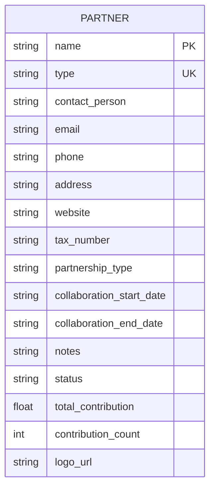

**Diagram sources**

- [schema.ts](file://convex/schema.ts#L783-L812)
- [partners.ts](file://convex/partners.ts#L4-L117)

**Section sources**

- [partners.ts](file://convex/partners.ts#L4-L117)
- [schema.ts](file://convex/schema.ts#L783-L812)

## CRUD Operations Implementation

The Partner Management module implements a complete set of CRUD operations through Convex functions, enabling full lifecycle management of partner records.

### Create Operation

The `createPartner` mutation handles the creation of new partner records with comprehensive validation:

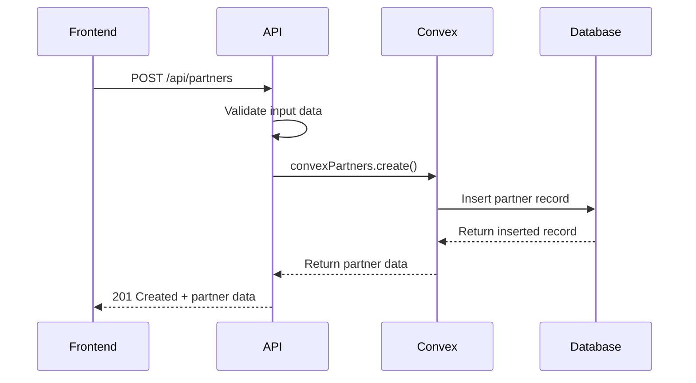

**Diagram sources**

- [partners.ts](file://convex/partners.ts#L92-L124)
- [route.ts](file://src/app/api/partners/route.ts#L133-L194)

### Read Operations

The module provides multiple query functions for retrieving partner data:

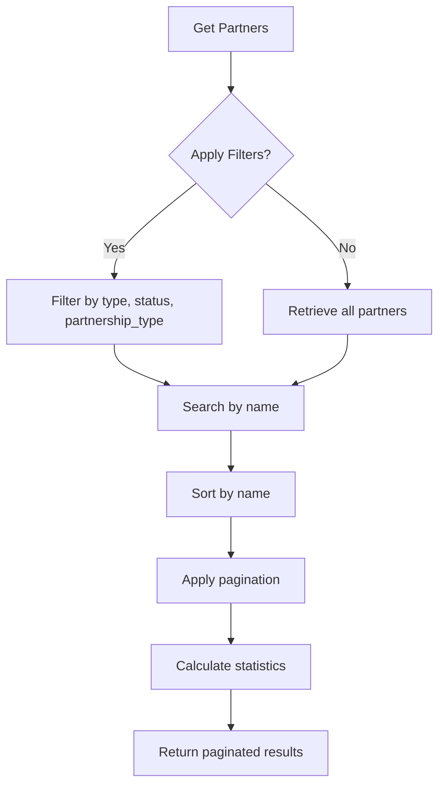

**Diagram sources**

- [partners.ts](file://convex/partners.ts#L4-L79)
- [route.ts](file://src/app/api/partners/route.ts#L86-L127)

### Update and Delete Operations

The update and delete operations follow a consistent pattern with proper error handling:

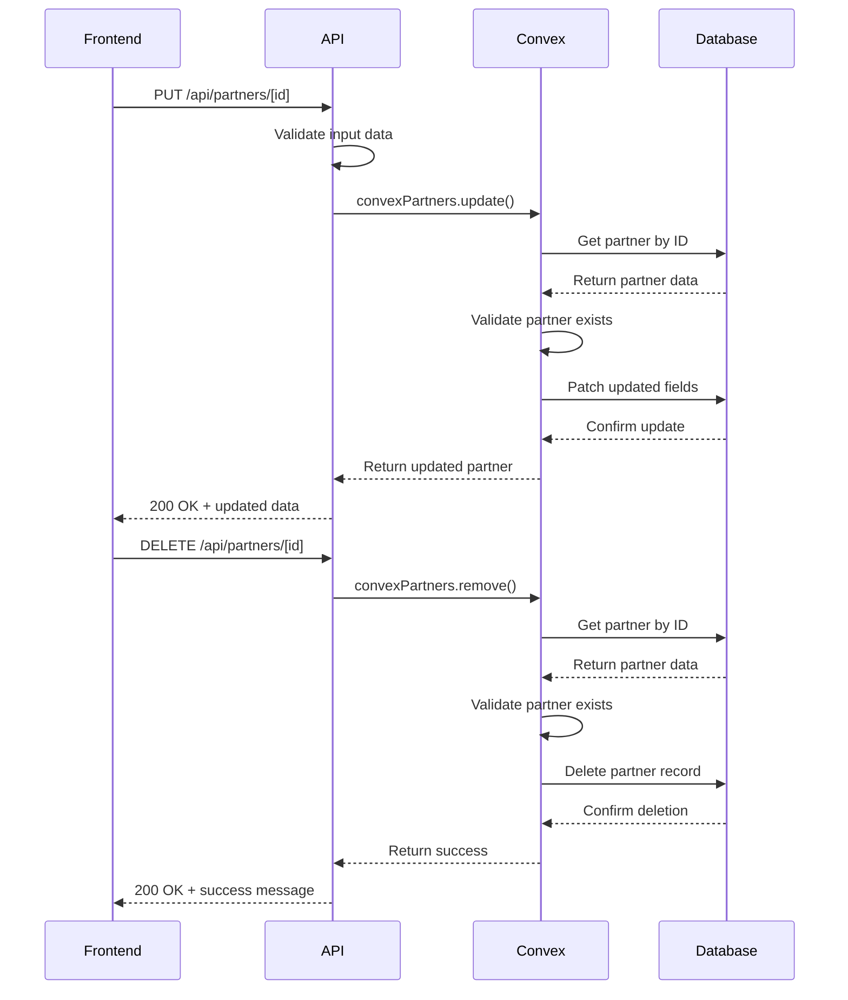

**Diagram sources**

- [partners.ts](file://convex/partners.ts#L127-L181)
- [\[id\]\route.ts](file://src/app/api/partners/[id]/route.ts#L111-L214)

**Section sources**

- [partners.ts](file://convex/partners.ts#L92-L181)
- [route.ts](file://src/app/api/partners/route.ts#L133-L194)
- [\[id\]\route.ts](file://src/app/api/partners/[id]/route.ts#L73-L214)

## Partner Listing Interface

The partner listing interface provides a comprehensive view of all partners with filtering, searching, and management capabilities.

### Interface Components

The interface is built using React components with the following structure:

```mermaid
classDiagram
class PartnersPage {
+string searchTerm
+string typeFilter
+string statusFilter
+boolean isCreateModalOpen
+boolean isEditModalOpen
+Partner editingPartner
+FormData formData
+useQuery data
+useMemo partners
+useMemo filteredPartners
}
class Partner {
+string _id
+string name
+string type
+string contact_person
+string email
+string phone
+string address
+string website
+string tax_number
+string partnership_type
+string collaboration_start_date
+string collaboration_end_date
+string notes
+string status
+number total_contribution
+number contribution_count
+string logo_url
}
PartnersPage --> Partner : displays
PartnersPage --> "API Client" : uses
"API Client" --> PartnersPage : returns data
```

**Diagram sources**

- [liste\page.tsx](<file://src/app/(dashboard)/partner/liste/page.tsx#L66-L642>)

### Filtering and Searching

The interface supports multiple filtering and searching mechanisms:

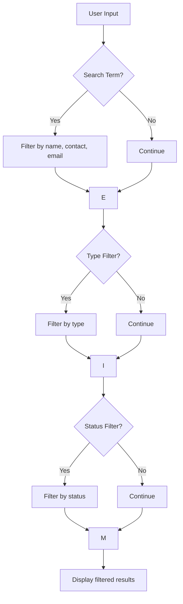

**Section sources**

- [liste\page.tsx](<file://src/app/(dashboard)/partner/liste/page.tsx#L88-L114>)

## Data Validation and Workflows

The Partner Management module implements comprehensive data validation and status workflows to ensure data integrity.

### Data Validation Rules

The system enforces validation rules at both the API and frontend levels:

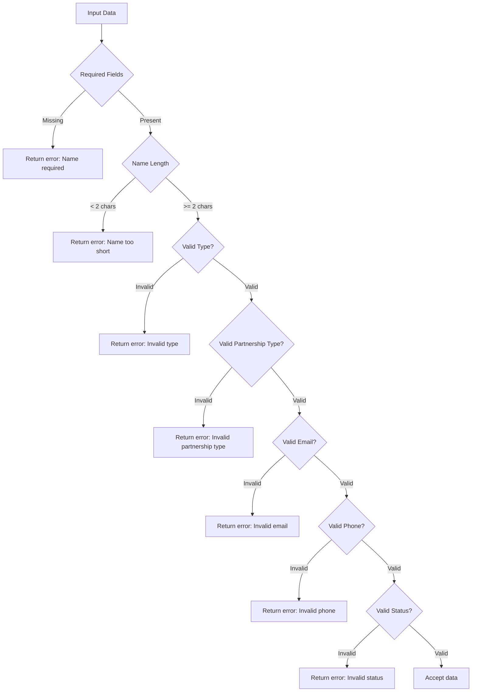

**Section sources**

- [route.ts](file://src/app/api/partners/route.ts#L46-L80)
- [\[id\]\route.ts](file://src/app/api/partners/[id]/route.ts#L33-L67)

### Partnership Status Workflow

The system implements a state-based workflow for partner status management:

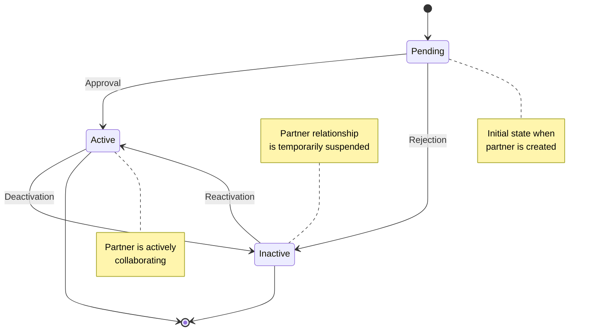

**Section sources**

- [partners.ts](file://convex/partners.ts#L15-L16)
- [liste\page.tsx](<file://src/app/(dashboard)/partner/liste/page.tsx#L194-L204>)

## Integration with Other Modules

The Partner Management module integrates with several other system components to provide a cohesive experience.

### Donation Tracking Integration

The system synchronizes partner contribution data with the donation tracking module:

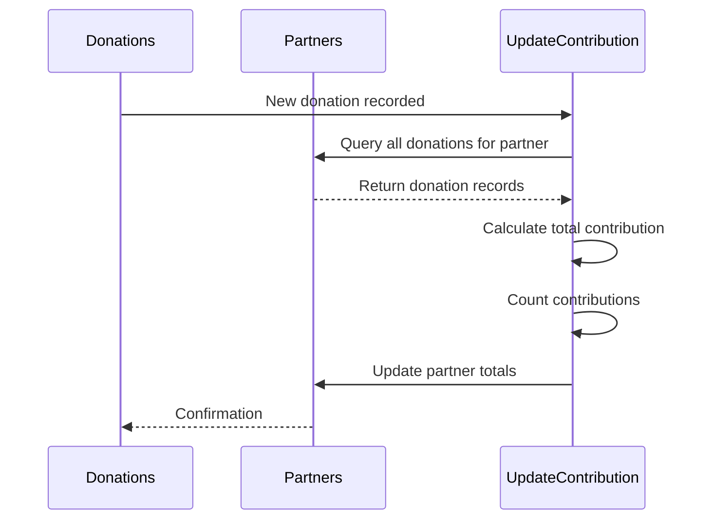

**Section sources**

- [partners.ts](file://convex/partners.ts#L184-L220)

### Reporting Module Integration

Partner data is integrated with the reporting system for analytics and export:

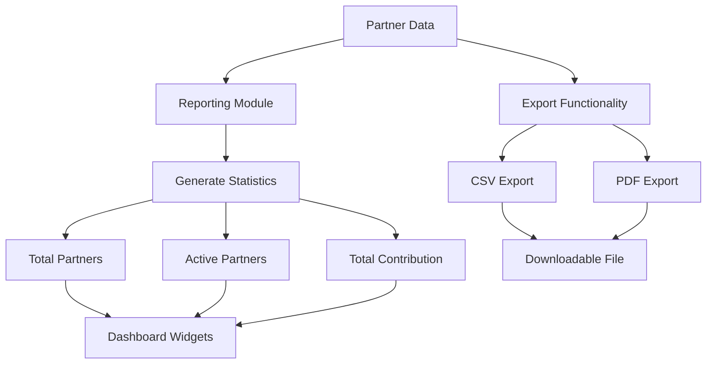

**Section sources**

- [partners.ts](file://convex/partners.ts#L62-L77)
- [liste\page.tsx](<file://src/app/(dashboard)/partner/liste/page.tsx#L274>)

## Common Use Cases

The Partner Management module supports several common organizational scenarios.

### Corporate Partners

For corporate partners, the system captures business-specific information:

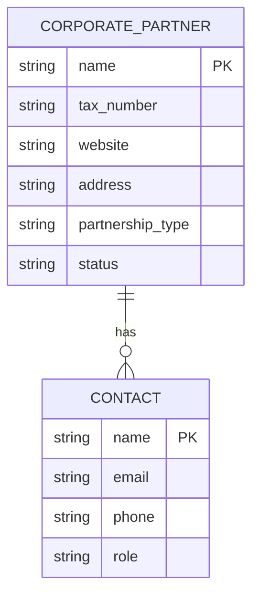

**Section sources**

- [partners.ts](file://convex/partners.ts#L96-L103)

### Sponsors

The system handles sponsor relationships with specific tracking:

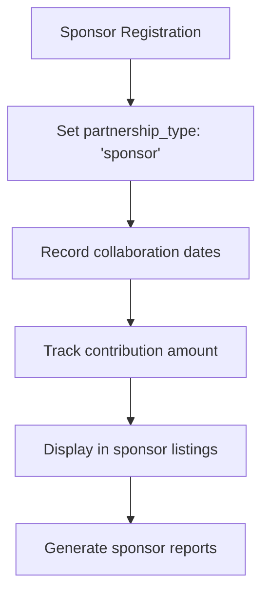

**Section sources**

- [partners.ts](file://convex/partners.ts#L103-L108)

### Institutional Collaborators

For institutional collaborators, the system maintains formal relationship data:

```mermaid
classDiagram
class InstitutionalCollaborator {
+string name
+string type
+string contact_person
+string email
+string phone
+string address
+string partnership_type
+string collaboration_start_date
+string collaboration_end_date
+string agreement_file_id
+string status
}
InstitutionalCollaborator : Required fields : name, type, contact_person, email, partnership_type, collaboration_start_date, status
InstitutionalCollaborator : Optional fields : phone, address, collaboration_end_date, agreement_file_id
```

**Section sources**

- [partners.ts](file://convex/partners.ts#L4-L117)

## Audit Logging and Security

The system implements security measures and audit capabilities for partner management.

### Error Handling and Logging

The API endpoints include comprehensive error handling:

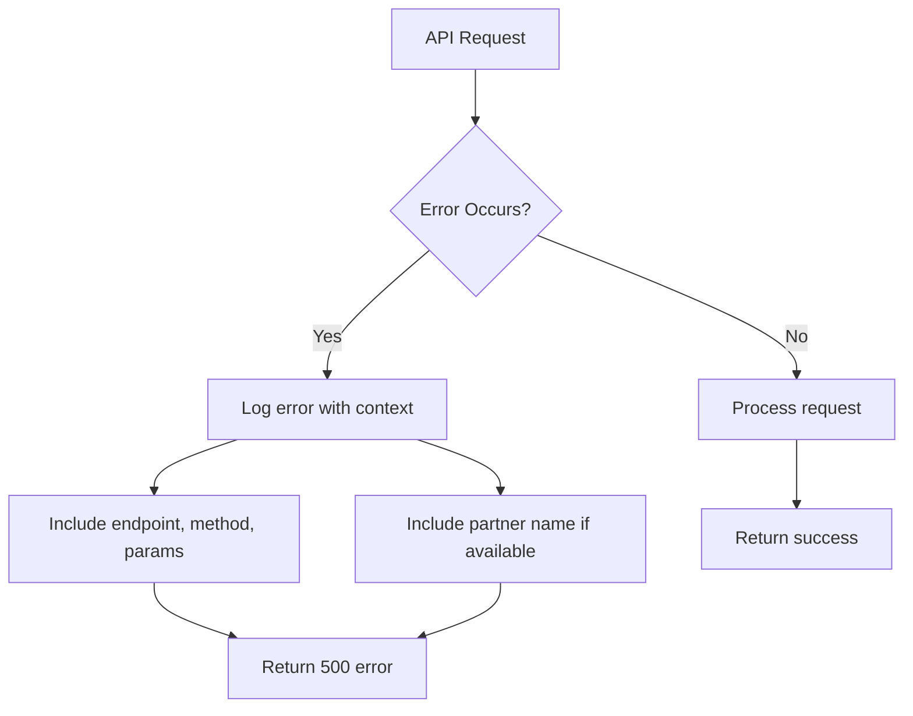

**Section sources**

- [route.ts](file://src/app/api/partners/route.ts#L116-L126)
- [\[id\]\route.ts](file://src/app/api/partners/[id]/route.ts#L95-L104)
