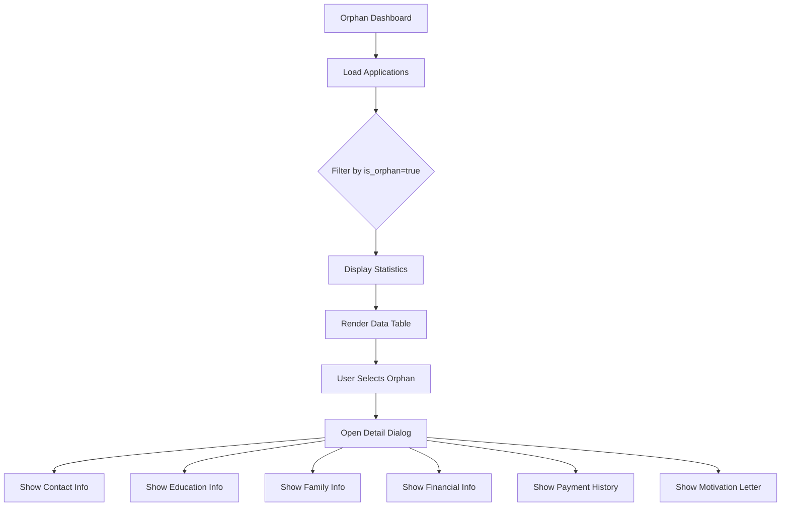
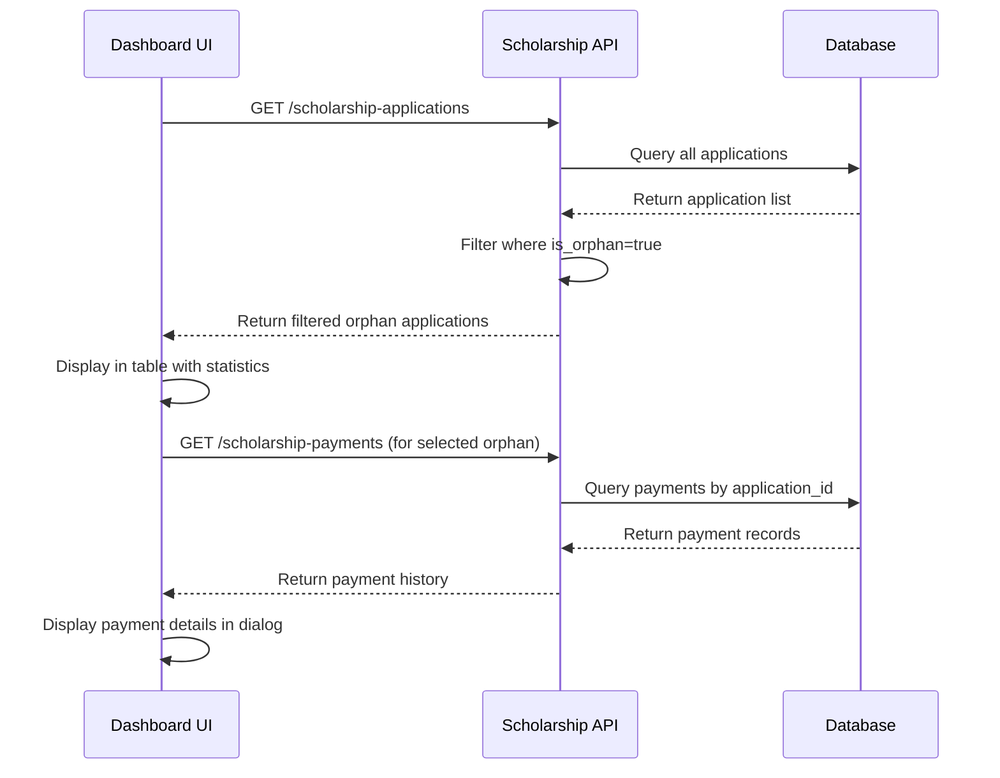
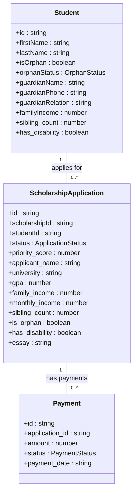

# Orphan (Yetim) Tracking

<cite>
**Referenced Files in This Document**   
- [page.tsx](file://src/app/(dashboard)/burs/yetim/page.tsx)
- [scholarships.ts](file://convex/scholarships.ts)
- [scholarship.ts](file://src/types/scholarship.ts)
</cite>

## Table of Contents

1. [Introduction](#introduction)
2. [Orphan Dashboard Implementation](#orphan-dashboard-implementation)
3. [Backend Logic for Orphan-Specific Rules](#backend-logic-for-orphan-specific-rules)
4. [Orphan Type Categorization and Eligibility](#orphan-type-categorization-and-eligibility)
5. [Integration Points](#integration-points)
6. [Real-World Case Management and Data Patterns](#real-world-case-management-and-data-patterns)
7. [Compliance and Privacy Considerations](#compliance-and-privacy-considerations)

## Introduction

The Orphan (Yetim) Tracking sub-module is a specialized component within the Kafkasder beneficiary management system designed to manage scholarship programs for orphaned students. This module provides a dedicated interface for tracking, evaluating, and supporting orphan beneficiaries through an automated workflow that integrates with financial aid, guardianship records, and social worker assessments. The system implements a priority-based scoring mechanism that gives special consideration to orphan status, ensuring equitable access to educational support. The implementation follows a secure, role-based access model with comprehensive audit logging to protect sensitive personal information.

## Orphan Dashboard Implementation

The orphan dashboard page (`src/app/(dashboard)/burs/yetim/page.tsx`) serves as the central interface for managing orphan scholarship beneficiaries. It displays a comprehensive list of all scholarship applications where the `is_orphan` flag is set to true, providing administrators with key metrics and detailed information about each case.

The dashboard features four main statistical cards showing total orphan students, active support cases, pending applications, and total supported beneficiaries. Users can filter the list by application status (draft, submitted, under review, approved, rejected, waitlisted) and search by applicant name, phone number, or university. The data table displays essential information including student details, education status, family situation, GPA, application status, and submission date.

When a user selects a specific orphan case, a detailed dialog opens showing comprehensive information across multiple categories: contact information, education details, family information, financial status, payment history (for approved cases), and motivation letters. The interface uses a heart icon (Heart) to symbolize orphan status throughout the UI, creating a consistent visual language for this beneficiary type.

**Diagram sources**

- [page.tsx](<file://src/app/(dashboard)/burs/yetim/page.tsx#L51-L517>)

**Section sources**

- [page.tsx](<file://src/app/(dashboard)/burs/yetim/page.tsx#L51-L517>)

## Backend Logic for Orphan-Specific Rules

The backend logic for handling orphan-specific scholarship rules is implemented in `convex/scholarships.ts`. The system uses a priority scoring algorithm that automatically calculates a priority score for each application based on multiple factors, with orphan status being a significant component.

The `calculatePriorityScore` function assigns weights to different criteria: GPA (30% weight), income factors (40% weight), and special circumstances (30% weight). For orphaned applicants, the function adds 15 points to their priority score when the `is_orphan` field is true. This scoring mechanism ensures that orphaned students receive preferential treatment in the scholarship allocation process.

The scholarship application workflow follows a state transition model with defined statuses: draft, submitted, under_review, approved, rejected, and waitlisted. Applications begin in "draft" status and can only be submitted when all required information is provided. The system prevents resubmission of non-draft applications, maintaining data integrity throughout the process.

Financial data is handled with sensitivity, with family income and monthly income fields contributing significantly to the priority score. Lower income levels result in higher scores, with tiered thresholds that provide greater weight to applicants from more economically disadvantaged backgrounds.

**Diagram sources**

- [scholarships.ts](file://convex/scholarships.ts#L301-L338)
- [page.tsx](<file://src/app/(dashboard)/burs/yetim/page.tsx#L77-L107>)

**Section sources**

- [scholarships.ts](file://convex/scholarships.ts#L301-L338)

## Orphan Type Categorization and Eligibility

Orphan categorization is defined in the type system through the `OrphanStatus` enum in `src/types/scholarship.ts`, which includes four distinct categories: FULL_ORPHAN, PARTIAL_ORPHAN, ABANDONED, and PROTECTED. This classification system allows for nuanced support based on the specific circumstances of each orphaned beneficiary.

The Student interface includes several fields relevant to orphan tracking: `isOrphan` (boolean flag), `orphanStatus` (enum type), `guardianName`, `guardianPhone`, and `guardianRelation`. These fields enable comprehensive documentation of the guardian relationship, which is critical for verifying eligibility and ensuring appropriate support.

The ScholarshipApplication interface extends this with additional fields that capture the socioeconomic context of orphaned applicants, including `sibling_count`, `monthly_income`, `family_income`, `father_occupation`, and `mother_occupation`. The presence of the `father_occupation` field with a default display value of "Vefat" (Deceased) in the UI indicates special handling for paternal status in orphan cases.

Eligibility determination combines automated scoring with manual review. The system automatically calculates a priority score that incorporates orphan status, but final approval decisions are made by human reviewers through the dashboard interface. This hybrid approach balances efficiency with the need for compassionate, case-by-case evaluation.

**Diagram sources**

- [scholarship.ts](file://src/types/scholarship.ts#L53-L58)
- [scholarship.ts](file://src/types/scholarship.ts#L82-L115)

**Section sources**

- [scholarship.ts](file://src/types/scholarship.ts#L53-L58)

## Integration Points

The orphan tracking system integrates with multiple components of the broader beneficiary management ecosystem. The primary integration point is with the financial aid system through the scholarship payments functionality, which tracks disbursements to approved orphan beneficiaries.

Guardianship records are integrated through the guardian information fields in the Student interface, which capture the guardian's name, relationship to the orphan, contact information, occupation, and income. This data is used to assess the household's economic situation and verify the appropriateness of guardianship arrangements.

Social worker assessments are supported through the application review workflow, where case managers can add reviewer notes and track regular checkups. The system supports workflow notifications that can alert social workers to upcoming assessments or changes in a beneficiary's status.

The dashboard also integrates with document management systems, allowing for the upload and verification of supporting documents such as death certificates, guardianship papers, and income verification. These documents are stored securely and linked to the respective scholarship application.

Data export capabilities allow for reporting to regulatory bodies and funding organizations, with support for CSV, PDF, and Excel formats. The export system includes filters for date ranges, status, and orphan type, enabling targeted reporting for compliance and auditing purposes.

## Real-World Case Management and Data Patterns

In real-world usage, orphan case management follows predictable data entry patterns. Administrators typically begin by creating a beneficiary record with the `isOrphan` flag set to true and selecting the appropriate `orphanStatus` category. The guardian information is then populated, establishing the legal and practical support structure for the orphaned student.

Common data entry sequences include:

1. Creating the application with basic student information
2. Adding educational details (university, department, GPA)
3. Documenting family situation and financial status
4. Uploading supporting documents
5. Submitting the application for review
6. Tracking payment disbursements upon approval

Typical case management workflows involve periodic status updates, with social workers conducting regular checkups that are recorded in the system. The dashboard's filtering capabilities allow administrators to identify cases that require attention, such as those with upcoming review dates or pending documentation.

The system handles edge cases such as partial orphans (where one parent has passed away) differently from full orphans, adjusting support levels accordingly. Abandoned children and those under state protection are categorized separately, recognizing their distinct legal and support requirements.

## Compliance and Privacy Considerations

The orphan tracking system implements strict privacy controls to protect sensitive information about vulnerable beneficiaries. Access to orphan records is restricted to authorized personnel with appropriate roles (ADMIN/MANAGER), and all access is logged for audit purposes.

Personal data, including TC identification numbers, is protected through authentication requirements and role-based access control. The system follows data minimization principles, collecting only information necessary for scholarship administration and support provision.

Data retention policies ensure that records are maintained for appropriate periods in compliance with legal requirements, with secure archiving and deletion procedures. The system supports data export with appropriate anonymization options for reporting purposes.

Regular security audits are conducted to identify and address potential vulnerabilities, with particular attention to the protection of orphan-related data. The system implements encryption for data at rest and in transit, ensuring confidentiality throughout the data lifecycle.
