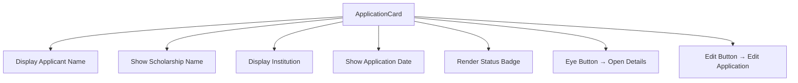
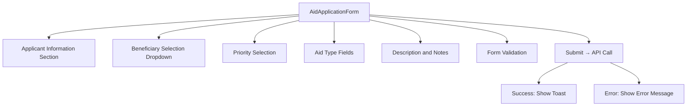
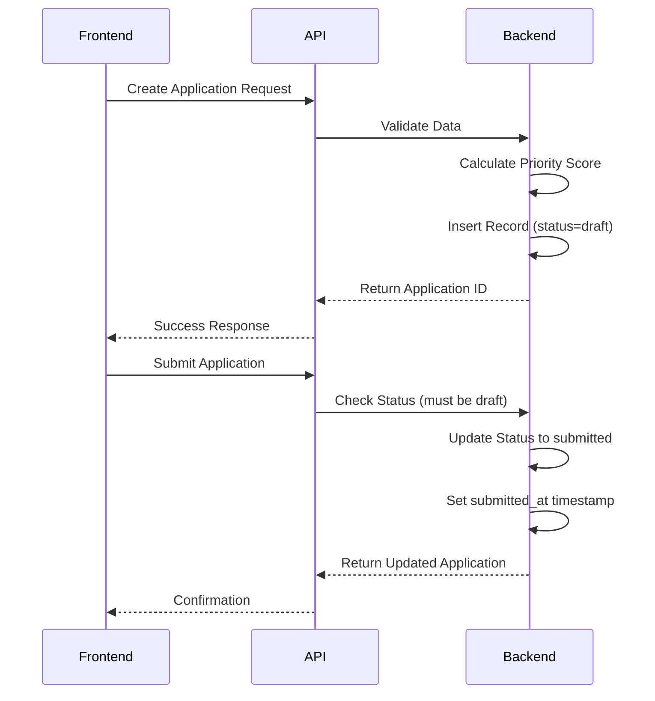

# Scholarship Applications

<cite>
**Referenced Files in This Document**   
- [convex/scholarships.ts](file://convex/scholarships.ts)
- [src/components/scholarships/ApplicationCard.tsx](file://src/components/scholarships/ApplicationCard.tsx)
- [src/components/forms/AidApplicationForm.tsx](file://src/components/forms/AidApplicationForm.tsx)
- [src/lib/validations/aid-application.ts](file://src/lib/validations/aid-application.ts)
- [src/types/scholarship.ts](file://src/types/scholarship.ts)
- [src/lib/api/scholarships.ts](file://src/lib/api/scholarships.ts)
- [src/app/(dashboard)/burs/basvurular/page.tsx](file://src/app/(dashboard)/burs/basvurular/page.tsx)
</cite>

## Table of Contents

1. [Introduction](#introduction)
2. [Application Lifecycle](#application-lifecycle)
3. [ApplicationCard Component](#applicationcard-component)
4. [AidApplicationForm Implementation](#aidapplicationform-implementation)
5. [Backend Logic in convex/scholarships.ts](#backend-logic-in-convexscholarshipsts)
6. [Validation Rules in src/lib/validations/aid-application.ts](#validation-rules-in-srclibvalidationsaid-applicationts)
7. [Integration with Beneficiary Profiles and Financial Aid](#integration-with-beneficiary-profiles-and-financial-aid)
8. [Real-World Workflows and Examples](#real-world-workflows-and-examples)
9. [Performance Considerations](#performance-considerations)
10. [Accessibility Features](#accessibility-features)
11. [Troubleshooting Guide](#troubleshooting-guide)

## Introduction

The Scholarship Applications sub-module manages the complete lifecycle of scholarship applications within the Kafkasder platform. This includes submission, validation, review, and status tracking for applicants seeking financial aid. The system integrates with beneficiary profiles and financial records to ensure accurate eligibility assessment and efficient processing. Key components include the `ApplicationCard` for displaying application summaries, the `AidApplicationForm` for data entry, and backend logic in `convex/scholarships.ts` that handles application creation, eligibility checks, and state transitions. Validation rules are enforced through `src/lib/validations/aid-application.ts`, ensuring data integrity and compliance with business logic constraints.

## Application Lifecycle

The scholarship application lifecycle consists of several distinct stages: draft, submitted, under review, approved, rejected, and waitlisted. Applications begin in a "draft" state, allowing applicants to save incomplete forms. Upon submission, the system validates the application and transitions it to "submitted" status. From there, administrators can move applications into "under_review", where eligibility criteria are assessed using business logic such as income level, academic performance, and special circumstances. Final decisions result in either "approved", "rejected", or "waitlisted" statuses. Each transition is logged and triggers appropriate notifications. The system maintains a complete audit trail of all state changes, supporting transparency and accountability throughout the review process.

**Section sources**

- [convex/scholarships.ts](file://convex/scholarships.ts#L201-L239)
- [src/lib/api/scholarships.ts](file://src/lib/api/scholarships.ts#L219-L257)

## ApplicationCard Component

The `ApplicationCard` component provides a concise visual summary of scholarship applications, designed for use in list views and dashboards. It displays key information including the applicant's name, associated scholarship program, educational institution, and application date. Status badges use color-coded indicators to quickly communicate the current state of each application (e.g., draft, submitted, under review). The component includes interactive elements: an eye icon button that opens a detailed dialog with comprehensive application data, and an edit button (when applicable) that allows authorized users to modify application details. The card layout is responsive, adapting to different screen sizes while maintaining readability and accessibility.

**Diagram sources**

- [src/components/scholarships/ApplicationCard.tsx](file://src/components/scholarships/ApplicationCard.tsx#L25-L121)

**Section sources**

- [src/components/scholarships/ApplicationCard.tsx](file://src/components/scholarships/ApplicationCard.tsx#L17-L23)

## AidApplicationForm Implementation

The `AidApplicationForm` component facilitates data entry for new scholarship applications through a structured, user-friendly interface. Built with React Hook Form and Zod validation, it ensures data integrity while providing real-time feedback to users. The form is organized into logical sections: applicant information, beneficiary selection (optional), priority designation, and various aid types including one-time financial assistance, regular financial aid, food aid, in-kind donations, and service referrals. Conditional rendering enhances usability, while accessibility features such as proper labeling and keyboard navigation support inclusive access. Upon submission, the form data is validated and sent to the backend API for processing.

**Diagram sources**

- [src/components/forms/AidApplicationForm.tsx](file://src/components/forms/AidApplicationForm.tsx#L50-L349)

**Section sources**

- [src/components/forms/AidApplicationForm.tsx](file://src/components/forms/AidApplicationForm.tsx#L45-L48)

## Backend Logic in convex/scholarships.ts

The backend logic in `convex/scholarships.ts` handles all critical operations for scholarship applications, including creation, validation, and state management. The `createApplication` mutation initializes new applications with default values such as "draft" status and calculates a priority score based on factors like GPA, income level, and special circumstances (orphan status, disability). The `submitApplication` mutation enforces business rules by preventing submission of non-draft applications and automatically setting the submission timestamp. The `updateApplication` mutation allows authorized users to modify application status and add reviewer notes. All operations are secured through authentication and role-based access control, ensuring data integrity and compliance with privacy requirements.

**Diagram sources**

- [convex/scholarships.ts](file://convex/scholarships.ts#L201-L239)
- [convex/scholarships.ts](file://convex/scholarships.ts#L279-L298)

**Section sources**

- [convex/scholarships.ts](file://convex/scholarships.ts#L302-L339)

## Validation Rules in src/lib/validations/aid-application.ts

Validation rules defined in `src/lib/validations/aid-application.ts` ensure data integrity and enforce business logic constraints across the application. The Zod schema validates required fields such as applicant name and application date, while also enforcing type safety and format requirements. Business logic constraints include minimum length requirements for text fields, numerical validation for financial amounts (ensuring non-negative values), and enumeration validation for categorical fields like applicant type (person, organization, partner) and priority level (low, normal, high, urgent). The validation system supports both synchronous client-side validation for immediate user feedback and asynchronous server-side validation for security and data consistency. Custom validation functions can be extended to support complex business rules as needed.

**Section sources**

- [src/lib/validations/aid-application.ts](file://src/lib/validations/aid-application.ts#L1-L70)

## Integration with Beneficiary Profiles and Financial Aid

The scholarship application system integrates seamlessly with beneficiary profiles and financial aid records to provide a comprehensive view of applicant eligibility and support history. When creating an application, users can optionally link it to an existing beneficiary profile, which automatically populates relevant demographic and socioeconomic data. This integration enables cross-referencing of financial aid records to prevent duplication and ensure equitable distribution of resources. The system can assess an applicant's complete assistance history, including previous scholarships, regular financial aid, and in-kind support, to make informed decisions about new applications. This holistic approach supports data-driven decision making and helps identify applicants with the greatest need.

**Section sources**

- [src/components/forms/AidApplicationForm.tsx](file://src/components/forms/AidApplicationForm.tsx#L55-L61)
- [src/lib/api/scholarships.ts](file://src/lib/api/scholarships.ts#L241-L244)

## Real-World Workflows and Examples

Real-world application workflows demonstrate the system's practical operation. For example, a student applying for academic support would first create a draft application, saving their progress before final submission. Upon submission, the application enters "under_review" status, where administrators assess eligibility based on GPA, financial need, and personal statements. In cases of incomplete documentation, the system allows reverting to "draft" status for applicant correction. Approved applications trigger automated notifications and initiate payment processing workflows. Common validation errors include missing required fields, invalid TC number formats, and inconsistent data (e.g., claiming orphan status without supporting documentation). These are caught during submission and presented to users with clear error messages.

**Section sources**

- [convex/scholarships.ts](file://convex/scholarships.ts#L226-L228)
- [src/lib/validations/aid-application.ts](file://src/lib/validations/aid-application.ts#L10-L13)

## Performance Considerations

Performance considerations for large-scale application processing include efficient database indexing, pagination of results, and optimized query patterns. The system implements server-side pagination with configurable limits to prevent excessive data loading, particularly important when dealing with thousands of applications. Database indexes on frequently queried fields (such as application status and scholarship ID) ensure rapid filtering and sorting. The API supports selective field retrieval to minimize payload size, and client-side caching reduces redundant network requests. For bulk operations, the system provides batch processing endpoints that can handle multiple applications efficiently while maintaining data consistency through transactional operations.

**Section sources**

- [convex/scholarships.ts](file://convex/scholarships.ts#L124-L189)
- [src/lib/api/scholarships.ts](file://src/lib/api/scholarships.ts#L171-L186)

## Accessibility Features

Accessibility features in the UI ensure that all users, including those with disabilities, can effectively interact with the scholarship application system. The `AidApplicationForm` includes proper ARIA labels, semantic HTML structure, and keyboard navigation support. Form fields are associated with their labels using htmlFor attributes, and error messages are programmatically linked to their respective inputs. The `ApplicationCard` component uses sufficient color contrast and provides text alternatives for icons. All interactive elements are focusable and operable via keyboard, with visible focus indicators. The system supports screen readers through appropriate role attributes and live regions for dynamic content updates, such as form submission results and validation errors.

**Section sources**

- [src/components/forms/AidApplicationForm.tsx](file://src/components/forms/AidApplicationForm.tsx#L130-L147)
- [src/components/scholarships/ApplicationCard.tsx](file://src/components/scholarships/ApplicationCard.tsx#L56-L57)

## Troubleshooting Guide

Common issues in the scholarship application system typically involve validation failures, submission errors, and data synchronization problems. For failed submissions, check that all required fields are populated and that data formats comply with validation rules (e.g., valid TC number format, proper date formatting). If applications appear missing from lists, verify that filters are correctly configured and that the user has appropriate permissions to view the data. When integration with beneficiary profiles fails, ensure the selected beneficiary ID exists and is active. Debugging tips include checking browser developer tools for API errors, verifying network connectivity, and reviewing server logs for detailed error messages. Clear error handling with user-friendly messages helps prevent confusion and supports successful application completion.

**Section sources**

- [convex/scholarships.ts](file://convex/scholarships.ts#L287-L289)
- [src/components/forms/AidApplicationForm.tsx](file://src/components/forms/AidApplicationForm.tsx#L94-L97)
