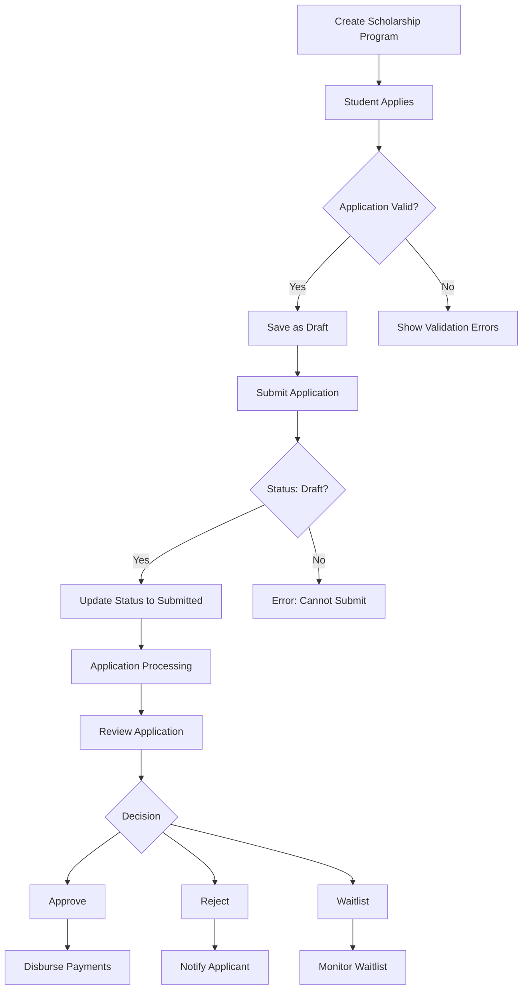
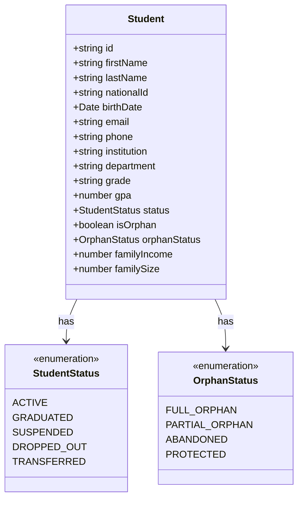
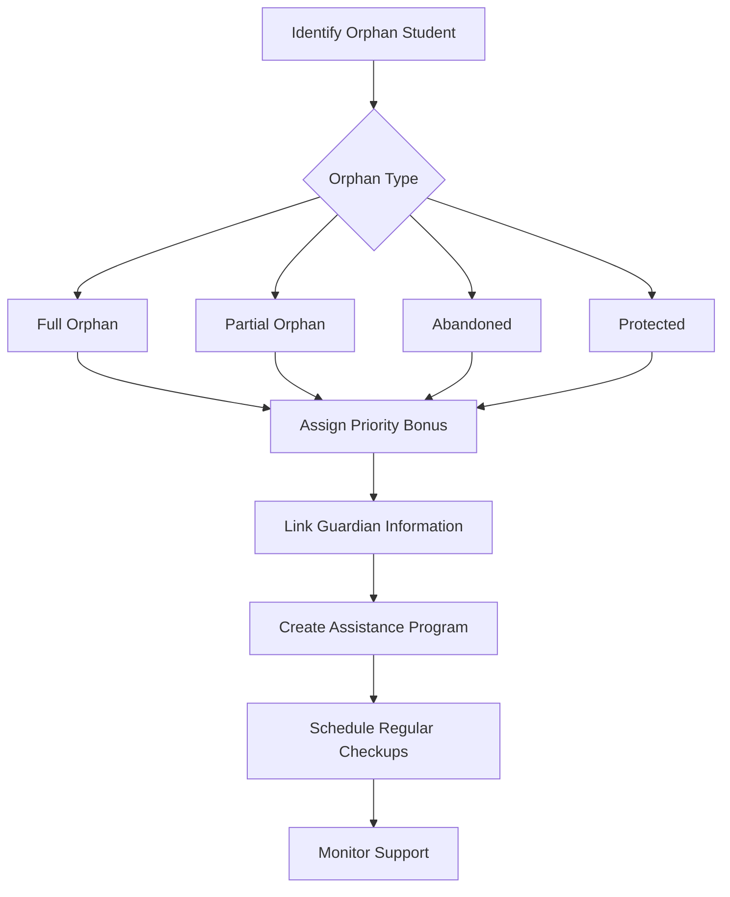
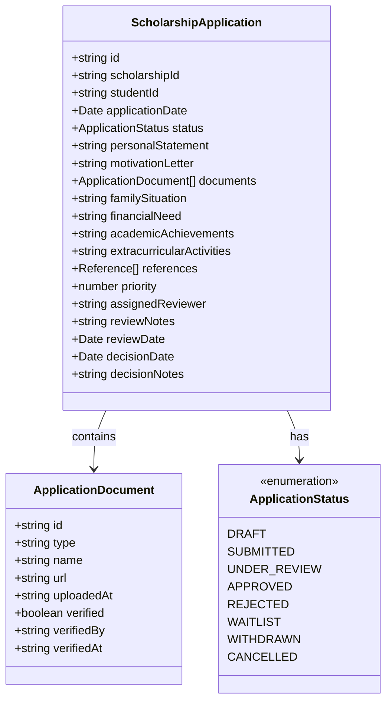
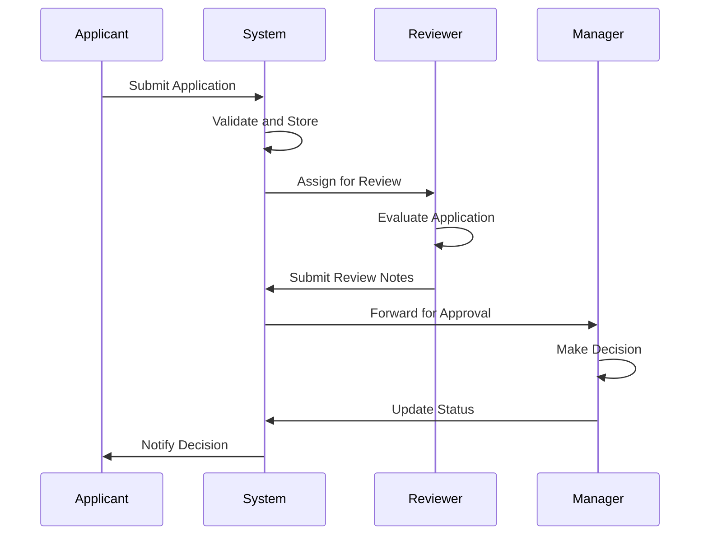
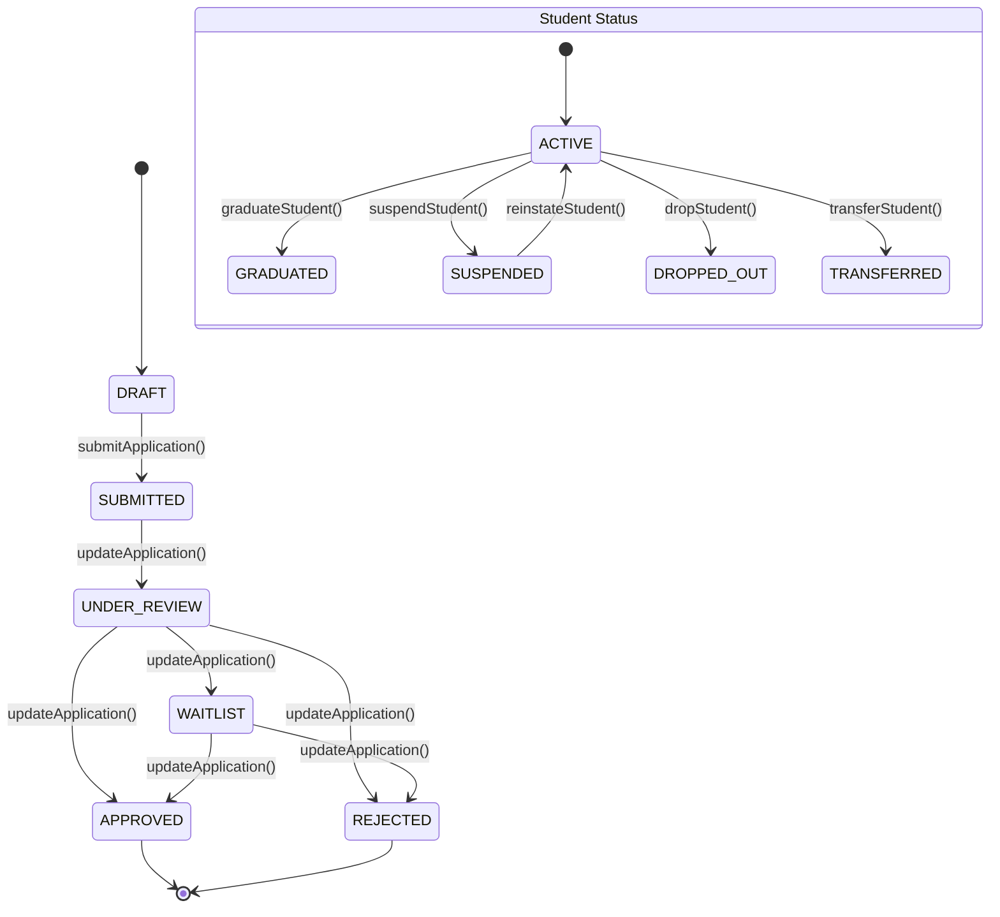
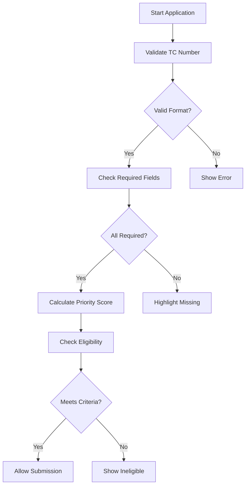
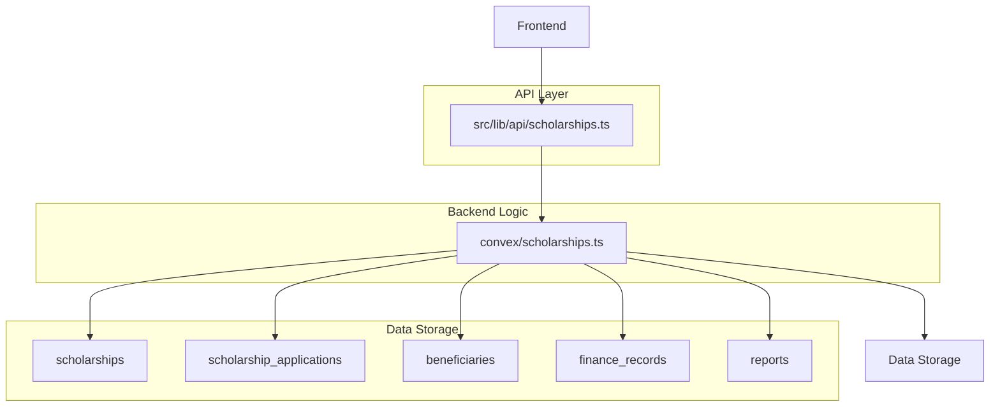
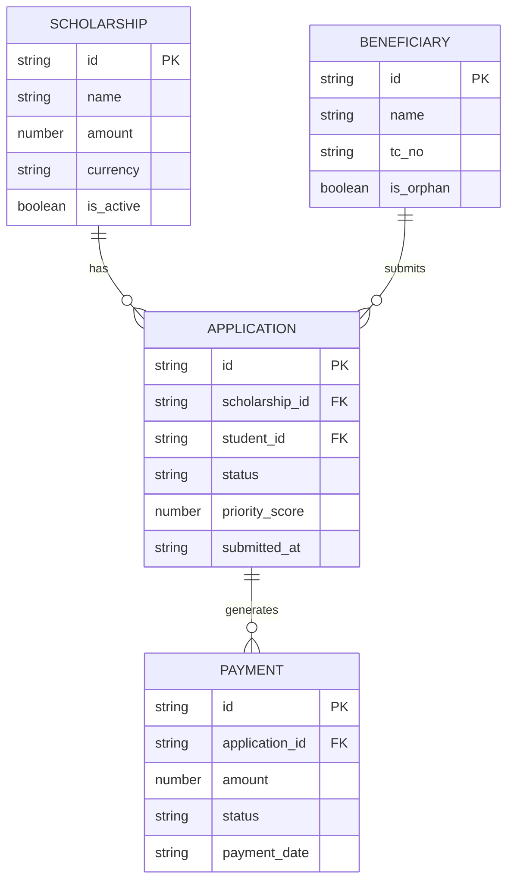

# Scholarship Management

<cite>
**Referenced Files in This Document**   
- [scholarships.ts](file://convex/scholarships.ts)
- [aid-application.ts](file://src/lib/validations/aid-application.ts)
- [ApplicationCard.tsx](file://src/components/scholarships/ApplicationCard.tsx)
- [StudentCard.tsx](file://src/components/scholarships/StudentCard.tsx)
- [scholarship.ts](file://src/types/scholarship.ts)
- [schema.ts](file://convex/schema.ts)
- [orphan-types.ts](file://src/lib/constants/orphan-types.ts)
- [burs/basvurular/page.tsx](file://src/app/(dashboard)/burs/basvurular/page.tsx)
- [burs/ogrenciler/page.tsx](file://src/app/(dashboard)/burs/ogrenciler/page.tsx)
- [lib/api/scholarships.ts](file://src/lib/api/scholarships.ts)
</cite>

## Table of Contents

1. [Introduction](#introduction)
2. [Scholarship Application Lifecycle](#scholarship-application-lifecycle)
3. [Student Enrollment and Tracking](#student-enrollment-and-tracking)
4. [Orphan (Yetim) Management Workflows](#orphan-yetim-management-workflows)
5. [Application Form Implementation](#application-form-implementation)
6. [Review and Decision Process](#review-and-decision-process)
7. [Student and Application Status Transitions](#student-and-application-status-transitions)
8. [Eligibility and Validation Rules](#eligibility-and-validation-rules)
9. [Backend Logic and Data Integration](#backend-logic-and-data-integration)
10. [Reporting and Compliance](#reporting-and-compliance)
11. [Common Challenges and Best Practices](#common-challenges-and-best-practices)

## Introduction

The Scholarship Management module provides a comprehensive system for managing scholarship programs, applications, student enrollment, and financial aid distribution. It supports workflows for application submission, review, approval, and ongoing student tracking. The system integrates with beneficiary data, financial records, and reporting tools to ensure transparency and compliance. Key components include the `ApplicationCard` and `StudentCard` UI components for displaying application and student information, backend logic in `convex/scholarships.ts` for business operations, and validation rules in `src/lib/validations/aid-application.ts` to ensure data integrity. The module also includes specialized workflows for managing orphan (yetim) students, with dedicated status tracking and assistance programs.

**Section sources**

- [scholarships.ts](file://convex/scholarships.ts#L1-L50)
- [scholarship.ts](file://src/types/scholarship.ts#L1-L50)

## Scholarship Application Lifecycle

The scholarship application lifecycle begins with the creation of a scholarship program, followed by student applications, review, decision-making, and payment processing. Applications start in a "draft" status and transition to "submitted" when finalized. The system supports multiple status transitions including "under_review", "approved", "rejected", and "waitlisted". Each application contains detailed information about the student, academic performance, financial need, and supporting documents. The lifecycle is managed through a series of backend mutations that update the application status and trigger appropriate workflows. Applications are linked to scholarship programs and beneficiaries, enabling comprehensive tracking and reporting.

**Diagram sources**

- [scholarships.ts](file://convex/scholarships.ts#L201-L239)
- [scholarship.ts](file://src/types/scholarship.ts#L16-L25)

**Section sources**

- [scholarships.ts](file://convex/scholarships.ts#L201-L286)
- [scholarship.ts](file://src/types/scholarship.ts#L127-L154)

## Student Enrollment and Tracking

Student enrollment is managed through the integration of beneficiary data with scholarship applications. When a student applies for a scholarship, their information is linked to an existing beneficiary record or creates a new one. The system tracks key student attributes including education level, institution, GPA, family income, and orphan status. Students are assigned a status such as "ACTIVE", "GRADUATED", "SUSPENDED", "DROPPED_OUT", or "TRANSFERRED". The `StudentCard` component provides a visual representation of student information, including status badges and orphan indicators. Student tracking includes monitoring academic progress, payment history, and compliance with scholarship requirements.

**Diagram sources**

- [scholarship.ts](file://src/types/scholarship.ts#L81-L114)
- [StudentCard.tsx](file://src/components/scholarships/StudentCard.tsx#L29-L32)

**Section sources**

- [scholarship.ts](file://src/types/scholarship.ts#L81-L114)
- [StudentCard.tsx](file://src/components/scholarships/StudentCard.tsx#L34-L200)

## Orphan (Yetim) Management Workflows

The system includes specialized workflows for managing orphan (yetim) students, recognizing their unique circumstances and needs. Orphan status is tracked using the `isOrphan` boolean field and the `orphanStatus` enumeration which includes categories such as "FULL_ORPHAN", "PARTIAL_ORPHAN", "ABANDONED", and "PROTECTED". The `ORPHAN_TYPES` constants in `src/lib/constants/orphan-types.ts` define these categories with corresponding labels. Orphan applications receive priority scoring in the evaluation process, with a 15-point bonus in the priority calculation algorithm. The system also tracks guardian information including name, relationship, phone, and occupation. Orphan assistance programs can be created to provide ongoing support beyond the initial scholarship.

**Diagram sources**

- [orphan-types.ts](file://src/lib/constants/orphan-types.ts#L1-L22)
- [scholarship.ts](file://src/types/scholarship.ts#L53-L58)

**Section sources**

- [orphan-types.ts](file://src/lib/constants/orphan-types.ts#L1-L22)
- [scholarship.ts](file://src/types/scholarship.ts#L103-L107)

## Application Form Implementation

The application form implementation uses the `ApplicationCard` component to display scholarship application information in a consistent and user-friendly format. The form collects essential information including applicant details, academic information, financial situation, and personal statements. Key fields include applicant name, TC number, phone, email, university, department, grade level, GPA, monthly and family income, occupation of parents, sibling count, orphan status, disability status, and essay. The form supports document uploads for transcripts, income proof, and other required materials. The UI displays application status with color-coded badges and provides actions for viewing details and editing applications.

**Diagram sources**

- [ApplicationCard.tsx](file://src/components/scholarships/ApplicationCard.tsx#L17-L23)
- [scholarship.ts](file://src/types/scholarship.ts#L127-L154)

**Section sources**

- [ApplicationCard.tsx](file://src/components/scholarships/ApplicationCard.tsx#L25-L121)
- [scholarship.ts](file://src/types/scholarship.ts#L127-L154)

## Review and Decision Process

The review and decision process is managed through a structured workflow that ensures consistent evaluation of scholarship applications. Applications are assigned to reviewers who assess eligibility, financial need, academic merit, and special circumstances. The system supports multiple review stages including initial screening, detailed evaluation, and final decision-making. Reviewers can add notes and recommendations that are stored with the application. The decision process includes status transitions to "under_review", "approved", "rejected", or "waitlisted". Approved applications trigger payment processing workflows, while rejected applications include decision notes explaining the outcome. The system maintains an audit trail of all review activities and decisions.

**Diagram sources**

- [scholarships.ts](file://convex/scholarships.ts#L242-L275)
- [burs/basvurular/page.tsx](<file://src/app/(dashboard)/burs/basvurular/page.tsx#L123-L131>)

**Section sources**

- [scholarships.ts](file://convex/scholarships.ts#L242-L286)
- [burs/basvurular/page.tsx](<file://src/app/(dashboard)/burs/basvurular/page.tsx#L52-L516>)

## Student and Application Status Transitions

The system implements a comprehensive status management system for both students and applications. Application statuses include "DRAFT", "SUBMITTED", "UNDER_REVIEW", "APPROVED", "REJECTED", "WAITLIST", "WITHDRAWN", and "CANCELLED". Student statuses include "ACTIVE", "GRADUATED", "SUSPENDED", "DROPPED_OUT", and "TRANSFERRED". Status transitions are enforced through backend validation to ensure data integrity. For example, only draft applications can be submitted, and status changes are logged with timestamps and user information. The UI displays status with appropriate badges and colors, providing clear visual feedback to users. Status changes trigger notifications and workflow actions as appropriate.

**Diagram sources**

- [scholarship.ts](file://src/types/scholarship.ts#L16-L25)
- [scholarship.ts](file://src/types/scholarship.ts#L34-L40)

**Section sources**

- [scholarship.ts](file://src/types/scholarship.ts#L16-L25)
- [scholarship.ts](file://src/types/scholarship.ts#L34-L40)

## Eligibility and Validation Rules

Eligibility and validation rules are implemented to ensure the integrity and quality of scholarship applications. The system validates applicant information including TC number format, required fields, and data consistency. Eligibility criteria are defined for each scholarship program and automatically checked during the application process. The priority scoring algorithm calculates a weighted score based on GPA (30% weight), family income (40% weight), and special circumstances such as orphan status (15-point bonus) or disability (10-point bonus). Validation rules are enforced both on the client-side through form validation and on the server-side through backend checks.

**Diagram sources**

- [scholarships.ts](file://convex/scholarships.ts#L288-L341)
- [aid-application.ts](file://src/lib/validations/aid-application.ts#L1-L70)

**Section sources**

- [scholarships.ts](file://convex/scholarships.ts#L288-L341)
- [aid-application.ts](file://src/lib/validations/aid-application.ts#L1-L70)

## Backend Logic and Data Integration

The backend logic for scholarship management is implemented in `convex/scholarships.ts` using Convex functions for queries and mutations. The system integrates with beneficiary data through the `beneficiaries` collection, financial records through `finance_records`, and reporting through `reports`. Key operations include creating and updating scholarship programs, processing applications, calculating priority scores, and managing payments. The API layer in `src/lib/api/scholarships.ts` provides a client-friendly interface to these backend functions. Data integration ensures that student information, application status, and payment history are consistently synchronized across the system.

**Diagram sources**

- [scholarships.ts](file://convex/scholarships.ts#L1-L50)
- [lib/api/scholarships.ts](file://src/lib/api/scholarships.ts#L1-L50)
- [schema.ts](file://convex/schema.ts#L1007-L1030)

**Section sources**

- [scholarships.ts](file://convex/scholarships.ts#L1-L468)
- [lib/api/scholarships.ts](file://src/lib/api/scholarships.ts#L1-L389)

## Reporting and Compliance

The system provides comprehensive reporting capabilities for scholarship management and compliance. Reports include application statistics, student demographics, payment history, and financial summaries. The `getStatistics` function in `convex/scholarships.ts` calculates key metrics such as total applications, status distribution, and total paid amounts. Compliance reporting tracks orphan assistance, payment timelines, and program effectiveness. The system supports data export in CSV, PDF, and Excel formats for external reporting requirements. Reports can be filtered by date range, status, and other criteria to meet specific compliance needs.

**Diagram sources**

- [scholarships.ts](file://convex/scholarships.ts#L429-L468)
- [burs/ogrenciler/page.tsx](<file://src/app/(dashboard)/burs/ogrenciler/page.tsx#L154-L174>)

**Section sources**

- [scholarships.ts](file://convex/scholarships.ts#L429-L468)
- [burs/ogrenciler/page.tsx](<file://src/app/(dashboard)/burs/ogrenciler/page.tsx#L85-L535>)

## Common Challenges and Best Practices

Managing scholarship programs presents several common challenges including application volume, eligibility verification, timely decision-making, and compliance reporting. Best practices include implementing automated validation rules, using priority scoring to focus review efforts, maintaining clear communication with applicants, and conducting regular audits of the system. The system addresses these challenges through structured workflows, comprehensive status tracking, and integrated reporting. For orphan management, best practices include regular check-ins, guardian verification, and multi-year planning to ensure continuity of support. Renewal processes should begin well in advance of expiration dates to minimize disruptions in funding.

**Section sources**

- [scholarships.ts](file://convex/scholarships.ts#L288-L341)
- [burs/basvurular/page.tsx](<file://src/app/(dashboard)/burs/basvurular/page.tsx#L52-L516>)
- [burs/ogrenciler/page.tsx](<file://src/app/(dashboard)/burs/ogrenciler/page.tsx#L85-L535>)
