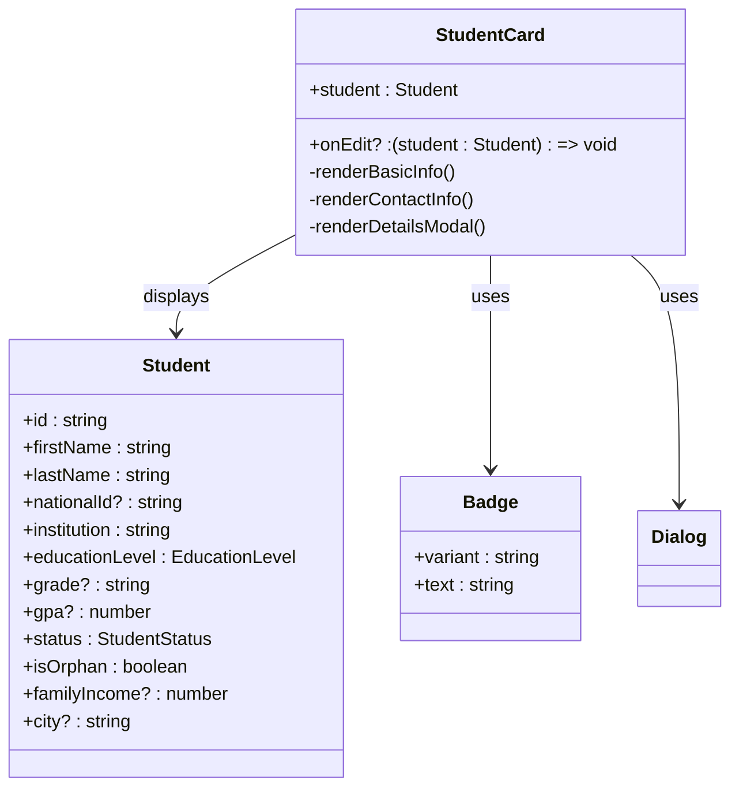
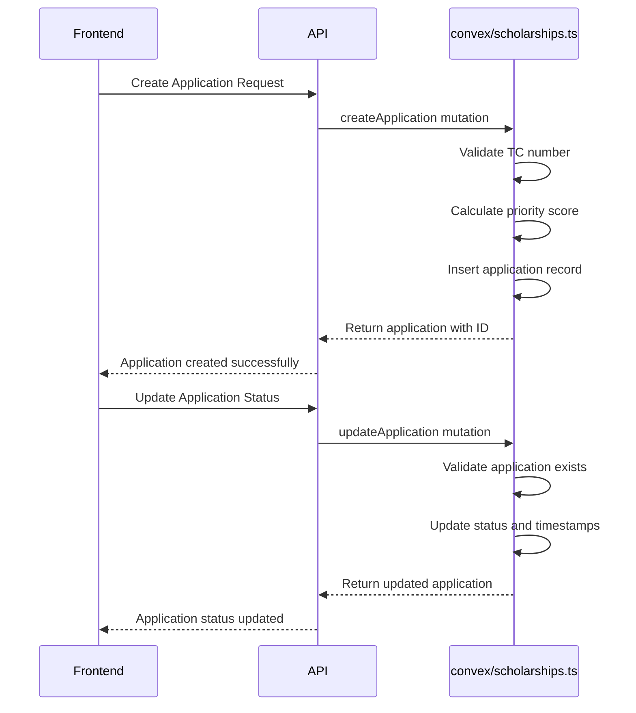
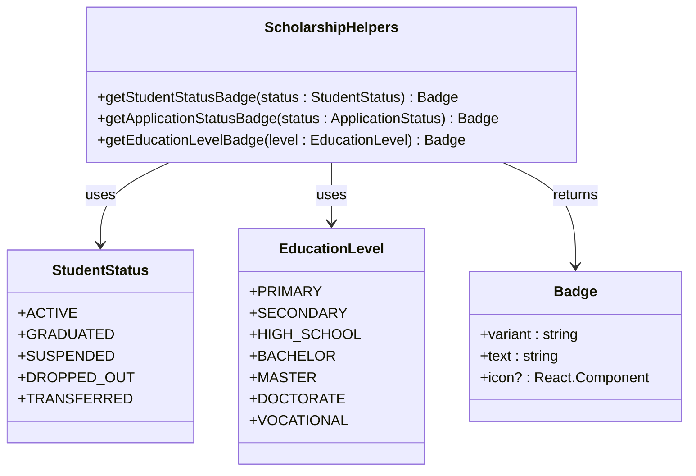

# Student Management

<cite>
**Referenced Files in This Document**   
- [scholarships.ts](file://convex/scholarships.ts)
- [StudentCard.tsx](file://src/components/scholarships/StudentCard.tsx)
- [scholarship-helpers.tsx](file://src/lib/utils/scholarship-helpers.tsx)
- [scholarship.ts](file://src/types/scholarship.ts)
- [page.tsx](file://src/app/(dashboard)/burs/ogrenciler/page.tsx)
- [schema.ts](file://convex/schema.ts)
</cite>

## Table of Contents

1. [Introduction](#introduction)
2. [Student Lifecycle Management](#student-lifecycle-management)
3. [StudentCard Component](#studentcard-component)
4. [Backend Functions in convex/scholarships.ts](#backend-functions-in-convexscholarshipsts)
5. [Integration with External Systems](#integration-with-external-systems)
6. [Scholarship Helpers and Calculations](#scholarship-helpers-and-calculations)
7. [Common Issues and Compliance](#common-issues-and-compliance)

## Introduction

The Student Management sub-module provides comprehensive tracking and monitoring of enrolled students throughout their scholarship lifecycle. This system enables administrators to manage student profiles, track academic progress, monitor financial disbursements, and handle renewal processes. The module integrates with beneficiary data, academic records, and financial systems to ensure accurate and timely scholarship administration. This documentation details the core components, workflows, and integration points that support effective student management within the scholarship program.

## Student Lifecycle Management

The student lifecycle begins with enrollment through the scholarship application process and continues through renewal, academic monitoring, and eventual graduation or program completion. Students are tracked from initial application through their entire academic journey, with status updates reflecting their current standing (ACTIVE, GRADUATED, SUSPENDED, DROPPED_OUT, or TRANSFERRED). The system maintains comprehensive records including personal information, academic performance (GPA), financial need assessments, and family circumstances. Renewal workflows are triggered automatically based on academic year cycles, requiring students to submit updated documentation and performance records. Academic performance reviews are conducted periodically to ensure scholarship recipients maintain eligibility requirements. The system supports handling of special cases such as students who drop out, transfer institutions, or experience changes in their financial or personal circumstances.

**Section sources**

- [scholarship.ts](file://src/types/scholarship.ts#L34-L40)
- [schema.ts](file://convex/schema.ts#L1007-L1030)

## StudentCard Component

The StudentCard component provides a visual interface for displaying comprehensive student information in a compact format. This component renders key details including the student's name, institution, education level, grade, and GPA. Status indicators are prominently displayed using color-coded badges that reflect the student's current status (Active, Graduated, Suspended, Dropped Out, or Transferred). For orphan students, a special "Orphan" badge is displayed with a heart icon. The card includes contact information such as phone, email, and city. When expanded through the detail view, additional information is revealed including national ID, address details, family income, family size, guardian information (for orphans), and any notes. The component supports editing functionality through an edit button, allowing authorized users to update student information. The design follows a responsive layout that adapts to different screen sizes, ensuring usability across devices.

**Diagram sources**

- [StudentCard.tsx](file://src/components/scholarships/StudentCard.tsx#L29-L200)
- [scholarship.ts](file://src/types/scholarship.ts#L81-L114)

**Section sources**

- [StudentCard.tsx](file://src/components/scholarships/StudentCard.tsx#L1-L202)
- [scholarship.ts](file://src/types/scholarship.ts#L81-L114)

## Backend Functions in convex/scholarships.ts

The backend functions in convex/scholarships.ts handle core student management operations including enrollment, renewal processing, and status updates. The module provides query functions to list and retrieve student applications with various filtering options (by scholarship, status, or TC number). Mutation functions enable creating new applications, updating application status, and submitting applications for review. The createApplication function validates TC numbers and calculates a priority score based on academic performance, financial need, and special circumstances. The updateApplication function handles status transitions and records reviewer information. The system supports comprehensive student management through functions that retrieve statistics on application volumes, approval rates, and payment statuses. These backend functions serve as the foundation for the student management workflows, ensuring data consistency and enforcing business rules throughout the scholarship lifecycle.

**Diagram sources**

- [scholarships.ts](file://convex/scholarships.ts#L201-L239)
- [scholarships.ts](file://convex/scholarships.ts#L243-L275)

**Section sources**

- [scholarships.ts](file://convex/scholarships.ts#L124-L189)
- [scholarships.ts](file://convex/scholarships.ts#L201-L239)
- [scholarships.ts](file://convex/scholarships.ts#L243-L275)

## Integration with External Systems

The student management system integrates with multiple external systems to ensure comprehensive data synchronization and operational efficiency. Beneficiary data is synchronized from the core beneficiary management system, ensuring that student records maintain consistency with the organization's primary beneficiary database. Academic records are integrated through periodic data imports or API connections with educational institutions, allowing automatic updates of GPA and academic standing. Financial systems are connected to facilitate scholarship disbursements, with payment records synchronized between the scholarship module and the organization's financial accounting system. The integration architecture follows a service-oriented approach, with well-defined APIs for data exchange. Data synchronization processes include validation checks and audit trails to ensure data integrity. The system also supports manual data entry and document uploads as fallback mechanisms when automated integrations are unavailable.

**Section sources**

- [scholarships.ts](file://convex/scholarships.ts#L341-L427)
- [page.tsx](<file://src/app/(dashboard)/burs/ogrenciler/page.tsx#L94-L110>)

## Scholarship Helpers and Calculations

The scholarship-helpers.tsx module contains utility functions that support student management through automated calculations and data transformations. The getStudentStatusBadge function converts student status codes into visually distinct badges with appropriate labels and styling. Similarly, getEducationLevelBadge transforms education level codes into human-readable labels. These helper functions ensure consistent presentation of student information across the application. The system also includes calculation logic for determining student eligibility and disbursement schedules, though the specific implementation details are primarily handled in the backend scholarships.ts module. These helpers play a crucial role in the user interface by providing standardized visual representations of student data, improving usability and reducing cognitive load for administrators managing large numbers of scholarship recipients.

**Diagram sources**

- [scholarship-helpers.tsx](file://src/lib/utils/scholarship-helpers.tsx#L7-L19)
- [scholarship-helpers.tsx](file://src/lib/utils/scholarship-helpers.tsx#L70-L84)

**Section sources**

- [scholarship-helpers.tsx](file://src/lib/utils/scholarship-helpers.tsx#L1-L86)
- [scholarship.ts](file://src/types/scholarship.ts#L34-L50)

## Common Issues and Compliance

The student management system addresses several common issues related to data synchronization, student status changes, and compliance reporting. Data synchronization challenges between the scholarship module and external systems are mitigated through automated sync processes with error handling and manual reconciliation tools. For students who drop out of their programs, the system provides workflows to update their status to DROPPED_OUT, suspend disbursements, and document the reason for departure. Audit requirements for compliance reporting are addressed through comprehensive logging of all student record changes, including who made the change and when. The system maintains historical records of student status, ensuring transparency in decision-making processes. Regular audit reports can be generated to demonstrate compliance with funding requirements and organizational policies. Data privacy is maintained through appropriate access controls, ensuring that sensitive student information is only accessible to authorized personnel.

**Section sources**

- [scholarships.ts](file://convex/scholarships.ts#L429-L467)
- [scholarship.ts](file://src/types/scholarship.ts#L338-L344)
