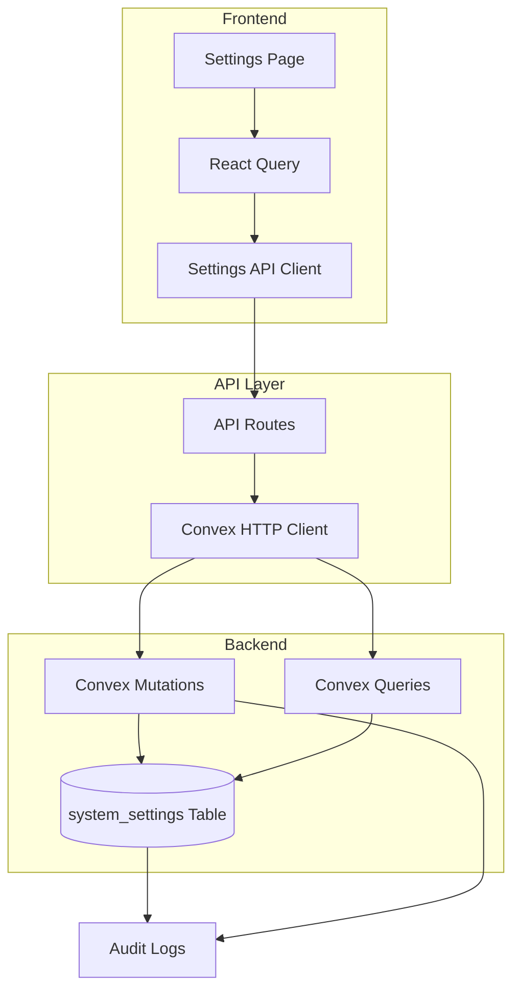
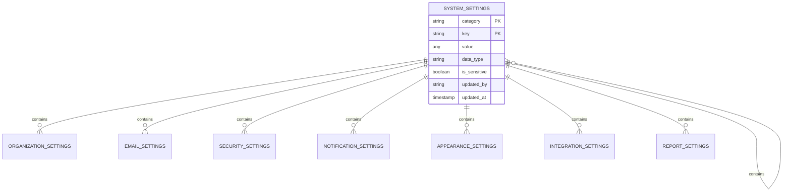
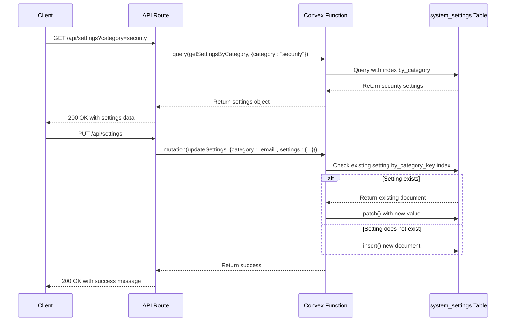

# Settings Management

<cite>
**Referenced Files in This Document**   
- [system_settings.ts](file://convex/system_settings.ts)
- [settings.ts](file://src/lib/api/settings.ts)
- [route.ts](file://src/app/api/settings/route.ts)
- [page.tsx](file://src/app/(dashboard)/settings/page.tsx)
- [database.ts](file://src/types/database.ts)
</cite>

## Table of Contents

1. [Introduction](#introduction)
2. [Settings Architecture](#settings-architecture)
3. [Settings Categories and Data Model](#settings-categories-and-data-model)
4. [API Routes and Convex Functions](#api-routes-and-convex-functions)
5. [Dynamic Forms Implementation](#dynamic-forms-implementation)
6. [Security Considerations](#security-considerations)
7. [Audit Logging and Change Tracking](#audit-logging-and-change-tracking)
8. [Environment-Specific Configurations](#environment-specific-configurations)
9. [Common Issues and Troubleshooting](#common-issues-and-troubleshooting)
10. [Conclusion](#conclusion)

## Introduction

The Settings Management module provides a comprehensive system for managing application configuration through a structured key-value storage approach. This system enables administrators to configure application behavior, manage feature flags, and control sensitive settings through a secure interface. The implementation leverages Convex functions for real-time updates, with settings organized into categories such as organization, email, notifications, system, security, appearance, integrations, and reports. The module supports both individual setting updates and bulk operations, with proper validation and error handling throughout the process.

**Section sources**

- [system_settings.ts](file://convex/system_settings.ts#L1-L244)
- [settings.ts](file://src/lib/api/settings.ts#L1-L273)

## Settings Architecture

The Settings Management system follows a three-tier architecture consisting of frontend components, API routes, and Convex backend functions. The frontend uses React Query for state management and data fetching, while the backend leverages Convex's real-time capabilities for immediate synchronization across clients. Settings are stored in a dedicated `system_settings` table with fields for category, key, value, data type, sensitivity flag, and audit information. The architecture supports both granular updates (single settings) and bulk operations (category-level or complete system settings), with appropriate HTTP methods mapped to corresponding Convex mutations.

**Diagram sources**

- [system_settings.ts](file://convex/system_settings.ts#L1-L244)
- [route.ts](file://src/app/api/settings/route.ts#L1-L128)
- [settings.ts](file://src/lib/api/settings.ts#L1-L273)

**Section sources**

- [system_settings.ts](file://convex/system_settings.ts#L1-L244)
- [route.ts](file://src/app/api/settings/route.ts#L1-L128)
- [settings.ts](file://src/lib/api/settings.ts#L1-L273)

## Settings Categories and Data Model

Settings are organized into predefined categories that group related configuration options. Each setting is stored as a document with a category, key, value, data type, and sensitivity flag. The system automatically detects data types (string, number, boolean, object, array) and marks settings as sensitive if their keys contain terms like "password", "secret", or "key". The data model supports various setting types including organization information, email configuration, notification preferences, system parameters, security policies, appearance options, integration credentials, and report settings.

**Diagram sources**

- [system_settings.ts](file://convex/system_settings.ts#L1-L244)
- [settings.ts](file://src/lib/api/settings.ts#L1-L273)
- [database.ts](file://src/types/database.ts#L1-L552)

**Section sources**

- [system_settings.ts](file://convex/system_settings.ts#L1-L244)
- [settings.ts](file://src/lib/api/settings.ts#L1-L273)
- [database.ts](file://src/types/database.ts#L1-L552)

## API Routes and Convex Functions

The Settings Management module exposes a comprehensive API through Next.js route handlers that interface with Convex functions. The API supports four primary operations: GET for retrieving settings (all or by category), POST for updating settings within a category, PUT for bulk updates of all settings, and DELETE for resetting settings to defaults. Each API route translates HTTP requests into corresponding Convex queries and mutations, with proper error handling and response formatting. The Convex functions are optimized for performance, using indexed queries to minimize read scope and reduce write conflicts during concurrent operations.

**Diagram sources**

- [route.ts](file://src/app/api/settings/route.ts#L1-L128)
- [system_settings.ts](file://convex/system_settings.ts#L1-L244)

**Section sources**

- [route.ts](file://src/app/api/settings/route.ts#L1-L128)
- [system_settings.ts](file://convex/system_settings.ts#L1-L244)

## Dynamic Forms Implementation

The settings interface implements dynamic forms that adapt to different setting categories, providing appropriate input controls based on the setting type. The implementation uses React Query for data fetching and mutation handling, with form validation through Zod schemas. Each category tab contains a form with inputs specific to that category's settings, including text fields, number inputs, switches for boolean values, and password inputs for sensitive data. The form tracks changes and enables the save button only when modifications are present, preventing unnecessary updates. Validation ensures that settings meet required criteria before submission, such as minimum password length or valid email formats.

**Section sources**

- [page.tsx](<file://src/app/(dashboard)/settings/page.tsx#L1-L700>)
- [settings.ts](file://src/lib/api/settings.ts#L1-L273)

## Security Considerations

The Settings Management system incorporates multiple security measures to protect sensitive configuration data. Sensitive settings (those containing "password", "secret", or "key" in their keys) are automatically flagged and handled with additional care. The system implements proper authentication and authorization through Convex's security model, ensuring that only authorized users can modify settings. All API routes include error handling that avoids leaking sensitive information in error messages. The implementation also includes validation for security-related settings, such as enforcing minimum password lengths and session timeout limits. Additionally, the system supports two-factor authentication requirements as a configurable security policy.

**Section sources**

- [system_settings.ts](file://convex/system_settings.ts#L1-L244)
- [settings.ts](file://src/lib/api/settings.ts#L1-L273)
- [page.tsx](<file://src/app/(dashboard)/settings/page.tsx#L1-L700>)

## Audit Logging and Change Tracking

The system maintains comprehensive audit logs for all setting changes, capturing who made the change, when it occurred, and which settings were modified. Each setting document includes `updated_by` and `updated_at` fields that are automatically populated during mutations. The audit trail enables administrators to track configuration changes over time and identify the source of any issues that arise from setting modifications. The implementation also supports resetting settings to defaults, with appropriate confirmation prompts to prevent accidental loss of configuration. Future enhancements could include detailed change logs that record both old and new values for audit purposes.

**Section sources**

- [system_settings.ts](file://convex/system_settings.ts#L1-L244)
- [audit_logs.ts](file://convex/audit_logs.ts#L1-L50)

## Environment-Specific Configurations

The Settings Management system supports environment-specific configurations through its flexible key-value storage model. Different environments (development, staging, production) can maintain their own setting values while sharing the same structure and categories. The system allows for feature flags to be toggled on or off per environment, enabling gradual feature rollouts and environment-specific behavior. Configuration values such as API endpoints, email settings, and integration credentials can be customized for each environment without changing the application code. The implementation also supports default values that apply across environments, with environment-specific overrides taking precedence.

**Section sources**

- [system_settings.ts](file://convex/system_settings.ts#L1-L244)
- [settings.ts](file://src/lib/api/settings.ts#L1-L273)

## Common Issues and Troubleshooting

Several common issues may arise when managing settings in this system. Caching of settings can lead to stale data being displayed, which is mitigated through React Query's cache invalidation mechanisms and appropriate stale time settings. Validation of input values is enforced through Zod schemas on the frontend and type checking in Convex functions, preventing invalid configurations from being saved. Migration between versions requires careful consideration of setting schema changes, with backward compatibility maintained through default values and graceful handling of missing settings. Performance considerations include the use of indexed queries to prevent full table scans and batch processing for reset operations to avoid timeouts.

**Section sources**

- [system_settings.ts](file://convex/system_settings.ts#L1-L244)
- [settings.ts](file://src/lib/api/settings.ts#L1-L273)
- [page.tsx](<file://src/app/(dashboard)/settings/page.tsx#L1-L700>)

## Conclusion

The Settings Management module provides a robust, secure, and user-friendly interface for configuring application behavior. By leveraging Convex's real-time capabilities and a well-structured API, the system enables efficient management of configuration settings across multiple categories. The implementation balances flexibility with security, allowing administrators to customize the application while protecting sensitive data. With comprehensive audit logging, environment-specific configurations, and proper error handling, the system provides a reliable foundation for application configuration management.
