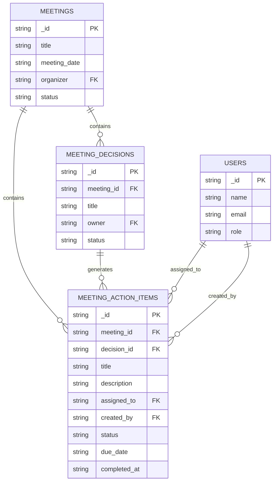
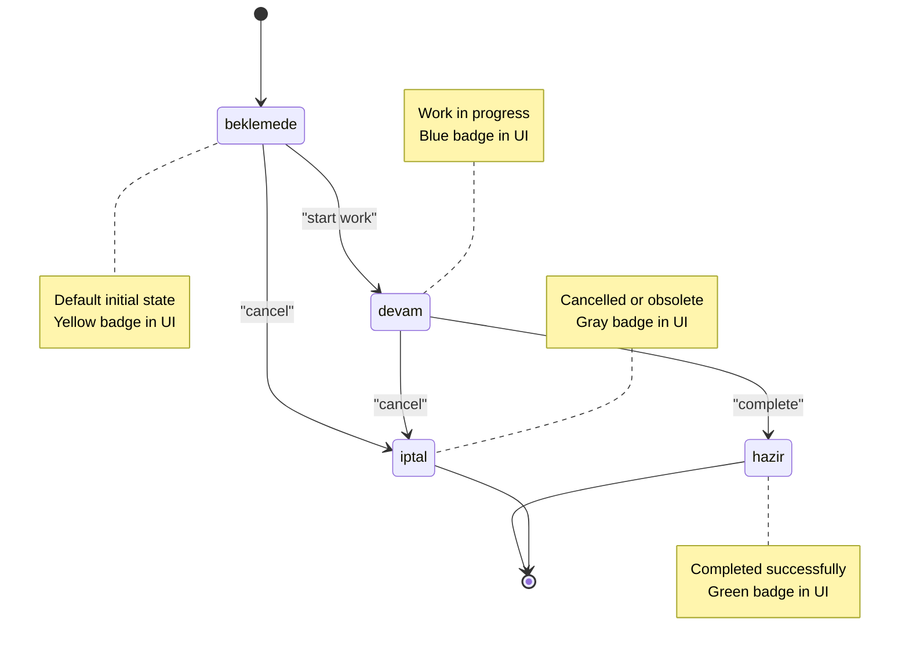
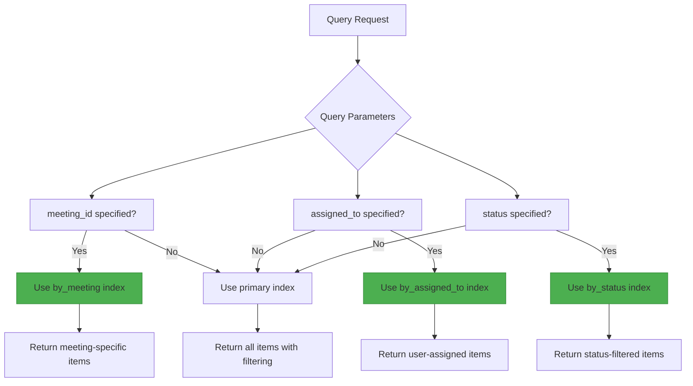
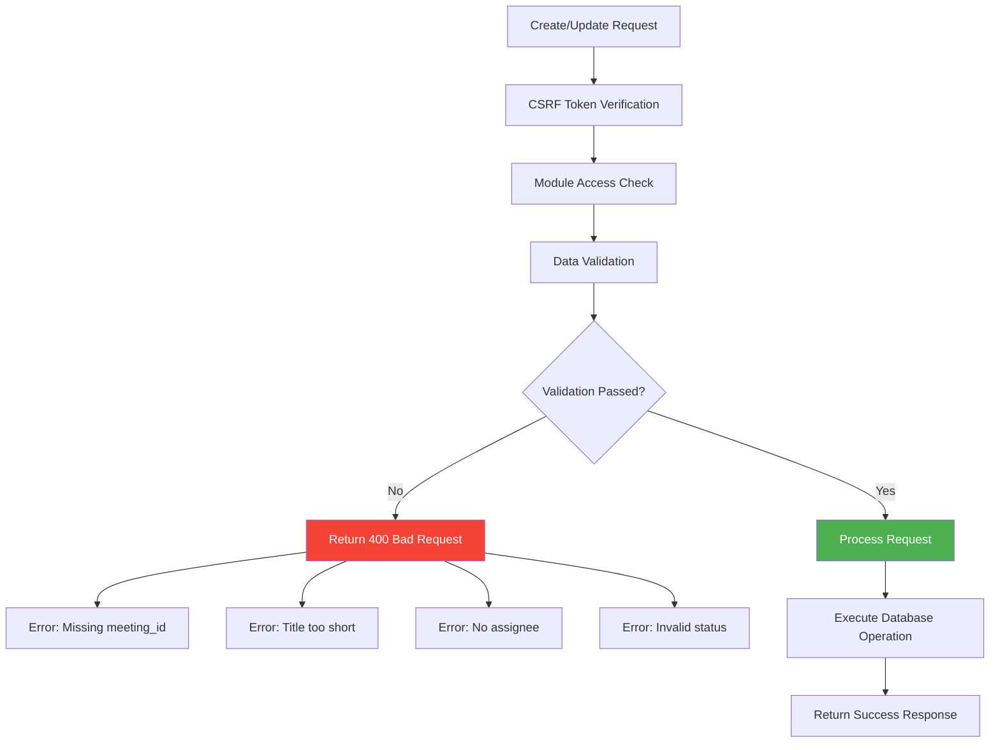
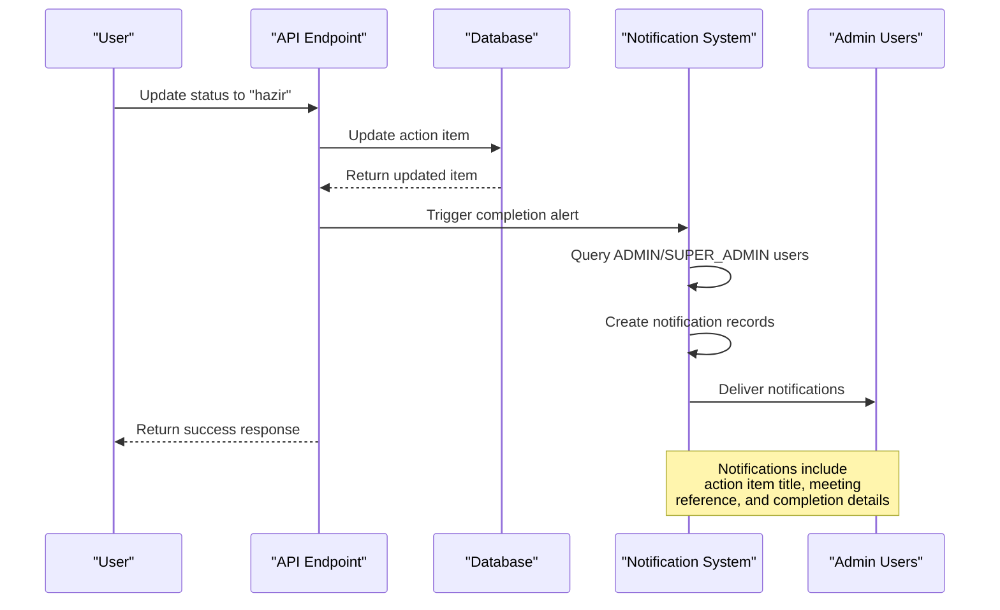

# Meeting Action Items

<cite>
**Referenced Files in This Document**   
- [meeting_action_items.ts](file://convex/meeting_action_items.ts)
- [database.ts](file://src/types/database.ts)
- [api.ts](file://src/lib/convex/api.ts)
- [meetingActionItem.ts](file://src/lib/validations/meetingActionItem.ts)
- [route.ts](file://src/app/api/meeting-action-items/route.ts)
- [route.ts](file://src/app/api/meeting-action-items/[id]/route.ts)
</cite>

## Table of Contents

1. [Introduction](#introduction)
2. [Data Model and Relationships](#data-model-and-relationships)
3. [Action Item Lifecycle and Status Management](#action-item-lifecycle-and-status-management)
4. [Indexing and Query Optimization](#indexing-and-query-optimization)
5. [Data Validation and Access Control](#data-validation-and-access-control)
6. [Integration with Notification System](#integration-with-notification-system)
7. [Referential Integrity and Cascading Operations](#referential-integrity-and-cascading-operations)
8. [API Endpoints and Usage Examples](#api-endpoints-and-usage-examples)
9. [Troubleshooting Common Issues](#troubleshooting-common-issues)

## Introduction

The Meeting Action Items sub-module provides a structured system for tracking tasks and responsibilities that emerge from meetings and decisions. This documentation details the implementation of action item creation, assignment, status tracking, and integration with related components such as meetings, decisions, and users. The system ensures proper data integrity, efficient querying through indexing, and appropriate access controls based on user roles and meeting participation.

## Data Model and Relationships

The Meeting Action Items system is built around a core document structure that establishes relationships with meetings, decisions, and users through foreign key references. Each action item is associated with a specific meeting and optionally linked to a particular decision made during that meeting.



**Diagram sources**

- [database.ts](file://src/types/database.ts#L271-L290)
- [meeting_action_items.ts](file://convex/meeting_action_items.ts#L54-L92)

**Section sources**

- [database.ts](file://src/types/database.ts#L271-L290)
- [meeting_action_items.ts](file://convex/meeting_action_items.ts#L54-L92)

## Action Item Lifecycle and Status Management

Action items progress through a defined lifecycle with four distinct status states that reflect their completion state. The system maintains a complete history of status changes, enabling auditability and transparency in task progression.

The status transitions are:

- **beklemede** (Pending): Initial state when an action item is created
- **devam** (In Progress): When work on the action item has started
- **hazir** (Completed): When the action item has been finished
- **iptal** (Cancelled): When the action item is no longer required



When an action item's status changes to "hazir" (completed), the system automatically records the completion timestamp. The status history array captures every status transition with the timestamp, user who made the change, and an optional note explaining the change.

**Diagram sources**

- [meeting_action_items.ts](file://convex/meeting_action_items.ts#L6-11)
- [meetingActionItem.ts](file://src/lib/validations/meetingActionItem.ts#L1-L8)

**Section sources**

- [meeting_action_items.ts](file://convex/meeting_action_items.ts#L6-11)
- [meetingActionItem.ts](file://src/lib/validations/meetingActionItem.ts#L1-L8)

## Indexing and Query Optimization

The system implements targeted indexing strategies to ensure efficient querying performance, particularly for common access patterns related to meeting-specific action items and user assignments.

The database maintains three dedicated indexes:

- **by_meeting**: Optimizes queries for retrieving all action items associated with a specific meeting
- **by_assigned_to**: Optimizes queries for retrieving all action items assigned to a specific user
- **by_status**: Optimizes queries for retrieving action items by their current status



The query handler in the backend intelligently selects the appropriate index based on the provided parameters, ensuring optimal performance for the most common use cases: viewing action items for a specific meeting or checking a user's assigned tasks.

**Diagram sources**

- [meeting_action_items.ts](file://convex/meeting_action_items.ts#L22-L43)

**Section sources**

- [meeting_action_items.ts](file://convex/meeting_action_items.ts#L22-L43)

## Data Validation and Access Control

The system implements comprehensive data validation rules and access control mechanisms to ensure data integrity and security. All operations on action items require appropriate permissions and undergo validation before processing.

### Data Validation Rules

When creating or updating action items, the system enforces the following validation rules:

- Meeting ID is required
- Title must be at least 3 characters long
- Assigned user must be specified
- Created by user must be specified
- Status must be one of the allowed values



### Access Control

Access to action item operations is controlled through role-based permissions:

- Only users with 'workflow' module access can create, read, update, or delete action items
- CSRF tokens are required for all mutating operations (POST, PUT, PATCH, DELETE)
- The system verifies user permissions before processing any request

**Diagram sources**

- [route.ts](file://src/app/api/meeting-action-items/route.ts#L84-L98)
- [route.ts](file://src/app/api/meeting-action-items/[id]/route.ts#L52-L53)

**Section sources**

- [route.ts](file://src/app/api/meeting-action-items/route.ts#L84-L98)
- [route.ts](file://src/app/api/meeting-action-items/[id]/route.ts#L52-L53)

## Integration with Notification System

The Meeting Action Items system is integrated with the workflow notification system to provide automated alerts when significant events occur, particularly when action items are completed.

When an action item's status is changed to "hazir" (completed), the system automatically triggers notifications to all administrators and super administrators. This ensures that completed tasks are visible to relevant stakeholders without requiring manual follow-up.



The notification includes contextual information such as the action item title, the associated meeting, and any notes provided during the status update. This integration ensures that important task completions are not overlooked and provides visibility into workflow progress.

**Diagram sources**

- [meeting_action_items.ts](file://convex/meeting_action_items.ts#L197-L259)
- [meeting_action_items.ts](file://convex/meeting_action_items.ts#L142-L149)

**Section sources**

- [meeting_action_items.ts](file://convex/meeting_action_items.ts#L197-L259)

## Referential Integrity and Cascading Operations

The system maintains referential integrity between action items, meetings, and decisions through foreign key relationships. While the current implementation does not enforce database-level cascading operations, it provides application-level handling for related scenarios.

When a meeting is cancelled or deleted, the system does not automatically remove associated action items. Instead, these action items become orphaned but remain accessible for historical tracking and audit purposes. This approach preserves the record of what was discussed and decided, even if the parent meeting is no longer active.

The relationship between action items and decisions is optional, allowing for flexibility in how tasks are organized:

- Action items can be linked to a specific decision when they directly implement that decision
- Action items can exist at the meeting level without being tied to a particular decision

This design choice supports both structured decision implementation and general meeting follow-up tasks.

**Section sources**

- [database.ts](file://src/types/database.ts#L271-L290)
- [meeting_action_items.ts](file://convex/meeting_action_items.ts#L54-L92)

## API Endpoints and Usage Examples

The Meeting Action Items sub-module exposes a comprehensive REST API for creating, retrieving, updating, and deleting action items. The endpoints follow standard HTTP conventions and provide appropriate status codes and response formats.

### Available Endpoints

| Endpoint                         | Method | Description                      | Parameters                                  |
| -------------------------------- | ------ | -------------------------------- | ------------------------------------------- |
| `/api/meeting-action-items`      | GET    | List action items with filtering | meeting_id, assigned_to, status, pagination |
| `/api/meeting-action-items`      | POST   | Create new action item           | Action item data                            |
| `/api/meeting-action-items/[id]` | GET    | Get specific action item         | ID path parameter                           |
| `/api/meeting-action-items/[id]` | PUT    | Update action item               | ID path parameter, update data              |
| `/api/meeting-action-items/[id]` | PATCH  | Update action item status        | ID path parameter, status, changed_by       |
| `/api/meeting-action-items/[id]` | DELETE | Delete action item               | ID path parameter                           |

### Example Usage

To create a new action item:

```http
POST /api/meeting-action-items
Content-Type: application/json

{
  "meeting_id": "meeting_123",
  "title": "Prepare quarterly report",
  "description": "Compile financial data for Q3",
  "assigned_to": "user_456",
  "created_by": "user_789",
  "due_date": "2024-12-15"
}
```

To update an action item's status:

```http
PATCH /api/meeting-action-items/action_123
Content-Type: application/json

{
  "status": "hazir",
  "changed_by": "user_456",
  "note": "Report completed and submitted"
}
```

**Section sources**

- [route.ts](file://src/app/api/meeting-action-items/route.ts)
- [route.ts](file://src/app/api/meeting-action-items/[id]/route.ts)

## Troubleshooting Common Issues

This section addresses common issues that may arise when working with the Meeting Action Items system and provides guidance for resolution.

### Handling Orphaned Action Items

When meetings are cancelled, their associated action items remain in the system as orphaned records. To address this:

1. Implement a periodic cleanup process that identifies action items linked to cancelled meetings
2. Review these action items to determine if they should be:
   - Reassigned to a different meeting
   - Marked as cancelled with appropriate notes
   - Kept for historical purposes

### Ensuring Referential Integrity

To maintain data consistency:

- Always verify that referenced meetings, decisions, and users exist before creating action items
- Implement application-level checks when deleting meetings to notify users of associated action items
- Consider adding soft deletion for meetings to preserve historical context

### Performance Optimization

For large datasets:

- Ensure indexes are properly maintained on meeting_id and assigned_to fields
- Use pagination when retrieving large lists of action items
- Implement client-side caching for frequently accessed action items

### Access Control Issues

Common access problems and solutions:

- **403 Forbidden errors**: Verify the user has 'workflow' module access
- **CSRF token errors**: Ensure proper token inclusion in mutating requests
- **Permission denied**: Check user role and meeting participation requirements

**Section sources**

- [meeting_action_items.ts](file://convex/meeting_action_items.ts)
- [route.ts](file://src/app/api/meeting-action-items/route.ts)
- [route.ts](file://src/app/api/meeting-action-items/[id]/route.ts)
