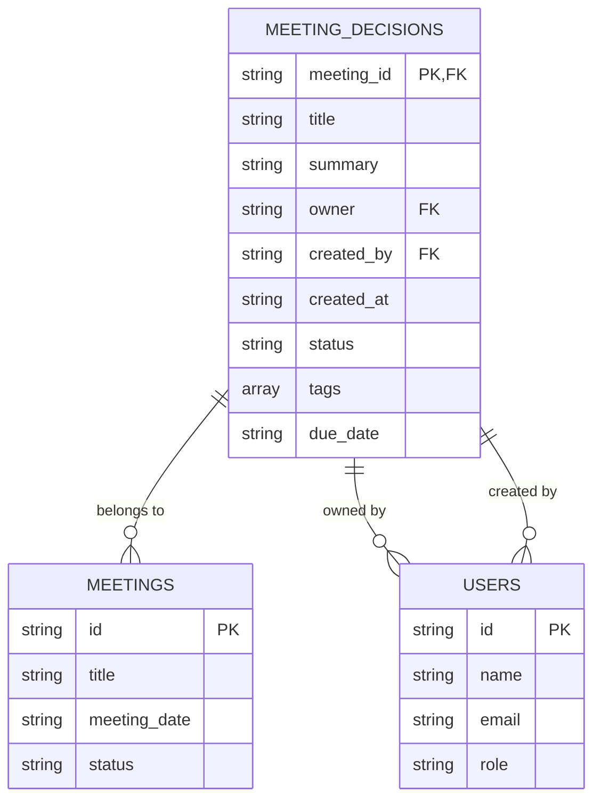
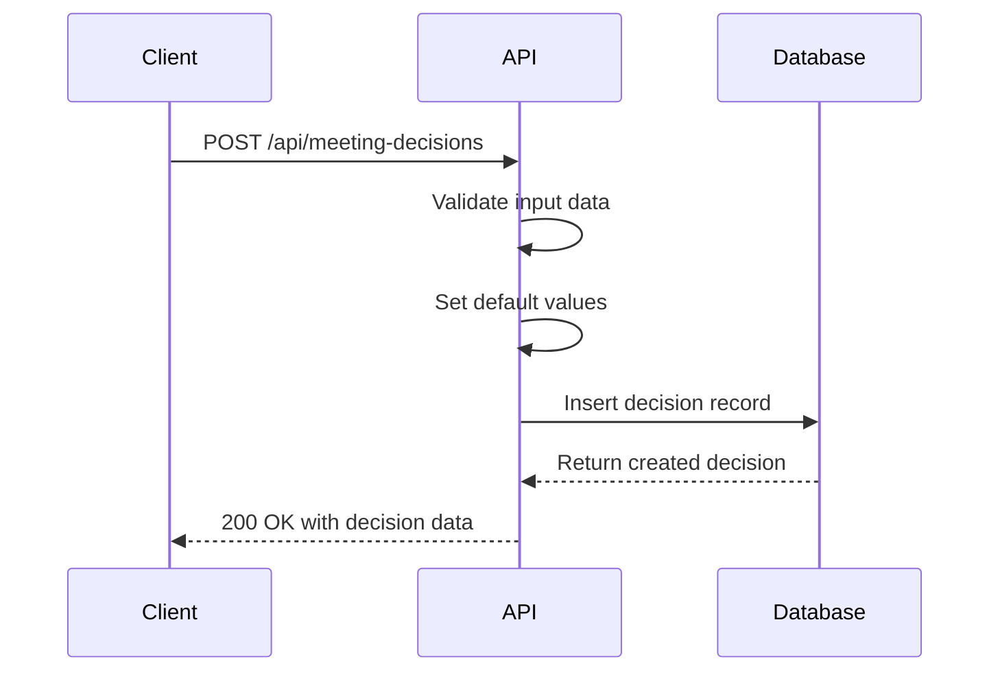
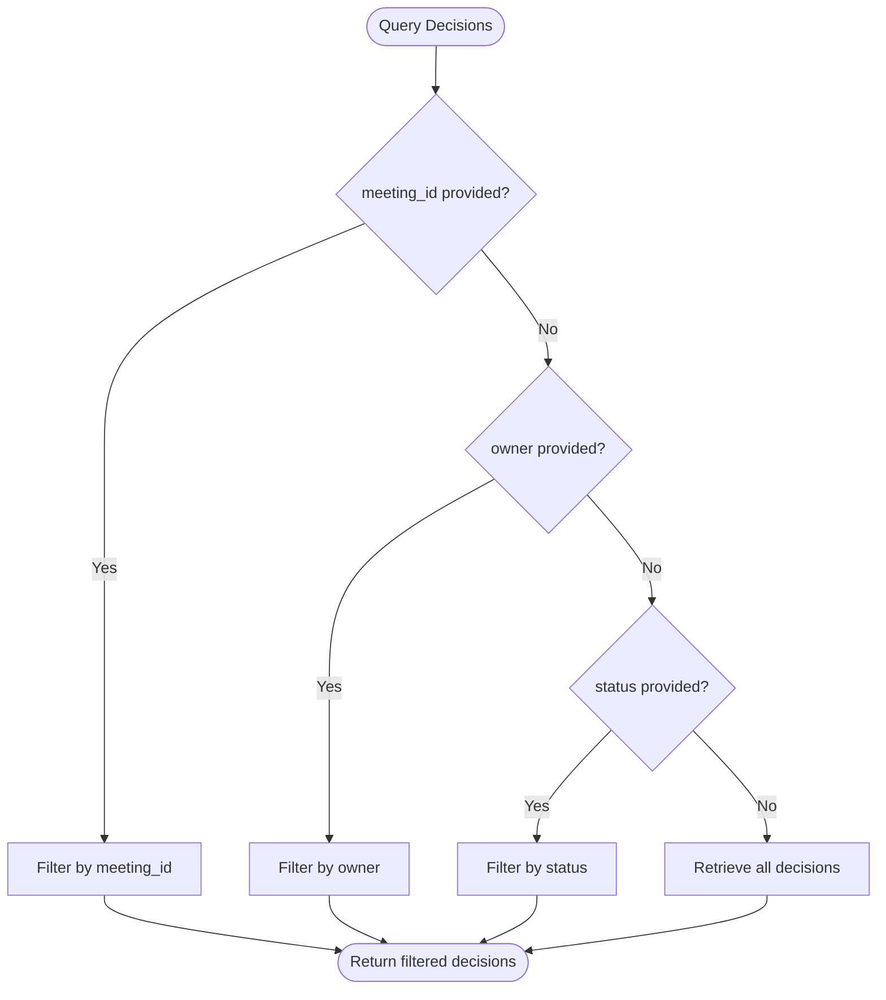
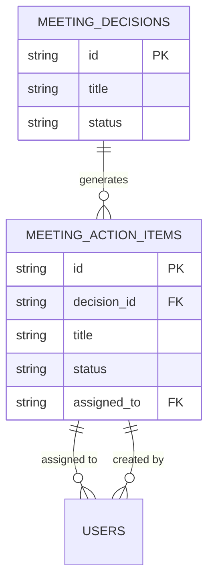
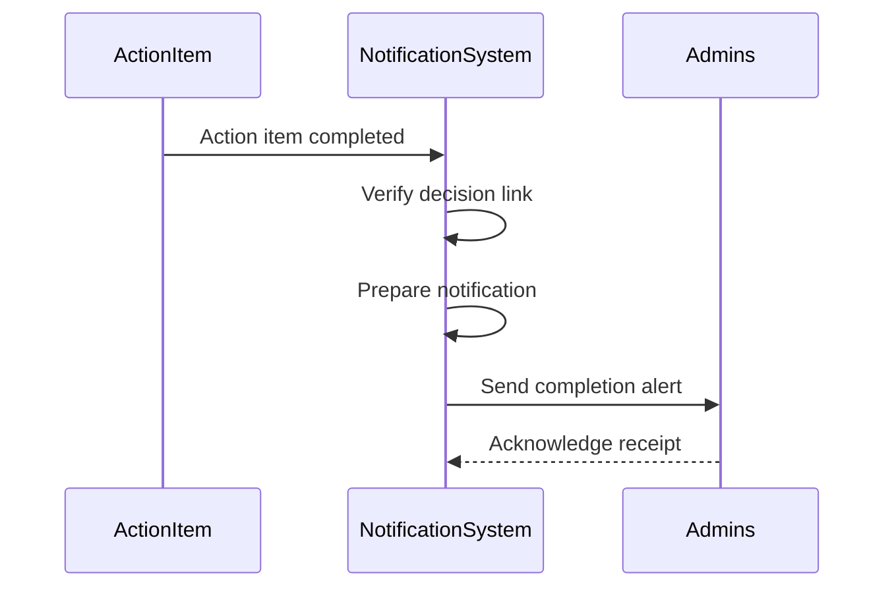

# Meeting Decisions

<cite>
**Referenced Files in This Document**   
- [meeting_decisions.ts](file://convex/meeting_decisions.ts)
- [meetings.ts](file://convex/meetings.ts)
- [meeting_action_items.ts](file://convex/meeting_action_items.ts)
- [database.ts](file://src/types/database.ts)
- [meetingActionItem.ts](file://src/lib/validations/meetingActionItem.ts)
</cite>

## Table of Contents

1. [Introduction](#introduction)
2. [Data Model](#data-model)
3. [CRUD Operations](#crud-operations)
4. [Querying and Filtering](#querying-and-filtering)
5. [Indexing Strategy](#indexing-strategy)
6. [Business Rules and Lifecycle](#business-rules-and-lifecycle)
7. [Integration with Action Items](#integration-with-action-items)
8. [Notification System](#notification-system)
9. [Audit Logging](#audit-logging)
10. [Data Consistency](#data-consistency)
11. [Common Issues and Solutions](#common-issues-and-solutions)

## Introduction

The Meeting Decisions sub-module provides a structured system for recording, tracking, and managing decisions made during organizational meetings. This documentation details the implementation of decision tracking, including core functionality, data relationships, business rules, and integration points. The system enables users to create decisions with titles, summaries, owners, and status tracking, while maintaining a clear relationship to parent meetings through the meeting_id field.

**Section sources**

- [meeting_decisions.ts](file://convex/meeting_decisions.ts#L1-L114)
- [database.ts](file://src/types/database.ts#L259-L269)

## Data Model

The Meeting Decision data model is designed to capture essential information about decisions made during meetings. Each decision record contains the following key fields:

- **meeting_id**: Reference to the parent meeting (required)
- **title**: Brief description of the decision (required)
- **summary**: Detailed explanation of the decision (optional)
- **owner**: User responsible for implementing the decision (optional)
- **created_by**: User who created the decision record (required)
- **created_at**: Timestamp of decision creation (automatically set)
- **status**: Current state of the decision (acik, devam, kapatildi)
- **tags**: Array of string tags for categorization (optional)
- **due_date**: Target completion date (optional)

The decision status follows a three-state lifecycle: "acik" (open), "devam" (in progress), and "kapatildi" (closed). These statuses are defined as a union type in the schema to ensure data integrity.



**Diagram sources**

- [meeting_decisions.ts](file://convex/meeting_decisions.ts#L4-L8)
- [database.ts](file://src/types/database.ts#L259-L269)

**Section sources**

- [meeting_decisions.ts](file://convex/meeting_decisions.ts#L4-L8)
- [database.ts](file://src/types/database.ts#L259-L269)

## CRUD Operations

The system provides standard CRUD (Create, Read, Update, Delete) operations for managing meeting decisions through Convex functions.

### Create Operation

The create operation requires a meeting_id, title, and created_by user. The status field defaults to "acik" if not specified. The created_at timestamp is automatically set to the current ISO string.



**Diagram sources**

- [meeting_decisions.ts](file://convex/meeting_decisions.ts#L51-L76)

### Read Operations

Two primary read operations are available: get (retrieve single decision by ID) and list (retrieve multiple decisions with optional filtering).

### Update Operation

The update operation allows modification of decision properties including title, summary, owner, status, tags, and due_date. The system validates that the decision exists before applying updates.

### Delete Operation

The delete operation removes a decision record after verifying its existence. This operation is irreversible.

**Section sources**

- [meeting_decisions.ts](file://convex/meeting_decisions.ts#L51-L114)

## Querying and Filtering

The system supports querying decisions by various criteria to facilitate efficient data retrieval and reporting.

### Query by Meeting Context

To retrieve all decisions associated with a specific meeting, use the meeting_id parameter:

```typescript
const decisions = await ctx.db
  .query('meeting_decisions')
  .withIndex('by_meeting', (q) => q.eq('meeting_id', meetingId))
  .collect();
```

### Query by Owner

To find decisions assigned to a specific user, use the owner parameter:

```typescript
const decisions = await ctx.db
  .query('meeting_decisions')
  .withIndex('by_owner', (q) => q.eq('owner', ownerId))
  .collect();
```

### Query by Status

To retrieve decisions by their current status, use the status parameter:

```typescript
const decisions = await ctx.db
  .query('meeting_decisions')
  .withIndex('by_status', (q) => q.eq('status', status))
  .collect();
```

When multiple filter parameters are provided, the system processes them in priority order: meeting_id, owner, then status. If no filters are specified, all decisions are returned.



**Diagram sources**

- [meeting_decisions.ts](file://convex/meeting_decisions.ts#L10-L41)

**Section sources**

- [meeting_decisions.ts](file://convex/meeting_decisions.ts#L10-L41)

## Indexing Strategy

The system employs a targeted indexing strategy to ensure efficient data retrieval performance. Three dedicated indexes have been created to support the primary query patterns:

- **by_meeting**: Index on meeting_id field for fast retrieval of decisions by meeting context
- **by_owner**: Index on owner field for quick access to decisions assigned to specific users
- **by_status**: Index on status field for efficient filtering by decision state

These indexes enable the system to perform queries with optimal performance, even as the dataset grows. The query planner automatically selects the appropriate index based on the filter parameters provided in the request.

**Section sources**

- [meeting_decisions.ts](file://convex/meeting_decisions.ts#L22-L23)
- [meeting_decisions.ts](file://convex/meeting_decisions.ts#L29-L30)
- [meeting_decisions.ts](file://convex/meeting_decisions.ts#L36-L37)

## Business Rules and Lifecycle

The Meeting Decisions system enforces several business rules to maintain data integrity and support effective decision tracking.

### Status Lifecycle

Decisions follow a defined lifecycle with three possible states:

- **acik (Open)**: Decision has been recorded but implementation has not started
- **devam (In Progress)**: Implementation of the decision is underway
- **kapatildi (Closed)**: Decision has been fully implemented and completed

The system does not enforce a strict transition order between states, allowing users to move between any states as needed based on the actual progress of implementation.

### Default Values

When creating a new decision, the following default values are applied:

- Status defaults to "acik" if not specified
- Created_at is automatically set to the current timestamp
- No default owner is assigned

### Data Validation

The system validates that required fields (meeting_id, title, created_by) are present before creating a decision. The status field is validated against the allowed values (acik, devam, kapatildi) to prevent invalid data entry.

**Section sources**

- [meeting_decisions.ts](file://convex/meeting_decisions.ts#L71-L72)
- [meeting_decisions.ts](file://convex/meeting_decisions.ts#L63-L64)

## Integration with Action Items

Meeting decisions are closely integrated with action items, creating a comprehensive task management system. Each decision can spawn one or more action items that represent specific tasks required to implement the decision.

An action item can reference its parent decision through the decision_id field, establishing a clear lineage from strategic decisions to tactical implementation tasks. This relationship enables users to trace the origin of tasks back to the meeting decisions that generated them.

The status of action items (beklemede, devam, hazir, iptal) provides granular tracking of implementation progress, complementing the higher-level status tracking of the parent decision.



**Diagram sources**

- [meeting_action_items.ts](file://convex/meeting_action_items.ts#L57-L58)
- [database.ts](file://src/types/database.ts#L271-L290)

**Section sources**

- [meeting_action_items.ts](file://convex/meeting_action_items.ts#L57-L58)
- [database.ts](file://src/types/database.ts#L271-L290)

## Notification System

The system integrates with a workflow notification system to keep stakeholders informed about decision status changes and related activities. When action items linked to decisions are completed, notifications are automatically sent to relevant administrators.

The notification system uses the workflow_notifications collection to manage alerts, with the reference field containing the decision_id to establish context. This integration ensures that decision owners and stakeholders are promptly informed about progress toward implementing decisions.



**Diagram sources**

- [meeting_action_items.ts](file://convex/meeting_action_items.ts#L197-L259)

**Section sources**

- [meeting_action_items.ts](file://convex/meeting_action_items.ts#L197-L259)

## Audit Logging

All operations on meeting decisions are subject to audit logging to maintain a complete history of changes. The system automatically tracks creation and modification events, capturing essential information including:

- Timestamp of each operation
- User who performed the action
- Type of operation (CREATE, UPDATE, DELETE)
- Resource affected (decision ID)

This audit trail enables organizations to review the history of decision management, ensuring accountability and supporting compliance requirements. The audit_logs collection maintains these records with appropriate indexing for efficient querying by resource, user, or date range.

**Section sources**

- [audit_logs.ts](file://convex/audit_logs.ts#L39-L91)

## Data Consistency

The system maintains data consistency through several mechanisms:

### Referential Integrity

While the database does not enforce foreign key constraints at the database level, the application logic validates the existence of related records. Before creating a decision, the system verifies that the referenced meeting exists.

### Error Handling

Operations include comprehensive error handling to prevent data corruption. For update and delete operations, the system first verifies that the target decision exists before proceeding. If a decision is not found, an appropriate error is thrown.

### Transaction Safety

Each operation is performed as an atomic transaction, ensuring that partial updates cannot leave the data in an inconsistent state. The Convex database guarantees that operations either complete fully or fail completely.

**Section sources**

- [meeting_decisions.ts](file://convex/meeting_decisions.ts#L91-L95)
- [meeting_decisions.ts](file://convex/meeting_decisions.ts#L105-L108)

## Common Issues and Solutions

Several common issues may arise when working with the Meeting Decisions system, along with their recommended solutions.

### Maintaining Decision History

Challenge: Tracking the evolution of a decision's status over time.

Solution: While the current system does not maintain a formal history of status changes for decisions, this functionality could be enhanced by adding a status_history field similar to the one implemented for action items. This would allow users to see the complete timeline of a decision's progress.

### Handling Status Transitions

Challenge: Ensuring appropriate status transitions based on business rules.

Solution: The current implementation allows any status transition, providing maximum flexibility. If stricter workflow enforcement is required, validation logic could be added to the update operation to restrict transitions based on organizational policies.

### Data Consistency When Meetings Are Modified

Challenge: Maintaining integrity when parent meetings are updated or deleted.

Solution: The system currently does not automatically update or delete decisions when their parent meeting is modified. To address this, event listeners could be implemented to handle meeting deletion by either cascading the deletion to related decisions or updating the decision status to reflect the meeting's cancellation.

### Ensuring Data Completeness

Challenge: Preventing orphaned decisions or incomplete records.

Solution: The validation rules ensure that required fields are present when creating decisions. Additional validation could be implemented to ensure that decisions have either an owner assigned or a note explaining why no owner is designated, improving accountability.

**Section sources**

- [meeting_decisions.ts](file://convex/meeting_decisions.ts#L78-L99)
- [meeting_action_items.ts](file://convex/meeting_action_items.ts#L117-L137)
