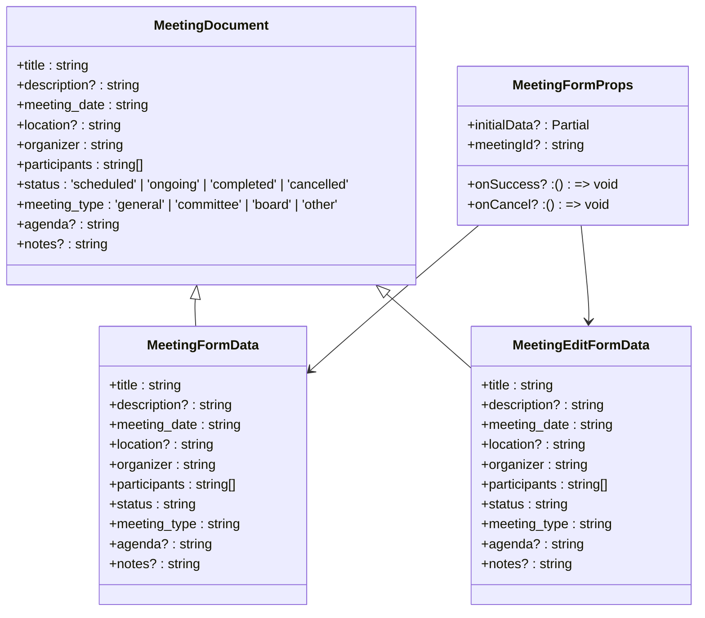
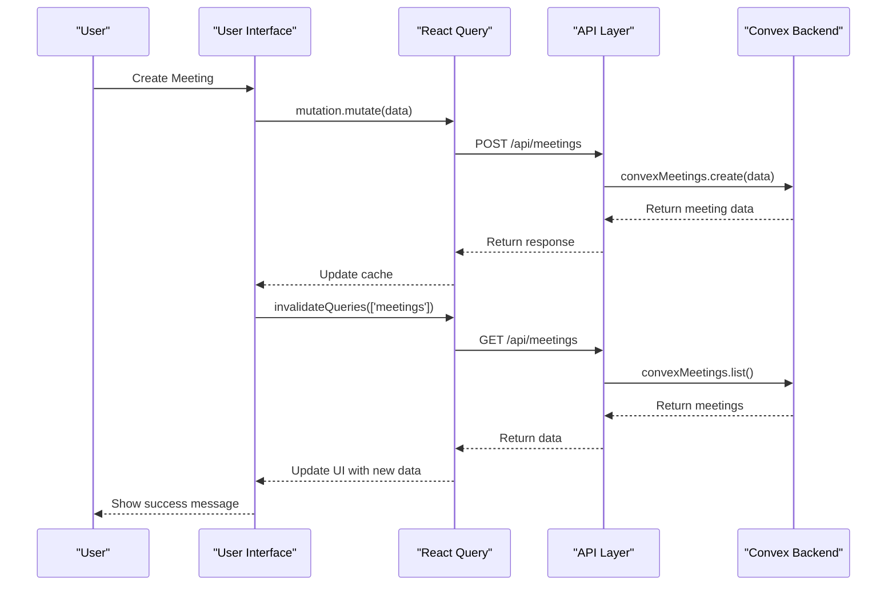

# Meeting Scheduling

<cite>
**Referenced Files in This Document**   
- [CalendarView.tsx](file://src/components/meetings/CalendarView.tsx)
- [MeetingForm.tsx](file://src/components/forms/MeetingForm.tsx)
- [page.tsx](file://src/app/(dashboard)/is/toplantilar/page.tsx)
- [database.ts](file://src/types/database.ts)
- [meeting.ts](file://src/lib/validations/meeting.ts)
- [meetings.ts](file://convex/meetings.ts)
- [route.ts](file://src/app/api/meetings/route.ts)
- [convex-api-client.ts](file://src/lib/api/convex-api-client.ts)
</cite>

## Table of Contents

1. [Introduction](#introduction)
2. [Meeting Management](#meeting-management)
3. [CalendarView Component Implementation](#calendarview-component-implementation)
4. [Data Models and Validation](#data-models-and-validation)
5. [Meeting Status Transitions](#meeting-status-transitions)
6. [Integration with Users and Real-time Updates](#integration-with-users-and-real-time-updates)
7. [Performance and Responsive Design](#performance-and-responsive-design)
8. [Common Issues and Solutions](#common-issues-and-solutions)

## Introduction

The Meeting Scheduling sub-module provides a comprehensive solution for managing organizational meetings within the Kafkasder-panel application. This system enables users to create, organize, and track meetings through an intuitive calendar interface with robust filtering capabilities. The implementation supports different meeting types including general, committee, and board meetings, each with distinct visual indicators and workflows. The system integrates tightly with user management, allowing for participant assignment and organizer designation. Meetings can be viewed in both calendar and list formats, with support for real-time updates and data consistency across clients. The module handles meeting agendas, notes, and action items, providing a complete workflow from planning to post-meeting documentation.

## Meeting Management

The meeting management system provides a complete workflow for creating, editing, and organizing meetings. Users can create new meetings through a dedicated form that captures essential details including title, description, date, time, location, meeting type, participants, agenda, and notes. The system automatically assigns the current user as the meeting organizer and includes them in the participant list by default. Meeting creation is accessible through multiple entry points: a dedicated "New Meeting" button, double-clicking on a date in the calendar view, or selecting an empty date slot. The form enforces validation rules to ensure data integrity, requiring a minimum of three characters for the title, a future date for scheduling, and at least one participant. The participant selection interface allows users to add or remove participants with a maximum limit of 50 attendees per meeting. When editing existing meetings, users can modify most fields except for the meeting date in certain contexts, and can transition the meeting through different status states. The system provides visual feedback during form submission and displays appropriate success or error messages. Meetings can be filtered by type (general, committee, board, other) and status (scheduled, ongoing, completed, cancelled) using dedicated dropdown filters in the interface.

**Section sources**

- [MeetingForm.tsx](file://src/components/forms/MeetingForm.tsx#L44-L440)
- [page.tsx](<file://src/app/(dashboard)/is/toplantilar/page.tsx#L62-L786>)

## CalendarView Component Implementation

The CalendarView component provides a month-based calendar interface for visualizing and interacting with meetings. It displays meetings with color-coded indicators based on meeting type: blue for general meetings, purple for committee meetings, red for board meetings, and gray for other meetings. The component supports month navigation through previous and next month buttons, as well as a "Today" button that resets the view to the current month. Users can select specific dates to view meetings scheduled for that day, with upcoming meetings (within the next seven days) displayed by default when no date is selected. The calendar highlights dates with scheduled meetings through bold text and blue underlines. When a date is selected, the component displays a list of meetings for that date, showing the meeting time, title, type, location, participant count, and current status. Each meeting card is clickable to view details or initiate editing. The component supports double-click functionality on dates to create new meetings, providing a quick and intuitive way to schedule appointments. The interface is responsive and adapts to different screen sizes, with meetings displayed in a single column on mobile devices and in a two-column grid on larger screens. The calendar uses the Turkish locale for date formatting, displaying month and day names in Turkish.

```mermaid
flowchart TD
A[CalendarView Component] --> B[State Management]
B --> B1[selectedMonth: Date]
B --> B2[selectedDate: Date | undefined]
A --> C[Data Processing]
C --> C1[meetingsByDate: Map<string, MeetingDocument[]>]
C --> C2[selectedDateMeetings: MeetingDocument[]]
A --> D[UI Rendering]
D --> D1[Month Navigation Controls]
D --> D2[Calendar Grid]
D --> D3[Meeting Indicators]
D --> D4[Selected Date Meetings List]
A --> E[Event Handlers]
E --> E1[handlePreviousMonth]
E --> E2[handleNextMonth]
E --> E3[handleToday]
E --> E4[handleDateSelect]
E --> E5[handleDateDoubleClick]
D2 --> F[Date Cells]
F --> F1[No Meetings: Normal Style]
F --> F2[Has Meetings: Bold + Underline]
D4 --> G[Meeting Cards]
G --> G1[Time and Status Badge]
G --> G2[Title]
G --> G3[Type Indicator Dot]
G --> G4[Location]
G --> G5[Participant Count]
```

**Diagram sources**

- [CalendarView.tsx](file://src/components/meetings/CalendarView.tsx#L21-L282)

**Section sources**

- [CalendarView.tsx](file://src/components/meetings/CalendarView.tsx#L21-L282)

## Data Models and Validation

The meeting data model is defined with a comprehensive set of fields to capture all necessary meeting information. The core MeetingDocument interface extends the base Document interface and includes properties for title, description, meeting_date, location, organizer, participants, status, meeting_type, agenda, and notes. The organizer field stores the user ID of the meeting creator, while participants is an array of user IDs representing attendees. The status field is a union type with four possible values: 'scheduled', 'ongoing', 'completed', and 'cancelled'. The meeting_type field supports four categories: 'general', 'committee', 'board', and 'other'. Validation is implemented using Zod schemas with different rules for creating new meetings versus editing existing ones. The meetingSchema used for new meetings enforces that the meeting date is at least one hour in the future, while the meetingEditSchema allows any date for editing existing meetings. Both schemas validate that the title is between 3 and 200 characters, descriptions and notes are limited to 2000 characters, and locations are limited to 200 characters. The participants array must contain between 1 and 50 unique user IDs, and the organizer must be included in the participants list. The system also validates that meeting types and statuses are from the allowed sets of values. Helper functions provide additional validation, such as checking if a meeting is within one hour of the current time.



**Diagram sources**

- [database.ts](file://src/types/database.ts#L246-L257)
- [meeting.ts](file://src/lib/validations/meeting.ts#L58-L94)

**Section sources**

- [database.ts](file://src/types/database.ts#L246-L257)
- [meeting.ts](file://src/lib/validations/meeting.ts#L58-L171)

## Meeting Status Transitions

The meeting system implements a state machine with four distinct status states: scheduled, ongoing, completed, and cancelled. Meetings are created with a default status of 'scheduled' and can transition through the workflow as the meeting progresses. The status transitions are managed through the user interface and backend services, ensuring data consistency across all clients. From the 'scheduled' state, meetings can transition to 'ongoing' when the meeting starts, to 'completed' when the meeting concludes, or to 'cancelled' if the meeting is no longer needed. Meetings in the 'ongoing' state can transition to 'completed' or 'cancelled', while 'completed' and 'cancelled' meetings are considered terminal states with no further transitions. The UI provides visual indicators for each status using different badge variants: default for scheduled, secondary for ongoing, outline for completed, and destructive for cancelled. When editing a meeting, users can change the status directly through a dropdown selector. The system also provides a dedicated "Start Meeting" button that appears only for scheduled meetings, which transitions the meeting to the ongoing state with a single click. Status changes are persisted to the database and broadcast to other clients to ensure real-time synchronization. The system validates status transitions to prevent invalid state changes, such as attempting to move a completed meeting back to scheduled.

```mermaid
stateDiagram-v2
[*] --> scheduled
scheduled --> ongoing : Start Meeting
scheduled --> completed : Complete
scheduled --> cancelled : Cancel
ongoing --> completed : Complete
ongoing --> cancelled : Cancel
completed --> [*]
cancelled --> [*]
state scheduled {
[*] --> scheduled
style scheduled fill : #3b82f6,stroke : #1e40af,color : white
}
state ongoing {
[*] --> ongoing
style ongoing fill : #f59e0b,stroke : #92400e,color : white
}
state completed {
[*] --> completed
style completed fill : #d1d5db,stroke : #374151,color : black
}
state cancelled {
[*] --> cancelled
style cancelled fill : #ef4444,stroke : #991b1b,color : white
}
```

**Diagram sources**

- [MeetingForm.tsx](file://src/components/forms/MeetingForm.tsx#L319-L370)
- [meeting.ts](file://src/lib/validations/meeting.ts#L75-L84)

**Section sources**

- [MeetingForm.tsx](file://src/components/forms/MeetingForm.tsx#L139-L149)
- [meeting.ts](file://src/lib/validations/meeting.ts#L75-L84)

## Integration with Users and Real-time Updates

The meeting system integrates closely with the user management system to enable participant assignment and organizer designation. The MeetingForm component automatically sets the current authenticated user as the meeting organizer and includes them in the participant list by default. The participant selection interface would normally fetch all users from the system to allow selection, though this functionality is currently disabled in the implementation. Each meeting stores user references as IDs in the organizer and participants fields, creating relationships between meetings and users. The system handles these relationships by validating that the organizer is included in the participants list and preventing removal of the organizer from the participant list. Real-time updates are achieved through React Query's caching and invalidation mechanisms. When meetings are created, updated, or deleted, the system invalidates relevant query caches to trigger automatic refetching of data. This ensures that all clients see the most current meeting information without requiring manual page refreshes. The MeetingsPage component uses multiple useQuery hooks to fetch meetings for different views (list, calendar, tabs) and automatically updates the UI when data changes. The system also invalidates related caches for dashboard metrics and upcoming meetings counts when meeting data changes. Event handlers for meeting creation, editing, and deletion are connected to form submission and button click events, providing a seamless user experience with immediate visual feedback.



**Diagram sources**

- [page.tsx](<file://src/app/(dashboard)/is/toplantilar/page.tsx#L118-L135>)
- [convex-api-client.ts](file://src/lib/api/convex-api-client.ts#L268-L317)
- [route.ts](file://src/app/api/meetings/route.ts#L75-L136)

**Section sources**

- [page.tsx](<file://src/app/(dashboard)/is/toplantilar/page.tsx#L118-L135>)
- [convex-api-client.ts](file://src/lib/api/convex-api-client.ts#L268-L317)

## Performance and Responsive Design

The meeting scheduling system is designed with performance and responsiveness in mind to handle various data volumes and device types. The CalendarView component optimizes performance by fetching meetings for the current month only, limiting the dataset to a manageable size. For the list view, the system implements pagination with a default limit of 20 meetings per page, preventing performance degradation with large datasets. The component uses React's useMemo hook to memoize expensive calculations, such as grouping meetings by date and filtering upcoming meetings, preventing unnecessary recalculations on every render. The interface is fully responsive, adapting its layout based on screen size: on mobile devices, meetings are displayed in a single column, while on larger screens they appear in a two-column grid. The calendar navigation is intuitive and accessible, with large touch targets for buttons and clear visual indicators for interactive elements. The system implements loading states with animated spinners to provide feedback during data fetching, enhancing the user experience during network delays. For accessibility, the interface includes appropriate ARIA labels, keyboard navigation support, and sufficient color contrast. The design follows consistent styling patterns using the application's component library, ensuring a cohesive user experience across the application. The system also implements client-side caching through React Query to minimize network requests and improve perceived performance.

**Section sources**

- [CalendarView.tsx](file://src/components/meetings/CalendarView.tsx#L26-L36)
- [page.tsx](<file://src/app/(dashboard)/is/toplantilar/page.tsx#L107-L122>)

## Common Issues and Solutions

The meeting scheduling system addresses several common issues through specific implementation choices and design patterns. Timezone handling is managed by storing all meeting dates in ISO format (UTC) and converting to local time for display, ensuring consistency across different timezones. Calendar localization is implemented using the date-fns library with the Turkish locale (tr), providing proper formatting of month and day names in Turkish. For performance with large meeting datasets, the system implements server-side pagination and filtering, fetching only the required data rather than loading all meetings at once. The CalendarView component specifically limits calendar view data to the current month to prevent performance issues. Responsive design is achieved through CSS grid and flexbox layouts that adapt to different screen sizes, with mobile-first design principles applied. Data consistency is maintained through React Query's caching and synchronization mechanisms, which automatically update all instances of meeting data when changes occur. The system handles form validation comprehensively, providing immediate feedback on errors and preventing submission of invalid data. For meeting creation, the system includes a warning when scheduling meetings within one hour of the current time, helping users avoid last-minute scheduling. The participant management system prevents common errors by automatically including the organizer in the participant list and preventing removal of the organizer. Error handling is implemented at multiple levels, with user-friendly toast notifications for API errors and proper error boundaries to prevent application crashes.

**Section sources**

- [CalendarView.tsx](file://src/components/meetings/CalendarView.tsx#L30-L31)
- [meeting.ts](file://src/lib/validations/meeting.ts#L11-L35)
- [page.tsx](<file://src/app/(dashboard)/is/toplantilar/page.tsx#L107-L122>)
- [MeetingForm.tsx](file://src/components/forms/MeetingForm.tsx#L177-L179)
