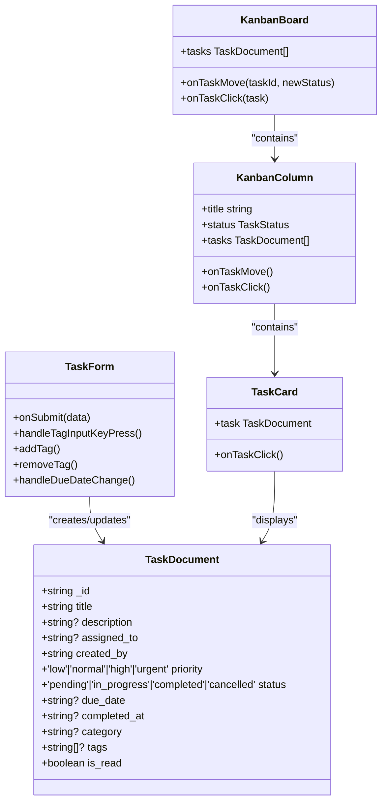
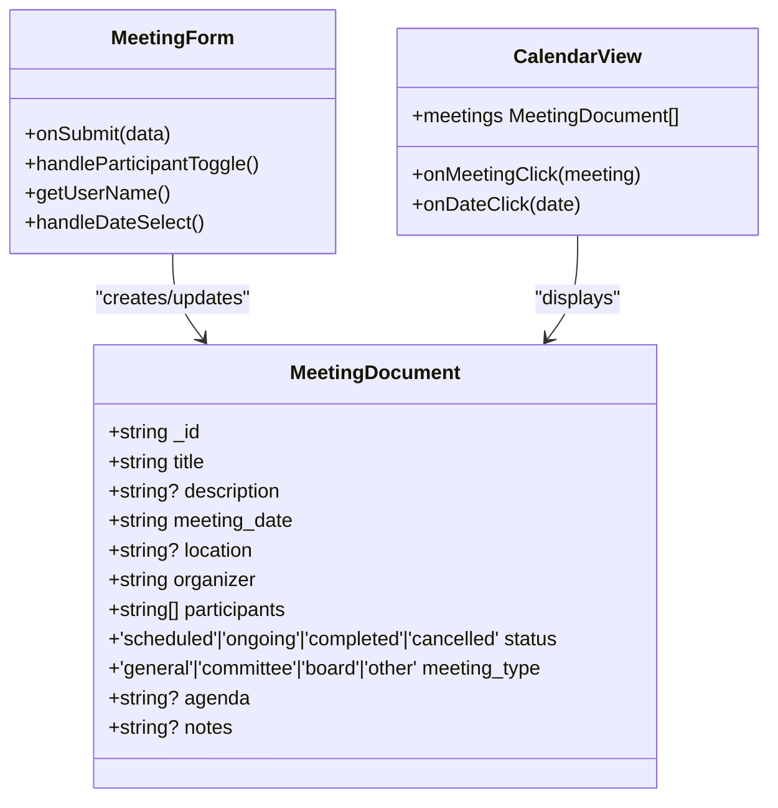
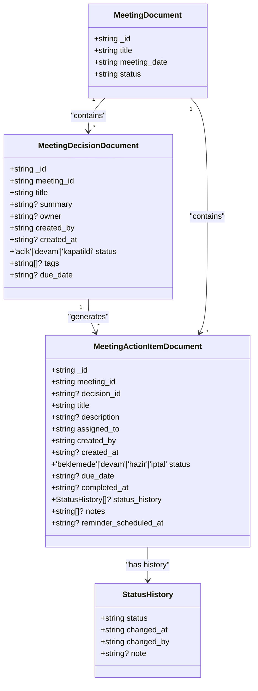
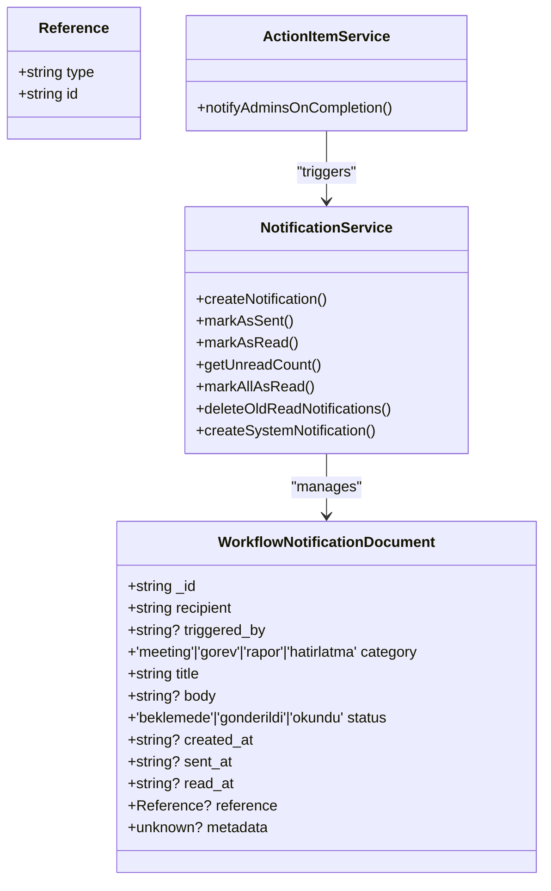

# Task & Meeting Management

<cite>
**Referenced Files in This Document**   
- [tasks.ts](file://convex/tasks.ts)
- [meetings.ts](file://convex/meetings.ts)
- [meeting_decisions.ts](file://convex/meeting_decisions.ts)
- [meeting_action_items.ts](file://convex/meeting_action_items.ts)
- [workflow_notifications.ts](file://convex/workflow_notifications.ts)
- [schema.ts](file://convex/schema.ts)
- [TaskForm.tsx](file://src/components/forms/TaskForm.tsx)
- [MeetingForm.tsx](file://src/components/forms/MeetingForm.tsx)
- [KanbanBoard.tsx](file://src/components/tasks/KanbanBoard.tsx)
- [CalendarView.tsx](file://src/components/meetings/CalendarView.tsx)
- [gorevler/page.tsx](file://src/app/(dashboard)/is/gorevler/page.tsx)
- [toplantilar/page.tsx](file://src/app/(dashboard)/is/toplantilar/page.tsx)
- [database.ts](file://src/types/database.ts)
- [convex-api-client.ts](file://src/lib/api/convex-api-client.ts)
</cite>

## Table of Contents

1. [Task Management](#task-management)
2. [Meeting Management](#meeting-management)
3. [Action Items and Decisions](#action-items-and-decisions)
4. [Workflow Notifications](#workflow-notifications)
5. [Integration and Data Consistency](#integration-and-data-consistency)
6. [Common Issues and Best Practices](#common-issues-and-best-practices)

## Task Management

The task management system provides comprehensive functionality for creating, assigning, tracking, and managing tasks through a Kanban board interface. Tasks are stored in the `tasks` collection with defined schema including title, description, assignment, priority, status, due date, category, and tags.

Task creation is handled through the `TaskForm` component which validates input data before submission. The form supports creating new tasks and editing existing ones, with validation ensuring required fields like title are present and priority/status values are valid. Tasks can be assigned to users, given priorities (low, normal, high, urgent), and set to various statuses (pending, in_progress, completed, cancelled).

The Kanban board visualization allows users to manage tasks through drag-and-drop interactions. The board displays tasks in columns based on their status: "Pending", "In Progress", "Completed", and "Cancelled". Each task card shows the title, description, assigned user, priority badge, due date with visual indicators for overdue or upcoming deadlines, and associated tags. Users can click on task cards to view or edit details.



**Diagram sources**

- [tasks.ts](file://convex/tasks.ts#L54-L137)
- [TaskForm.tsx](file://src/components/forms/TaskForm.tsx#L41-L448)
- [KanbanBoard.tsx](file://src/components/tasks/KanbanBoard.tsx#L1-L246)
- [database.ts](file://src/types/database.ts#L231-L244)

**Section sources**

- [tasks.ts](file://convex/tasks.ts#L54-L137)
- [TaskForm.tsx](file://src/components/forms/TaskForm.tsx#L41-L448)
- [KanbanBoard.tsx](file://src/components/tasks/KanbanBoard.tsx#L1-L246)
- [gorevler/page.tsx](<file://src/app/(dashboard)/is/gorevler/page.tsx#L56-L602>)

## Meeting Management

The meeting management system enables users to schedule, organize, and track meetings through both calendar and list views. Meetings are stored in the `meetings` collection with attributes including title, description, date/time, location, organizer, participants, status, type, agenda, and notes.

Meetings can be created and edited using the `MeetingForm` component, which provides a comprehensive interface for entering meeting details. The form includes fields for title, description, date and time selection, location, meeting type (general, committee, board, other), participant selection, agenda, and notes. When editing a meeting, users can also update its status. The form includes validation to ensure required fields are completed and provides visual feedback for upcoming meetings scheduled within one hour.

The CalendarView component provides a visual representation of meetings organized by date. Users can navigate between months, view upcoming meetings, and create new meetings by double-clicking on a date. The calendar displays meeting indicators with different colors based on meeting type (blue for general, purple for committee, red for board, gray for other). Clicking on a meeting in the calendar view opens the meeting details.



**Diagram sources**

- [meetings.ts](file://convex/meetings.ts#L51-L124)
- [MeetingForm.tsx](file://src/components/forms/MeetingForm.tsx#L45-L442)
- [CalendarView.tsx](file://src/components/meetings/CalendarView.tsx#L1-L284)
- [database.ts](file://src/types/database.ts#L246-L258)

**Section sources**

- [meetings.ts](file://convex/meetings.ts#L51-L124)
- [MeetingForm.tsx](file://src/components/forms/MeetingForm.tsx#L45-L442)
- [CalendarView.tsx](file://src/components/meetings/CalendarView.tsx#L1-L284)
- [toplantilar/page.tsx](<file://src/app/(dashboard)/is/toplantilar/page.tsx#L63-L788>)

## Action Items and Decisions

The system implements a structured approach to capturing decisions made during meetings and tracking action items that result from those decisions. This creates a clear audit trail and ensures accountability for follow-up tasks.

Meeting decisions are stored in the `meeting_decisions` collection and are linked to specific meetings. Each decision includes a title, summary, owner (the person responsible for implementation), creator, creation timestamp, status (open, in progress, closed), tags, and due date. Decisions can be queried by meeting, owner, or status, enabling users to track open decisions for specific meetings or individuals.

Action items are stored in the `meeting_action_items` collection and can be linked to both meetings and specific decisions. Each action item contains a title, description, assigned user, creator, status (pending, in progress, ready, cancelled), due date, and completion timestamp. The system maintains a status history that records all status changes with timestamps and the user who made the change. When an action item is marked as complete, the system automatically notifies administrators.



**Diagram sources**

- [meeting_decisions.ts](file://convex/meeting_decisions.ts#L51-L114)
- [meeting_action_items.ts](file://convex/meeting_action_items.ts#L54-L273)
- [schema.ts](file://convex/schema.ts#L283-L342)
- [database.ts](file://src/types/database.ts#L260-L291)

**Section sources**

- [meeting_decisions.ts](file://convex/meeting_decisions.ts#L51-L114)
- [meeting_action_items.ts](file://convex/meeting_action_items.ts#L54-L273)
- [schema.ts](file://convex/schema.ts#L283-L342)

## Workflow Notifications

The notification system tracks and delivers important workflow events to users through the `workflow_notifications` collection. Notifications are used to inform users about task completions, meeting updates, and other system events.

Notifications have three statuses: "pending", "sent", and "read". Each notification includes a recipient, optional trigger user, category (meeting, task, report, reminder), title, optional body, creation timestamp, optional sent timestamp, optional read timestamp, reference to related content, and metadata. The system provides functions to create notifications, mark them as sent, mark them as read, and remove them.

When action items are completed, the system automatically notifies administrators through the `notifyAdminsOnCompletion` function. This function identifies all users with ADMIN or SUPER_ADMIN roles and creates notifications for them. The system also supports marking all notifications as read for a user and retrieving unread notification counts.



**Diagram sources**

- [workflow_notifications.ts](file://convex/workflow_notifications.ts#L76-L281)
- [meeting_action_items.ts](file://convex/meeting_action_items.ts#L197-L259)
- [database.ts](file://src/types/database.ts#L292-L308)

**Section sources**

- [workflow_notifications.ts](file://convex/workflow_notifications.ts#L76-L281)
- [meeting_action_items.ts](file://convex/meeting_action_items.ts#L197-L259)

## Integration and Data Consistency

The task and meeting management modules are tightly integrated, with data consistency maintained through proper schema design and API implementations. The system uses Convex as the backend, providing real-time data synchronization and automatic conflict resolution.

Data relationships are established through ID references between collections. Tasks are linked to users via the `assigned_to` and `created_by` fields. Meetings connect to users through `organizer` and `participants` fields. Decisions and action items maintain references to their parent meetings, and action items can also reference specific decisions.

The system implements proper indexing on frequently queried fields to ensure performance. The `tasks` collection has indexes on `assigned_to`, `status`, and `created_by`. The `meetings` collection is indexed by `organizer`, `status`, and `meeting_date`. Decision and action item collections have indexes on their respective relationship fields.

Real-time updates are handled through React Query, which automatically refetches data when mutations occur. After creating or updating tasks and meetings, the system invalidates relevant query caches to ensure the UI reflects the latest data. This approach provides a responsive user experience while maintaining data consistency across views.

```mermaid
erDiagram
USERS ||--o{ TASKS : "creates"
USERS ||--o{ TASKS : "assigned_to"
USERS ||--o{ MEETINGS : "organizes"
USERS ||--o{ MEETINGS : "participates_in"
MEETINGS ||--o{ MEETING_DECISIONS : "contains"
MEETINGS ||--o{ MEETING_ACTION_ITEMS : "contains"
MEETING_DECISIONS ||--o{ MEETING_ACTION_ITEMS : "generates"
USERS ||--o{ WORKFLOW_NOTIFICATIONS : "receives"
USERS ||--o{ WORKFLOW_NOTIFICATIONS : "triggers"
TASKS {
string _id PK
string title
string? description
string? assigned_to FK
string created_by FK
enum priority
enum status
string? due_date
string? completed_at
string? category
string[]? tags
boolean is_read
}
MEETINGS {
string _id PK
string title
string? description
string meeting_date
string? location
string organizer FK
string[] participants FK
enum status
enum meeting_type
string? agenda
string? notes
}
MEETING_DECISIONS {
string _id PK
string meeting_id FK
string title
string? summary
string? owner FK
string created_by FK
string? created_at
enum status
string[]? tags
string? due_date
}
MEETING_ACTION_ITEMS {
string _id PK
string meeting_id FK
string? decision_id FK
string title
string? description
string assigned_to FK
string created_by FK
string? created_at
enum status
string? due_date
string? completed_at
}
WORKFLOW_NOTIFICATIONS {
string _id PK
string recipient FK
string? triggered_by FK
enum category
string title
string? body
enum status
string? created_at
string? sent_at
string? read_at
}
```

**Diagram sources**

- [schema.ts](file://convex/schema.ts#L253-L342)
- [database.ts](file://src/types/database.ts#L231-L308)

**Section sources**

- [schema.ts](file://convex/schema.ts#L253-L342)
- [tasks.ts](file://convex/tasks.ts#L4-L140)
- [meetings.ts](file://convex/meetings.ts#L4-L124)
- [convex-api-client.ts](file://src/lib/api/convex-api-client.ts#L124-L247)

## Common Issues and Best Practices

### Timezone Handling

The system stores all dates and times in ISO format (UTC) to ensure consistency across different timezones. When displaying dates to users, the frontend converts UTC timestamps to the user's local timezone using the `date-fns` library. This approach prevents timezone-related inconsistencies when users in different regions view or create tasks and meetings.

### Notification Delays

Notification delays can occur due to background processing or network latency. The system implements a status tracking mechanism with "pending", "sent", and "read" states to provide visibility into notification delivery. Administrators can monitor notification delivery through the system's audit capabilities and investigate any delays in the notification pipeline.

### Permission-Based Visibility

Access to tasks and meetings is controlled through role-based permissions. Users can only view and interact with content based on their assigned permissions. The system checks module access through the `requireModuleAccess('workflow')` function before allowing operations on tasks and meetings. This ensures that sensitive information is only accessible to authorized personnel.

### Recurring Tasks and Meetings

While the current implementation does not explicitly support recurring tasks and meetings, this functionality can be achieved through manual creation or by implementing a scheduling service that creates individual instances based on recurrence rules. For recurring meetings, users are advised to create a template meeting and duplicate it as needed, updating the date and time for each occurrence.

### Performance Optimization

To maintain optimal performance with large datasets, the system implements pagination with a default limit of 20 items per page. Queries are optimized through proper indexing on frequently filtered fields. The Kanban board and calendar views load data efficiently by only retrieving necessary information for the current view, reducing network overhead and improving responsiveness.

**Section sources**

- [auth.ts](file://convex/auth.ts)
- [tasks.ts](file://convex/tasks.ts#L14-L43)
- [meetings.ts](file://convex/meetings.ts#L13-L40)
- [gorevler/page.tsx](<file://src/app/(dashboard)/is/gorevler/page.tsx#L73-L86>)
- [toplantilar/page.tsx](<file://src/app/(dashboard)/is/toplantilar/page.tsx#L90-L104>)
