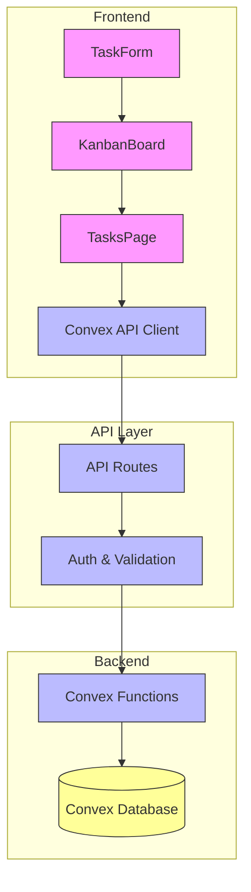
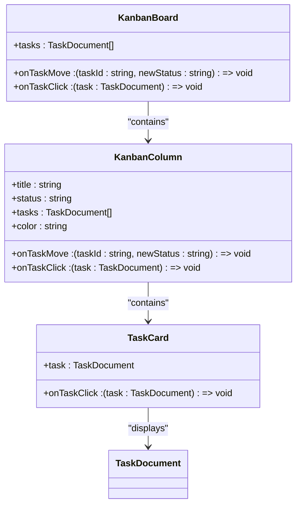
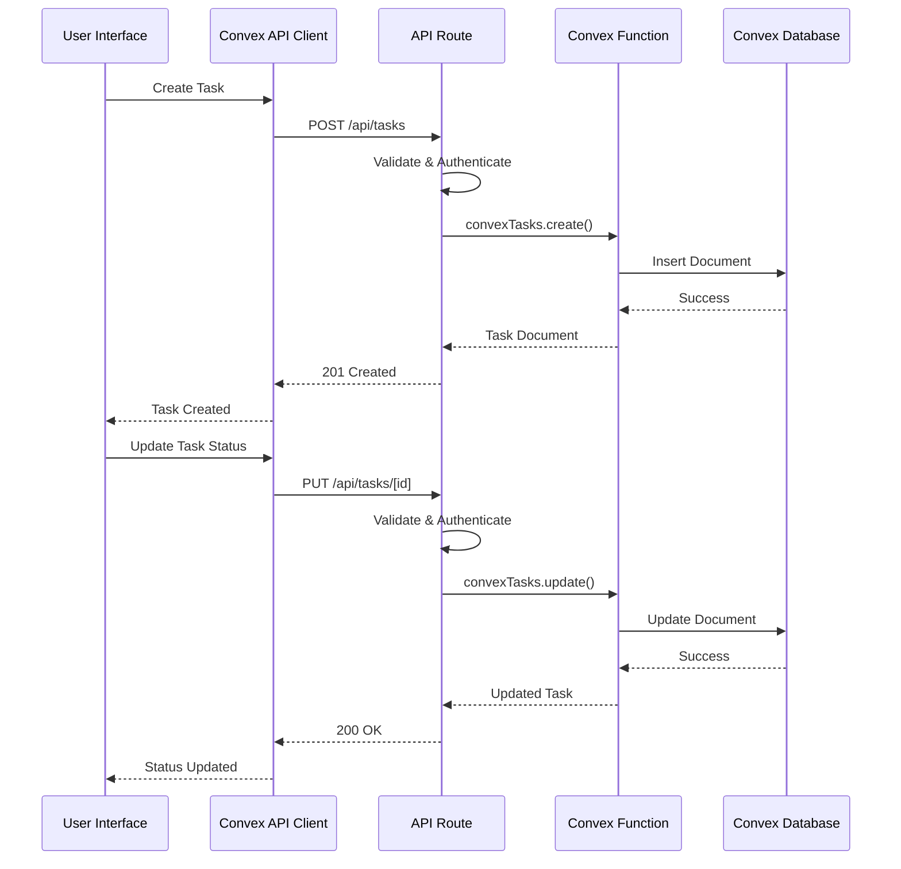
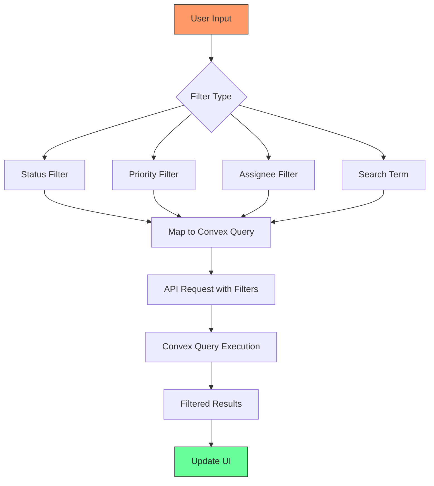
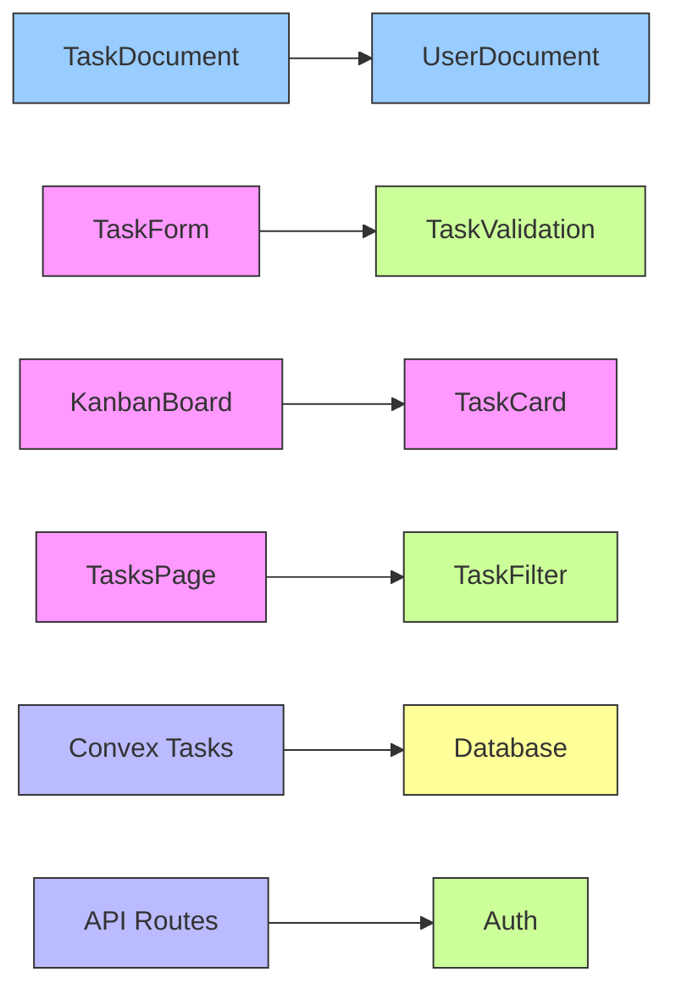

# Task Management

<cite>
**Referenced Files in This Document**   
- [tasks.ts](file://convex/tasks.ts)
- [KanbanBoard.tsx](file://src/components/tasks/KanbanBoard.tsx)
- [page.tsx](file://src/app/(dashboard)/is/gorevler/page.tsx)
- [task.ts](file://src/lib/validations/task.ts)
- [database.ts](file://src/types/database.ts)
- [convex-api-client.ts](file://src/lib/api/convex-api-client.ts)
- [route.ts](file://src/app/api/tasks/route.ts)
</cite>

## Table of Contents

1. [Task Management](#task-management)
2. [Core Components](#core-components)
3. [Architecture Overview](#architecture-overview)
4. [Detailed Component Analysis](#detailed-component-analysis)
5. [Dependency Analysis](#dependency-analysis)
6. [Performance Considerations](#performance-considerations)
7. [Troubleshooting Guide](#troubleshooting-guide)
8. [Conclusion](#conclusion)

## Core Components

The Task Management sub-module provides a comprehensive solution for managing tasks through the KanbanBoard component, implementing full CRUD operations via Convex functions and API routes. The system supports task creation, assignment, prioritization, and status tracking with real-time updates.

The implementation follows a layered architecture with Convex handling data persistence and business logic, API routes providing secure endpoints, and React components rendering the user interface. The KanbanBoard component enables visual task management through drag-and-drop interactions, while the underlying system ensures data consistency and proper state management.

**Section sources**

- [tasks.ts](file://convex/tasks.ts#L1-L140)
- [KanbanBoard.tsx](file://src/components/tasks/KanbanBoard.tsx#L1-L246)
- [page.tsx](<file://src/app/(dashboard)/is/gorevler/page.tsx#L1-L602>)

## Architecture Overview

The Task Management system follows a client-server architecture with Convex as the backend platform, providing a unified API for data operations. The frontend components interact with Convex through API routes, ensuring proper authentication and authorization.

**Diagram sources**

- [KanbanBoard.tsx](file://src/components/tasks/KanbanBoard.tsx#L1-L246)
- [page.tsx](<file://src/app/(dashboard)/is/gorevler/page.tsx#L1-L602>)
- [route.ts](file://src/app/api/tasks/route.ts#L1-L140)
- [tasks.ts](file://convex/tasks.ts#L1-L140)

## Detailed Component Analysis

### Kanban Board Implementation

The KanbanBoard component provides a visual interface for managing tasks across different status columns. It supports drag-and-drop functionality for changing task status and click interactions for editing task details.

**Diagram sources**

- [KanbanBoard.tsx](file://src/components/tasks/KanbanBoard.tsx#L1-L246)

### Task CRUD Operations

The system implements full CRUD operations for tasks through Convex functions and API routes. The operations are exposed through a client-side API that handles authentication, validation, and error handling.

**Diagram sources**

- [tasks.ts](file://convex/tasks.ts#L54-L137)
- [route.ts](file://src/app/api/tasks/route.ts#L78-L140)
- [convex-api-client.ts](file://src/lib/api/convex-api-client.ts#L219-L264)

### Task Filtering and Search

The system provides comprehensive filtering capabilities for tasks based on assignee, status, priority, and search terms. The filtering is implemented both on the client side for UI rendering and on the server side for data retrieval.

**Diagram sources**

- [page.tsx](<file://src/app/(dashboard)/is/gorevler/page.tsx#L72-L85>)
- [tasks.ts](file://convex/tasks.ts#L5-L43)

## Dependency Analysis

The Task Management sub-module has dependencies across multiple layers of the application, from the database schema to the user interface components.

**Diagram sources**

- [database.ts](file://src/types/database.ts#L231-L243)
- [task.ts](file://src/lib/validations/task.ts#L40-L124)
- [tasks.ts](file://convex/tasks.ts#L1-L140)

## Performance Considerations

The system implements several performance optimizations to handle large task sets efficiently:

- **Pagination**: Tasks are loaded in batches of 20 items to prevent performance degradation with large datasets
- **Caching**: API responses are cached to reduce redundant server requests
- **Optimized Queries**: Convex queries use indexes for faster filtering operations
- **Virtualization**: The Kanban board renders only visible tasks to improve rendering performance

The system also implements real-time updates through Convex subscriptions, ensuring that all users see the most current task status without requiring manual refresh.

**Section sources**

- [page.tsx](<file://src/app/(dashboard)/is/gorevler/page.tsx#L69-L70>)
- [tasks.ts](file://convex/tasks.ts#L16-L33)

## Troubleshooting Guide

Common issues in the Task Management system and their solutions:

1. **Permission-based visibility**: Ensure users have the 'workflow' module access permission to view and modify tasks
2. **Timezone handling**: Due dates are stored in UTC and displayed in the user's local timezone using browser formatting
3. **Large task sets**: For optimal performance with large datasets, use filters to narrow down results before loading
4. **Real-time updates**: If updates are not appearing, check the Convex subscription connection and network status
5. **Validation errors**: Task creation may fail due to validation rules - ensure title is 3-100 characters and priority/status values are valid

The system includes comprehensive error handling with user-friendly messages and logging for debugging purposes.

**Section sources**

- [route.ts](file://src/app/api/tasks/route.ts#L40-L94)
- [task.ts](file://src/lib/validations/task.ts#L40-L124)

## Conclusion

The Task Management sub-module provides a robust solution for managing tasks within the application. The integration of the KanbanBoard component with Convex backend services enables efficient task tracking and collaboration. The system supports all essential task management features including creation, assignment, prioritization, and status tracking with real-time updates.

Key strengths of the implementation include:

- Intuitive Kanban interface for visual task management
- Comprehensive filtering and search capabilities
- Real-time updates through Convex subscriptions
- Proper permission-based access control
- Optimized performance for large datasets

The architecture follows best practices with clear separation of concerns between UI components, API clients, and backend services, ensuring maintainability and scalability.
