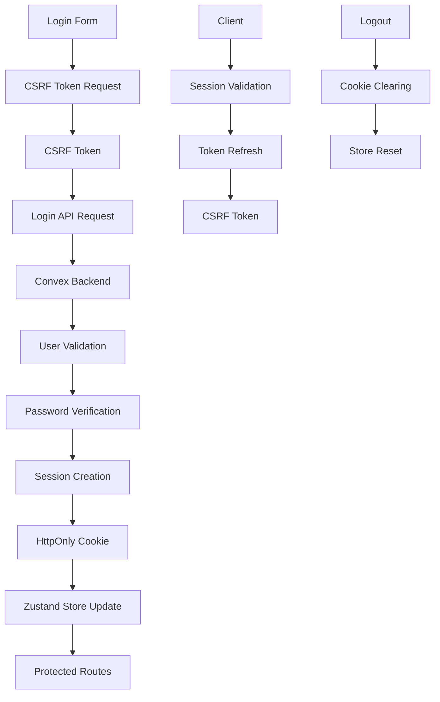
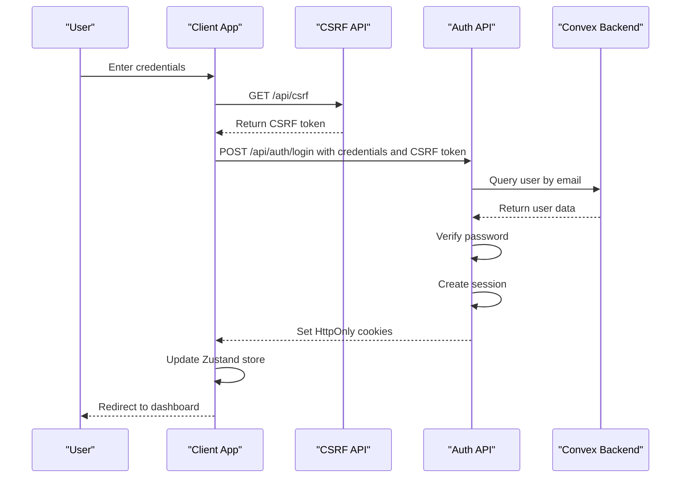
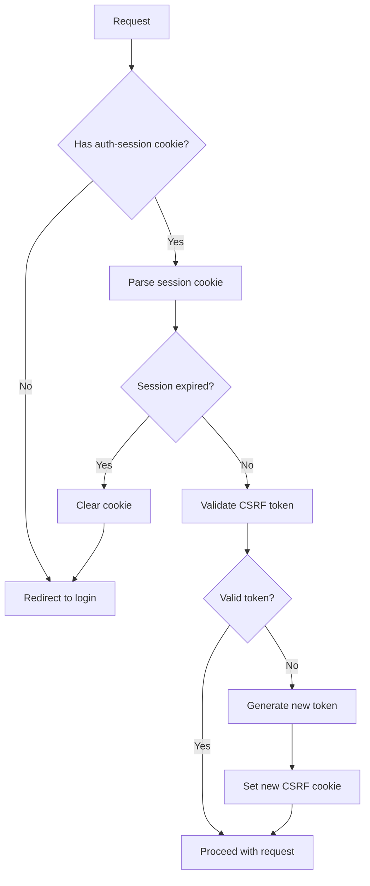
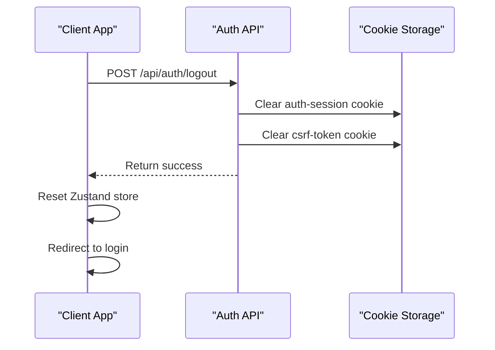
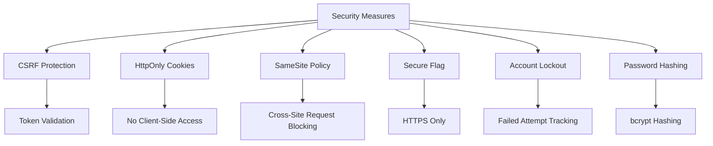
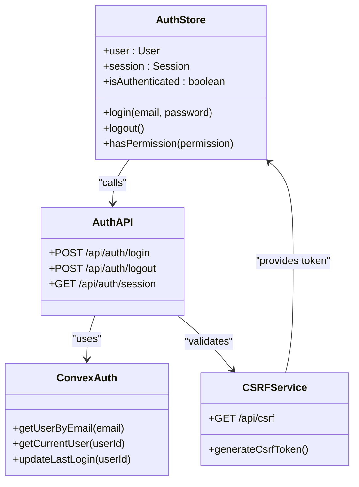

# Authentication

<cite>
**Referenced Files in This Document**   
- [authStore.ts](file://src/stores/authStore.ts)
- [auth.ts](file://convex/auth.ts)
- [get-user.ts](file://src/lib/auth/get-user.ts)
- [login/route.ts](file://src/app/api/auth/login/route.ts)
- [logout/route.ts](file://src/app/api/auth/logout/route.ts)
- [session/route.ts](file://src/app/api/auth/session/route.ts)
- [csrf/route.ts](file://src/app/api/csrf/route.ts)
- [session.ts](file://src/lib/auth/session.ts)
- [auth.ts](file://src/types/auth.ts)
- [page.tsx](file://src/app/login/page.tsx)
</cite>

## Table of Contents

1. [Introduction](#introduction)
2. [Authentication Architecture Overview](#authentication-architecture-overview)
3. [Core Components](#core-components)
4. [Login Workflow](#login-workflow)
5. [Session Management](#session-management)
6. [Logout Process](#logout-process)
7. [Security Measures](#security-measures)
8. [Error Handling](#error-handling)
9. [Integration Between Components](#integration-between-components)
10. [Common Issues and Solutions](#common-issues-and-solutions)

## Introduction

The authentication system in this application implements a secure, multi-layered approach to user authentication and session management. It combines Convex backend functions for data storage and retrieval with Zustand for client-side state management. The system handles login, session persistence, and logout workflows while implementing critical security measures including CSRF protection, HttpOnly cookies, and client-side session validation. This documentation details the implementation, flow, and integration points of the authentication system.

## Authentication Architecture Overview

**Diagram sources**

- [authStore.ts](file://src/stores/authStore.ts)
- [login/route.ts](file://src/app/api/auth/login/route.ts)
- [session.ts](file://src/lib/auth/session.ts)

## Core Components

The authentication system consists of several key components that work together to provide secure user authentication:

- **Zustand Store**: Manages client-side authentication state
- **Convex Backend Functions**: Handle user data retrieval and authentication logic
- **Next.js API Routes**: Serve as the interface between frontend and backend
- **Session Management**: Handles session creation, validation, and expiration
- **Security Layer**: Implements CSRF protection and secure cookie policies

**Section sources**

- [authStore.ts](file://src/stores/authStore.ts)
- [auth.ts](file://convex/auth.ts)
- [session.ts](file://src/lib/auth/session.ts)

## Login Workflow

The login process follows a secure, multi-step workflow:

1. User submits credentials through the login form
2. Client requests a CSRF token from the server
3. Server generates and returns a CSRF token
4. Client includes the CSRF token in the login request
5. Server validates credentials against Convex database
6. Upon successful authentication, server creates a session
7. Session information is stored in HttpOnly cookies
8. Client-side store is updated with user information

**Diagram sources**

- [login/route.ts](file://src/app/api/auth/login/route.ts)
- [authStore.ts](file://src/stores/authStore.ts)
- [csrf/route.ts](file://src/app/api/csrf/route.ts)

**Section sources**

- [login/route.ts](file://src/app/api/auth/login/route.ts)
- [authStore.ts](file://src/stores/authStore.ts)

## Session Management

Session management is handled through a combination of server-side and client-side mechanisms:

- **HttpOnly Cookies**: Store session tokens securely on the client
- **Client-Side Storage**: Maintain user information in Zustand store
- **Session Validation**: Regular validation of session expiration
- **Automatic Refresh**: CSRF tokens are refreshed as needed

The system implements both short-term (24 hours) and long-term (30 days) session options based on the "remember me" preference.

**Diagram sources**

- [session/route.ts](file://src/app/api/auth/session/route.ts)
- [session.ts](file://src/lib/auth/session.ts)
- [get-user.ts](file://src/lib/auth/get-user.ts)

**Section sources**

- [session/route.ts](file://src/app/api/auth/session/route.ts)
- [session.ts](file://src/lib/auth/session.ts)

## Logout Process

The logout process ensures complete session cleanup:

1. Client sends logout request to server
2. Server clears all authentication cookies
3. Client-side store is reset
4. User is redirected to login page

The system handles potential errors during logout gracefully, ensuring that cookies are cleared even if other operations fail.

**Diagram sources**

- [logout/route.ts](file://src/app/api/auth/logout/route.ts)
- [authStore.ts](file://src/stores/authStore.ts)

**Section sources**

- [logout/route.ts](file://src/app/api/auth/logout/route.ts)

## Security Measures

The authentication system implements multiple security measures:

- **CSRF Protection**: Token-based protection against cross-site request forgery
- **HttpOnly Cookies**: Prevent client-side script access to session tokens
- **SameSite Policy**: Strict SameSite cookie policy
- **Secure Flag**: Cookies marked as secure in production
- **Account Lockout**: Protection against brute force attacks
- **Password Hashing**: Secure password storage with bcrypt

**Diagram sources**

- [csrf/route.ts](file://src/app/api/csrf/route.ts)
- [login/route.ts](file://src/app/api/auth/login/route.ts)
- [session.ts](file://src/lib/auth/session.ts)

**Section sources**

- [csrf/route.ts](file://src/app/api/csrf/route.ts)
- [login/route.ts](file://src/app/api/auth/login/route.ts)

## Error Handling

The system implements comprehensive error handling for various scenarios:

- **Invalid Credentials**: Clear error messages for incorrect email/password
- **Account Inactive**: Specific handling for deactivated accounts
- **CSRF Validation**: Errors for missing or invalid CSRF tokens
- **Network Issues**: Graceful handling of connectivity problems
- **Session Expiration**: Automatic redirection to login when session expires

Error states are communicated to the user through the Zustand store, allowing for consistent error display across the application.

**Section sources**

- [login/route.ts](file://src/app/api/auth/login/route.ts)
- [authStore.ts](file://src/stores/authStore.ts)

## Integration Between Components

The authentication system integrates several components:

- **Next.js API Routes**: Handle HTTP requests and responses
- **Convex Functions**: Manage data storage and retrieval
- **Zustand Store**: Maintain client-side state
- **Type Definitions**: Ensure type safety across components

The integration follows a clear separation of concerns, with each component responsible for specific aspects of the authentication process.

**Diagram sources**

- [authStore.ts](file://src/stores/authStore.ts)
- [login/route.ts](file://src/app/api/auth/login/route.ts)
- [auth.ts](file://convex/auth.ts)
- [csrf/route.ts](file://src/app/api/csrf/route.ts)

**Section sources**

- [authStore.ts](file://src/stores/authStore.ts)
- [login/route.ts](file://src/app/api/auth/login/route.ts)
- [auth.ts](file://convex/auth.ts)

## Common Issues and Solutions

### Session Expiration

Session expiration is handled automatically by checking the expiration timestamp in the session cookie. When a session expires, the user is redirected to the login page.

### Concurrent Login Attempts

The system implements rate limiting and account lockout mechanisms to prevent abuse from concurrent login attempts. After a configured number of failed attempts, accounts are temporarily locked.

### Authentication State Synchronization

State synchronization between client and server is maintained through:

- Regular session validation
- Cookie-based session storage
- Zustand store updates on authentication events
- Error handling that resets inconsistent states

### Remember Me Functionality

The "remember me" feature extends session duration from 24 hours to 30 days. This setting is respected both in cookie expiration and session validation logic.

**Section sources**

- [session.ts](file://src/lib/auth/session.ts)
- [login/route.ts](file://src/app/api/auth/login/route.ts)
- [authStore.ts](file://src/stores/authStore.ts)
