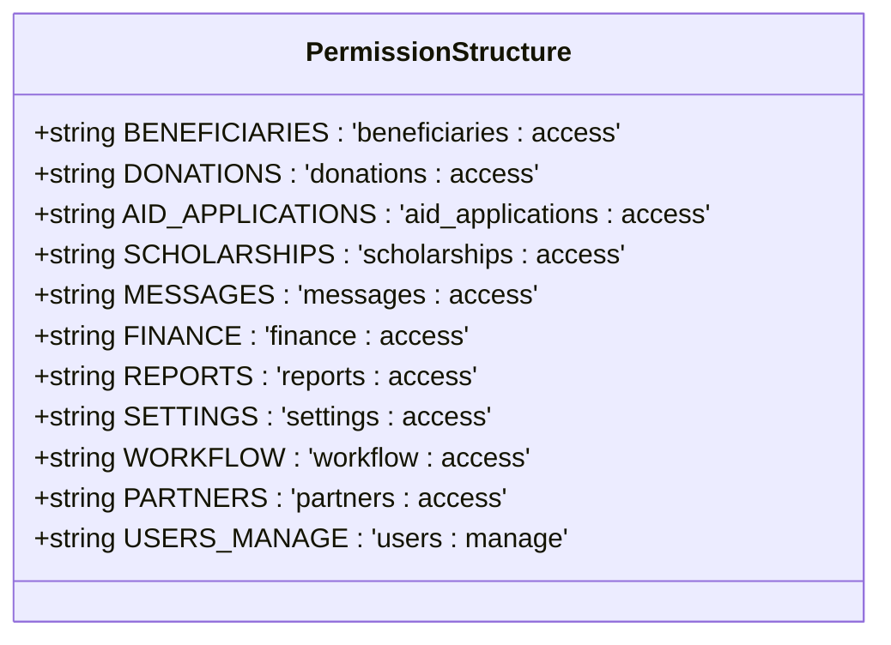
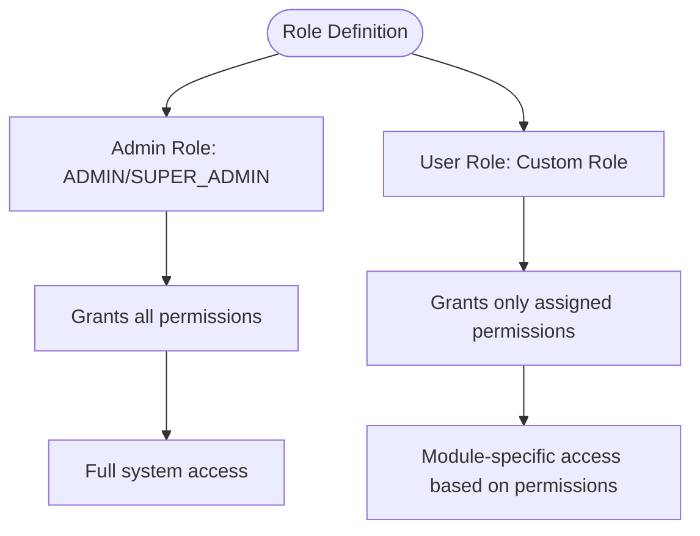
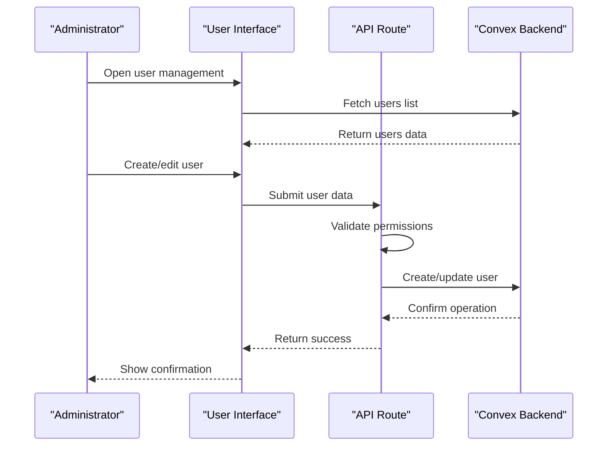
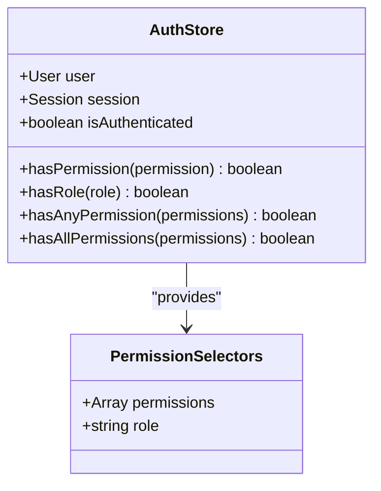
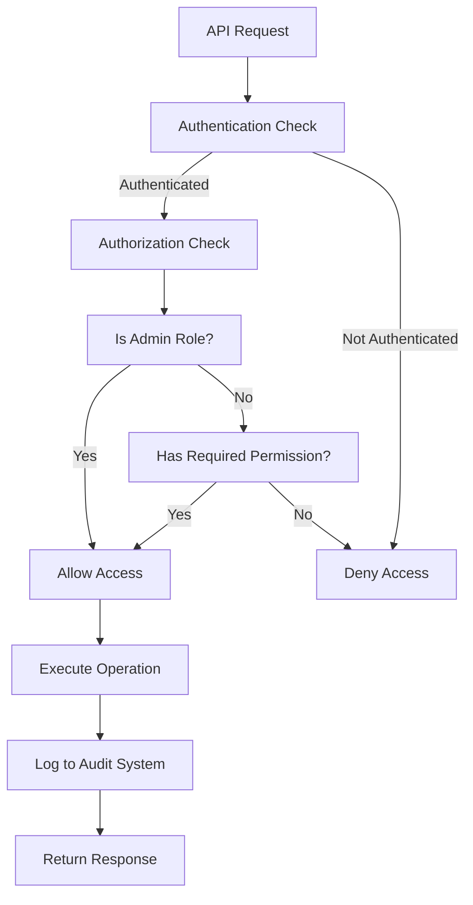
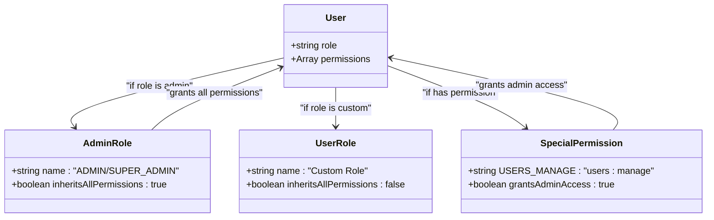
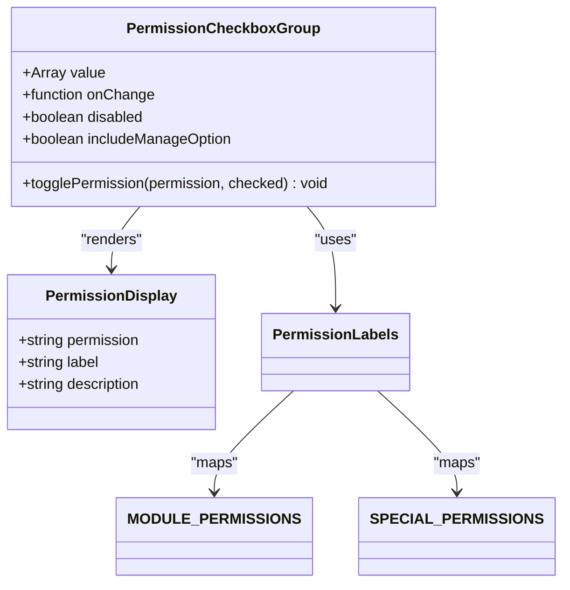

# Roles and Permissions

<cite>
**Referenced Files in This Document**   
- [authStore.ts](file://src/stores/authStore.ts)
- [users.ts](file://convex/users.ts)
- [permissions.ts](file://src/types/permissions.ts)
- [permission-checkbox-group.tsx](file://src/components/users/permission-checkbox-group.tsx)
- [auth-utils.ts](file://src/lib/api/auth-utils.ts)
- [proxy.ts](file://src/proxy.ts)
- [user-form.tsx](file://src/components/forms/user-form.tsx)
</cite>

## Table of Contents

1. [Introduction](#introduction)
2. [Permission Structure](#permission-structure)
3. [Role Definitions](#role-definitions)
4. [User Management Interface](#user-management-interface)
5. [Client-Side Permission Checking](#client-side-permission-checking)
6. [Server-Side Permission Enforcement](#server-side-permission-enforcement)
7. [Permission Inheritance and Role Conflicts](#permission-inheritance-and-role-conflicts)
8. [Permission Checkbox Group UI Component](#permission-checkbox-group-ui-component)
9. [Common Issues and Best Practices](#common-issues-and-best-practices)

## Introduction

The Roles and Permissions system implements a robust role-based access control (RBAC) framework that governs access to various application modules. This system ensures that users can only access functionality and data appropriate to their assigned roles and permissions. The implementation spans both client and server components, providing comprehensive security across the application. The system is designed to be granular, allowing precise control over access to different modules and operations.

**Section sources**

- [authStore.ts](file://src/stores/authStore.ts#L1-L403)
- [users.ts](file://convex/users.ts#L1-L220)

## Permission Structure

The permission system is organized around module-based access control, with each application module having its own access permission. The core permission structure is defined in the `MODULE_PERMISSIONS` constant, which includes permissions for beneficiaries, donations, aid applications, scholarships, messages, finance, reports, settings, workflow, and partners. Additionally, special permissions exist for administrative functions, such as `USERS_MANAGE` which grants user management capabilities. Permissions are implemented as string literals with a consistent naming convention of `module:access`, making them easily identifiable and maintainable.

**Diagram sources**

- [permissions.ts](file://src/types/permissions.ts#L1-L12)

**Section sources**

- [permissions.ts](file://src/types/permissions.ts#L1-L39)

## Role Definitions

Roles in the system are defined as string values that represent different user types within the organization. The system supports role-based access control where users are assigned a specific role (e.g., "ADMIN", "SUPER_ADMIN") that determines their baseline permissions. Role checking is implemented through case-insensitive comparison, ensuring consistent behavior regardless of how roles are stored or transmitted. The system also supports permission-based role assignment, where users with the `USERS_MANAGE` permission are treated as having administrative privileges regardless of their explicit role designation.

**Diagram sources**

- [auth-utils.ts](file://src/lib/api/auth-utils.ts#L34-L37)
- [proxy.ts](file://src/proxy.ts#L107-L108)

**Section sources**

- [auth-utils.ts](file://src/lib/api/auth-utils.ts#L29-L70)
- [proxy.ts](file://src/proxy.ts#L102-L138)

## User Management Interface

The user management interface allows administrators to create, edit, and manage user accounts with their associated roles and permissions. When creating or updating a user, the interface validates that at least one module access permission is selected, ensuring that users have appropriate access levels. The user form includes validation for role information, requiring that role names be at least two characters long. User data, including permissions, is stored in the Convex database with appropriate indexing for efficient querying by role, email, or active status.

**Diagram sources**

- [users.ts](file://convex/users.ts#L83-L121)
- [users.ts](file://convex/users.ts#L123-L206)
- [user-form.tsx](file://src/components/forms/user-form.tsx#L24-L24)

**Section sources**

- [users.ts](file://convex/users.ts#L83-L206)
- [user-form.tsx](file://src/components/forms/user-form.tsx#L24-L24)

## Client-Side Permission Checking

Client-side permission checking is implemented through the authentication store (Zustand) which maintains the current user's session and permissions. The store provides several helper methods for checking permissions, including `hasPermission`, `hasRole`, `hasAnyPermission`, and `hasAllPermissions`. These methods are used throughout the application to conditionally render UI elements and control access to functionality. The permission state is persisted in localStorage for session continuity, with appropriate safeguards for server-side rendering environments.

**Diagram sources**

- [authStore.ts](file://src/stores/authStore.ts#L277-L305)
- [authStore.ts](file://src/stores/authStore.ts#L398-L400)

**Section sources**

- [authStore.ts](file://src/stores/authStore.ts#L277-L305)

## Server-Side Permission Enforcement

Server-side permission enforcement is implemented through a combination of Convex queries and mutations, API route protection, and a proxy system that validates access before allowing operations. The system uses a centralized permission checking function in the proxy that evaluates role requirements, specific permission requirements, and any permission requirements for each route. Administrative users (ADMIN/SUPER_ADMIN roles or users with USERS_MANAGE permission) are granted bypass access to all routes. All data modification operations are logged in the audit system for compliance and security monitoring.

**Diagram sources**

- [proxy.ts](file://src/proxy.ts#L102-L138)
- [audit_logs.ts](file://convex/audit_logs.ts#L1-L56)

**Section sources**

- [proxy.ts](file://src/proxy.ts#L102-L138)
- [auth-utils.ts](file://src/lib/api/auth-utils.ts#L29-L58)

## Permission Inheritance and Role Conflicts

The system handles permission inheritance through a hierarchical model where administrative roles inherit all permissions. Users with the ADMIN or SUPER_ADMIN role automatically have access to all modules, regardless of their explicitly assigned permissions. Similarly, users with the USERS_MANAGE special permission are treated as having administrative privileges. This approach resolves potential role conflicts by establishing a clear precedence hierarchy. The system does not support role-based inheritance beyond these administrative roles, relying instead on explicit permission assignment for granular control.

**Diagram sources**

- [auth-utils.ts](file://src/lib/api/auth-utils.ts#L34-L37)
- [proxy.ts](file://src/proxy.ts#L107-L108)

**Section sources**

- [auth-utils.ts](file://src/lib/api/auth-utils.ts#L34-L37)
- [proxy.ts](file://src/proxy.ts#L107-L108)

## Permission Checkbox Group UI Component

The permission checkbox group UI component provides a user-friendly interface for assigning permissions to users in the user management system. The component displays all available module permissions in a consistent order, with each permission represented by a checkbox and descriptive label. The component supports an optional "Manage Users" permission that grants administrative capabilities. When a permission is toggled, the component updates the parent form state using a callback function. The component is designed to be reusable and accessible, with proper labeling and keyboard navigation support.

**Diagram sources**

- [permission-checkbox-group.tsx](file://src/components/users/permission-checkbox-group.tsx#L1-L74)
- [permissions.ts](file://src/types/permissions.ts#L25-L37)

**Section sources**

- [permission-checkbox-group.tsx](file://src/components/users/permission-checkbox-group.tsx#L1-L74)

## Common Issues and Best Practices

Common issues in the roles and permissions system include ensuring consistent permission checks across the application, preventing privilege escalation, and maintaining audit trails for permission changes. Best practices include using the centralized permission checking functions rather than implementing permission logic in multiple locations, regularly reviewing user permissions, and leveraging the audit logging system to monitor access changes. The system should be tested thoroughly to ensure that permission checks cannot be bypassed through direct API calls or URL manipulation.

**Section sources**

- [proxy.ts](file://src/proxy.ts#L102-L138)
- [authStore.ts](file://src/stores/authStore.ts#L277-L305)
- [audit_logs.ts](file://convex/audit_logs.ts#L1-L56)
