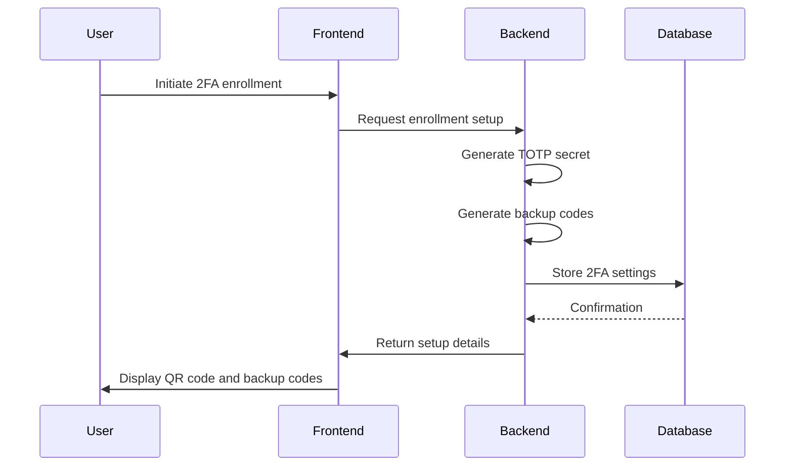
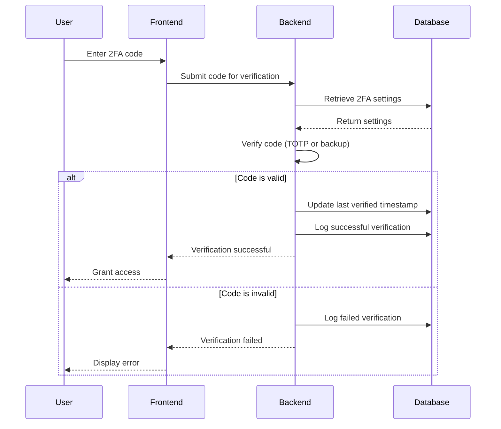
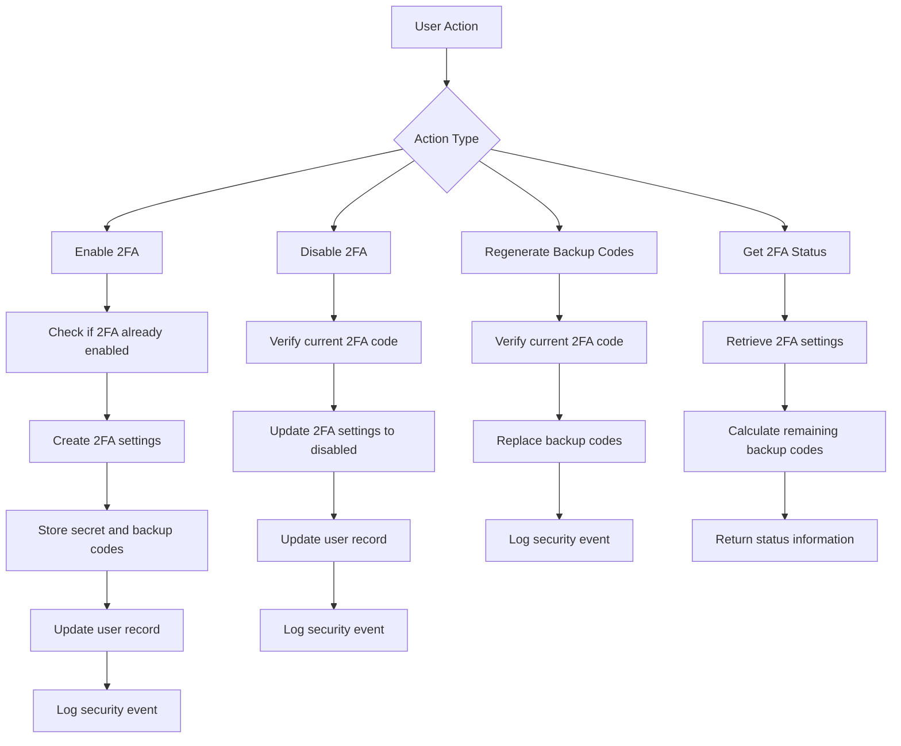
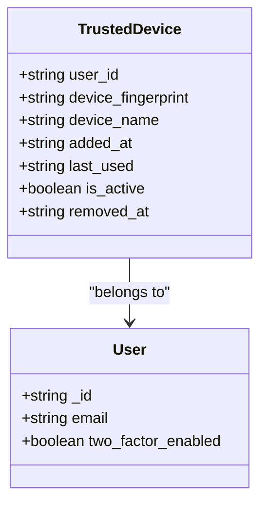
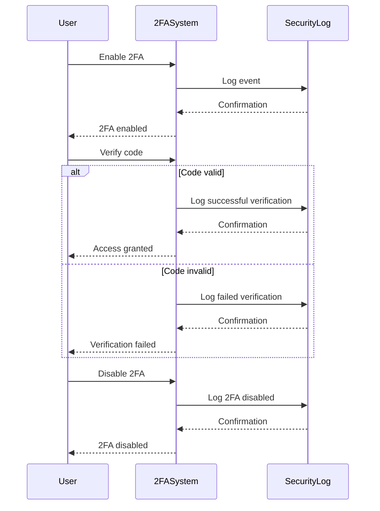

# Two-Factor Authentication

<cite>
**Referenced Files in This Document**   
- [two_factor_auth.ts](file://convex/two_factor_auth.ts)
- [schema.ts](file://convex/schema.ts)
- [auth.ts](file://convex/auth.ts)
- [users.ts](file://convex/users.ts)
- [audit_logs.ts](file://convex/audit_logs.ts)
</cite>

## Table of Contents

1. [Introduction](#introduction)
2. [2FA Implementation Overview](#2fa-implementation-overview)
3. [Enrollment Process](#enrollment-process)
4. [Verification Methods](#verification-methods)
5. [Management Functions](#management-functions)
6. [Trusted Devices](#trusted-devices)
7. [Security Event Logging](#security-event-logging)
8. [Database Schema](#database-schema)
9. [User Interface Integration](#user-interface-integration)
10. [Common Issues and Recovery](#common-issues-and-recovery)

## Introduction

The Two-Factor Authentication (2FA) system provides an additional layer of security for user accounts by requiring a second form of verification beyond just a password. This document details the implementation of 2FA using Time-Based One-Time Password (TOTP) and backup codes, covering enrollment, verification, management, and integration with the user management interface. The system is designed to enhance security while maintaining usability and providing recovery options for common scenarios like lost devices.

## 2FA Implementation Overview

The 2FA system is implemented as a set of Convex functions that handle enrollment, verification, and management of two-factor authentication settings. The core functionality is provided through mutations and queries that interact with the database to store and retrieve 2FA settings, verify codes, and manage trusted devices. The system integrates with the existing authentication flow to provide seamless 2FA verification during login.

The implementation follows a modular approach with separate functions for different aspects of 2FA:

- Enrollment and configuration
- Code verification (TOTP and backup codes)
- Settings management (enable/disable)
- Trusted device management
- Security event logging

**Section sources**

- [two_factor_auth.ts](file://convex/two_factor_auth.ts#L1-L346)

## Enrollment Process

The 2FA enrollment process allows users to enable two-factor authentication for their accounts. This process involves generating a shared secret for TOTP, creating backup codes, and storing these securely in the database.

The enrollment is initiated through the `enable2FA` mutation, which takes the user ID, secret, and backup codes as parameters. The function first checks if 2FA is already enabled for the user to prevent duplicate enrollment. If not enabled, it creates a new 2FA settings record with the provided secret and backup codes, marks 2FA as enabled, and updates the user record to reflect the 2FA status.

During enrollment, the system generates multiple backup codes that users can use for recovery in case they lose access to their primary 2FA method. These backup codes are stored in the database with a "used" flag to track their usage status.



**Diagram sources**

- [two_factor_auth.ts](file://convex/two_factor_auth.ts#L4-L54)

**Section sources**

- [two_factor_auth.ts](file://convex/two_factor_auth.ts#L4-L54)

## Verification Methods

The 2FA system supports two primary verification methods: TOTP codes and backup codes. Each method serves a different purpose and is used in different scenarios.

### TOTP Verification

Time-Based One-Time Password (TOTP) verification is the primary method for 2FA. Users generate time-limited codes using an authenticator app like Google Authenticator or Authy. The `verify2FACode` mutation handles TOTP code verification by checking the provided code against the stored secret for the user.

The verification process involves:

1. Retrieving the user's 2FA settings from the database
2. Validating that 2FA is enabled for the user
3. Verifying the provided code (in production, using a proper TOTP library)
4. Updating the last verified timestamp
5. Logging the verification event

In the current implementation, the code validation is simulated by checking if the code is 6 digits long. In production, this would be replaced with a proper TOTP verification function that validates the code against the stored secret.

### Backup Code Verification

Backup codes provide a recovery mechanism when users lose access to their primary 2FA method. The `useBackupCode` mutation handles backup code verification by checking the provided code against the stored backup codes for the user.

When a backup code is successfully used:

- The code is marked as used in the database
- The usage timestamp is recorded
- A security event is logged
- The system returns the number of remaining backup codes
- A warning is provided if fewer than 3 backup codes remain



**Diagram sources**

- [two_factor_auth.ts](file://convex/two_factor_auth.ts#L101-L153)
- [two_factor_auth.ts](file://convex/two_factor_auth.ts#L156-L211)

**Section sources**

- [two_factor_auth.ts](file://convex/two_factor_auth.ts#L101-L211)

## Management Functions

The 2FA system provides several management functions that allow users and administrators to control 2FA settings.

### Enabling and Disabling 2FA

Users can enable or disable 2FA for their accounts using the `enable2FA` and `disable2FA` mutations. The `enable2FA` mutation creates a new 2FA settings record with the provided secret and backup codes, while the `disable2FA` mutation updates the existing settings to mark 2FA as disabled.

When disabling 2FA, the system requires the user to provide a valid 2FA code as an additional security measure. This prevents unauthorized disabling of 2FA if an attacker gains access to the user's password.

### Backup Code Regeneration

Users can regenerate their backup codes using the `regenerateBackupCodes` mutation. This function replaces the existing backup codes with a new set and requires the user to provide a valid 2FA code for verification. This ensures that only someone with access to the current 2FA method can generate new backup codes.

### 2FA Status Retrieval

The `get2FAStatus` query allows applications to retrieve the current 2FA status for a user. This includes whether 2FA is enabled, when it was enrolled, the last verification time, the number of remaining backup codes, and whether new backup codes are needed (fewer than 3 remaining).



**Diagram sources**

- [two_factor_auth.ts](file://convex/two_factor_auth.ts#L4-L98)
- [two_factor_auth.ts](file://convex/two_factor_auth.ts#L214-L257)
- [two_factor_auth.ts](file://convex/two_factor_auth.ts#L260-L288)

**Section sources**

- [two_factor_auth.ts](file://convex/two_factor_auth.ts#L4-L98)
- [two_factor_auth.ts](file://convex/two_factor_auth.ts#L214-L288)

## Trusted Devices

The trusted devices feature allows users to mark specific devices as trusted, bypassing 2FA prompts on those devices for a period of time. This improves usability while maintaining security.

### Adding Trusted Devices

Users can add a trusted device using the `addTrustedDevice` mutation. This function takes the user ID, device fingerprint, and optional device name as parameters and creates a new record in the trusted_devices collection.

The device fingerprint is a unique identifier for the device, typically generated from browser and system characteristics. This ensures that the trust is specific to the exact device and cannot be easily replicated.

### Checking Trusted Status

The `isDeviceTrusted` query checks whether a specific device is trusted for a user. It takes the user ID and device fingerprint as parameters and returns a boolean indicating whether the device is trusted and active.

### Removing Trusted Devices

Users can remove a trusted device using the `removeTrustedDevice` mutation. This function takes the device ID and marks the device as inactive, effectively removing the trust status.



**Diagram sources**

- [two_factor_auth.ts](file://convex/two_factor_auth.ts#L291-L345)
- [schema.ts](file://convex/schema.ts#L773-L794)

**Section sources**

- [two_factor_auth.ts](file://convex/two_factor_auth.ts#L291-L345)

## Security Event Logging

The 2FA system integrates with the security event logging system to provide an audit trail of all 2FA-related activities. Security events are logged for important actions such as enabling/disabling 2FA, successful and failed verification attempts, and backup code usage.

### Event Types

The following security event types are used for 2FA activities:

- `2fa_enabled`: Logged when a user enables 2FA
- `2fa_disabled`: Logged when a user disables 2FA
- `login_success`: Logged for successful 2FA verification (with method detail)
- `login_failure`: Logged for failed 2FA verification
- `password_change`: Used for backup code regeneration events

### Severity Levels

Security events are assigned severity levels based on the sensitivity of the action:

- `high`: Actions that reduce security (e.g., disabling 2FA)
- `medium`: Standard security events (e.g., backup code usage, backup code regeneration)
- `low`: Successful verification events

### Event Details

Security events include contextual details such as:

- The method used (TOTP or backup code)
- The reason for failure (e.g., invalid code)
- The action performed (e.g., backup_codes_regenerated)



**Diagram sources**

- [two_factor_auth.ts](file://convex/two_factor_auth.ts#L40-L47)
- [two_factor_auth.ts](file://convex/two_factor_auth.ts#L88-L95)
- [two_factor_auth.ts](file://convex/two_factor_auth.ts#L129-L137)
- [two_factor_auth.ts](file://convex/two_factor_auth.ts#L142-L150)
- [two_factor_auth.ts](file://convex/two_factor_auth.ts#L193-L201)
- [two_factor_auth.ts](file://convex/two_factor_auth.ts#L243-L251)
- [schema.ts](file://convex/schema.ts#L679-L704)

**Section sources**

- [two_factor_auth.ts](file://convex/two_factor_auth.ts#L40-L251)
- [schema.ts](file://convex/schema.ts#L679-L704)

## Database Schema

The 2FA system uses two primary collections to store configuration and state information: `two_factor_settings` and `trusted_devices`.

### Two-Factor Settings Schema

The `two_factor_settings` collection stores the 2FA configuration for each user:

| Field         | Type                                                   | Description                                              |
| ------------- | ------------------------------------------------------ | -------------------------------------------------------- |
| user_id       | Id<'users'>                                            | Reference to the user who owns these settings            |
| secret        | string                                                 | Encrypted shared secret for TOTP                         |
| backup_codes  | Array<{code: string; used: boolean; used_at?: string}> | Backup codes and their usage state                       |
| enabled       | boolean                                                | Whether 2FA is currently enabled                         |
| enabled_at    | string                                                 | Timestamp when 2FA was enabled                           |
| disabled_at   | string                                                 | Timestamp when 2FA was disabled (optional)               |
| last_verified | string                                                 | Timestamp of the last successful verification (optional) |

The collection has an index on the `user_id` field to enable efficient lookups by user.

### Trusted Devices Schema

The `trusted_devices` collection stores information about devices that have been marked as trusted:

| Field              | Type        | Description                                                 |
| ------------------ | ----------- | ----------------------------------------------------------- |
| user_id            | Id<'users'> | Owner of the trusted device                                 |
| device_fingerprint | string      | Unique fingerprint representing the device                  |
| device_name        | string      | Human-readable device name (optional)                       |
| added_at           | string      | Timestamp when the device was added                         |
| last_used          | string      | Timestamp when the device was last used (optional)          |
| is_active          | boolean     | Whether the device is currently trusted                     |
| removed_at         | string      | Timestamp when the device was removed from trust (optional) |

The collection has indexes on both `user_id` and `device_fingerprint` to support efficient queries.

```mermaid
erDiagram
two_factor_settings {
Id<'users'> user_id PK
string secret
array backup_codes
boolean enabled
string enabled_at
string disabled_at
string last_verified
}
trusted_devices {
Id<'trusted_devices'> _id PK
Id<'users'> user_id FK
string device_fingerprint
string device_name
string added_at
string last_used
boolean is_active
string removed_at
}
users {
Id<'users'> _id PK
string email
boolean two_factor_enabled
}
two_factor_settings ||--o{ users : "belongs to"
trusted_devices }o--|| users : "belongs to"
```

**Diagram sources**

- [schema.ts](file://convex/schema.ts#L746-L794)

**Section sources**

- [schema.ts](file://convex/schema.ts#L746-L794)

## User Interface Integration

The 2FA backend functions are integrated with the user management interface to provide a seamless experience for configuring 2FA settings. The integration follows a client-server architecture where the frontend components call the Convex functions through the API.

### Configuration Flow

The 2FA configuration flow in the user interface follows these steps:

1. User navigates to the security settings page
2. System retrieves the current 2FA status using `get2FAStatus`
3. Interface displays the current status and options (enable/disable)
4. When enabling 2FA:
   - System generates a secret and backup codes
   - Displays QR code for TOTP setup
   - Shows backup codes for user to save
   - Calls `enable2FA` with the secret and backup codes
5. When disabling 2FA:
   - Prompts for current 2FA code
   - Calls `disable2FA` with the verification code

### Trusted Devices Management

The interface also provides management of trusted devices:

- Lists currently trusted devices
- Allows removing trusted devices
- Shows when devices were last used

### Security Event Display

Administrators can view security events related to 2FA in the audit logs, providing visibility into 2FA activities across the system.

**Section sources**

- [two_factor_auth.ts](file://convex/two_factor_auth.ts#L260-L288)
- [users.ts](file://convex/users.ts#L4-L220)
- [auth.ts](file://convex/auth.ts#L4-L82)

## Common Issues and Recovery

The 2FA system addresses several common issues that users may encounter, providing recovery options and guidance.

### Lost 2FA Device

When users lose access to their 2FA device, they can use backup codes to log in. After logging in with a backup code, they should:

1. Immediately regenerate new backup codes using the `regenerateBackupCodes` function
2. Set up 2FA on a new device
3. Consider reviewing and removing any trusted devices that may no longer be secure

### Backup Code Regeneration

Users should regenerate backup codes if they suspect their current codes have been compromised or when they have used most of their codes. The regeneration process requires verification with a current 2FA code to ensure only authorized users can generate new codes.

### Trusted Device Management

Users should periodically review their trusted devices list and remove any devices they no longer use. This reduces the attack surface and ensures that only current, trusted devices can bypass 2FA prompts.

### Handling Failed Verification

When users encounter failed verification attempts, the system logs these events and provides appropriate feedback. After multiple failed attempts, account lockout mechanisms may be triggered to prevent brute force attacks.

**Section sources**

- [two_factor_auth.ts](file://convex/two_factor_auth.ts#L156-L211)
- [two_factor_auth.ts](file://convex/two_factor_auth.ts#L214-L257)
- [two_factor_auth.ts](file://convex/two_factor_auth.ts#L332-L345)
- [audit_logs.ts](file://convex/audit_logs.ts#L12-L35)
