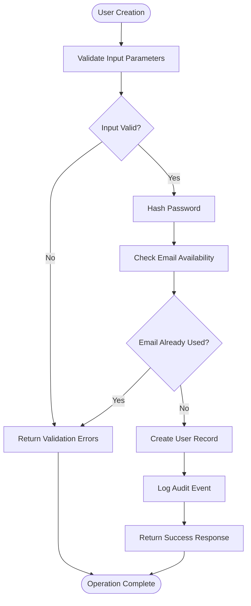
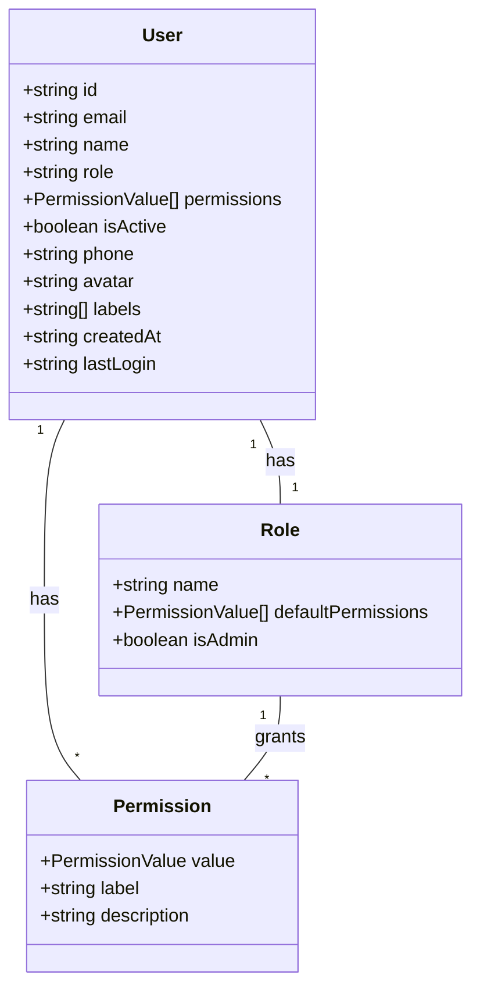
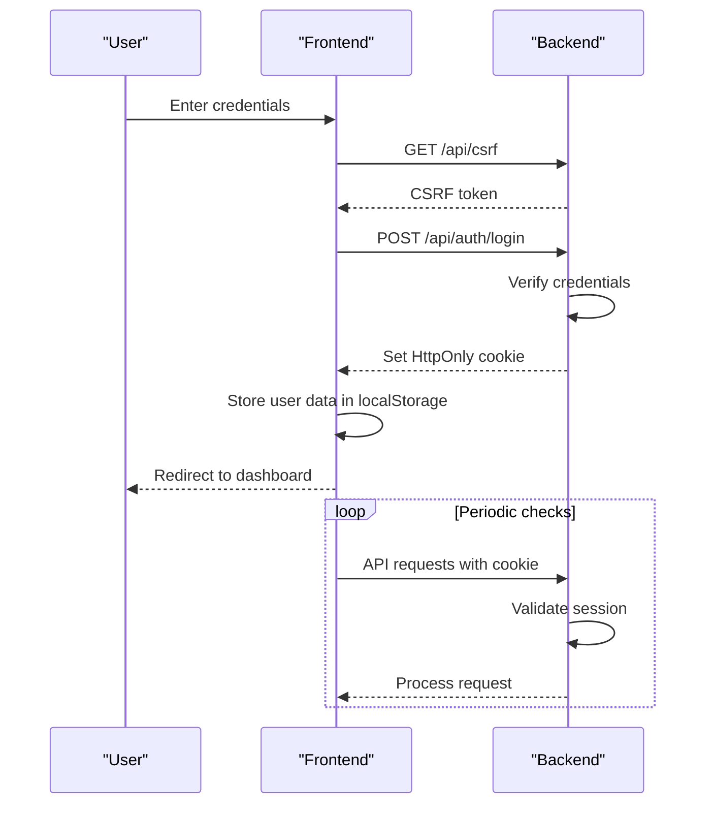
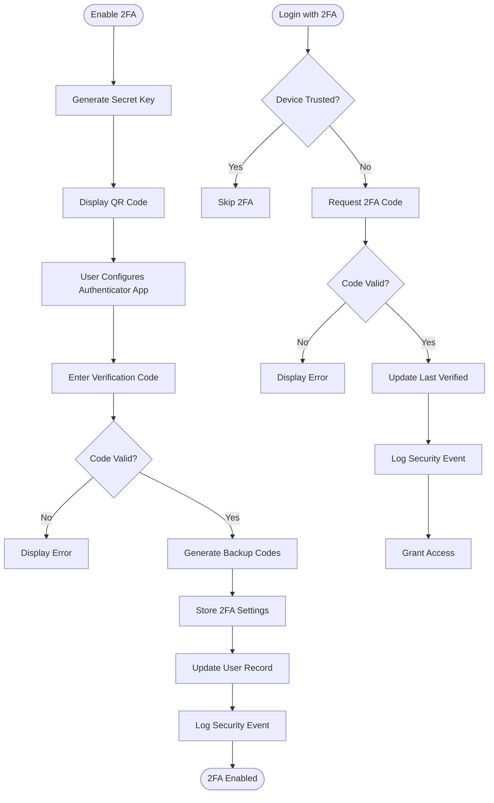
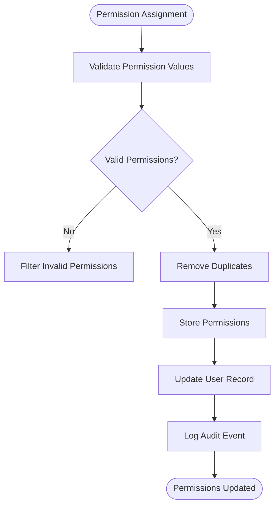
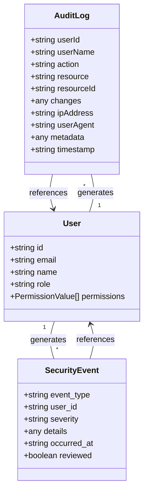
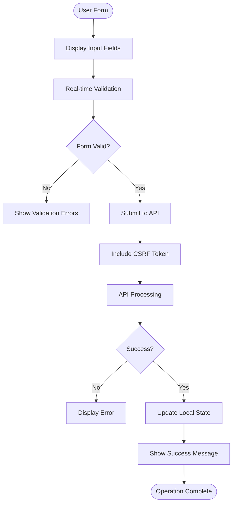

# User Management

<cite>
**Referenced Files in This Document**   
- [users.ts](file://convex/users.ts)
- [auth.ts](file://convex/auth.ts)
- [two_factor_auth.ts](file://convex/two_factor_auth.ts)
- [audit_logs.ts](file://convex/audit_logs.ts)
- [authStore.ts](file://src/stores/authStore.ts)
- [user-form.tsx](file://src/components/forms/user-form.tsx)
- [permission-checkbox-group.tsx](file://src/components/users/permission-checkbox-group.tsx)
- [session.ts](file://src/lib/auth/session.ts)
- [api/users/route.ts](file://src/app/api/users/route.ts)
- [api/users/[id]/route.ts](file://src/app/api/users/[id]/route.ts)
</cite>

## Table of Contents

1. [Introduction](#introduction)
2. [User Creation and Management](#user-creation-and-management)
3. [Role-Based Access Control](#role-based-access-control)
4. [Authentication and Session Handling](#authentication-and-session-handling)
5. [Two-Factor Authentication](#two-factor-authentication)
6. [Permission Management](#permission-management)
7. [Audit Logging and Security](#audit-logging-and-security)
8. [Frontend Integration](#frontend-integration)
9. [Security Considerations](#security-considerations)
10. [Common Issues and Troubleshooting](#common-issues-and-troubleshooting)

## Introduction

The User Management module provides comprehensive functionality for managing user accounts, roles, permissions, and security features within the application. This system integrates frontend forms with backend security mechanisms to ensure secure and efficient user administration. The implementation leverages Convex as the backend database and authentication functions, with a React frontend using Next.js for user interface components.

The module supports user creation, role-based access control, authentication workflows, and two-factor authentication setup. It also includes comprehensive audit logging for tracking user changes and security events. The system is designed to be both secure and user-friendly, with intuitive forms for user management and robust security measures to protect sensitive operations.

**Section sources**

- [users.ts](file://convex/users.ts)
- [auth.ts](file://convex/auth.ts)

## User Creation and Management

The user creation and management system provides a complete CRUD (Create, Read, Update, Delete) interface for user accounts. Users are stored in the Convex database with essential information including name, email, role, permissions, and account status.

The system implements strict validation for user data, ensuring that all required fields are properly formatted and complete. When creating a new user, the system validates the email format, ensures the name and role are sufficiently descriptive, and verifies that at least one permission is assigned. Passwords are validated for strength before hashing and storage.

User records include an `isActive` flag that controls whether a user can log in. This allows administrators to disable accounts without deleting them, preserving audit history and related data. The system also supports optional phone numbers, avatar URLs, and custom labels for organizational purposes.

**Diagram sources**

- [users.ts](file://convex/users.ts#L84-L122)
- [api/users/route.ts](file://src/app/api/users/route.ts#L155-L207)

**Section sources**

- [users.ts](file://convex/users.ts#L84-L122)
- [api/users/route.ts](file://src/app/api/users/route.ts#L155-L207)

## Role-Based Access Control

The role-based access control system implements a flexible permission model that combines user roles with explicit permission assignments. While users have roles (such as "Dernek Başkanı" or "Yönetici"), their actual permissions are determined by a combination of their assigned permissions and role-based inference.

The system includes a permission escalation mechanism where users with roles containing "ADMIN" or "BAŞKAN" automatically receive base module permissions and user management capabilities, regardless of their explicitly assigned permissions. This ensures that high-level administrators always have appropriate access while still allowing for granular permission control.

Roles are primarily used for display purposes and organizational hierarchy, while the actual access control is enforced through the permission system. This separation allows organizations to maintain their structural roles while implementing precise access control policies.

**Diagram sources**

- [users.ts](file://convex/users.ts)
- [session.ts](file://src/lib/auth/session.ts#L130-L177)

**Section sources**

- [session.ts](file://src/lib/auth/session.ts#L88-L177)
- [users.ts](file://convex/users.ts)

## Authentication and Session Handling

The authentication system implements a secure session management approach using HttpOnly cookies for token storage. The authStore manages the client-side authentication state, storing user information in localStorage for persistence while keeping the actual authentication token protected in an HttpOnly cookie.

The login process begins with CSRF token verification, followed by credential submission to the authentication API. Upon successful authentication, the server sets an HttpOnly cookie containing the session token, while the client stores basic user information in localStorage for quick access. This approach protects against XSS attacks while maintaining a smooth user experience.

Session validation occurs on both the client and server sides. The client checks for valid session data in localStorage, while the server verifies the authentication token on each request. The system also tracks the last login time for each user, providing administrators with visibility into account activity.

**Diagram sources**

- [authStore.ts](file://src/stores/authStore.ts#L144-L246)
- [auth.ts](file://convex/auth.ts)
- [api/auth/login/route.ts](file://src/app/api/auth/login/route.ts)

**Section sources**

- [authStore.ts](file://src/stores/authStore.ts#L144-L246)
- [auth.ts](file://convex/auth.ts)

## Two-Factor Authentication

The two-factor authentication system provides an additional layer of security for user accounts. Users can enable 2FA by configuring a TOTP (Time-Based One-Time Password) authenticator app, which generates verification codes. The system stores the secret key for code generation and validates codes during the login process.

For account recovery, the system generates backup codes that can be used when the primary 2FA method is unavailable. These backup codes are single-use and tracked to prevent reuse. Users are warned when their remaining backup codes fall below a threshold, prompting them to generate new ones.

The implementation includes trusted device functionality, allowing users to mark specific devices as trusted to bypass 2FA requirements on subsequent logins. This improves usability while maintaining security, as trusted devices are identified by their fingerprint and can be revoked by the user.

**Diagram sources**

- [two_factor_auth.ts](file://convex/two_factor_auth.ts)
- [api/auth/login/route.ts](file://src/app/api/auth/login/route.ts)

**Section sources**

- [two_factor_auth.ts](file://convex/two_factor_auth.ts)

## Permission Management

The permission management system implements a granular access control model with both module-level and special permissions. Module permissions grant access to specific application features such as beneficiaries, donations, and reports, while special permissions provide administrative capabilities like user management.

Permissions are managed through a checkbox interface that displays permissions in a logical order, with the option to include the user management permission for administrators. The system validates all permission assignments to ensure only valid permission values are stored.

The frontend component provides immediate feedback on permission changes and includes descriptive text explaining the implications of each permission. This helps administrators make informed decisions when assigning permissions to users.

**Diagram sources**

- [permission-checkbox-group.tsx](file://src/components/users/permission-checkbox-group.tsx)
- [users.ts](file://convex/users.ts#L124-L207)

**Section sources**

- [permission-checkbox-group.tsx](file://src/components/users/permission-checkbox-group.tsx)
- [users.ts](file://convex/users.ts#L124-L207)

## Audit Logging and Security

The audit logging system tracks all critical operations related to user management and security. Every user creation, update, deletion, and permission change is recorded with detailed information including the user who performed the action, the affected resource, the type of action, and relevant metadata.

Security events such as 2FA enablement, disablement, and login attempts are also logged for compliance and monitoring purposes. The system includes rate limiting to prevent brute force attacks and implements CSRF protection for all state-changing operations.

Audit logs are stored in the Convex database with indexes optimized for querying by user, resource, or date range. Administrators can view audit logs to investigate suspicious activity or verify compliance with organizational policies.

**Diagram sources**

- [audit_logs.ts](file://convex/audit_logs.ts)
- [two_factor_auth.ts](file://convex/two_factor_auth.ts)
- [users.ts](file://convex/users.ts)

**Section sources**

- [audit_logs.ts](file://convex/audit_logs.ts)
- [two_factor_auth.ts](file://convex/two_factor_auth.ts)

## Frontend Integration

The frontend integration connects user management forms with backend security features through a seamless interface. The user form component provides a comprehensive interface for creating and editing user accounts, with real-time validation and helpful guidance for administrators.

The form includes a password generator that creates strong, random passwords meeting security requirements. It also provides clear instructions for password policies and includes appropriate validation messages when requirements are not met.

The integration with the authStore ensures that permission checks are performed client-side before attempting operations that require specific permissions. This provides immediate feedback to users and reduces unnecessary API calls.

**Diagram sources**

- [user-form.tsx](file://src/components/forms/user-form.tsx)
- [authStore.ts](file://src/stores/authStore.ts)
- [api/users/route.ts](file://src/app/api/users/route.ts)

**Section sources**

- [user-form.tsx](file://src/components/forms/user-form.tsx)
- [authStore.ts](file://src/stores/authStore.ts)

## Security Considerations

The user management system implements multiple security measures to protect against common threats. Passwords are hashed using bcrypt before storage, and password strength is validated to ensure adequate complexity. The system includes rate limiting to prevent brute force attacks on both login and password recovery endpoints.

CSRF protection is implemented for all state-changing operations, requiring a valid CSRF token for actions like user creation, updates, and deletions. Sensitive operations such as changing permissions or enabling/disabling accounts require explicit permission checks to prevent unauthorized access.

The system follows the principle of least privilege, where users only have the permissions necessary for their role. Administrative operations are logged for audit purposes, and sensitive data like password hashes are never exposed in API responses.

Two-factor authentication provides an additional layer of security for user accounts, protecting against credential stuffing and phishing attacks. The implementation includes backup codes for account recovery while ensuring these codes are single-use and properly tracked.

**Section sources**

- [auth.ts](file://convex/auth.ts)
- [users.ts](file://convex/users.ts)
- [security.ts](file://src/lib/security.ts)
- [auth-utils.ts](file://src/lib/api/auth-utils.ts)

## Common Issues and Troubleshooting

Common issues in the user management system include session expiration, permission inheritance conflicts, and bulk user operation failures. Session expiration occurs after a period of inactivity, requiring users to log in again. The system provides clear error messages and redirects to the login page when sessions expire.

Permission inheritance issues can arise when role-based permission escalation conflicts with explicitly assigned permissions. The system resolves this by giving precedence to the role-based escalation for administrative roles, ensuring consistent access for high-level users.

Bulk user operations may fail due to validation errors on individual records. The system processes bulk operations with appropriate error handling, providing detailed feedback about which operations succeeded and which failed, along with specific error messages for troubleshooting.

Two-factor authentication issues commonly involve lost devices or exhausted backup codes. The system alerts users when their backup codes are running low and provides clear instructions for regenerating new codes. Administrators can assist users with account recovery through alternative verification methods.

**Section sources**

- [authStore.ts](file://src/stores/authStore.ts)
- [session.ts](file://src/lib/auth/session.ts)
- [users.ts](file://convex/users.ts)
- [two_factor_auth.ts](file://convex/two_factor_auth.ts)
