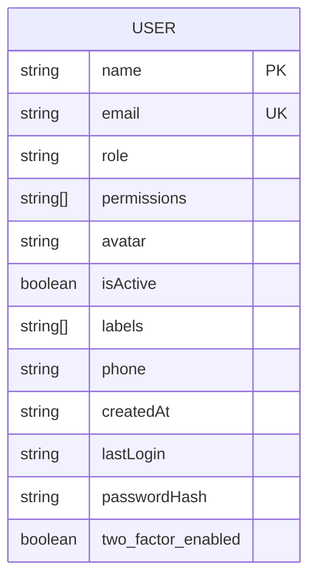
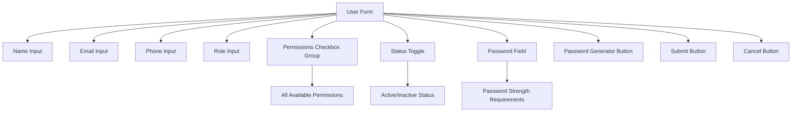
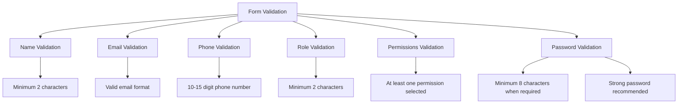
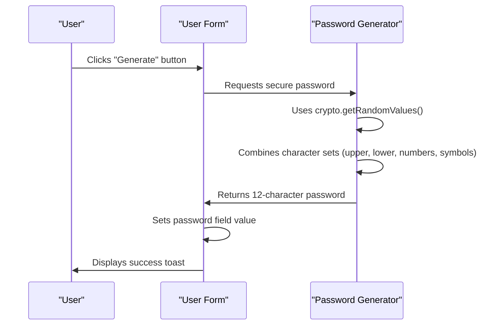
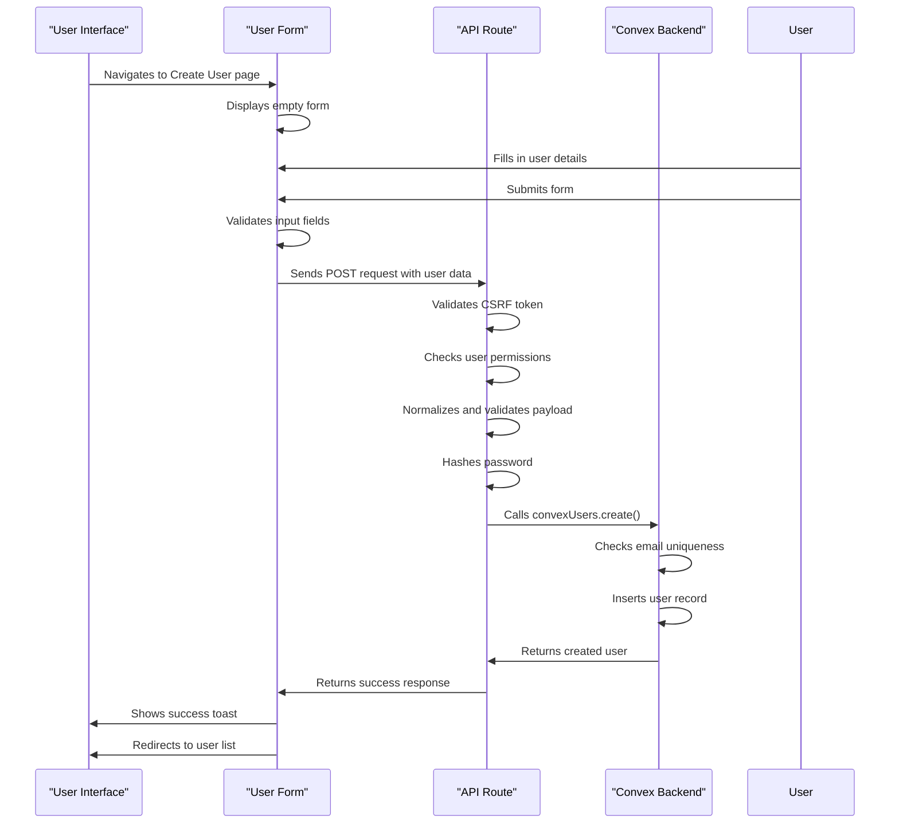
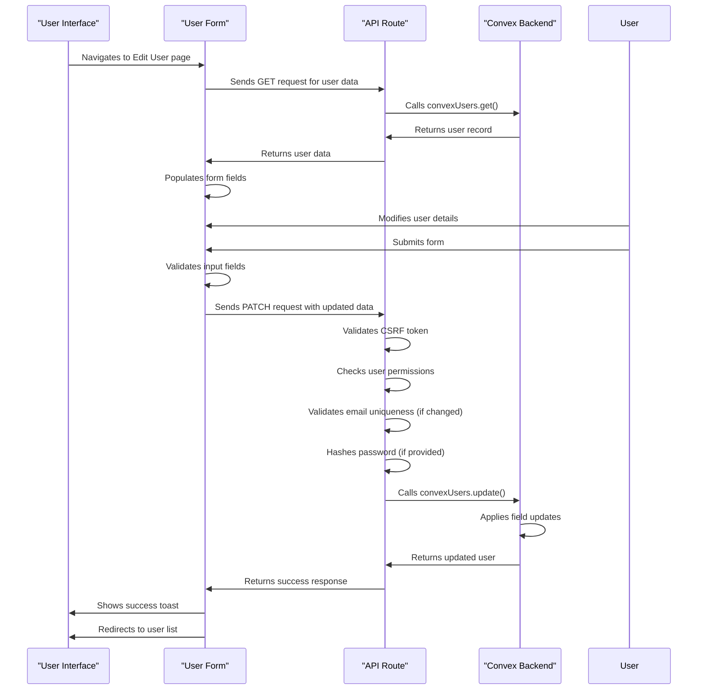
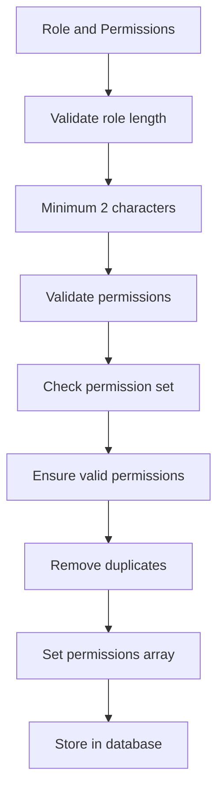

# User Profiles

<cite>
**Referenced Files in This Document**   
- [user-form.tsx](file://src/components/forms/user-form.tsx)
- [users.ts](file://convex/users.ts)
- [schema.ts](file://convex/schema.ts)
- [database.ts](file://src/types/database.ts)
- [page.tsx](file://src/app/(dashboard)/kullanici/yeni/page.tsx)
- [page.tsx](file://src/app/(dashboard)/kullanici/[id]/duzenle/page.tsx)
- [route.ts](file://src/app/api/users/route.ts)
- [route.ts](file://src/app/api/users/[id]/route.ts)
</cite>

## Table of Contents

1. [Introduction](#introduction)
2. [Data Structure](#data-structure)
3. [User Form Component](#user-form-component)
4. [Form Validation Rules](#form-validation-rules)
5. [Password Generation](#password-generation)
6. [User Creation Workflow](#user-creation-workflow)
7. [User Editing Workflow](#user-editing-workflow)
8. [Backend Integration](#backend-integration)
9. [Common Issues and Solutions](#common-issues-and-solutions)

## Introduction

The User Profiles feature enables administrators to create, edit, and manage user accounts within the system. This functionality is centered around a comprehensive user form component that captures essential profile information including name, email, role, permissions, phone, avatar, and status. The implementation integrates with Convex backend functions for data persistence and validation. The system ensures data integrity through email uniqueness checks, proper role assignment, and secure password handling. This document details the implementation of user profile management, covering the data structure, form validation, UI components, and integration between frontend and backend systems.

## Data Structure

The user profile data structure is defined in the Convex schema and TypeScript interfaces, containing essential fields for user management.



**Diagram sources**

- [schema.ts](file://convex/schema.ts#L9-L33)
- [database.ts](file://src/types/database.ts#L19-L30)

**Section sources**

- [schema.ts](file://convex/schema.ts#L9-L33)
- [database.ts](file://src/types/database.ts#L19-L30)

## User Form Component

The user form component provides a comprehensive interface for creating and editing user profiles with various input fields and controls.



**Diagram sources**

- [user-form.tsx](file://src/components/forms/user-form.tsx#L137-L270)

**Section sources**

- [user-form.tsx](file://src/components/forms/user-form.tsx#L27-L274)

## Form Validation Rules

The user form implements comprehensive validation rules to ensure data quality and consistency.



**Diagram sources**

- [user-form.tsx](file://src/components/forms/user-form.tsx#L27-L40)
- [route.ts](file://src/app/api/users/route.ts#L34-L57)
- [route.ts](file://src/app/api/users/[id]/route.ts#L87-L96)

**Section sources**

- [user-form.tsx](file://src/components/forms/user-form.tsx#L27-L40)
- [route.ts](file://src/app/api/users/route.ts#L34-L57)
- [route.ts](file://src/app/api/users/[id]/route.ts#L87-L96)

## Password Generation

The system includes a secure password generation functionality that creates strong passwords for new users.



**Diagram sources**

- [user-form.tsx](file://src/components/forms/user-form.tsx#L44-L71)
- [user-form.tsx](file://src/components/forms/user-form.tsx#L105-L108)

**Section sources**

- [user-form.tsx](file://src/components/forms/user-form.tsx#L44-L71)
- [user-form.tsx](file://src/components/forms/user-form.tsx#L105-L108)

## User Creation Workflow

The user creation process follows a structured workflow from form submission to backend persistence.



**Diagram sources**

- [page.tsx](<file://src/app/(dashboard)/kullanici/yeni/page.tsx#L67-L73>)
- [route.ts](file://src/app/api/users/route.ts#L154-L218)
- [users.ts](file://convex/users.ts#L84-L121)

**Section sources**

- [page.tsx](<file://src/app/(dashboard)/kullanici/yeni/page.tsx#L67-L73>)
- [route.ts](file://src/app/api/users/route.ts#L154-L218)
- [users.ts](file://convex/users.ts#L84-L121)

## User Editing Workflow

The user editing process allows administrators to modify existing user profiles with proper validation and persistence.



**Diagram sources**

- [page.tsx](<file://src/app/(dashboard)/kullanici/[id]/duzenle/page.tsx#L131-L134>)
- [route.ts](file://src/app/api/users/[id]/route.ts#L62-L167)
- [users.ts](file://convex/users.ts#L124-L206)

**Section sources**

- [page.tsx](<file://src/app/(dashboard)/kullanici/[id]/duzenle/page.tsx#L131-L134>)
- [route.ts](file://src/app/api/users/[id]/route.ts#L62-L167)
- [users.ts](file://convex/users.ts#L124-L206)

## Backend Integration

The frontend user form integrates with Convex backend functions through API routes to handle user creation and updates.

```mermaid
flowchart TD
A[Frontend] --> B[API Routes]
B --> C[Convex Functions]
C --> D[Database]
subgraph Frontend
A1[User Form]
A2[React Hook Form]
A3[Zod Validation]
end
subgraph API Routes
B1[POST /api/users]
B2[PATCH /api/users/[id]]
B3[GET /api/users/[id]]
end
subgraph Convex Functions
C1[convexUsers.create()]
C2[convexUsers.update()]
C3[convexUsers.get()]
C4[convexUsers.list()]
end
subgraph Database
D1[Users Collection]
D2[Index: by_email]
D3[Index: by_role]
D4[Search Index: by_search]
end
A1 --> B1
A1 --> B2
A1 --> B3
B1 --> C1
B2 --> C2
B3 --> C3
B3 --> C4
C1 --> D1
C2 --> D1
C3 --> D1
C4 --> D1
D2 --> C1
D2 --> C2
D3 --> C4
D4 --> C4
```

**Diagram sources**

- [user-form.tsx](file://src/components/forms/user-form.tsx#L27-L274)
- [route.ts](file://src/app/api/users/route.ts)
- [route.ts](file://src/app/api/users/[id]/route.ts)
- [users.ts](file://convex/users.ts)
- [schema.ts](file://convex/schema.ts#L9-L38)

**Section sources**

- [user-form.tsx](file://src/components/forms/user-form.tsx#L27-L274)
- [route.ts](file://src/app/api/users/route.ts)
- [route.ts](file://src/app/api/users/[id]/route.ts)
- [users.ts](file://convex/users.ts)
- [schema.ts](file://convex/schema.ts#L9-L38)

## Common Issues and Solutions

This section addresses common issues encountered during user profile management and their solutions.

### Email Uniqueness Validation

When creating or updating a user, the system validates email uniqueness to prevent duplicate accounts.

```mermaid
flowchart TD
A[Email Validation] --> B[Check if email is being changed]
B --> C{Email changed?}
C --> |No| D[No validation needed]
C --> |Yes| E[Query users collection]
E --> F[Search by_email index]
F --> G{User found?}
G --> |No| H[Email available]
G --> |Yes| I[Check if same user ID]
I --> |Yes| J[Email available]
I --> |No| K[Email already in use]
K --> L[Throw error: "Email already in use"]
```

**Diagram sources**

- [users.ts](file://convex/users.ts#L97-L105)
- [users.ts](file://convex/users.ts#L161-L171)

**Section sources**

- [users.ts](file://convex/users.ts#L97-L105)
- [users.ts](file://convex/users.ts#L161-L171)

### Role Assignment and Permissions

The system handles role assignment and permission management to ensure proper access control.



**Diagram sources**

- [user-form.tsx](file://src/components/forms/user-form.tsx#L36-L37)
- [route.ts](file://src/app/api/users/route.ts#L44-L47)
- [route.ts](file://src/app/api/users/[id]/route.ts#L93-L97)
- [route.ts](file://src/app/api/users/route.ts#L49-L54)
- [route.ts](file://src/app/api/users/[id]/route.ts#L100-L107)

**Section sources**

- [user-form.tsx](file://src/components/forms/user-form.tsx#L36-L37)
- [route.ts](file://src/app/api/users/route.ts#L44-L47)
- [route.ts](file://src/app/api/users/[id]/route.ts#L93-L97)
- [route.ts](file://src/app/api/users/route.ts#L49-L54)
- [route.ts](file://src/app/api/users/[id]/route.ts#L100-L107)
