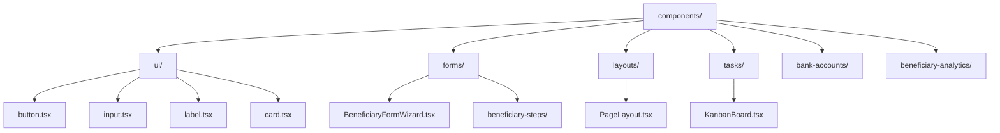
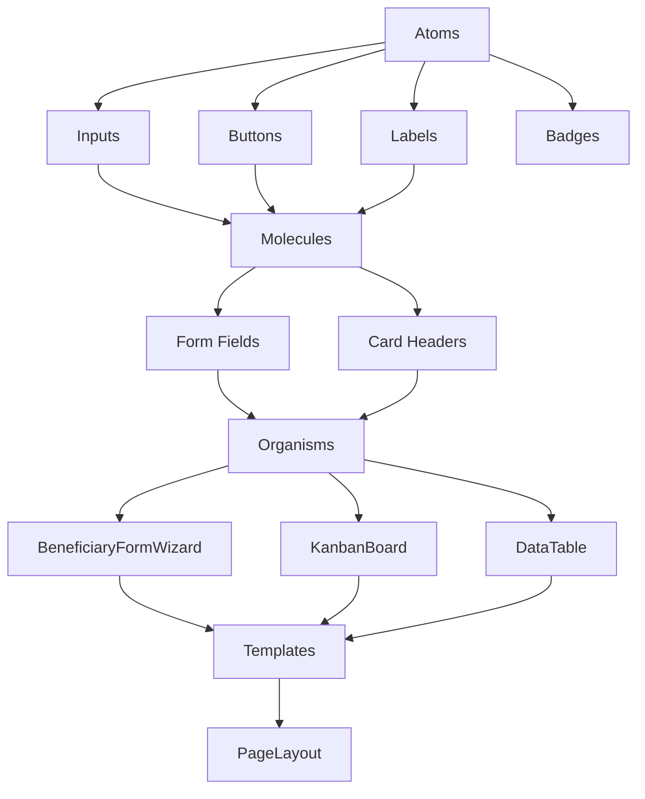
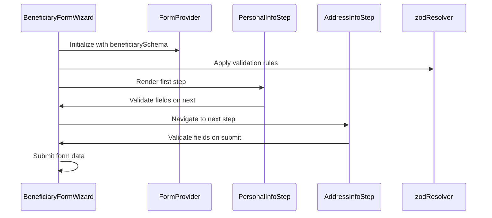
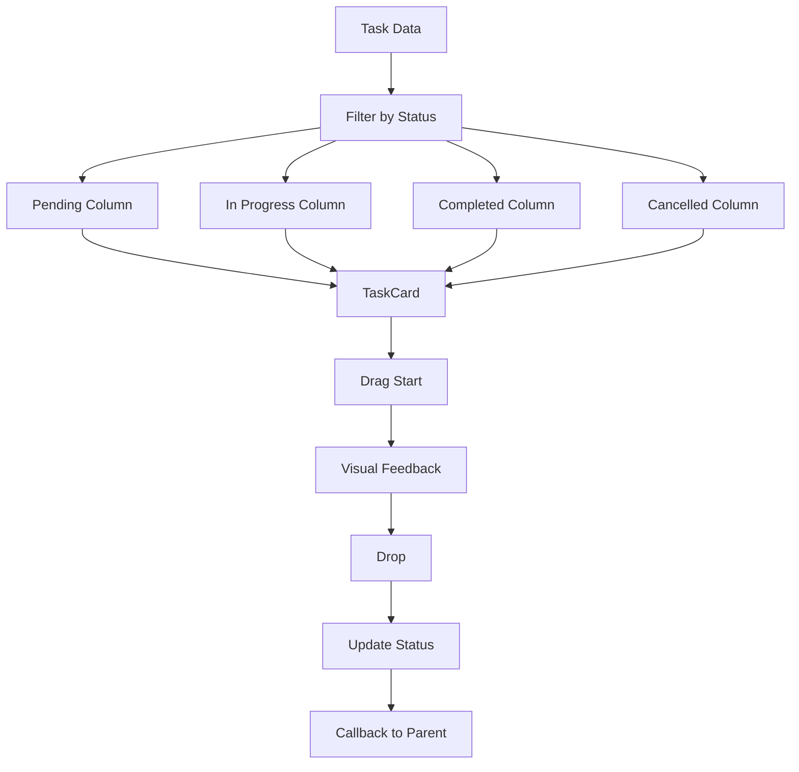
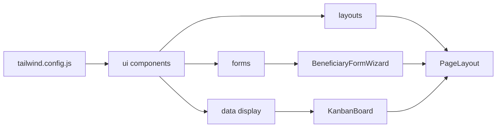

# Component Hierarchy

<cite>
**Referenced Files in This Document**   
- [PageLayout.tsx](file://src/components/layouts/PageLayout.tsx)
- [BeneficiaryFormWizard.tsx](file://src/components/forms/BeneficiaryFormWizard.tsx)
- [KanbanBoard.tsx](file://src/components/tasks/KanbanBoard.tsx)
- [input.tsx](file://src/components/ui/input.tsx)
- [form.tsx](file://src/components/ui/form.tsx)
- [label.tsx](file://src/components/ui/label.tsx)
- [card.tsx](file://src/components/ui/card.tsx)
- [button.tsx](file://src/components/ui/button.tsx)
- [data-table.tsx](file://src/components/ui/data-table.tsx)
- [tailwind.config.js](file://tailwind.config.js)
- [PersonalInfoStep.tsx](file://src/components/forms/beneficiary-steps/PersonalInfoStep.tsx)
- [AddressInfoStep.tsx](file://src/components/forms/beneficiary-steps/AddressInfoStep.tsx)
</cite>

## Table of Contents

1. [Introduction](#introduction)
2. [Project Structure](#project-structure)
3. [Core Components](#core-components)
4. [Architecture Overview](#architecture-overview)
5. [Detailed Component Analysis](#detailed-component-analysis)
6. [Dependency Analysis](#dependency-analysis)
7. [Performance Considerations](#performance-considerations)
8. [Troubleshooting Guide](#troubleshooting-guide)
9. [Conclusion](#conclusion)

## Introduction

This document provides a comprehensive overview of the frontend component hierarchy in Kafkasder-panel, focusing on the organization and implementation of reusable UI components. It details the atomic design principles applied across the components directory, the structure of layout components, and the composition patterns used for higher-order components. The documentation also covers accessibility, theming, responsive design, and guidelines for creating new components following existing conventions.

## Project Structure

The Kafkasder-panel frontend follows a structured directory organization that promotes reusability and maintainability. The components directory is organized according to atomic design principles, with base UI primitives in the ui subdirectory, form-specific components in forms, and feature-specific components in dedicated subdirectories. Layout components are centralized in the layouts directory, while higher-order components like form wizards and data tables are composed from these base primitives.



**Diagram sources**

- [src/components/ui/button.tsx](file://src/components/ui/button.tsx)
- [src/components/ui/input.tsx](file://src/components/ui/input.tsx)
- [src/components/ui/label.tsx](file://src/components/ui/label.tsx)
- [src/components/ui/card.tsx](file://src/components/ui/card.tsx)
- [src/components/forms/BeneficiaryFormWizard.tsx](file://src/components/forms/BeneficiaryFormWizard.tsx)
- [src/components/layouts/PageLayout.tsx](file://src/components/layouts/PageLayout.tsx)
- [src/components/tasks/KanbanBoard.tsx](file://src/components/tasks/KanbanBoard.tsx)

**Section sources**

- [src/components/](file://src/components/)

## Core Components

The core components in Kafkasder-panel follow atomic design principles, organizing UI elements from atomic primitives to complex organisms. The ui directory contains base components like buttons, inputs, and labels that serve as the foundation for all other components. These primitives are designed with accessibility, theming, and responsiveness in mind, using Tailwind CSS for styling and proper ARIA attributes for accessibility.

**Section sources**

- [src/components/ui/](file://src/components/ui/)
- [src/components/forms/](file://src/components/forms/)
- [src/components/layouts/](file://src/components/layouts/)

## Architecture Overview

The component architecture in Kafkasder-panel follows a hierarchical composition pattern where complex components are built from simpler, reusable primitives. This approach promotes consistency, maintainability, and ease of testing. The architecture is organized around atomic design principles, with atoms (basic UI elements), molecules (composed from atoms), organisms (complex components), and templates (page layouts) forming a clear hierarchy.



**Diagram sources**

- [src/components/ui/input.tsx](file://src/components/ui/input.tsx)
- [src/components/ui/button.tsx](file://src/components/ui/button.tsx)
- [src/components/ui/label.tsx](file://src/components/ui/label.tsx)
- [src/components/forms/BeneficiaryFormWizard.tsx](file://src/components/forms/BeneficiaryFormWizard.tsx)
- [src/components/tasks/KanbanBoard.tsx](file://src/components/tasks/KanbanBoard.tsx)
- [src/components/ui/data-table.tsx](file://src/components/ui/data-table.tsx)
- [src/components/layouts/PageLayout.tsx](file://src/components/layouts/PageLayout.tsx)

## Detailed Component Analysis

### Layout Components

The PageLayout component serves as the foundation for consistent UI across all pages in the application. It provides a standardized header with title, description, badge, and action elements, along with responsive design and accessibility features. The layout uses motion animations for smooth transitions and supports back navigation with proper ARIA labeling.

```mermaid
classDiagram
class PageLayout {
+children : ReactNode
+title : string
+description? : string
+icon? : LucideIcon | string | null
+badge? : { text : string; variant? : 'default' | 'secondary' | 'destructive' | 'outline' }
+actions? : ReactNode
+showBackButton? : boolean
+className? : string
}
PageLayout --> Button : "uses"
PageLayout --> Badge : "uses"
PageLayout --> motion.div : "uses"
PageLayout --> ArrowLeft : "uses"
```

**Diagram sources**

- [src/components/layouts/PageLayout.tsx](file://src/components/layouts/PageLayout.tsx)
- [src/components/ui/button.tsx](file://src/components/ui/button.tsx)
- [src/components/ui/badge.tsx](file://src/components/ui/badge.tsx)

**Section sources**

- [src/components/layouts/PageLayout.tsx](file://src/components/layouts/PageLayout.tsx)

### Form Composition Patterns

The BeneficiaryFormWizard demonstrates a sophisticated form composition pattern that breaks down a complex 927-line form into manageable steps. This wizard pattern uses React Hook Form for state management and validation, with each step encapsulated in its own component. The form implements progressive disclosure, showing only relevant fields at each step, and provides visual feedback through a progress indicator.



**Diagram sources**

- [src/components/forms/BeneficiaryFormWizard.tsx](file://src/components/forms/BeneficiaryFormWizard.tsx)
- [src/components/forms/beneficiary-steps/PersonalInfoStep.tsx](file://src/components/forms/beneficiary-steps/PersonalInfoStep.tsx)
- [src/components/forms/beneficiary-steps/AddressInfoStep.tsx](file://src/components/forms/beneficiary-steps/AddressInfoStep.tsx)
- [src/lib/validations/beneficiary.ts](file://src/lib/validations/beneficiary.ts)

**Section sources**

- [src/components/forms/BeneficiaryFormWizard.tsx](file://src/components/forms/BeneficiaryFormWizard.tsx)
- [src/components/forms/beneficiary-steps/PersonalInfoStep.tsx](file://src/components/forms/beneficiary-steps/PersonalInfoStep.tsx)
- [src/components/forms/beneficiary-steps/AddressInfoStep.tsx](file://src/components/forms/beneficiary-steps/AddressInfoStep.tsx)

### Data Display Components

The KanbanBoard component exemplifies a complex data display pattern that organizes tasks into columns based on their status. It implements drag-and-drop functionality for task reorganization, with visual feedback during drag operations. The component uses memoization to optimize performance and provides accessibility features for keyboard navigation.



**Diagram sources**

- [src/components/tasks/KanbanBoard.tsx](file://src/components/tasks/KanbanBoard.tsx)

**Section sources**

- [src/components/tasks/KanbanBoard.tsx](file://src/components/tasks/KanbanBoard.tsx)

## Dependency Analysis

The component hierarchy in Kafkasder-panel demonstrates a well-structured dependency graph with clear separation of concerns. Base UI components in the ui directory have no dependencies on higher-level components, while feature-specific components import and compose these primitives. This unidirectional dependency flow prevents circular dependencies and makes the codebase more maintainable.



**Diagram sources**

- [tailwind.config.js](file://tailwind.config.js)
- [src/components/ui/](file://src/components/ui/)
- [src/components/forms/BeneficiaryFormWizard.tsx](file://src/components/forms/BeneficiaryFormWizard.tsx)
- [src/components/layouts/PageLayout.tsx](file://src/components/layouts/PageLayout.tsx)
- [src/components/tasks/KanbanBoard.tsx](file://src/components/tasks/KanbanBoard.tsx)

**Section sources**

- [tailwind.config.js](file://tailwind.config.js)
- [src/components/](file://src/components/)

## Performance Considerations

The component implementation in Kafkasder-panel incorporates several performance optimizations. The KanbanBoard uses React.memo to prevent unnecessary re-renders of task cards, while the DataTable component implements animated transitions with staggered entry effects. Form components leverage React Hook Form's efficient state management to minimize re-renders during user input. The use of Tailwind CSS ensures that styling is optimized and doesn't contribute to bundle size bloat.

**Section sources**

- [src/components/tasks/KanbanBoard.tsx](file://src/components/tasks/KanbanBoard.tsx)
- [src/components/ui/data-table.tsx](file://src/components/ui/data-table.tsx)
- [src/components/forms/BeneficiaryFormWizard.tsx](file://src/components/forms/BeneficiaryFormWizard.tsx)

## Troubleshooting Guide

When working with the component hierarchy in Kafkasder-panel, common issues typically relate to form state management, accessibility compliance, or styling conflicts. For form-related issues, ensure that React Hook Form providers and controllers are properly configured. For accessibility problems, verify that all interactive elements have appropriate ARIA attributes and keyboard navigation support. Styling issues can often be resolved by checking Tailwind CSS class precedence and ensuring consistent use of the design system.

**Section sources**

- [src/components/ui/form.tsx](file://src/components/ui/form.tsx)
- [src/components/ui/input.tsx](file://src/components/ui/input.tsx)
- [src/components/ui/label.tsx](file://src/components/ui/label.tsx)

## Conclusion

The component hierarchy in Kafkasder-panel demonstrates a well-architected frontend implementation that follows atomic design principles and promotes reusability. By organizing components from atomic primitives to complex organisms, the codebase maintains consistency while allowing for flexibility in composition. The use of modern React patterns, proper accessibility implementation, and performance optimizations results in a robust and maintainable frontend architecture that can serve as a model for similar applications.
