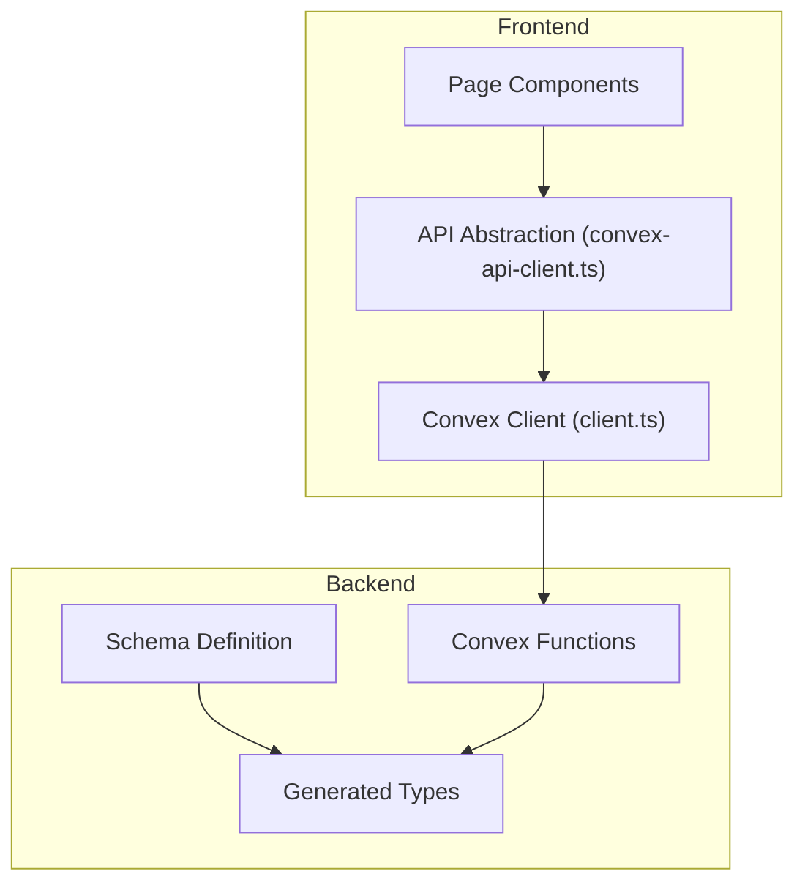
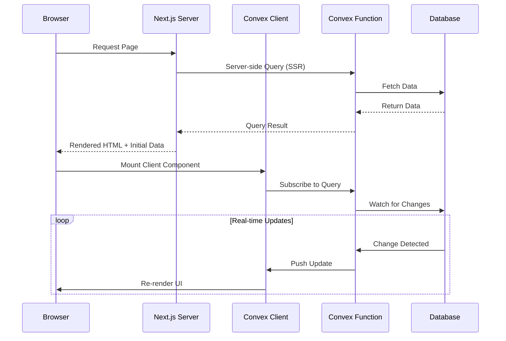
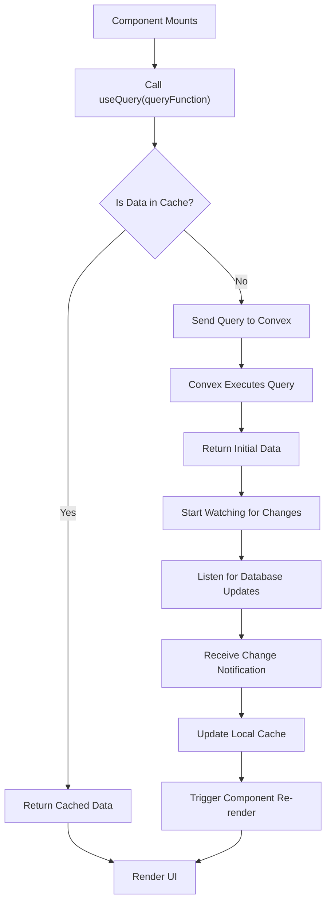
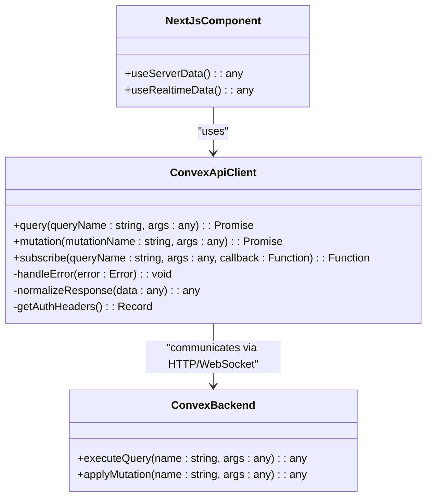
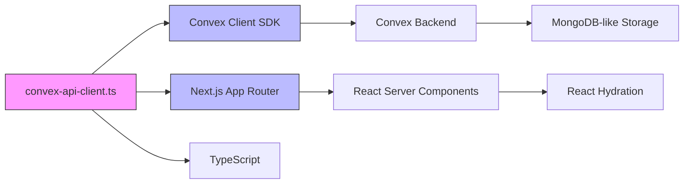

# Data Fetching and Synchronization

<cite>
**Referenced Files in This Document**   
- [convex-api-client.ts](file://src/lib/api/convex-api-client.ts)
- [client.ts](file://src/lib/convex/client.ts)
- [api.ts](file://src/lib/convex/api.ts)
- [kumbara/page.tsx](file://src/app/(dashboard)/bagis/kumbara/page.tsx)
- [liste/page.tsx](file://src/app/(dashboard)/bagis/liste/page.tsx)
- [ihtiyac-sahipleri/page.tsx](file://src/app/(dashboard)/yardim/ihtiyac-sahipleri/page.tsx)
- [donations.ts](file://convex/donations.ts)
- [beneficiaries.ts](file://convex/beneficiaries.ts)
- [schema.ts](file://convex/schema.ts)
</cite>

## Table of Contents

1. [Introduction](#introduction)
2. [Project Structure](#project-structure)
3. [Core Components](#core-components)
4. [Architecture Overview](#architecture-overview)
5. [Detailed Component Analysis](#detailed-component-analysis)
6. [Dependency Analysis](#dependency-analysis)
7. [Performance Considerations](#performance-considerations)
8. [Troubleshooting Guide](#troubleshooting-guide)
9. [Conclusion](#conclusion)

## Introduction

This document provides a comprehensive overview of the data fetching and synchronization mechanisms in Kafkasder-panel, focusing on the integration between Next.js server components and Convex's real-time database. It details how server-side data loading and client-side subscriptions work together to deliver responsive and up-to-date user interfaces. The documentation also covers the abstraction layer that standardizes interactions with Convex queries and mutations, ensuring consistency and maintainability across the application.

## Project Structure

The project is organized into several key directories: `convex` for backend logic and schema definitions, `src/app` for Next.js page components, and `src/lib` for shared utilities and API clients. The Convex functions reside in the `convex/` directory and are automatically generated into TypeScript types under `convex/_generated`. The frontend pages under `src/app/(dashboard)` use server components for initial data loading and client components for real-time updates via subscriptions.

**Diagram sources**

- [client.ts](file://src/lib/convex/client.ts)
- [convex-api-client.ts](file://src/lib/api/convex-api-client.ts)
- [schema.ts](file://convex/schema.ts)

**Section sources**

- [client.ts](file://src/lib/convex/client.ts)
- [convex-api-client.ts](file://src/lib/api/convex-api-client.ts)
- [schema.ts](file://convex/schema.ts)

## Core Components

The core data fetching components include the Convex client initialization, the API abstraction layer (`convex-api-client.ts`), and the integration of server-side data loading with client-side subscriptions. Server components fetch initial data during rendering, while client components subscribe to real-time updates using Convex's reactivity system. This hybrid approach ensures fast initial loads and live synchronization without manual polling.

**Section sources**

- [convex-api-client.ts](file://src/lib/api/convex-api-client.ts)
- [client.ts](file://src/lib/convex/client.ts)
- [api.ts](file://src/lib/convex/api.ts)

## Architecture Overview

Kafkasder-panel uses a layered architecture where Next.js server components handle initial data fetching, and client components manage real-time updates through Convex subscriptions. The `convex-api-client.ts` file abstracts all interactions with Convex queries and mutations, providing a consistent interface across the application. This abstraction enables centralized error handling, caching, and type safety.

**Diagram sources**

- [client.ts](file://src/lib/convex/client.ts)
- [convex-api-client.ts](file://src/lib/api/convex-api-client.ts)
- [donations.ts](file://convex/donations.ts)
- [beneficiaries.ts](file://convex/beneficiaries.ts)

## Detailed Component Analysis

### Server-Side Data Loading

Next.js server components in Kafkasder-panel use direct Convex queries to fetch data during server-side rendering. This approach ensures that pages are rendered with fully populated data before being sent to the client, improving perceived performance and SEO. The donation and beneficiary pages leverage this pattern to display lists and statistics immediately upon load.

**Section sources**

- [kumbara/page.tsx](<file://src/app/(dashboard)/bagis/kumbara/page.tsx>)
- [liste/page.tsx](<file://src/app/(dashboard)/bagis/liste/page.tsx>)
- [ihtiyac-sahipleri/page.tsx](<file://src/app/(dashboard)/yardim/ihtiyac-sahipleri/page.tsx>)

### Client-Side Subscriptions

Client components use Convex's `useQuery` hook to establish real-time subscriptions. When underlying data changes in the database, the Convex backend pushes updates to all active clients, triggering re-renders. This mechanism is used extensively in dynamic views like donation tracking and beneficiary management to reflect changes instantly without requiring page refreshes.

**Diagram sources**

- [client.ts](file://src/lib/convex/client.ts)
- [api.ts](file://src/lib/convex/api.ts)

### API Abstraction Layer

The `convex-api-client.ts` file provides a unified interface for all Convex interactions, wrapping both queries and mutations. It standardizes error handling, implements retry logic, and normalizes response formats. This abstraction decouples business logic from Convex-specific implementations, making it easier to maintain and test the codebase.

**Diagram sources**

- [convex-api-client.ts](file://src/lib/api/convex-api-client.ts)

**Section sources**

- [convex-api-client.ts](file://src/lib/api/convex-api-client.ts)

## Dependency Analysis

The data fetching system depends on Convex for real-time capabilities, Next.js for server-side rendering, and TypeScript for type safety. The `convex/_generated` directory contains auto-generated types that ensure alignment between frontend and backend. External dependencies like React and Next.js enable the component model and server-client boundary management.

**Diagram sources**

- [convex-api-client.ts](file://src/lib/api/convex-api-client.ts)
- [client.ts](file://src/lib/convex/client.ts)
- [package.json](file://package.json)

**Section sources**

- [convex-api-client.ts](file://src/lib/api/convex-api-client.ts)
- [client.ts](file://src/lib/convex/client.ts)
- [package.json](file://package.json)

## Performance Considerations

The system employs several optimization strategies:

- **Query deduplication**: Multiple components requesting the same data share a single active subscription.
- **Caching**: Results are cached both in-memory and via browser storage to minimize redundant requests.
- **Selective revalidation**: Only changed data triggers updates, reducing unnecessary re-renders.
- **Code splitting**: Convex function imports are tree-shaken to reduce bundle size.

These optimizations ensure efficient data synchronization even with high-frequency updates across multiple clients.

## Troubleshooting Guide

Common issues include subscription timeouts, stale data, and authentication-related fetch failures. The system logs errors through `error-tracker.ts` and displays user-friendly messages via `ErrorReportForm`. For debugging real-time issues, developers can inspect WebSocket traffic and verify Convex function execution using the Convex dashboard.

**Section sources**

- [error-tracker.ts](file://src/lib/error-tracker.ts)
- [errors.ts](file://convex/errors.ts)
- [errors.ts](file://src/lib/errors.ts)

## Conclusion

Kafkasder-panel effectively combines Next.js server components with Convex's real-time database to create a responsive and synchronized user experience. The architecture balances fast initial loads with live updates, while the API abstraction layer ensures maintainability and consistency. By leveraging modern full-stack patterns, the application delivers reliable data fetching and synchronization across donation and beneficiary management workflows.
