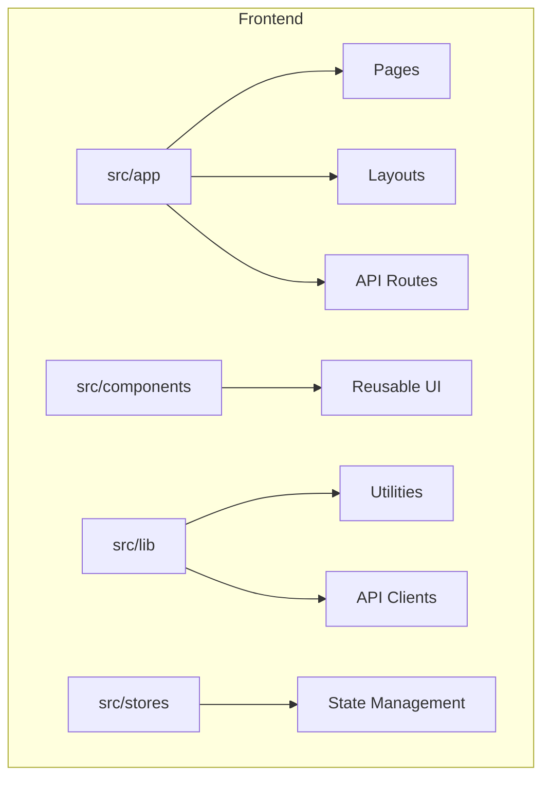
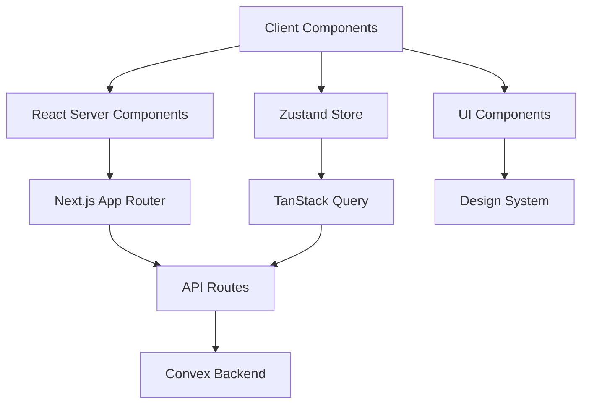
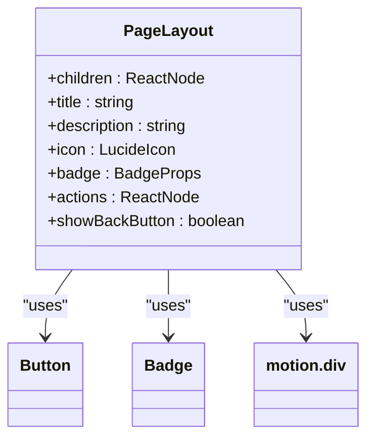
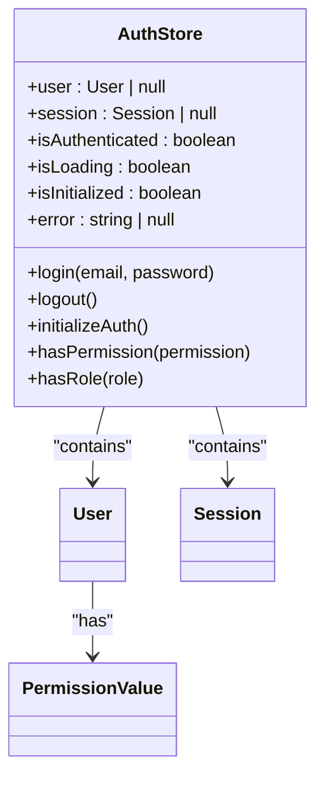
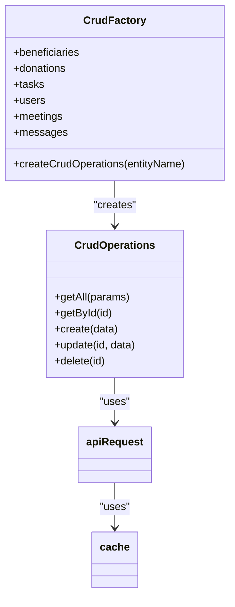
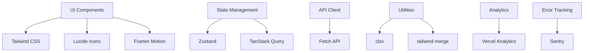

# Frontend Architecture

<cite>
**Referenced Files in This Document**   
- [layout.tsx](file://src/app/layout.tsx)
- [providers.tsx](file://src/app/providers.tsx)
- [authStore.ts](file://src/stores/authStore.ts)
- [convex-api-client.ts](file://src/lib/api/convex-api-client.ts)
- [crud-factory.ts](file://src/lib/api/crud-factory.ts)
- [api-cache.ts](file://src/lib/api-cache.ts)
- [persistent-cache.ts](file://src/lib/persistent-cache.ts)
- [PageLayout.tsx](file://src/components/layouts/PageLayout.tsx)
</cite>

## Table of Contents

1. [Introduction](#introduction)
2. [Project Structure](#project-structure)
3. [Core Components](#core-components)
4. [Architecture Overview](#architecture-overview)
5. [Detailed Component Analysis](#detailed-component-analysis)
6. [Dependency Analysis](#dependency-analysis)
7. [Performance Considerations](#performance-considerations)
8. [Troubleshooting Guide](#troubleshooting-guide)
9. [Conclusion](#conclusion)

## Introduction

The Kafkasder-panel frontend architecture is built on Next.js App Router with React Server Components, providing a modern, scalable foundation for the application. This document outlines the high-level design, component hierarchy, state management, routing structure, and cross-cutting concerns that define the system's frontend architecture.

## Project Structure

The project follows a feature-based organization with clear separation of concerns. The core structure includes:

- `src/app`: Next.js App Router pages and layouts
- `src/components`: Reusable UI components organized by feature
- `src/lib`: Shared utilities and API clients
- `src/stores`: State management stores
- `src/types`: Type definitions
- `convex`: Backend API definitions

The App Router enables server components by default, with client components explicitly marked using 'use client' directive.



**Diagram sources**

- [layout.tsx](file://src/app/layout.tsx)
- [providers.tsx](file://src/app/providers.tsx)

**Section sources**

- [layout.tsx](file://src/app/layout.tsx)
- [providers.tsx](file://src/app/providers.tsx)

## Core Components

The frontend architecture centers around reusable components in the components directory and shared utilities in the lib directory. The system leverages React Server Components for server-side rendering while maintaining interactive client components where needed.

**Section sources**

- [PageLayout.tsx](file://src/components/layouts/PageLayout.tsx)
- [convex-api-client.ts](file://src/lib/api/convex-api-client.ts)

## Architecture Overview

The architecture follows a layered approach with clear separation between presentation, state management, and data access layers. Server components handle data fetching and rendering, while client components manage interactivity.



**Diagram sources**

- [providers.tsx](file://src/app/providers.tsx)
- [authStore.ts](file://src/stores/authStore.ts)
- [convex-api-client.ts](file://src/lib/api/convex-api-client.ts)

## Detailed Component Analysis

### Component Hierarchy

The component hierarchy follows a modular structure with reusable UI components. The PageLayout component provides a consistent structure for all pages with title, description, actions, and navigation controls.



**Diagram sources**

- [PageLayout.tsx](file://src/components/layouts/PageLayout.tsx)

**Section sources**

- [PageLayout.tsx](file://src/components/layouts/PageLayout.tsx)

### State Management Pattern

The application uses Zustand for authentication state management and TanStack Query for data synchronization. The authStore maintains user session state with persistence via localStorage.



**Diagram sources**

- [authStore.ts](file://src/stores/authStore.ts)

**Section sources**

- [authStore.ts](file://src/stores/authStore.ts)

### Data Access Layer

The data access layer uses a CRUD factory pattern to provide consistent API clients for different entities. The convex-api-client wraps API routes with caching and error handling.



**Diagram sources**

- [crud-factory.ts](file://src/lib/api/crud-factory.ts)
- [convex-api-client.ts](file://src/lib/api/convex-api-client.ts)

**Section sources**

- [crud-factory.ts](file://src/lib/api/crud-factory.ts)
- [convex-api-client.ts](file://src/lib/api/convex-api-client.ts)

### Routing Structure

The routing structure uses Next.js App Router with nested layouts. The (dashboard) route group contains all dashboard pages with a shared layout.

```mermaid
graph TD
A[/] --> B[(dashboard)]
B --> C[analitik]
B --> D[ayarlar/parametreler]
B --> E[bagis/kumbara]
B --> F[bagis/liste]
B --> G[bagis/raporlar]
B --> H[burs/basvurular]
B --> I[burs/ogrenciler]
B --> J[burs/yetim]
B --> K[denetim-kayitlari]
B --> L[financial-dashboard]
B --> M[fon/gelir-gider]
B --> N[fon/raporlar]
B --> O[genel]
B --> P[is/gorevler]
B --> Q[is/toplantilar]
B --> R[is/yonetim]
B --> S[kullanici]
B --> T[kullanici/[id]/duzenle]
B --> U[kullanici/yeni]
B --> V[mesaj/gecmis]
B --> W[mesaj/kurum-ici]
B --> X[mesaj/toplu]
B --> Y[partner/liste]
B --> Z[performance-monitoring]
B --> AA[settings]
B --> AB[yardim/basvurular]
B --> AC[yardim/ihtiyac-sahipleri]
B --> AD[yardim/liste]
B --> AE[yardim/nakdi-vezne]
```

**Diagram sources**

- [layout.tsx](file://src/app/layout.tsx)

**Section sources**

- [layout.tsx](file://src/app/layout.tsx)

## Dependency Analysis

The frontend has well-defined dependencies between components and external libraries. The architecture minimizes direct dependencies through abstraction layers.



**Diagram sources**

- [package.json](file://package.json)

**Section sources**

- [package.json](file://package.json)

## Performance Considerations

The architecture incorporates several performance optimizations:

- Font optimization with variable fonts and lazy loading
- Component lazy loading for non-critical components
- Multiple caching layers (in-memory, persistent, HTTP)
- Code splitting and tree shaking
- Image optimization
- Bundle size monitoring

The system uses both in-memory caching via api-cache.ts and persistent caching via IndexedDB in persistent-cache.ts, with automatic cleanup of expired entries.

**Section sources**

- [api-cache.ts](file://src/lib/api-cache.ts)
- [persistent-cache.ts](file://src/lib/persistent-cache.ts)
- [layout.tsx](file://src/app/layout.tsx)

## Troubleshooting Guide

Common issues and their solutions:

- Authentication state not persisting: Check localStorage permissions and authStore hydration
- API calls failing: Verify CSRF token handling and authentication state
- Caching issues: Check cache TTL settings and cleanup intervals
- Performance problems: Monitor bundle size and implement code splitting
- Hydration errors: Ensure proper use of 'use client' directive and server/client component boundaries

**Section sources**

- [authStore.ts](file://src/stores/authStore.ts)
- [providers.tsx](file://src/app/providers.tsx)
- [api-cache.ts](file://src/lib/api-cache.ts)

## Conclusion

The Kafkasder-panel frontend architecture provides a robust, scalable foundation using Next.js App Router with React Server Components. The combination of Zustand for authentication state and TanStack Query for data synchronization creates a responsive user experience. The modular component structure and clear separation of concerns enable maintainable code that can evolve with the application's needs. Performance optimizations and comprehensive error handling ensure a reliable user experience across different network conditions.
