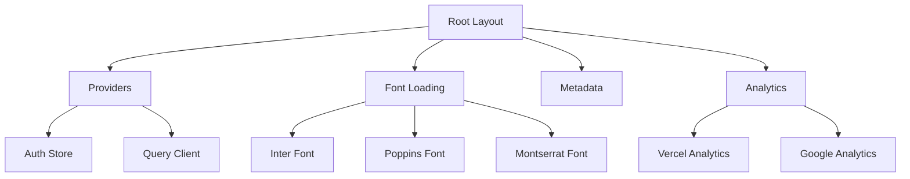
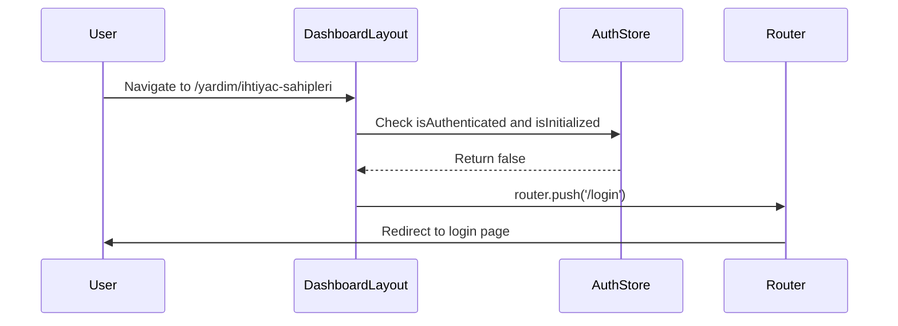
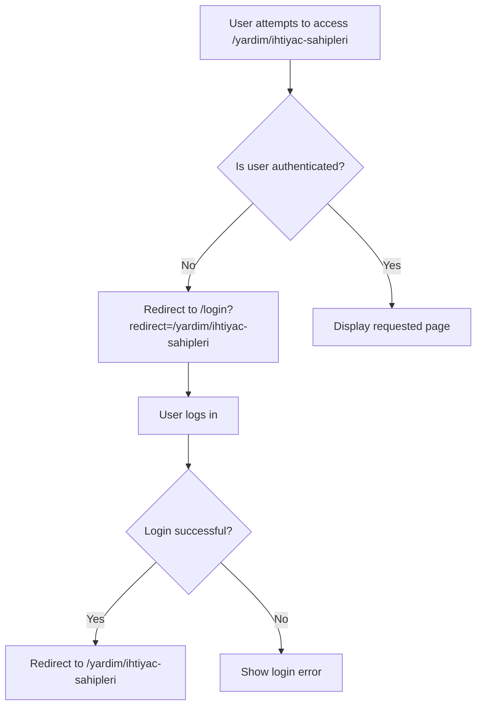
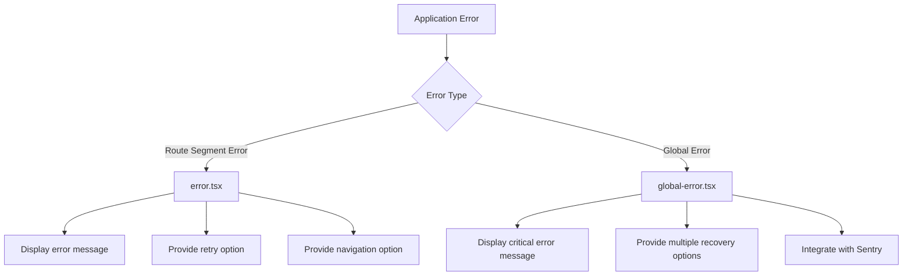
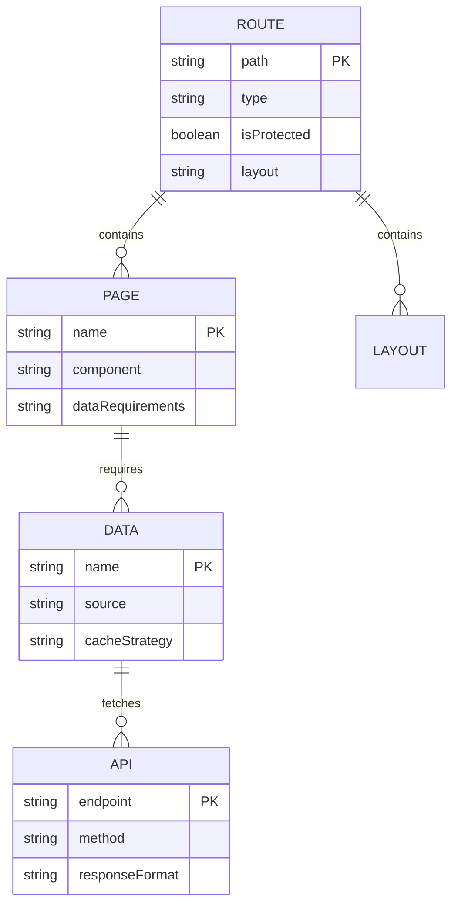
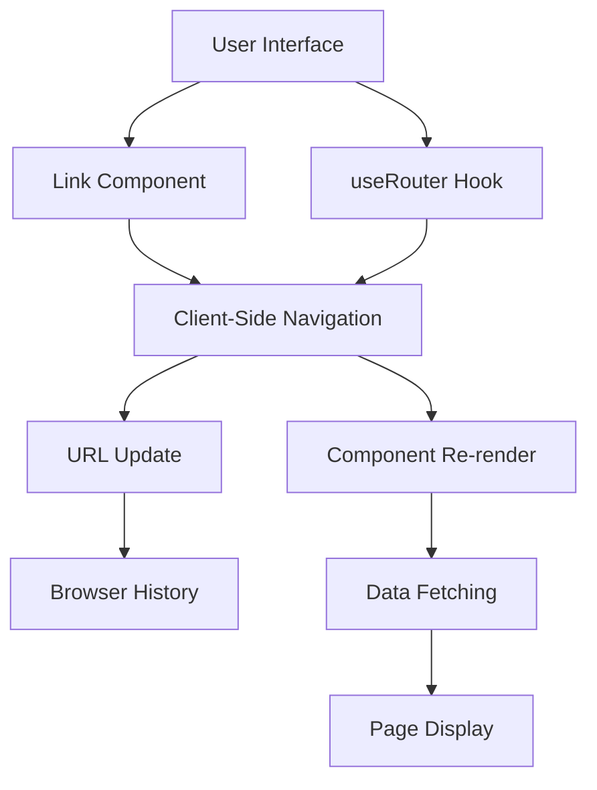

# Routing Structure

<cite>
**Referenced Files in This Document**   
- [layout.tsx](file://src/app/layout.tsx)
- [layout.tsx](file://src/app/(dashboard)/layout.tsx)
- [page.tsx](file://src/app/login/page.tsx)
- [error.tsx](file://src/app/error.tsx)
- [global-error.tsx](file://src/app/global-error.tsx)
</cite>

## Table of Contents

1. [Introduction](#introduction)
2. [Root Layout Structure](#root-layout-structure)
3. [Dashboard Layout and Authentication Guard](#dashboard-layout-and-authentication-guard)
4. [Authentication and Redirect Logic](#authentication-and-redirect-logic)
5. [Error Handling Boundaries](#error-handling-boundaries)
6. [Routing Conventions and Data Loading](#routing-conventions-and-data-loading)
7. [Navigation and Client-Side Routing](#navigation-and-client-side-routing)

## Introduction

The Kafkasder-panel application utilizes the Next.js App Router to implement a sophisticated routing structure with nested layouts, authentication protection, and error handling boundaries. This documentation details the implementation of the routing architecture, focusing on the nested layout system, authentication guard pattern, error handling mechanisms, and data loading patterns. The application features a protected dashboard area with multiple sections including beneficiaries, donations, and scholarships, all accessible through a well-structured routing system that employs dynamic routes with [id] parameters for detailed views.

## Root Layout Structure

The application implements a root layout in `src/app/layout.tsx` that serves as the foundation for all pages. This layout provides global providers, font loading, and metadata configuration. The root layout wraps all application content and establishes the basic structure for the entire application.

**Diagram sources**

- [layout.tsx](file://src/app/layout.tsx#L1-L88)

**Section sources**

- [layout.tsx](file://src/app/layout.tsx#L1-L88)

## Dashboard Layout and Authentication Guard

The dashboard layout in `src/app/(dashboard)/layout.tsx` implements a comprehensive authentication guard pattern that protects all routes within the (dashboard) directory. This layout component checks the authentication state and redirects unauthenticated users to the login page. The layout also provides shared navigation elements, a header with user profile controls, and a collapsible sidebar for navigation.

The authentication guard is implemented through React hooks that initialize the authentication state and monitor changes. When a user attempts to access a protected route without being authenticated, the layout automatically redirects them to the login page with a redirect parameter to return to the original destination after successful authentication.

**Diagram sources**

- [layout.tsx](<file://src/app/(dashboard)/layout.tsx#L37-L515>)

**Section sources**

- [layout.tsx](<file://src/app/(dashboard)/layout.tsx#L37-L515>)

## Authentication and Redirect Logic

The login page at `src/app/login/page.tsx` implements redirect logic that allows users to return to their intended destination after authentication. The page accepts a redirect parameter in the query string and uses it to redirect the user after successful login. If no redirect parameter is provided, the user is redirected to the default dashboard page.

The authentication flow begins with the dashboard layout checking the authentication state. If the user is not authenticated, they are redirected to the login page with the current pathname as the redirect parameter. After successful authentication, the login page redirects the user back to the specified redirect path or the default dashboard page.

**Diagram sources**

- [page.tsx](file://src/app/login/page.tsx#L3-L11)

**Section sources**

- [page.tsx](file://src/app/login/page.tsx#L3-L11)

## Error Handling Boundaries

The application implements a comprehensive error handling strategy using Next.js error boundaries at multiple levels. The `error.tsx` file provides a route segment boundary that catches errors in specific route segments, while `global-error.tsx` provides a root-level boundary that catches unhandled errors throughout the application.

The error components display user-friendly error messages with appropriate recovery options. The route error boundary provides options to retry the current operation or navigate to the home page, while the global error boundary offers more comprehensive recovery options including clearing storage and reloading the application. Both error boundaries include detailed error information in development mode and integrate with Sentry for error tracking and reporting.

**Diagram sources**

- [error.tsx](file://src/app/error.tsx#L11-L205)
- [global-error.tsx](file://src/app/global-error.tsx#L30-L425)

**Section sources**

- [error.tsx](file://src/app/error.tsx#L1-L207)
- [global-error.tsx](file://src/app/global-error.tsx#L1-L427)

## Routing Conventions and Data Loading

The application follows Next.js routing conventions with clear organization for different dashboard sections. Routes are organized in the app directory with nested folders for each major feature area such as beneficiaries, donations, and scholarships. Dynamic routes are implemented using the [id] parameter syntax, allowing for detailed views of specific records.

Data loading patterns vary based on the component type. Server components use server-side data fetching to load data before rendering, while client components use React Query for data fetching and caching. The dashboard layout implements a prefetching mechanism that anticipates data requirements based on the current route, improving perceived performance by loading data before it's needed.

**Section sources**

- [layout.tsx](<file://src/app/(dashboard)/layout.tsx#L208-L304>)

## Navigation and Client-Side Routing

Client-side navigation in the application is implemented using Next.js Link components and the useRouter hook. The dashboard layout includes a sidebar navigation component that provides links to different sections of the application. These links use the Next.js Link component to enable client-side navigation without full page reloads, improving the user experience.

The application also implements breadcrumb navigation that shows the user's current location within the application hierarchy. This is particularly useful for nested routes with dynamic parameters. The breadcrumb component dynamically generates the navigation path based on the current route, allowing users to easily navigate back to higher-level pages.

**Section sources**

- [layout.tsx](<file://src/app/(dashboard)/layout.tsx#L461-L462>)
