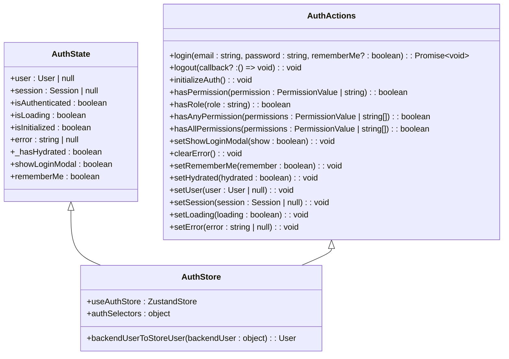
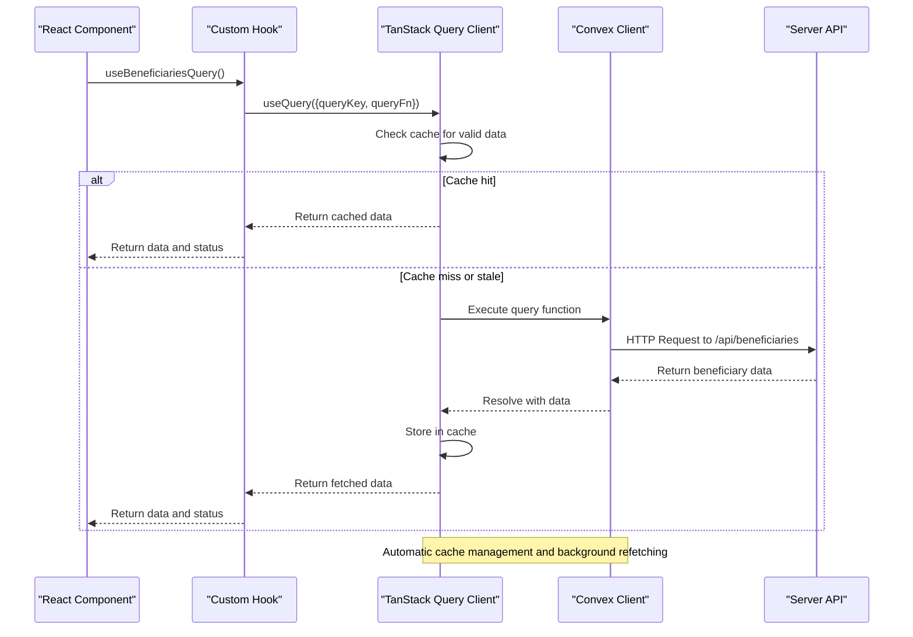
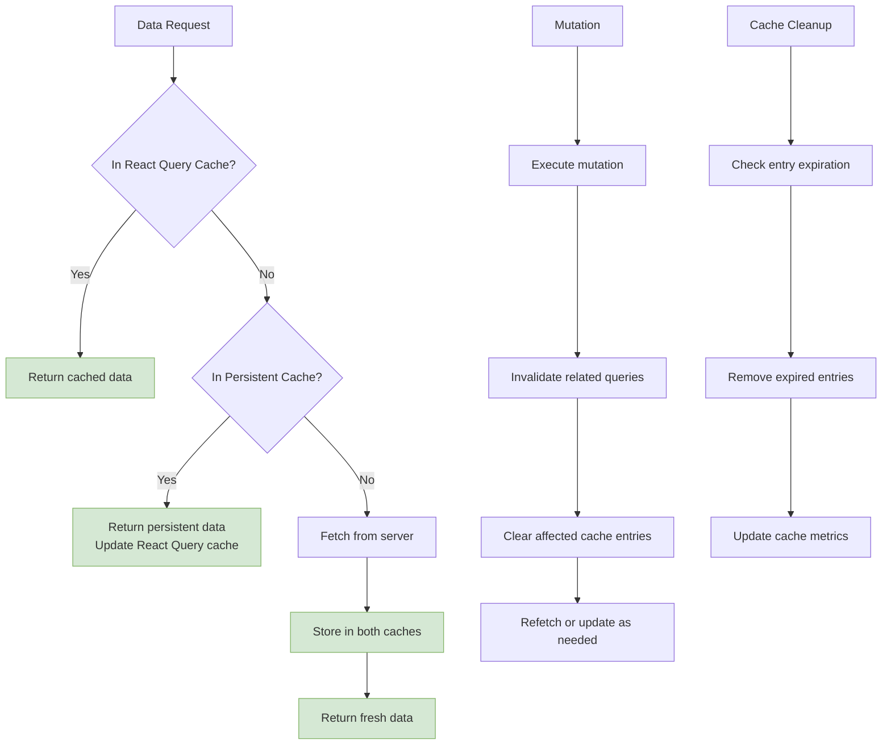
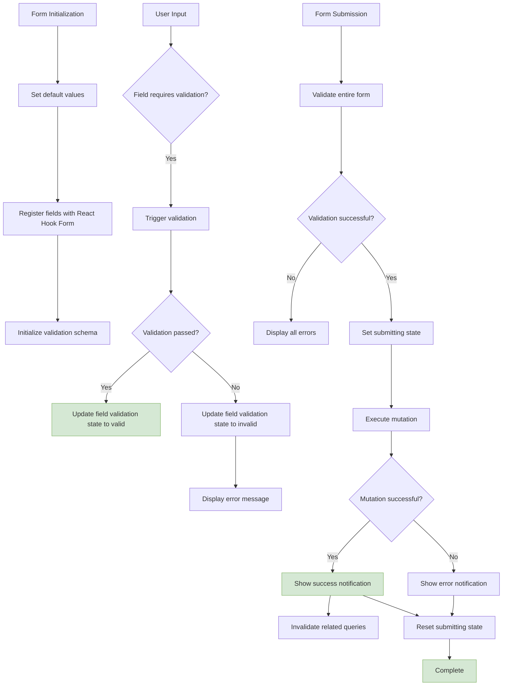
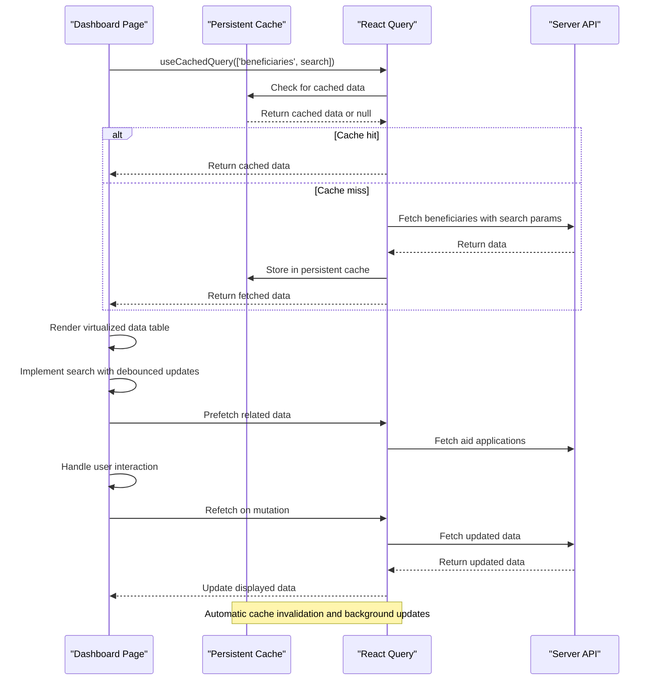

# State Management

<cite>
**Referenced Files in This Document**   
- [authStore.ts](file://src/stores/authStore.ts)
- [useApiCache.ts](file://src/hooks/useApiCache.ts)
- [persistent-cache.ts](file://src/lib/persistent-cache.ts)
- [BeneficiaryForm.tsx](file://src/components/forms/BeneficiaryForm.tsx)
- [page.tsx](file://src/app/(dashboard)/yardim/ihtiyac-sahipleri/page.tsx)
- [client.ts](file://src/lib/convex/client.ts)
</cite>

## Table of Contents

1. [Introduction](#introduction)
2. [Client State Management with Zustand](#client-state-management-with-zustand)
3. [Server State Synchronization with TanStack Query](#server-state-synchronization-with-tanstack-query)
4. [Caching Strategies](#caching-strategies)
5. [Form State Management](#form-state-management)
6. [Data Synchronization in Dashboard Pages](#data-synchronization-in-dashboard-pages)
7. [Error Handling and Loading States](#error-handling-and-loading-states)
8. [Optimistic Updates](#optimistic-updates)
9. [Best Practices and Common Pitfalls](#best-practices-and-common-pitfalls)

## Introduction

The Kafkasder-panel application implements a robust state management architecture that separates client state from server state while ensuring seamless synchronization between them. The system leverages Zustand for client-side state management, particularly for authentication state persistence, and integrates TanStack Query (via Convex client) for server state synchronization. This documentation details the implementation, integration points, and best practices for managing complex state interactions in the application.

## Client State Management with Zustand

The application uses Zustand as its primary solution for client state management, with a specific focus on authentication state persistence through the `authStore.ts` file. The store is implemented with several middleware enhancements including `devtools` for debugging, `persist` for local storage persistence, `subscribeWithSelector` for selective subscriptions, and `immer` for immutable updates.

The authentication store maintains critical user session information including user data, session tokens, authentication status, loading states, and error messages. It also manages UI-related state such as login modal visibility and remember-me preferences. The store implements a hydration process that checks localStorage for existing session data during initialization, allowing users to maintain their authenticated state across browser sessions.

Authentication actions include login and logout functionality that interacts with server-side API routes while maintaining client-side state consistency. The login process includes CSRF token validation for security, form submission handling with loading states, and error handling for various failure scenarios including invalid credentials, rate limiting, and network issues. The logout process clears both server-side session cookies and client-side storage.

The store also provides permission helper methods that allow components to check user permissions and roles, enabling fine-grained access control throughout the application. These helpers are optimized for performance and can be used in conditional rendering and authorization checks.

**Diagram sources**

- [authStore.ts](file://src/stores/authStore.ts#L22-L306)

**Section sources**

- [authStore.ts](file://src/stores/authStore.ts#L1-L403)

## Server State Synchronization with TanStack Query

Server state in Kafkasder-panel is managed through TanStack Query, integrated with the Convex backend via the Convex client. This approach provides automatic caching, background refetching, and stale-while-revalidate strategies that ensure data consistency across the application. The query client is configured to work seamlessly with the Convex real-time database, enabling efficient data synchronization between client and server.

The integration is implemented through custom hooks that abstract the complexity of direct API calls while providing type safety and optimal caching behavior. These hooks leverage the Convex client to execute queries and mutations against the backend, with automatic handling of loading states, error conditions, and data transformation. The system implements a clear separation between client state (managed by Zustand) and server state (managed by TanStack Query), with well-defined interaction points.

Data fetching operations are optimized through query key standardization, where each entity type has a consistent naming convention that enables automatic cache invalidation and relationship management. The query client is configured with default settings for stale time, cache time, and retry behavior that balance freshness with performance.

**Diagram sources**

- [useApiCache.ts](file://src/hooks/useApiCache.ts#L27-L177)
- [client.ts](file://src/lib/convex/client.ts#L1-L108)

**Section sources**

- [useApiCache.ts](file://src/hooks/useApiCache.ts#L1-L366)
- [client.ts](file://src/lib/convex/client.ts#L1-L108)

## Caching Strategies

The application implements a comprehensive caching strategy that combines in-memory caching (via TanStack Query) with persistent storage (via IndexedDB) to optimize performance and enable offline functionality. The caching system is configured with different strategies for various data types based on their update frequency, importance, and size.

The `useApiCache.ts` file defines specific caching hooks for different entity types, each with tailored configuration for stale time, cache time, and refetch behavior. For example, beneficiary data has a 5-minute stale time to balance freshness with performance, while static configuration data may have much longer cache durations. The system also implements automatic cache invalidation when related data is mutated, ensuring consistency across related queries.

Persistent caching is implemented through the `persistent-cache.ts` module, which provides an IndexedDB-backed storage solution that falls back to in-memory storage when IndexedDB is unavailable. This implementation supports versioning to handle schema changes, automatic cleanup of expired entries, and metrics tracking for cache performance monitoring. The persistent cache is used in conjunction with TanStack Query's prefetching capabilities to warm up frequently accessed data and improve perceived performance.

The caching system also includes debugging and monitoring tools that allow developers to inspect cache contents, view hit rates, and clear caches during development. These tools are particularly useful for troubleshooting stale data issues and optimizing cache configuration.

**Diagram sources**

- [useApiCache.ts](file://src/hooks/useApiCache.ts#L1-L366)
- [persistent-cache.ts](file://src/lib/persistent-cache.ts#L1-L454)

**Section sources**

- [useApiCache.ts](file://src/hooks/useApiCache.ts#L1-L366)
- [persistent-cache.ts](file://src/lib/persistent-cache.ts#L1-L454)

## Form State Management

Form state management in Kafkasder-panel is implemented using React Hook Form in combination with Zod for validation, providing a robust solution for complex form interactions. The `BeneficiaryForm.tsx` component serves as a prime example of this approach, demonstrating real-time validation, submission handling, and integration with the application's state management systems.

The form implementation includes several advanced features such as real-time field validation with visual feedback, optimized onChange handlers that debounce validation checks, and a loading overlay that prevents multiple submissions. The form state is managed locally within the component, with validation errors displayed inline according to accessibility standards.

Form submission is handled through TanStack Query's mutation functionality, which provides automatic loading states, error handling, and success feedback. Upon successful submission, the mutation automatically invalidates relevant queries to ensure data consistency across the application. The form also implements proper accessibility features including ARIA attributes, error messaging, and keyboard navigation.

The component demonstrates best practices for form state management, including the separation of concerns between UI state and data state, proper error boundary handling, and integration with the application's notification system for user feedback.

**Diagram sources**

- [BeneficiaryForm.tsx](file://src/components/forms/BeneficiaryForm.tsx#L1-L480)

**Section sources**

- [BeneficiaryForm.tsx](file://src/components/forms/BeneficiaryForm.tsx#L1-L480)

## Data Synchronization in Dashboard Pages

Dashboard pages in Kafkasder-panel implement sophisticated data synchronization patterns that combine server state management with client state to provide a responsive user experience. The beneficiaries dashboard page demonstrates this approach by integrating multiple data sources, caching strategies, and real-time updates.

The page implementation uses the `useCachedQuery` hook to fetch beneficiary data with automatic cache handling, falling back to direct API calls if the cached query fails. This ensures data availability even when the persistent cache is not accessible. The component also implements prefetching of related data (such as aid applications) to improve perceived performance when navigating between views.

Data synchronization is enhanced through virtualized data tables that efficiently render large datasets while maintaining smooth scrolling performance. The table implementation includes search functionality with debounced updates, lazy loading of heavy modal components, and performance monitoring to detect and address rendering issues.

The page also demonstrates proper error handling and loading states, with skeleton loaders providing visual feedback during data fetching. When data mutations occur (such as adding a new beneficiary), the component automatically refetches relevant queries to ensure the displayed data remains current.

**Diagram sources**

- [page.tsx](<file://src/app/(dashboard)/yardim/ihtiyac-sahipleri/page.tsx#L1-L281>)

**Section sources**

- [page.tsx](<file://src/app/(dashboard)/yardim/ihtiyac-sahipleri/page.tsx#L1-L281>)

## Error Handling and Loading States

The application implements comprehensive error handling and loading state management across all state management layers. Each component and hook provides appropriate feedback to users during data fetching, submission, and error conditions, ensuring a predictable and accessible user experience.

Loading states are managed through dedicated state variables in both the Zustand store and TanStack Query. The authentication store maintains an `isLoading` flag that controls UI elements such as loading spinners and disabled buttons during login and logout operations. Similarly, TanStack Query provides built-in loading states that are exposed through query and mutation hooks, allowing components to conditionally render loading indicators.

Error handling is implemented at multiple levels, with specific error messages for different failure scenarios. The authentication system distinguishes between validation errors (e.g., incorrect password), rate limiting errors, network errors, and server errors, providing appropriate user feedback for each case. Form components display validation errors inline with appropriate ARIA attributes for accessibility.

The system also implements global error handling through toast notifications that provide feedback for both successful operations and errors. These notifications are triggered by mutation success and error callbacks, ensuring consistent user feedback across the application. The error handling system includes network error detection and user-friendly messaging that guides users on how to resolve common issues.

## Optimistic Updates

While the current implementation primarily relies on refetch-based updates rather than optimistic updates, the architecture supports both approaches through TanStack Query's mutation configuration. The system could be enhanced to implement optimistic updates for certain operations, particularly for high-frequency interactions where immediate feedback is important.

The mutation configuration allows for the implementation of optimistic updates through the `onMutate` callback, which can update the query cache with the expected result before the server response is received. This would provide immediate UI feedback while maintaining data consistency through automatic rollback in case of mutation failure.

For operations that are well-suited to optimistic updates (such as status changes or simple edits), this pattern could significantly improve perceived performance. The system already has the necessary infrastructure in place, including proper cache invalidation and error handling, making it straightforward to implement optimistic updates where appropriate.

## Best Practices and Common Pitfalls

The state management architecture in Kafkasder-panel follows several best practices that ensure maintainability, performance, and reliability. These include the clear separation of client and server state, the use of typed interfaces for all state objects, and the implementation of reusable custom hooks that abstract complex logic.

To avoid common pitfalls such as stale data, the system implements automatic cache invalidation when mutations occur, ensuring that related queries are updated appropriately. The caching strategy is carefully tuned to balance data freshness with performance, with different stale times for different data types based on their update frequency.

Memory leaks are prevented through proper cleanup of subscriptions and effects, particularly in components that use real-time data or long-running queries. The use of memoization and selective state subscriptions minimizes unnecessary re-renders and improves overall application performance.

Developers should be aware of potential issues such as cache versioning when making changes to data structures, the importance of proper error boundary placement, and the need to handle edge cases such as offline operation and concurrent mutations. The existing architecture provides a solid foundation for addressing these concerns through its modular design and comprehensive error handling.
