# UI Components Library

<cite>
**Referenced Files in This Document**   
- [button.tsx](file://src/components/ui/button.tsx)
- [data-table.tsx](file://src/components/ui/data-table.tsx)
- [form.tsx](file://src/components/ui/form.tsx)
- [dialog.tsx](file://src/components/ui/dialog.tsx)
- [enhanced-toast.tsx](file://src/components/ui/enhanced-toast.tsx)
- [virtualized-data-table.tsx](file://src/components/ui/virtualized-data-table.tsx)
- [filter-panel.tsx](file://src/components/ui/filter-panel.tsx)
- [theme-switcher.tsx](file://src/components/ui/theme-switcher.tsx)
- [utils.ts](file://src/lib/utils.ts)
- [card.tsx](file://src/components/ui/card.tsx)
</cite>

## Table of Contents

1. [Introduction](#introduction)
2. [Core Components](#core-components)
3. [Utility Functions](#utility-functions)
4. [Component Architecture](#component-architecture)
5. [Accessibility and Keyboard Navigation](#accessibility-and-keyboard-navigation)
6. [Responsive Design](#responsive-design)
7. [Theming System](#theming-system)
8. [Usage Examples](#usage-examples)
9. [Conclusion](#conclusion)

## Introduction

The Kafkasder-panel UI components library provides a comprehensive set of reusable React components built with Tailwind CSS and Radix UI primitives. This documentation details the implementation of key components including Button, DataTable, Form, Dialog, and Toast, along with utility functions for className composition and variant management. The components are designed with accessibility, keyboard navigation, and responsive design principles in mind, supporting complex use cases in beneficiary and donation management.

## Core Components

### Button Component

The Button component is a versatile UI element with multiple variants and sizes. It supports different visual styles through the `variant` prop, including default, destructive, outline, secondary, ghost, and link. Size options include default, small (sm), large (lg), and various icon sizes. The component uses the `asChild` prop to allow rendering as different HTML elements while maintaining consistent styling.

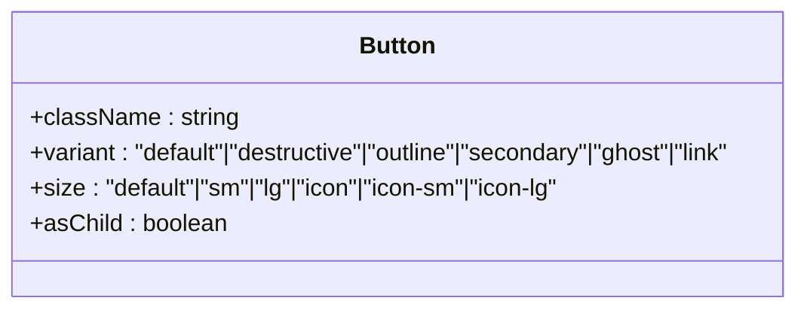

**Diagram sources**

- [button.tsx](file://src/components/ui/button.tsx#L36-L55)

**Section sources**

- [button.tsx](file://src/components/ui/button.tsx#L6-L34)

### Data Table Components

The library includes two table implementations: DataTable and VirtualizedDataTable. The DataTable component provides a feature-rich table with built-in loading, error, and empty states, along with search functionality and pagination. The VirtualizedDataTable implements virtual scrolling for improved performance with large datasets.

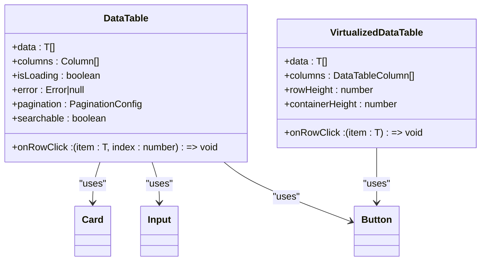

**Diagram sources**

- [data-table.tsx](file://src/components/ui/data-table.tsx#L28-L51)
- [virtualized-data-table.tsx](file://src/components/ui/virtualized-data-table.tsx#L14-L36)

**Section sources**

- [data-table.tsx](file://src/components/ui/data-table.tsx#L53-L344)
- [virtualized-data-table.tsx](file://src/components/ui/virtualized-data-table.tsx#L38-L345)

### Form Component

The Form component implements a robust form system using react-hook-form, providing a structured approach to form management with validation and error handling. It includes subcomponents like FormItem, FormLabel, FormControl, FormDescription, and FormMessage that work together to create accessible and user-friendly forms.

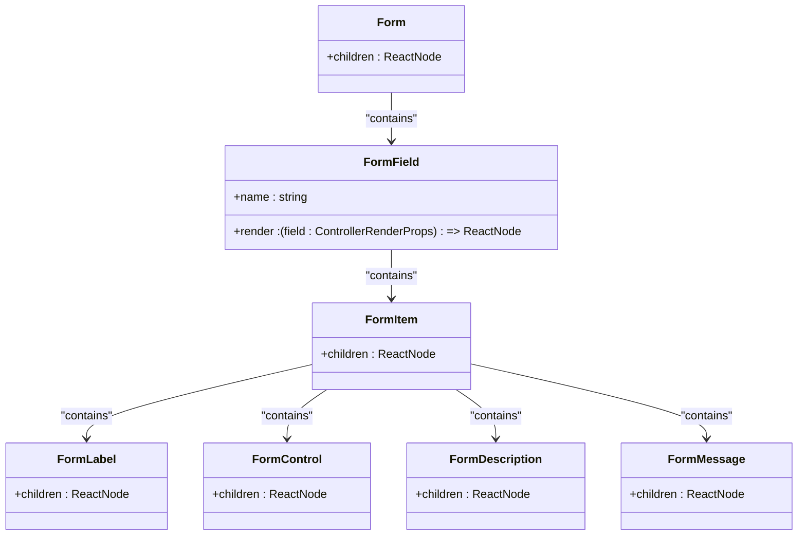

**Diagram sources**

- [form.tsx](file://src/components/ui/form.tsx#L18-L178)

**Section sources**

- [form.tsx](file://src/components/ui/form.tsx#L1-L179)

### Dialog Component

The Dialog component provides a modal interface with proper accessibility features. It includes subcomponents for the overlay, content, header, footer, title, and description. The component handles focus management and keyboard navigation, ensuring compliance with WCAG standards.

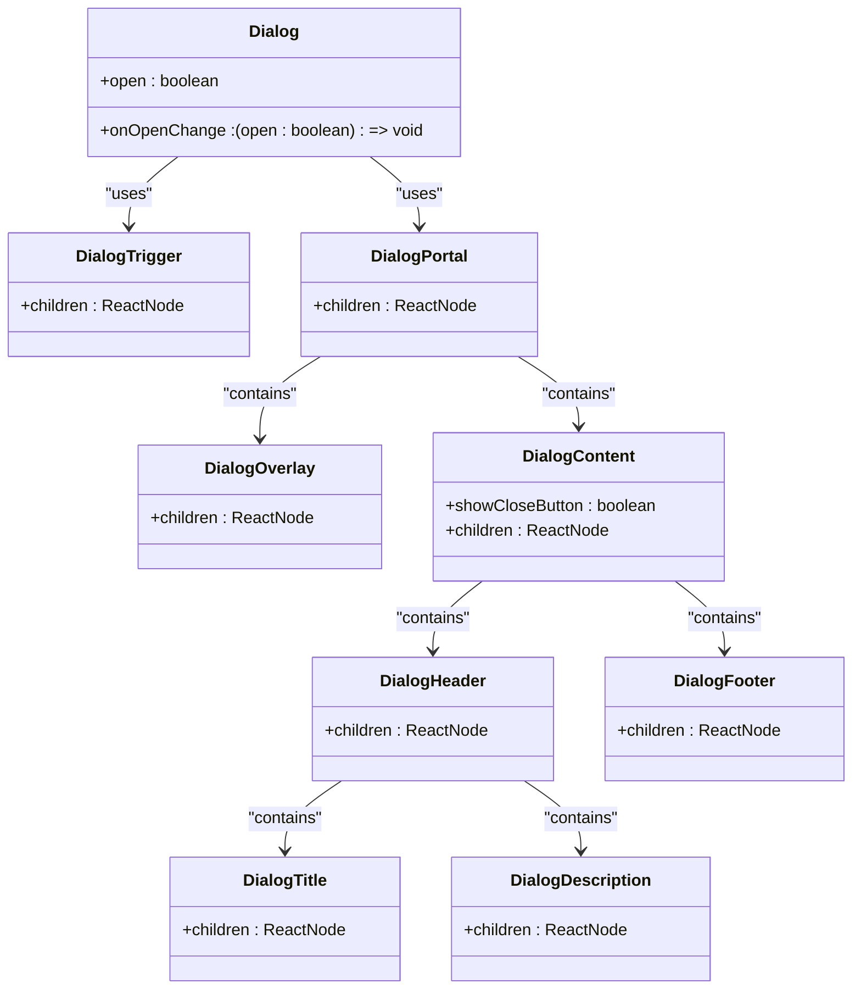

**Diagram sources**

- [dialog.tsx](file://src/components/ui/dialog.tsx#L9-L157)

**Section sources**

- [dialog.tsx](file://src/components/ui/dialog.tsx#L1-L158)

### Toast Component

The enhanced-toast component provides a comprehensive notification system with different types (success, error, warning, info) and customizable options. It supports actions, durations, and rich content through the enhancedToast utility.

```mermaid
classDiagram
class EnhancedToastOptions {
+title : string
+description : ReactNode
+duration : number
+action : { label : string, onClick : () => void }
}
class enhancedToast {
+success(message : string|EnhancedToastOptions) : void
+error(message : string|EnhancedToastOptions) : void
+warning(message : string|EnhancedToastOptions) : void
+info(message : string|EnhancedToastOptions) : void
+loading(message : string) : void
+promise<T>(promise : Promise<T>, messages : ToastMessages) : void
+dismiss(toastId? : string|number) : void
+dismissAll() : void
}
class EnhancedToaster {
+position : "top-right"
+richColors : true
+closeButton : true
+theme : "light"
+expand : true
}
enhancedToast --> EnhancedToastOptions : "uses"
EnhancedToaster --> enhancedToast : "uses"
```

**Diagram sources**

- [enhanced-toast.tsx](file://src/components/ui/enhanced-toast.tsx#L7-L18)
- [enhanced-toast.tsx](file://src/components/ui/enhanced-toast.tsx#L64-L271)

**Section sources**

- [enhanced-toast.tsx](file://src/components/ui/enhanced-toast.tsx#L1-L290)

## Utility Functions

### ClassName Composition

The `cn` function from lib/utils.ts provides a utility for merging Tailwind CSS classes with support for conditional classes. It uses clsx for conditional class evaluation and tailwind-merge for deduplication and conflict resolution.

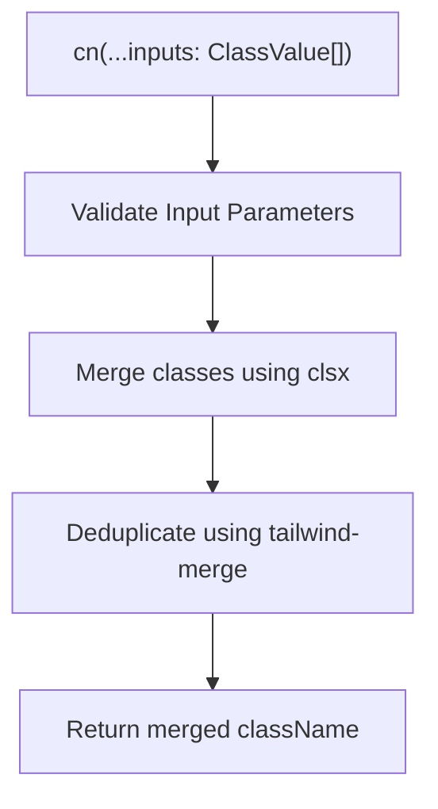

**Diagram sources**

- [utils.ts](file://src/lib/utils.ts#L1-L7)

**Section sources**

- [utils.ts](file://src/lib/utils.ts#L1-L7)

## Component Architecture

### Card Component

The Card component serves as a container for related content with various styling options. It supports different variants (default, interactive, elevated, outline, ghost) and sizes (default, sm, lg). The component includes subcomponents for header, title, description, action, content, and footer.

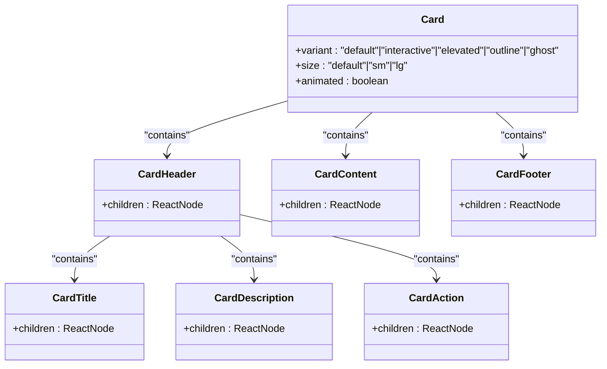

**Diagram sources**

- [card.tsx](file://src/components/ui/card.tsx#L6-L28)

**Section sources**

- [card.tsx](file://src/components/ui/card.tsx#L1-L117)

### Filter Panel Component

The FilterPanel component provides a flexible filtering interface with support for different field types (text, select, checkbox, daterange). It includes functionality for expanding/collapsing sections, resetting filters, and displaying active filters.

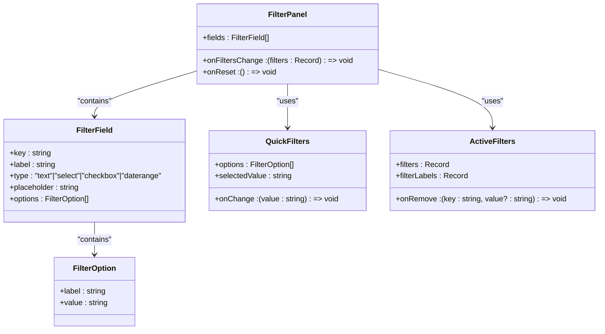

**Diagram sources**

- [filter-panel.tsx](file://src/components/ui/filter-panel.tsx#L22-L28)

**Section sources**

- [filter-panel.tsx](file://src/components/ui/filter-panel.tsx#L1-L283)

## Accessibility and Keyboard Navigation

### Keyboard Navigation Implementation

The components library implements comprehensive keyboard navigation support across all interactive elements. The DataTable component supports keyboard navigation for row selection with Enter and Space keys. The Dialog component manages focus trapping and supports Escape key for closing. The Button component ensures proper focus states and keyboard activation.

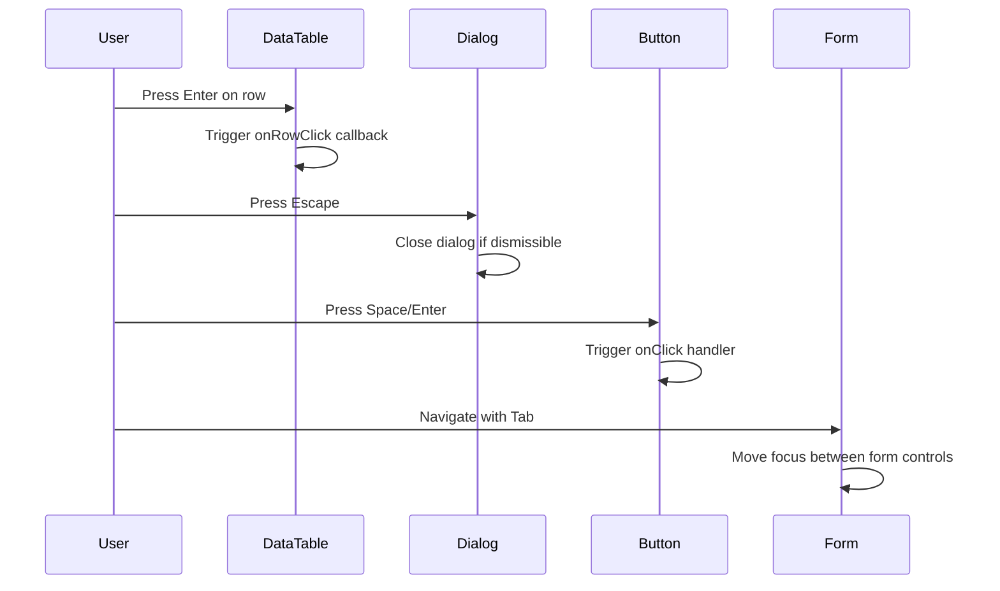

**Diagram sources**

- [data-table.tsx](file://src/components/ui/data-table.tsx#L246-L251)
- [dialog.tsx](file://src/components/ui/dialog.tsx#L48-L100)

**Section sources**

- [data-table.tsx](file://src/components/ui/data-table.tsx#L53-L344)
- [dialog.tsx](file://src/components/ui/dialog.tsx#L1-L158)

### ARIA Attributes and Roles

The components use appropriate ARIA attributes to enhance accessibility. The DataTable uses role="table", role="row", role="cell", and role="columnheader" for proper table semantics. The Dialog component uses aria-labelledby, aria-describedby, and role="dialog" for modal accessibility. The Button component uses aria-invalid for form validation states.

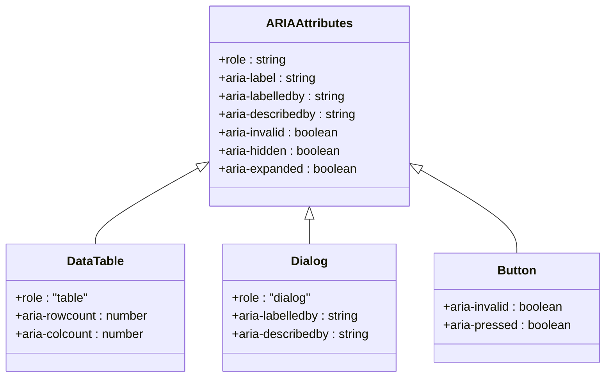

**Diagram sources**

- [data-table.tsx](file://src/components/ui/data-table.tsx#L240-L243)
- [dialog.tsx](file://src/components/ui/dialog.tsx#L79-L80)
- [button.tsx](file://src/components/ui/button.tsx#L51-L52)

**Section sources**

- [data-table.tsx](file://src/components/ui/data-table.tsx#L53-L344)
- [dialog.tsx](file://src/components/ui/dialog.tsx#L1-L158)
- [button.tsx](file://src/components/ui/button.tsx#L1-L59)

## Responsive Design

### Responsive Layout Implementation

The components are designed to be responsive across different screen sizes. The DataTable component uses flexbox for responsive column layout and includes a mobile scroll indicator. The Button component adapts its padding and size based on screen width. The Card component uses responsive padding and spacing.

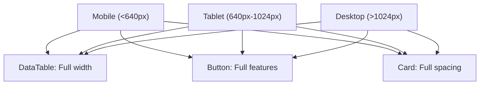

**Diagram sources**

- [data-table.tsx](file://src/components/ui/data-table.tsx#L208-L210)
- [button.tsx](file://src/components/ui/button.tsx#L21-L27)
- [card.tsx](file://src/components/ui/card.tsx#L19-L21)

**Section sources**

- [data-table.tsx](file://src/components/ui/data-table.tsx#L53-L344)
- [button.tsx](file://src/components/ui/button.tsx#L1-L59)
- [card.tsx](file://src/components/ui/card.tsx#L1-L117)

## Theming System

### Theme Switcher Implementation

The theme-switcher component provides a user interface for switching between light, dark, and system themes. It respects user preferences and persists the selected theme in localStorage. The component uses CSS classes on the html element to apply the appropriate theme.

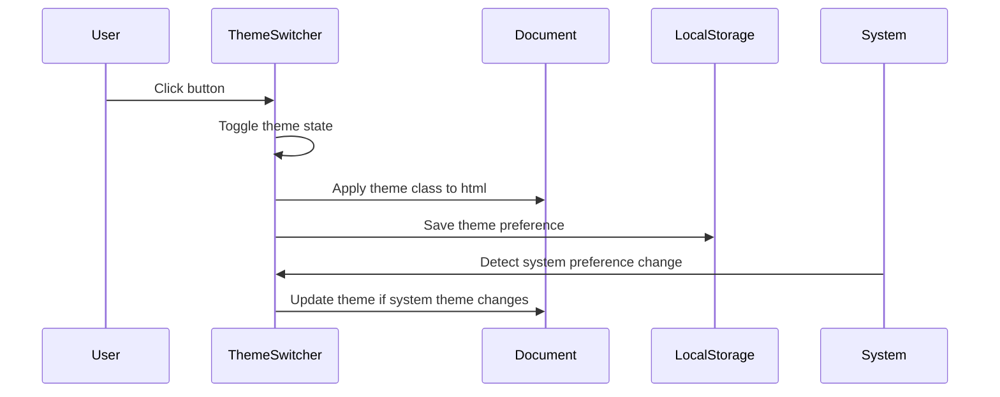

**Diagram sources**

- [theme-switcher.tsx](file://src/components/ui/theme-switcher.tsx#L14-L114)

**Section sources**

- [theme-switcher.tsx](file://src/components/ui/theme-switcher.tsx#L1-L142)

### Tailwind Configuration

The Tailwind configuration is set up to support the component library with appropriate content scanning paths. The configuration includes the src/components directory to ensure all component classes are included in the build.

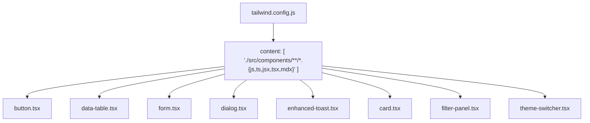

**Diagram sources**

- [tailwind.config.js](file://tailwind.config.js#L1-L13)

**Section sources**

- [tailwind.config.js](file://tailwind.config.js#L1-L13)

## Usage Examples

### Beneficiary Management

The DataTable and FilterPanel components are used together in beneficiary management interfaces to provide filtering and data display capabilities. The VirtualizedDataTable is used for large datasets to maintain performance.

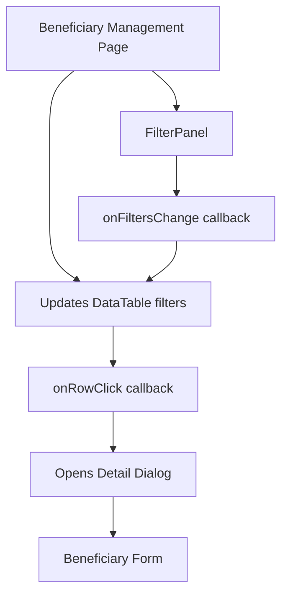

**Section sources**

- [data-table.tsx](file://src/components/ui/data-table.tsx#L53-L344)
- [filter-panel.tsx](file://src/components/ui/filter-panel.tsx#L33-L37)
- [dialog.tsx](file://src/components/ui/dialog.tsx#L9-L157)

### Donation Management

The Form and Toast components are used in donation management workflows to collect donation information and provide feedback on submission status. The enhancedToast utility is used to show success or error messages.

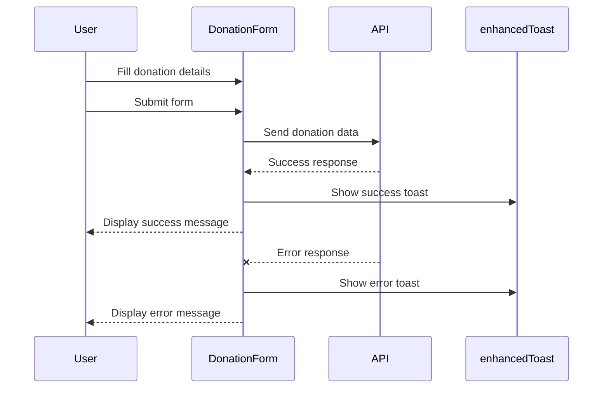

**Section sources**

- [form.tsx](file://src/components/ui/form.tsx#L1-L179)
- [enhanced-toast.tsx](file://src/components/ui/enhanced-toast.tsx#L64-L271)

## Conclusion

The Kafkasder-panel UI components library provides a comprehensive set of reusable components built with React, Tailwind CSS, and Radix UI primitives. The components are designed with accessibility, keyboard navigation, and responsive design principles in mind, supporting complex use cases in beneficiary and donation management. The library includes utility functions for className composition and variant management, along with a theming system that supports light, dark, and system themes. The components are well-documented and include usage examples for common scenarios.
