# Audit Logging

<cite>
**Referenced Files in This Document**   
- [audit_logs.ts](file://convex/audit_logs.ts)
- [security.ts](file://src/lib/security.ts)
- [page.tsx](file://src/app/(dashboard)/denetim-kayitlari/page.tsx)
- [schema.ts](file://convex/schema.ts)
</cite>

## Table of Contents

1. [Introduction](#introduction)
2. [Data Model](#data-model)
3. [Audit Log Generation](#audit-log-generation)
4. [Storage and Retention](#storage-and-retention)
5. [User Interface](#user-interface)
6. [Performance Considerations](#performance-considerations)

## Introduction

The audit logging system in Kafkasder-panel provides a comprehensive trail of user activities and system events, ensuring compliance with KVKK regulations. This system automatically captures critical operations, including data access and modifications, and stores them immutably for 7 years. The implementation includes both server-side logging mechanisms and a user interface for administrators to view, filter, and search through log entries. The system is designed to support accountability, security monitoring, and regulatory compliance.

## Data Model

The audit log data model is defined in the Convex database schema and captures essential information about each logged event. Each audit log entry includes the user ID, action type, resource affected, timestamp, and IP address. The data model is structured to support efficient querying and reporting.

**Diagram sources**

- [schema.ts](file://convex/schema.ts#L1179-L1220)

**Section sources**

- [schema.ts](file://convex/schema.ts#L1179-L1220)

## Audit Log Generation

Audit logs are generated automatically through the `logAction` mutation in the `audit_logs.ts` file. This mutation is triggered for critical operations such as creating, updating, deleting, or viewing resources. The `AuditLogger` class in `security.ts` provides a client-side interface for logging events, enriching them with user context, IP address, and user agent information before sending them to the server.

The system uses a centralized logging approach where all audit events are processed through a single mutation endpoint, ensuring consistency and reliability. The `logAction` mutation accepts parameters including the user ID, user name, action type, resource type, resource ID, changes (for updates), IP address, user agent, and any additional metadata.

```mermaid
sequenceDiagram
participant Client as "Client Application"
participant Security as "AuditLogger"
participant API as "Convex API"
participant DB as "Database"
Client->>Security : Perform critical operation
Security->>Security : Prepare log data
Security->>API : Call logAction mutation
API->>DB : Insert audit log entry
DB-->>API : Confirmation
API-->>Security : Success response
Security-->>Client : Operation complete
```

**Diagram sources**

- [audit_logs.ts](file://convex/audit_logs.ts#L11-L34)
- [security.ts](file://src/lib/security.ts#L367-L420)

**Section sources**

- [audit_logs.ts](file://convex/audit_logs.ts#L11-L34)
- [security.ts](file://src/lib/security.ts#L367-L420)

## Storage and Retention

Audit logs are stored in the Convex database within the `audit_logs` collection, which is configured with multiple indexes to optimize query performance. The system ensures immutability by design, as log entries cannot be modified or deleted once created. This immutability is enforced at both the application and database levels.

The retention policy complies with KVKK requirements by maintaining audit logs for 7 years. The system automatically manages data retention through database-level policies that prevent deletion of logs within the retention period. Additionally, the `generateComplianceReport` query in `security_audit.ts` verifies compliance by checking the completeness and retention of audit logs.

**Section sources**

- [schema.ts](file://convex/schema.ts#L1179-L1220)
- [security_audit.ts](file://convex/security_audit.ts#L217-L273)

## User Interface

The audit logging user interface is implemented in the `denetim-kayitlari/page.tsx` file, which provides administrators with a dashboard to view, filter, and search through audit log entries. The interface displays logs in a tabular format with columns for timestamp, user, action, resource, resource ID, and IP address.

Administrators can filter logs by action type (CREATE, UPDATE, DELETE, VIEW), resource type, and date range. The interface also supports full-text search across user names, resource types, and IDs. Each log entry can be expanded to view detailed information, including before-and-after values for data modifications and additional metadata.

The UI includes export functionality that allows administrators to download audit logs as CSV files for offline analysis or compliance reporting. The interface also provides visual statistics showing the distribution of actions over time and by user.

**Diagram sources**

- [page.tsx](<file://src/app/(dashboard)/denetim-kayitlari/page.tsx#L56-L100>)

**Section sources**

- [page.tsx](<file://src/app/(dashboard)/denetim-kayitlari/page.tsx#L56-L100>)

## Performance Considerations

The audit logging system is designed to handle high-volume logging with minimal performance impact on the main application. The implementation uses several optimization strategies to ensure scalability and efficiency.

The system employs indexed queries on the `audit_logs` collection, with indexes on `userId`, `resource`, `action`, and `timestamp` fields to accelerate common filtering operations. The `list` query in `audit_logs.ts` uses these indexes to efficiently retrieve logs based on various filter criteria.

For high-frequency operations, the system implements client-side batching through the `AuditLogger` class, which temporarily stores logs in memory before sending them to the server. This reduces the number of network requests and database operations. The in-memory buffer is limited to the most recent 1,000 logs to prevent excessive memory usage.

The database schema is optimized for write performance, with the `audit_logs` collection designed for append-only operations. This allows the underlying database to optimize storage and indexing for sequential writes. The system also implements pagination with a default limit of 100 records to prevent excessive data transfer when retrieving logs.

**Section sources**

- [audit_logs.ts](file://convex/audit_logs.ts#L51-L90)
- [security.ts](file://src/lib/security.ts#L367-L420)
